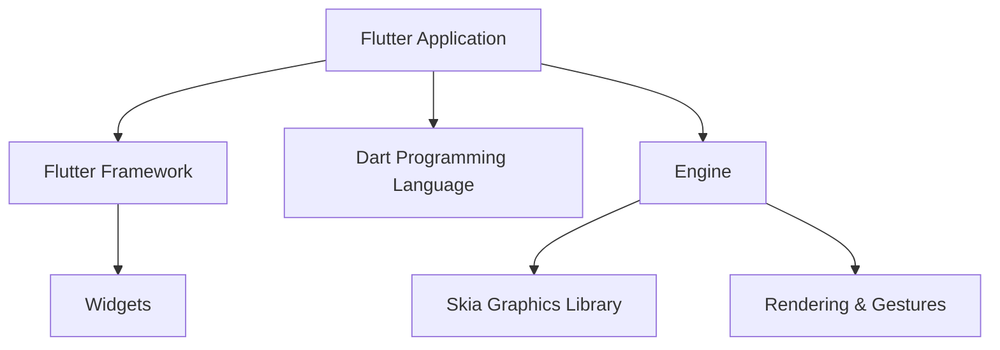

## 1.1.1 What is Flutter?

In the ever-evolving landscape of software development, the demand for applications that run seamlessly across multiple platforms is more pressing than ever. Enter Flutter, an open-source UI software development toolkit created by Google. Flutter is not just another framework; it's a revolutionary approach to building natively compiled applications for mobile (Android and iOS), web, and desktop from a single codebase.

### Introducing Flutter

Flutter was first unveiled by Google in 2015 and has since gained immense popularity among developers worldwide. Its core philosophy revolves around providing a fast, expressive, and flexible way to build beautiful applications. At its heart, Flutter is designed to empower developers to create high-performance, visually stunning applications with ease.

#### Key Features of Flutter

- **Single Codebase:** Write once, run anywhere. Flutter allows developers to maintain a single codebase for Android, iOS, web, and desktop applications.
- **Rich Set of Widgets:** Flutter offers a comprehensive library of customizable widgets that adhere to the Material Design and Cupertino aesthetics.
- **Hot Reload:** This feature enables developers to see changes in real-time without restarting the application, significantly speeding up the development process.
- **High Performance:** Flutter applications are compiled to native ARM code, ensuring smooth performance across all platforms.

### Cross-Platform Development Simplified

Cross-platform development has long been a challenging endeavor, often requiring developers to write separate codebases for each platform. This approach not only increases development time but also complicates maintenance and updates. Flutter addresses these challenges head-on by providing a unified framework that simplifies the development process.

#### Benefits of Cross-Platform Development with Flutter

1. **Efficiency:** By maintaining a single codebase, developers can focus on building features rather than managing multiple projects.
2. **Consistency:** Flutter ensures a consistent look and feel across all platforms, enhancing the user experience.
3. **Cost-Effective:** Reducing the need for separate teams for each platform can significantly cut development costs.
4. **Faster Time-to-Market:** With Flutter's rapid development capabilities, businesses can launch their applications faster, gaining a competitive edge.

### Understanding Flutter's Architecture

To fully appreciate Flutter's capabilities, it's essential to understand its architecture. Flutter is composed of three main components: the Flutter Framework, the Dart Programming Language, and the Engine.

#### Flutter Framework

The Flutter Framework is a collection of reusable UI elements known as widgets. These widgets are the building blocks of any Flutter application. They are highly customizable and can be combined to create complex user interfaces. Flutter's widget system is designed to be flexible and expressive, allowing developers to create beautiful UIs with minimal effort.

#### Dart Programming Language

Flutter applications are written in Dart, a language developed by Google. Dart is optimized for building user interfaces quickly and efficiently. It offers features like a rich standard library, garbage collection, and strong typing, making it an ideal choice for Flutter development. Dart's asynchronous programming capabilities also make it well-suited for handling complex UI interactions.

#### Engine

The engine is the powerhouse of Flutter, responsible for rendering, handling gestures, and compiling code. It is powered by Skia, a 2D graphics library that provides fast and smooth rendering. The engine compiles Flutter code to native ARM code, ensuring high performance across all platforms.

### Real-World Applications Built with Flutter

Flutter's versatility and performance have attracted many companies to adopt it for their applications. Here are a few notable examples:

- **Alibaba:** The e-commerce giant uses Flutter to power parts of its app, benefiting from its fast development cycle and beautiful UI capabilities.
- **Reflectly:** This popular journaling app leverages Flutter's rich set of widgets to deliver a visually appealing and intuitive user experience.
- **Google Ads:** Google's own advertising platform uses Flutter to provide a consistent experience across devices.

These examples highlight how Flutter can be used to create high-performance, visually stunning applications that meet the demands of modern users.

### Setting Expectations for Beginners

One of Flutter's most appealing aspects is its accessibility to beginners. You don't need prior programming experience to start building applications with Flutter. The framework is designed to be beginner-friendly, with extensive documentation and a supportive community to help you along the way.

#### Encouragement for New Developers

- **Community Support:** The Flutter community is vibrant and welcoming, offering numerous resources, tutorials, and forums for beginners.
- **Learning Resources:** Google provides comprehensive documentation and sample projects to help you get started quickly.
- **Hands-On Practice:** Flutter's hot reload feature encourages experimentation, allowing you to learn by doing.

### Conclusion

Flutter is more than just a toolkit; it's a gateway to a new era of cross-platform development. By enabling developers to build natively compiled applications from a single codebase, Flutter simplifies the development process, reduces costs, and accelerates time-to-market. Whether you're a seasoned developer or a complete beginner, Flutter offers the tools and resources you need to create beautiful, high-performance applications.

## Quiz Time!



### What is Flutter primarily used for?

- [x] Building natively compiled applications for mobile, web, and desktop from a single codebase.
- [ ] Creating backend server applications.
- [ ] Designing hardware components.
- [ ] Developing operating systems.

> **Explanation:** Flutter is an open-source UI toolkit by Google for building natively compiled applications across multiple platforms from a single codebase.

### Which programming language is used to write Flutter applications?

- [ ] Java
- [ ] Python
- [x] Dart
- [ ] C++

> **Explanation:** Flutter applications are written in Dart, a language developed by Google optimized for building user interfaces.

### What is the main advantage of Flutter's "Hot Reload" feature?

- [x] It allows developers to see changes in real-time without restarting the application.
- [ ] It automatically optimizes code for performance.
- [ ] It generates code documentation.
- [ ] It compiles code to machine language.

> **Explanation:** Hot Reload enables developers to instantly view changes in the application, speeding up the development process.

### What is the role of the Skia graphics library in Flutter?

- [x] It provides fast and smooth rendering for the Flutter engine.
- [ ] It handles network requests.
- [ ] It manages database operations.
- [ ] It compiles Dart code to native code.

> **Explanation:** Skia is a 2D graphics library used by Flutter's engine to render graphics efficiently.

### Which of the following is NOT a benefit of using Flutter for cross-platform development?

- [ ] Faster time-to-market
- [ ] Cost-effective development
- [x] Requires separate codebases for each platform
- [ ] Consistent user experience

> **Explanation:** Flutter allows developers to maintain a single codebase for multiple platforms, which is a key benefit.

### What type of applications can be built using Flutter?

- [x] Mobile, web, and desktop applications
- [ ] Only mobile applications
- [ ] Only web applications
- [ ] Only desktop applications

> **Explanation:** Flutter is designed to build applications for mobile, web, and desktop platforms.

### Which company developed Flutter?

- [x] Google
- [ ] Microsoft
- [ ] Apple
- [ ] Facebook

> **Explanation:** Flutter was developed by Google as an open-source UI toolkit.

### What are Flutter's building blocks for creating user interfaces?

- [x] Widgets
- [ ] Components
- [ ] Modules
- [ ] Packages

> **Explanation:** Widgets are the primary building blocks in Flutter for creating user interfaces.

### How does Flutter ensure high performance for its applications?

- [x] By compiling to native ARM code
- [ ] By using a virtual machine
- [ ] By running in a web browser
- [ ] By using interpreted code

> **Explanation:** Flutter compiles applications to native ARM code, ensuring high performance across platforms.

### True or False: Flutter requires prior programming experience to start building applications.

- [ ] True
- [x] False

> **Explanation:** Flutter is beginner-friendly, and no prior programming experience is required to start building applications.


