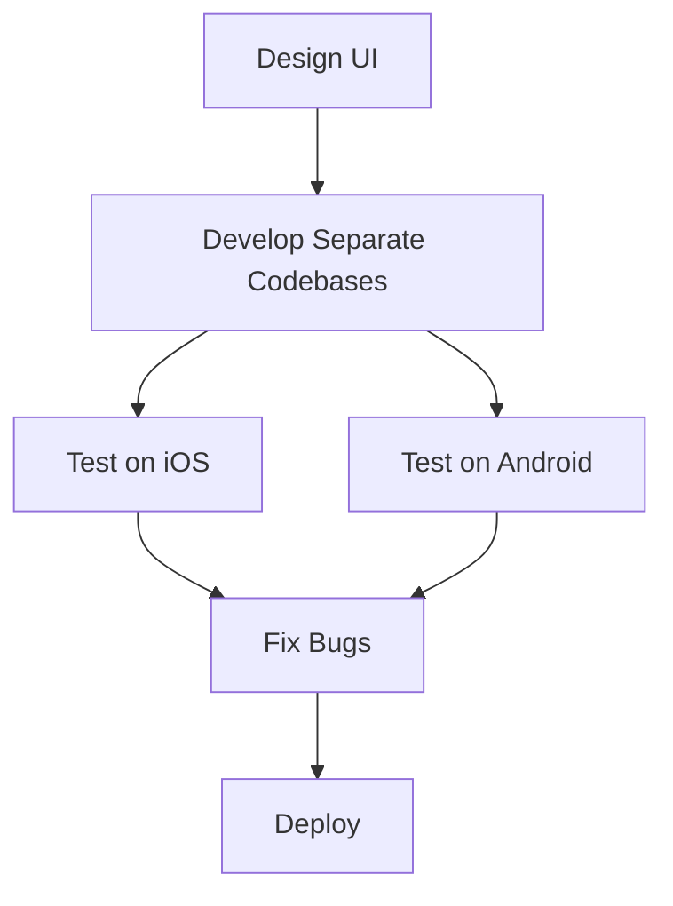
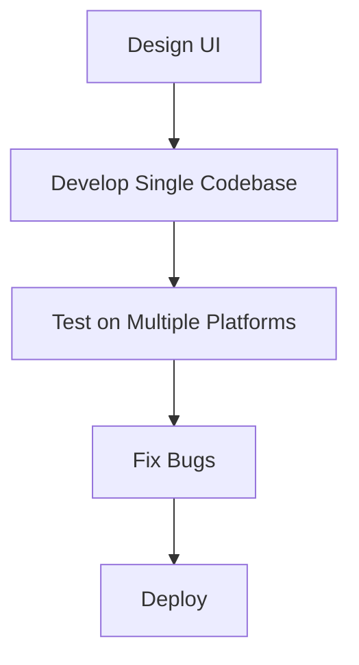

---

linkTitle: "1.1.2 The Advantages of Flutter"
title: "The Advantages of Flutter: Revolutionizing Cross-Platform App Development"
description: "Explore the unparalleled advantages of Flutter in app development, including hot reload, expressive UI, fast performance, and a single codebase for multiple platforms."
categories:
- Mobile Development
- Cross-Platform
- Software Engineering
tags:
- Flutter
- App Development
- Cross-Platform
- Mobile Apps
- UI/UX
date: 2024-10-25
type: docs
nav_weight: 112000
canonical: "https://fluttermasterylibrary.com/1/1/1/2"
license: "© 2023 Tokenizer Inc. CC BY-NC-SA 4.0"
---

## 1.1.2 The Advantages of Flutter

In the rapidly evolving world of mobile app development, Flutter has emerged as a game-changer. This open-source UI software development kit (SDK) by Google offers a plethora of advantages that streamline the development process, enhance performance, and provide a seamless user experience. In this section, we will delve into the key benefits of Flutter, compare it with other cross-platform frameworks, and explore how it stands out in the crowded landscape of app development tools.

### Hot Reload: Instant Gratification for Developers

One of the most celebrated features of Flutter is **Hot Reload**. This capability allows developers to see the changes they make in the code almost instantly, without losing the current state of the application. This feature significantly speeds up the development process, making it easier to experiment, build UIs, add features, and fix bugs.

#### How Hot Reload Works

When you make a change to your Flutter app's source code and save it, the updated code is injected into the running Dart Virtual Machine (VM). The Flutter framework then automatically rebuilds the widget tree, allowing you to see the effects of your changes immediately.

#### Code Example: Hot Reload in Action

Consider a simple Flutter application with a `Text` widget displaying "Hello, Flutter!". Let's change the text to "Hello, World!" and see how hot reload reflects this change instantly.

```dart
import 'package:flutter/material.dart';

void main() => runApp(MyApp());

class MyApp extends StatelessWidget {
  @override
  Widget build(BuildContext context) {
    return MaterialApp(
      home: Scaffold(
        appBar: AppBar(
          title: Text('Hot Reload Demo'),
        ),
        body: Center(
          child: Text('Hello, Flutter!'), // Change this to 'Hello, World!'
        ),
      ),
    );
  }
}
```

After changing the text to `'Hello, World!'` and saving the file, the app updates immediately without restarting, preserving the app's state.

### Expressive and Flexible UI: Crafting Beautiful Interfaces

Flutter provides a rich set of customizable widgets that enable developers to create complex and expressive user interfaces. These widgets are highly flexible and can be tailored to meet the specific needs of your application, ensuring a consistent look and feel across different platforms.

#### Customizable Widgets

Flutter's widget library is extensive, offering everything from basic UI elements like buttons and text fields to complex layouts and animations. The framework's layered architecture allows for fine-grained control over every pixel on the screen, enabling developers to create visually stunning applications.

#### Before-and-After Customization

Let's look at a simple example of a `Container` widget before and after customization.

**Before Customization:**

```dart
Container(
  width: 100,
  height: 100,
  color: Colors.blue,
)
```

**After Customization:**

```dart
Container(
  width: 100,
  height: 100,
  decoration: BoxDecoration(
    gradient: LinearGradient(
      colors: [Colors.blue, Colors.purple],
      begin: Alignment.topLeft,
      end: Alignment.bottomRight,
    ),
    borderRadius: BorderRadius.circular(10),
    boxShadow: [
      BoxShadow(
        color: Colors.black26,
        blurRadius: 10,
        offset: Offset(2, 2),
      ),
    ],
  ),
)
```

The customized container now features a gradient background, rounded corners, and a shadow, showcasing the expressive power of Flutter's widgets.

### Fast Performance: Native-Like Speed

Flutter apps are compiled directly to native ARM code using Dart's ahead-of-time (AOT) compilation. This ensures that Flutter applications run with the speed and performance of native apps, providing a smooth and responsive user experience.

#### Performance Optimization

Flutter's architecture is designed to minimize the overhead of communication between the app and the platform. By using the Skia graphics engine, Flutter can render complex animations and transitions at 60 frames per second (fps) or higher, ensuring a fluid user interface.

### Single Codebase for Multiple Platforms: Efficiency at Its Best

One of Flutter's most compelling advantages is its ability to use a single codebase for multiple platforms, including iOS, Android, web, and desktop. This not only reduces development time and costs but also simplifies maintenance and updates.

#### Code Sharing Across Platforms

With Flutter, you write your app once and deploy it on multiple platforms. This is achieved through the use of platform-specific widgets and APIs, allowing you to tailor the user experience to each platform while maintaining a consistent codebase.

### Open-Source and Community Support: A Thriving Ecosystem

Flutter is an open-source project with a vibrant community of developers contributing to its growth. This active community provides a wealth of packages and plugins that extend Flutter's capabilities, making it easier to integrate third-party services and APIs into your app.

#### Community Contributions

The Flutter community is constantly developing new packages and plugins, which are available through the [pub.dev](https://pub.dev/) repository. These contributions cover a wide range of functionalities, from state management solutions to integrations with popular services like Firebase and Google Maps.

### Comparisons with Other Frameworks: Flutter vs. the Rest

While there are several cross-platform frameworks available, Flutter stands out due to its unique features and advantages. Let's briefly compare Flutter with two popular alternatives: React Native and Xamarin.

#### Flutter vs. React Native

- **Performance:** Flutter's direct compilation to native code gives it an edge in performance over React Native, which relies on a JavaScript bridge.
- **UI Consistency:** Flutter's widget-based architecture ensures a consistent UI across platforms, whereas React Native requires additional work to achieve the same level of consistency.
- **Hot Reload:** Both frameworks offer hot reload, but Flutter's implementation is often praised for its speed and reliability.

#### Flutter vs. Xamarin

- **Language:** Flutter uses Dart, a language optimized for UI development, while Xamarin uses C#. Dart's simplicity and performance make it a strong choice for mobile development.
- **Community and Ecosystem:** Flutter's rapidly growing community and extensive package library provide a rich ecosystem for developers, whereas Xamarin's community is smaller in comparison.
- **UI Development:** Flutter's widget system offers more flexibility and customization options than Xamarin's approach, which relies on native UI components.

### Visual Aids: Development Workflows with and without Flutter

To better understand the impact of Flutter on the development process, let's visualize the workflows with and without Flutter using Mermaid.js diagrams.

#### Development Workflow Without Flutter



#### Development Workflow With Flutter



As illustrated, Flutter simplifies the development workflow by consolidating the codebase and testing processes, leading to faster deployment and easier maintenance.

### Conclusion

Flutter's advantages make it a compelling choice for developers seeking to create high-performance, visually appealing, and cross-platform applications. Its hot reload feature, expressive UI capabilities, fast performance, single codebase approach, and strong community support position it as a leader in the realm of mobile app development. By embracing Flutter, developers can streamline their workflows, reduce costs, and deliver exceptional user experiences across multiple platforms.

## Quiz Time!



### What is one of the most celebrated features of Flutter?

- [x] Hot Reload
- [ ] Cold Restart
- [ ] Manual Refresh
- [ ] Code Freeze

> **Explanation:** Hot Reload allows developers to see changes instantly without losing the app's current state, significantly speeding up the development process.


### How does Flutter ensure fast performance?

- [x] By compiling directly to native ARM code
- [ ] By using a JavaScript bridge
- [ ] By relying on web technologies
- [ ] By using interpreted code

> **Explanation:** Flutter apps are compiled directly to native ARM code, ensuring smooth performance similar to native apps.


### What advantage does a single codebase provide in Flutter?

- [x] Reduces development time and costs
- [ ] Requires separate codebases for each platform
- [ ] Increases complexity
- [ ] Limits platform support

> **Explanation:** A single codebase reduces development time and costs by allowing developers to write the app once and deploy it on multiple platforms.


### How does Flutter's widget system benefit UI development?

- [x] Provides a rich set of customizable widgets
- [ ] Limits customization options
- [ ] Requires platform-specific code for UI
- [ ] Uses native UI components only

> **Explanation:** Flutter's widget system offers a rich set of customizable widgets, enabling developers to create complex and expressive user interfaces.


### Which of the following is a benefit of Flutter's open-source nature?

- [x] Active community support and contributions
- [ ] Limited access to packages and plugins
- [ ] Closed development environment
- [ ] Proprietary software restrictions

> **Explanation:** Flutter's open-source nature fosters an active community that contributes to a wealth of packages and plugins, enhancing its capabilities.


### How does Flutter compare to React Native in terms of performance?

- [x] Flutter has an edge due to direct compilation to native code
- [ ] React Native is faster due to the JavaScript bridge
- [ ] Both have similar performance
- [ ] Flutter is slower than React Native

> **Explanation:** Flutter's direct compilation to native code gives it a performance edge over React Native, which relies on a JavaScript bridge.


### What language does Flutter use for development?

- [x] Dart
- [ ] JavaScript
- [ ] C#
- [ ] Swift

> **Explanation:** Flutter uses Dart, a language optimized for UI development, offering simplicity and performance benefits.


### Which feature allows Flutter to maintain a consistent UI across platforms?

- [x] Widget-based architecture
- [ ] Native UI components
- [ ] JavaScript bridge
- [ ] Platform-specific code

> **Explanation:** Flutter's widget-based architecture ensures a consistent UI across platforms, providing fine-grained control over every pixel.


### What is the primary benefit of Flutter's hot reload feature?

- [x] Allows developers to see changes instantly without losing the app's current state
- [ ] Requires a full app restart to see changes
- [ ] Only works on iOS devices
- [ ] Slows down the development process

> **Explanation:** Hot reload allows developers to see changes instantly without losing the app's current state, speeding up the development process.


### True or False: Flutter requires separate codebases for iOS and Android.

- [ ] True
- [x] False

> **Explanation:** False. Flutter allows developers to use a single codebase for both iOS and Android, simplifying development and maintenance.


