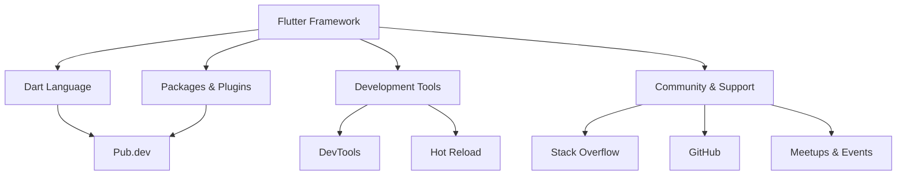

---

linkTitle: "1.1.4 The Flutter Ecosystem"
title: "Explore the Flutter Ecosystem: Resources, Community, and Tools"
description: "Dive into the Flutter ecosystem, exploring its resources, community support, development tools, and future prospects. Learn about the comprehensive documentation, rich packages, and active community that make Flutter a robust framework for app development."
categories:
- Flutter Development
- Mobile App Development
- Software Engineering
tags:
- Flutter
- Dart
- Mobile Development
- Open Source
- Software Tools
date: 2024-10-25
type: docs
nav_weight: 1140

canonical: "https://fluttermasterylibrary.com/1/1/1/4"
license: "© 2023 Tokenizer Inc. CC BY-NC-SA 4.0"
---

## 1.1.4 The Flutter Ecosystem

The Flutter ecosystem is a vibrant and dynamic space that offers a wealth of resources, community support, and tools to facilitate app development. As a beginner embarking on your Flutter journey, understanding this ecosystem will empower you to leverage its full potential. In this section, we'll explore the various components that make up the Flutter ecosystem, including resources, community, tools, and the future of Flutter.

### Overview of Resources

#### Comprehensive Documentation

The official Flutter website is your primary gateway to a treasure trove of documentation. It provides detailed guides, tutorials, and API references that cater to both beginners and advanced developers. The documentation is meticulously organized, making it easy to find information on specific topics such as widgets, state management, and platform integration.

- **Getting Started Guides:** These guides help newcomers set up their development environment and create their first Flutter app.
- **Cookbook:** A collection of practical recipes that demonstrate how to solve common problems in Flutter.
- **API Reference:** Detailed documentation of Flutter's core libraries and classes, essential for understanding how to use various components effectively.

#### Packages and Plugins on Pub.dev

Pub.dev is the official package repository for Dart and Flutter. It hosts a rich set of packages and plugins that extend Flutter's capabilities. Whether you need to integrate Firebase, implement complex animations, or access native device features, Pub.dev has a package for you.

- **Popular Packages:** Some of the most widely used packages include `provider` for state management, `http` for making network requests, and `shared_preferences` for persistent storage.
- **Community Contributions:** Many packages are open-source and maintained by the community, allowing you to contribute or fork them for your specific needs.
- **Versioning and Compatibility:** Pub.dev provides tools to manage package versions and ensure compatibility with your Flutter project.

### Community and Support

#### Active Flutter Community

The Flutter community is one of its greatest strengths. It is active, welcoming, and always ready to help. Engaging with the community can significantly enhance your learning experience and provide support when you encounter challenges.

- **Stack Overflow:** A popular platform for asking questions and finding solutions to common Flutter issues. The Flutter tag is actively monitored by experienced developers.
- **GitHub:** The Flutter GitHub repository is where you can report issues, contribute to the framework, and explore the source code.
- **Twitter and Reddit:** Follow Flutter's official Twitter account and join Reddit communities like r/FlutterDev to stay updated with the latest news and discussions.

#### Participating in Forums and Events

Getting involved in forums and attending Flutter events or meetups can be incredibly beneficial. These platforms provide opportunities to network with other developers, learn from experts, and share your experiences.

- **Flutter Meetups:** Local and virtual meetups where developers gather to discuss Flutter-related topics.
- **Conferences:** Events like Flutter Engage and Flutter Interact showcase the latest developments and future directions of Flutter.
- **Online Forums:** Platforms like Flutter Community on Medium offer articles and tutorials written by community members.

### Tools and Development Aids

#### Widgets Inspectors and Debuggers

Flutter's tooling includes powerful widgets inspectors and debuggers that aid in efficient development. These tools help you visualize widget trees, inspect widget properties, and debug layout issues.

- **Flutter DevTools:** An integrated suite of performance and debugging tools for Flutter apps. It includes a widget inspector, timeline view, memory profiler, and more.
- **Hot Reload:** A feature that allows you to instantly see the results of your code changes without restarting your app, significantly speeding up the development process.
- **Layout Explorer:** A tool within DevTools that helps you understand and debug your app's layout by visualizing the widget tree.

#### Performance Tools

Flutter provides several tools to monitor and optimize the performance of your app. These tools help you identify bottlenecks and ensure your app runs smoothly on all devices.

- **Flutter Performance Overlay:** Displays real-time performance metrics such as frame rendering times and GPU usage.
- **Dart Observatory:** A powerful tool for profiling Dart applications, including Flutter apps, to analyze CPU usage and memory allocation.

### Visualizing the Flutter Ecosystem

To better understand the interconnected components of the Flutter ecosystem, let's visualize it using a Mermaid.js diagram. This diagram illustrates the relationships between Flutter, Dart, packages, tools, and the community.

### Future of Flutter

Flutter's future is bright, with a robust roadmap and growing adoption in the industry. Google continues to invest in Flutter, expanding its capabilities and improving performance. The framework is increasingly being used for building not only mobile apps but also web and desktop applications.

- **Flutter for Web and Desktop:** Flutter's support for web and desktop platforms is maturing, allowing developers to create cross-platform applications from a single codebase.
- **Integration with Emerging Technologies:** Flutter is being integrated with technologies like machine learning and augmented reality, opening new possibilities for innovative app development.
- **Growing Industry Adoption:** Companies across various sectors are adopting Flutter for its flexibility, performance, and ease of use.

### Conclusion

The Flutter ecosystem is a comprehensive and ever-evolving environment that offers everything you need to build high-quality applications. By leveraging the resources, community support, and tools available, you can accelerate your development process and create apps that delight users. As you continue your Flutter journey, stay engaged with the community, explore new packages, and keep an eye on the exciting developments in the Flutter ecosystem.

## Quiz Time!



### What is the primary purpose of the Flutter documentation?

- [x] To provide detailed guides, tutorials, and API references for developers
- [ ] To offer a platform for developers to share their apps
- [ ] To host community forums and discussions
- [ ] To sell Flutter-related merchandise

> **Explanation:** The Flutter documentation is designed to provide developers with comprehensive guides, tutorials, and API references to help them understand and use Flutter effectively.

### What is Pub.dev?

- [x] A package repository for Dart and Flutter
- [ ] A community forum for Flutter developers
- [ ] A tool for debugging Flutter apps
- [ ] A platform for hosting Flutter apps

> **Explanation:** Pub.dev is the official package repository for Dart and Flutter, hosting a wide range of packages and plugins that extend Flutter's capabilities.

### Which of the following is a key feature of Flutter DevTools?

- [x] Widget Inspector
- [ ] Code Editor
- [ ] Package Manager
- [ ] Version Control

> **Explanation:** Flutter DevTools includes a Widget Inspector, which helps developers visualize widget trees and inspect widget properties.

### What is the benefit of Flutter's Hot Reload feature?

- [x] It allows developers to instantly see the results of code changes without restarting the app
- [ ] It automatically updates Flutter to the latest version
- [ ] It provides real-time performance metrics
- [ ] It compiles Dart code into native code

> **Explanation:** Hot Reload allows developers to see the results of their code changes instantly, without restarting the app, significantly speeding up the development process.

### How can developers engage with the Flutter community?

- [x] By participating in forums and attending meetups
- [ ] By purchasing Flutter merchandise
- [ ] By subscribing to Flutter newsletters
- [ ] By using only official Flutter packages

> **Explanation:** Developers can engage with the Flutter community by participating in forums, attending meetups, and contributing to discussions and projects.

### Which platform is NOT mentioned as part of the active Flutter community?

- [ ] Stack Overflow
- [ ] GitHub
- [x] LinkedIn
- [ ] Reddit

> **Explanation:** While LinkedIn is a professional networking platform, it is not specifically mentioned as part of the active Flutter community in this section.

### What does the Flutter Performance Overlay display?

- [x] Real-time performance metrics such as frame rendering times and GPU usage
- [ ] A list of installed packages
- [ ] The current version of Flutter
- [ ] A visual representation of the widget tree

> **Explanation:** The Flutter Performance Overlay displays real-time performance metrics, helping developers monitor and optimize their app's performance.

### What is the significance of Flutter's roadmap?

- [x] It outlines the future developments and improvements planned for Flutter
- [ ] It provides a list of all Flutter packages
- [ ] It details the history of Flutter's development
- [ ] It offers a guide to Flutter's installation process

> **Explanation:** Flutter's roadmap outlines the future developments and improvements planned for the framework, giving developers insight into its direction and growth.

### What is one of the future directions for Flutter mentioned in the section?

- [x] Expanding support for web and desktop platforms
- [ ] Replacing Dart with a new programming language
- [ ] Discontinuing support for mobile platforms
- [ ] Focusing solely on gaming applications

> **Explanation:** One of the future directions for Flutter is expanding its support for web and desktop platforms, allowing developers to create cross-platform applications from a single codebase.

### True or False: Flutter is only used for mobile app development.

- [ ] True
- [x] False

> **Explanation:** False. Flutter is increasingly being used for building not only mobile apps but also web and desktop applications.


