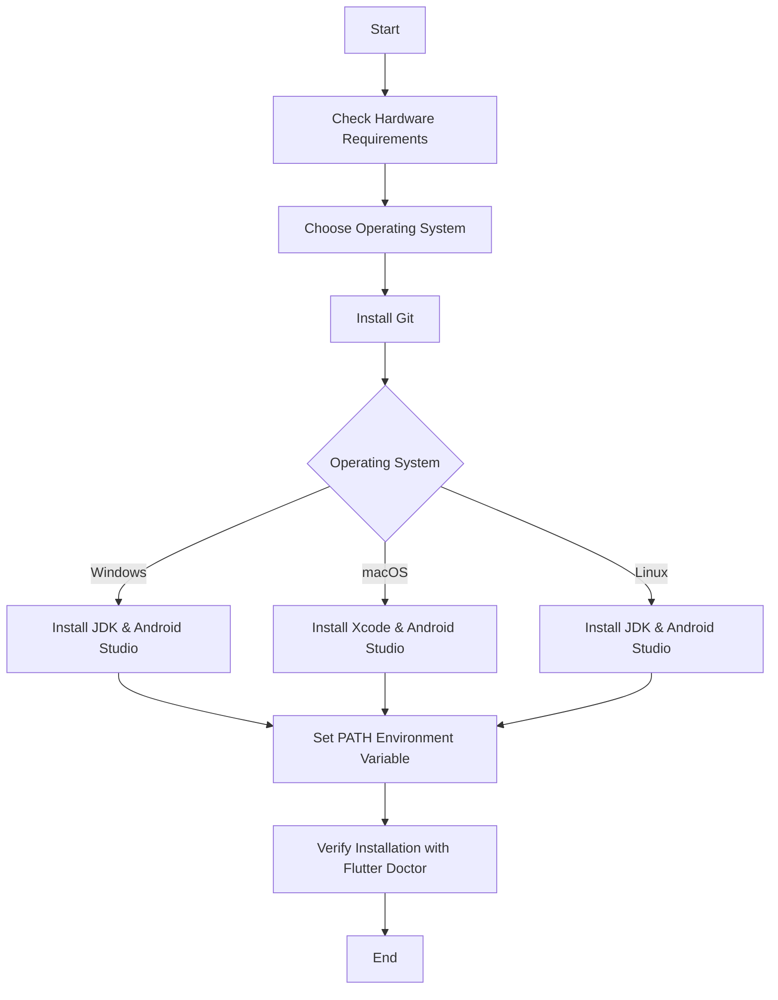

## 1.2.1 System Requirements

Embarking on your journey into Flutter app development requires a solid understanding of the system requirements and environment setup. This section will guide you through the necessary hardware and software prerequisites, ensuring your development environment is optimized for building efficient and responsive Flutter applications.

### Minimum Hardware Requirements

To ensure a smooth and efficient development experience with Flutter, your machine should meet the following minimum hardware specifications:

- **RAM:** At least 8 GB of RAM is recommended. While Flutter can run on systems with less memory, having 8 GB or more will significantly enhance performance, particularly when running emulators or multiple applications simultaneously.
- **CPU:** A multi-core processor is essential. A modern Intel i5 or AMD Ryzen 5 processor (or better) is recommended for handling the demands of development tools and emulators.
- **Storage:** A minimum of 10 GB of free disk space is required to accommodate Flutter SDK, Android Studio, and other necessary tools. An SSD (Solid State Drive) is highly recommended for faster build times and improved overall system responsiveness.

**Enhanced Development Experience:**
- **SSD:** Utilizing an SSD instead of an HDD can drastically reduce build times and improve the speed of file operations, which is crucial when dealing with large projects or frequent builds.

### Supported Operating Systems

Flutter supports development on major operating systems, each with specific version requirements:

- **Windows:** Version 7 SP1 or later (64-bit) is required. However, for optimal performance and access to the latest features, Windows 10 or later is recommended.
- **macOS:** Version 10.12 (Sierra) or later is necessary. macOS is essential for developing iOS applications due to the requirement of Xcode.
- **Linux:** Flutter supports various Linux distributions. It's advisable to refer to the [official Flutter documentation](https://flutter.dev/docs/get-started/install/linux) for a comprehensive list of supported distributions and specific requirements.

### Software Prerequisites

Setting up your software environment is crucial for Flutter development. Below are the essential software components you need:

#### Version Control System

- **Git:** Git is a distributed version control system that is essential for managing your codebase. Ensure Git is installed and configured on your system. You can download it from [Git's official website](https://git-scm.com/).

#### Android Development

For Android app development, the following tools are required:

- **JDK (Java Development Kit):** JDK 8 or higher is necessary for Android development. You can download it from [Oracle's official website](https://www.oracle.com/java/technologies/javase-jdk8-downloads.html) or use OpenJDK.
- **Android SDK:** The Android Software Development Kit is essential for building Android applications. It can be installed via Android Studio.
- **Android Studio:** This is the official integrated development environment (IDE) for Android development. It includes the Android SDK and emulator. Download it from [Android Studio's official website](https://developer.android.com/studio).

#### iOS Development (macOS Only)

Developing iOS applications requires a macOS environment due to Apple's development ecosystem:

- **Xcode:** Apple's official IDE for iOS development. It can be downloaded from the Mac App Store. Xcode includes the iOS SDK and simulator necessary for building and testing iOS apps.

### Environment Variables

Configuring environment variables is a critical step in setting up your Flutter development environment. The `PATH` environment variable must include the Flutter SDK's `bin` directory to execute Flutter commands from any terminal session.

#### Setting the `PATH` Environment Variable

Below are step-by-step instructions for setting the `PATH` variable on different operating systems:

##### Windows

1. **Locate the Flutter SDK Path:**
   - After downloading and extracting the Flutter SDK, note the path to the `bin` directory. For example, `C:\flutter\bin`.

2. **Open Environment Variables:**
   - Right-click on 'This PC' or 'My Computer' and select 'Properties'.
   - Click on 'Advanced system settings'.
   - Click on 'Environment Variables'.

3. **Edit the `PATH` Variable:**
   - Under 'System variables', find and select the `Path` variable, then click 'Edit'.
   - Click 'New' and add the path to the Flutter `bin` directory.

4. **Verify the Setup:**
   - Open a new Command Prompt and run `flutter doctor` to verify the installation.

##### macOS

1. **Locate the Flutter SDK Path:**
   - Note the path to the `bin` directory of the extracted Flutter SDK. For example, `/Users/yourname/flutter/bin`.

2. **Edit the `.zshrc` or `.bash_profile`:**
   - Open Terminal.
   - Use a text editor to open the `.zshrc` or `.bash_profile` file in your home directory. For example, `nano ~/.zshrc`.

3. **Add the Flutter Path:**
   - Add the following line to the file:
     ```bash
     export PATH="$PATH:/Users/yourname/flutter/bin"
     ```

4. **Apply the Changes:**
   - Run `source ~/.zshrc` or `source ~/.bash_profile` to apply the changes.

5. **Verify the Setup:**
   - Run `flutter doctor` in Terminal to verify the installation.

##### Linux

1. **Locate the Flutter SDK Path:**
   - Note the path to the `bin` directory of the extracted Flutter SDK. For example, `/home/yourname/flutter/bin`.

2. **Edit the `.bashrc` or `.zshrc`:**
   - Open Terminal.
   - Use a text editor to open the `.bashrc` or `.zshrc` file in your home directory. For example, `nano ~/.bashrc`.

3. **Add the Flutter Path:**
   - Add the following line to the file:
     ```bash
     export PATH="$PATH:/home/yourname/flutter/bin"
     ```

4. **Apply the Changes:**
   - Run `source ~/.bashrc` or `source ~/.zshrc` to apply the changes.

5. **Verify the Setup:**
   - Run `flutter doctor` in Terminal to verify the installation.

### Setup Process Flowchart

To visualize the setup process, refer to the following flowchart, which outlines the steps required to configure your Flutter development environment:



This flowchart provides a clear roadmap for setting up your development environment, ensuring you have all the necessary tools and configurations in place to start building Flutter applications.

### Conclusion

By meeting these system requirements and following the setup instructions, you'll be well-equipped to embark on your Flutter development journey. A properly configured environment is crucial for efficient development and testing, allowing you to focus on creating innovative and high-quality applications.

## Quiz Time!



### What is the minimum recommended RAM for Flutter development?

- [x] 8 GB
- [ ] 4 GB
- [ ] 2 GB
- [ ] 16 GB

> **Explanation:** 8 GB of RAM is recommended to ensure smooth performance, especially when running emulators or multiple applications.

### Which operating system version is required for Windows to support Flutter development?

- [ ] Windows XP
- [ ] Windows Vista
- [x] Windows 7 SP1 or later (64-bit)
- [ ] Windows 95

> **Explanation:** Windows 7 SP1 or later (64-bit) is the minimum requirement for Flutter development on Windows.

### What is the role of Git in Flutter development?

- [x] Version control system
- [ ] IDE for coding
- [ ] Compiler for Flutter apps
- [ ] Emulator for testing

> **Explanation:** Git is a version control system used to manage codebases and collaborate on projects.

### Which tool is necessary for iOS development on macOS?

- [ ] Android Studio
- [ ] Visual Studio
- [x] Xcode
- [ ] Eclipse

> **Explanation:** Xcode is required for iOS development on macOS, as it includes the necessary SDKs and simulators.

### What is the recommended storage type for faster build times in Flutter development?

- [ ] HDD
- [x] SSD
- [ ] USB Drive
- [ ] Cloud Storage

> **Explanation:** An SSD is recommended for faster build times and improved system responsiveness.

### How do you verify the Flutter installation on your system?

- [ ] Run `flutter setup`
- [ ] Open Android Studio
- [x] Run `flutter doctor`
- [ ] Check system settings

> **Explanation:** Running `flutter doctor` verifies the Flutter installation and checks for any missing dependencies.

### Which Java Development Kit (JDK) version is required for Android development?

- [ ] JDK 6
- [ ] JDK 7
- [x] JDK 8 or higher
- [ ] JDK 5

> **Explanation:** JDK 8 or higher is required for Android development with Flutter.

### What command is used to add the Flutter SDK to the `PATH` on macOS?

- [ ] `addpath`
- [ ] `setpath`
- [x] `export PATH="$PATH:/path/to/flutter/bin"`
- [ ] `flutter path`

> **Explanation:** The `export PATH` command is used to add the Flutter SDK to the `PATH` environment variable on macOS.

### Which IDE is officially recommended for Android development?

- [ ] Visual Studio Code
- [x] Android Studio
- [ ] Xcode
- [ ] NetBeans

> **Explanation:** Android Studio is the official IDE recommended for Android development.

### True or False: macOS is required for developing iOS applications.

- [x] True
- [ ] False

> **Explanation:** macOS is required for iOS development because Xcode, which is necessary for building and testing iOS apps, only runs on macOS.



By following these guidelines and ensuring your system meets the necessary requirements, you'll be well-prepared to dive into the world of Flutter development. Happy coding!
