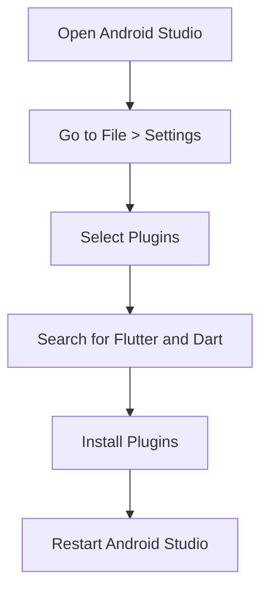
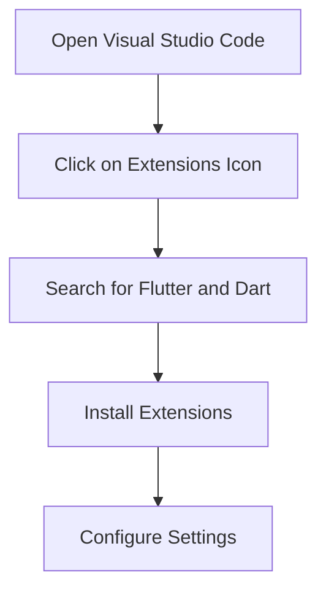

---

linkTitle: "1.2.3 Choosing an IDE or Text Editor"
title: "Choosing an IDE or Text Editor for Flutter Development"
description: "Explore the best IDEs and text editors for Flutter development, including Android Studio and Visual Studio Code. Learn how to set up your environment for optimal productivity."
categories:
- Flutter Development
- IDEs
- Text Editors
tags:
- Flutter
- Android Studio
- Visual Studio Code
- IDE Setup
- Development Tools
date: 2024-10-25
type: docs
nav_weight: 123000
---

## 1.2.3 Choosing an IDE or Text Editor

Embarking on your Flutter journey requires selecting the right Integrated Development Environment (IDE) or text editor. This choice is pivotal as it can significantly influence your productivity, ease of development, and overall experience. In this section, we will delve into two of the most popular options for Flutter development: Android Studio/IntelliJ IDEA and Visual Studio Code. We will explore their features, guide you through the setup process, and provide recommendations to help you decide which tool best suits your needs.

### Overview of Options

#### Android Studio/IntelliJ IDEA

**Android Studio**, built on JetBrains' IntelliJ IDEA, is a feature-rich IDE tailored for Android development. It offers a comprehensive suite of tools that cater to the needs of developers working on Android and Flutter applications. Some of its standout features include:

- **Integrated Emulator**: Allows you to test your applications on virtual devices directly within the IDE.
- **Advanced Code Editor**: Provides intelligent code completion, refactoring, and syntax highlighting.
- **Built-in Version Control**: Seamlessly integrates with Git, SVN, and other version control systems.
- **Extensive Plugin Support**: Offers a wide range of plugins, including those for Flutter and Dart, enhancing its functionality.

#### Visual Studio Code

**Visual Studio Code (VS Code)** is a lightweight, highly customizable text editor developed by Microsoft. It has gained immense popularity among developers due to its versatility and robust extension ecosystem. Key features include:

- **Lightweight and Fast**: Starts up quickly and consumes fewer resources compared to traditional IDEs.
- **Customizable Interface**: Allows you to tailor the editor to your preferences with themes and settings.
- **Rich Extension Marketplace**: Offers a plethora of extensions for various programming languages and frameworks, including Flutter and Dart.
- **Integrated Terminal**: Provides a built-in terminal for executing commands without leaving the editor.

### Setting Up Android Studio

To harness the full potential of Android Studio for Flutter development, follow these steps to set up your environment:

#### Step 1: Install Android Studio

1. **Download Android Studio**: Visit the [official Android Studio website](https://developer.android.com/studio) and download the installer for your operating system.
2. **Run the Installer**: Follow the on-screen instructions to complete the installation process.
3. **Launch Android Studio**: Open Android Studio and proceed with the initial setup wizard.

#### Step 2: Install Flutter and Dart Plugins

1. **Open the Plugins Menu**: Navigate to `File` > `Settings` (or `Android Studio` > `Preferences` on macOS) and select `Plugins`.
2. **Search for Plugins**: In the Plugins window, search for "Flutter" and "Dart".
3. **Install Plugins**: Click on the `Install` button for both plugins. Restart Android Studio to activate them.

#### Step 3: Configure Android SDK Path

1. **Access SDK Manager**: Go to `File` > `Project Structure` > `SDK Location`.
2. **Set SDK Path**: Ensure the Android SDK path is correctly set. If not, specify the location where the SDK is installed.

### Setting Up Visual Studio Code

Visual Studio Code offers a streamlined setup process for Flutter development. Follow these steps to get started:

#### Step 1: Install Visual Studio Code

1. **Download VS Code**: Head to the [Visual Studio Code website](https://code.visualstudio.com/) and download the appropriate installer for your platform.
2. **Install VS Code**: Run the installer and follow the prompts to complete the installation.

#### Step 2: Install Flutter and Dart Extensions

1. **Open Extensions Marketplace**: Click on the Extensions icon in the Activity Bar on the side of the window.
2. **Search for Extensions**: Type "Flutter" and "Dart" in the search bar.
3. **Install Extensions**: Click `Install` for both the Flutter and Dart extensions to add them to your editor.

#### Step 3: Configure Settings for Optimal Development

1. **Open Settings**: Navigate to `File` > `Preferences` > `Settings`.
2. **Customize Settings**: Adjust settings such as `editor.formatOnSave` and `dart.flutterSdkPath` to enhance your development workflow.

### Screenshots and Visual Aids

To assist you in the setup process, here are some visual aids illustrating key steps:

#### Android Studio Plugin Installation

#### Visual Studio Code Extension Installation

### Recommendation

Choosing between Android Studio and Visual Studio Code ultimately depends on your personal preferences and workflow. Here are some considerations to help you decide:

- **Android Studio**: Ideal if you prefer a comprehensive IDE with integrated tools and are primarily focused on Android development.
- **Visual Studio Code**: Suitable if you value a lightweight editor with flexibility and a vast extension ecosystem.

We encourage you to try both options to determine which aligns best with your development style. Experimenting with different tools can provide valuable insights into optimizing your workflow.

### Conclusion

Selecting the right IDE or text editor is a crucial step in your Flutter development journey. Both Android Studio and Visual Studio Code offer unique advantages that cater to different needs. By following the setup guides provided, you can create a robust development environment tailored to your preferences. Remember, the best tool is the one that enhances your productivity and makes coding an enjoyable experience.

## Quiz Time!



### Which IDE is built on JetBrains' IntelliJ IDEA?

- [x] Android Studio
- [ ] Visual Studio Code
- [ ] Eclipse
- [ ] NetBeans

> **Explanation:** Android Studio is built on JetBrains' IntelliJ IDEA, providing a rich set of tools for Android development.

### What is a key feature of Visual Studio Code?

- [x] Lightweight and customizable
- [ ] Integrated emulator
- [ ] Built-in version control
- [ ] Advanced code editor

> **Explanation:** Visual Studio Code is known for being lightweight and highly customizable, with a strong extension ecosystem.

### How do you install Flutter and Dart plugins in Android Studio?

- [x] Through the Plugins menu in Settings
- [ ] By downloading from the Flutter website
- [ ] Using the command line
- [ ] Via the Android SDK Manager

> **Explanation:** Flutter and Dart plugins can be installed in Android Studio through the Plugins menu found in the Settings.

### What is the first step to set up Visual Studio Code for Flutter development?

- [x] Install Visual Studio Code
- [ ] Install Dart SDK
- [ ] Configure Android SDK
- [ ] Install Android Studio

> **Explanation:** The first step is to install Visual Studio Code, which is necessary before adding any extensions.

### Which feature is NOT associated with Android Studio?

- [ ] Integrated Emulator
- [ ] Advanced Code Editor
- [x] Lightweight and Fast
- [ ] Built-in Version Control

> **Explanation:** Android Studio is a feature-rich IDE, but it is not known for being lightweight and fast compared to text editors like VS Code.

### What should you do after installing Flutter and Dart extensions in VS Code?

- [x] Configure settings for optimal development
- [ ] Install Android Studio
- [ ] Download additional themes
- [ ] Uninstall other extensions

> **Explanation:** After installing the extensions, configuring settings like `editor.formatOnSave` can enhance the development experience.

### Which IDE offers a built-in terminal?

- [x] Visual Studio Code
- [ ] Android Studio
- [ ] IntelliJ IDEA
- [ ] Eclipse

> **Explanation:** Visual Studio Code provides a built-in terminal, allowing developers to run commands without leaving the editor.

### What is the recommended way to decide between Android Studio and VS Code?

- [x] Try both to see which fits your workflow
- [ ] Choose based on popularity
- [ ] Use the one with more features
- [ ] Select the one with a better UI

> **Explanation:** Trying both IDEs helps you determine which one aligns best with your personal workflow and preferences.

### Which extension is essential for Flutter development in VS Code?

- [x] Flutter
- [ ] Python
- [ ] Java
- [ ] HTML

> **Explanation:** The Flutter extension is crucial for Flutter development in VS Code, providing necessary tools and features.

### True or False: Android Studio is a lightweight text editor.

- [ ] True
- [x] False

> **Explanation:** False. Android Studio is a comprehensive IDE, not a lightweight text editor.



