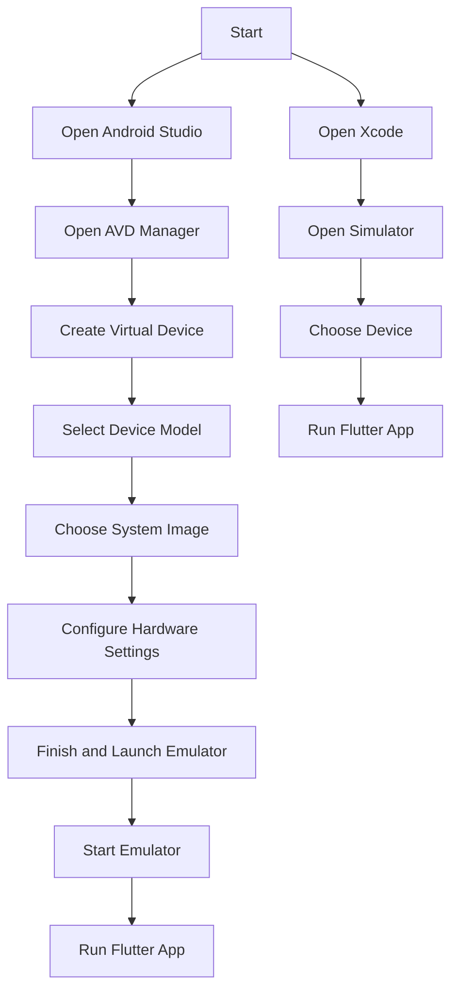

---

linkTitle: "1.2.4 Configuring Emulators and Devices"
title: "Configuring Emulators and Devices for Flutter Development"
description: "Learn how to set up Android emulators, iOS simulators, and connect physical devices for Flutter app development."
categories:
- Flutter Development
- Mobile App Development
- Software Engineering
tags:
- Flutter
- Android Emulator
- iOS Simulator
- Mobile Development
- App Testing
date: 2024-10-25
type: docs
nav_weight: 124000
---

## 1.2.4 Configuring Emulators and Devices

In the journey of developing Flutter applications, testing your app on various devices is crucial to ensure compatibility and performance. This section will guide you through setting up Android emulators, iOS simulators, and connecting physical devices for testing your Flutter applications. We will cover the essential steps, provide troubleshooting tips, and highlight best practices to streamline your development workflow.

### Setting Up Android Emulators

Android emulators allow you to test your Flutter applications on virtual devices that mimic the behavior of real Android devices. This is particularly useful for testing your app on different screen sizes and Android versions without needing physical devices.

#### Using Android Virtual Device (AVD) Manager

The Android Virtual Device (AVD) Manager in Android Studio is a powerful tool for creating and managing Android emulators. Follow these steps to set up an Android emulator:

1. **Open Android Studio**: Launch Android Studio and navigate to the "AVD Manager" from the "Tools" menu.

2. **Create a New Virtual Device**:
   - Click on "Create Virtual Device" to start the process.
   - **Select Device Model**: Choose a device model from the list. You can select from various categories like phones, tablets, and TVs. For most Flutter applications, selecting a popular phone model like Pixel is recommended.

3. **Choose a System Image**:
   - You will be prompted to select a system image. It's advisable to choose the latest stable version of Android for compatibility and performance reasons. You may need to download the system image if it's not already available.

4. **Configure Hardware Settings**:
   - Adjust the hardware settings such as RAM, storage, and resolution according to your needs. Ensure that the emulator has enough resources to run smoothly.

5. **Finish and Launch**:
   - Once configured, click "Finish" to create the virtual device. You can now start the emulator by clicking the "Play" button next to the device in the AVD Manager.

6. **Starting and Stopping the Emulator**:
   - To start the emulator, simply click on the "Play" button. To stop it, close the emulator window or use the "Stop" button in the AVD Manager.

#### Best Practices for Android Emulators

- **Allocate Sufficient Resources**: Ensure that your computer has enough RAM and CPU power to run the emulator smoothly. Emulators can be resource-intensive.
- **Use Hardware Acceleration**: Enable hardware acceleration in the emulator settings for better performance.
- **Regularly Update System Images**: Keep your system images up-to-date to test your app against the latest Android features and security updates.

### Setting Up iOS Simulators (macOS Only)

For iOS development, simulators are available through Xcode, Apple's integrated development environment. These simulators allow you to test your Flutter applications on different iPhone and iPad models.

#### Using Xcode for iOS Simulators

1. **Install Xcode**: Ensure that Xcode is installed on your macOS system. You can download it from the Mac App Store.

2. **Open Xcode**: Launch Xcode and navigate to "Xcode" > "Open Developer Tool" > "Simulator".

3. **Choose a Device**:
   - In the Simulator app, go to "Hardware" > "Device" to select the iPhone or iPad model you wish to simulate. You can choose from a variety of models, including the latest devices.

4. **Run Your Flutter App**:
   - Use the Flutter command `flutter run` in your terminal to launch your app on the selected simulator. Ensure that the simulator is running before executing the command.

#### Best Practices for iOS Simulators

- **Test on Multiple Devices**: Simulate different iPhone and iPad models to ensure your app's UI and functionality work across various screen sizes and resolutions.
- **Keep Xcode Updated**: Regularly update Xcode to access the latest simulators and iOS features.

### Connecting Physical Devices

Testing on physical devices is essential to understand how your app performs in real-world scenarios. Here's how to connect Android and iOS devices to your development environment.

#### Connecting Android Devices

1. **Enable Developer Options**:
   - On your Android device, go to "Settings" > "About Phone" and tap "Build Number" seven times to enable Developer Options.

2. **Enable USB Debugging**:
   - In "Developer Options", enable "USB Debugging" to allow your device to communicate with your computer.

3. **Connect via USB**:
   - Connect your Android device to your computer using a USB cable.

4. **Verify Connection**:
   - Use the command `flutter devices` in your terminal to verify that your device is connected and recognized by Flutter.

#### Connecting iOS Devices

1. **Install Necessary Profiles**:
   - Connect your iOS device to your Mac and open Xcode. You may need to install profiles and trust your development machine.

2. **Trust the Development Machine**:
   - On your iOS device, go to "Settings" > "General" > "Device Management" and trust your Mac.

3. **Apple Developer Account**:
   - Note that deploying apps to physical iOS devices requires an Apple Developer account. You can sign up for one on Apple's developer website.

### Troubleshooting Connection Issues

While setting up emulators and devices, you may encounter some common issues. Here are solutions to some frequent problems:

- **Driver Issues on Windows**: If your Android device is not recognized, ensure that the appropriate USB drivers are installed. You can download drivers from your device manufacturer's website.
- **Emulator Performance**: If the emulator is slow, check that hardware acceleration is enabled and allocate more resources if necessary.
- **iOS Device Not Recognized**: Ensure that your device is trusted on your Mac and that you have the necessary profiles installed.

### Flowchart: Setting Up and Running Emulators

Below is a flowchart illustrating the steps to set up and run emulators for Android and iOS:

### Conclusion

Configuring emulators and devices is a critical step in the Flutter development process. By following the steps outlined in this section, you can effectively test your applications on a variety of platforms and devices, ensuring a smooth user experience. Remember to regularly update your tools and test on multiple devices to catch any potential issues early in the development cycle.

## Quiz Time!



### What tool is used to create Android emulators in Android Studio?

- [x] AVD Manager
- [ ] Device Simulator
- [ ] Android Emulator Creator
- [ ] Virtual Device Setup

> **Explanation:** The AVD (Android Virtual Device) Manager is used to create and manage Android emulators in Android Studio.

### Which command verifies connected Android devices in Flutter?

- [x] flutter devices
- [ ] flutter connect
- [ ] flutter run
- [ ] flutter list

> **Explanation:** The `flutter devices` command lists all connected devices available for running Flutter apps.

### What must be enabled on an Android device to connect it for development?

- [x] USB Debugging
- [ ] Developer Mode
- [ ] Debug Mode
- [ ] USB Connection

> **Explanation:** USB Debugging must be enabled in the Developer Options to connect an Android device for development.

### What is required to deploy Flutter apps on physical iOS devices?

- [x] Apple Developer account
- [ ] Xcode license
- [ ] iOS Developer Kit
- [ ] iTunes account

> **Explanation:** An Apple Developer account is required to deploy apps on physical iOS devices.

### What should be done if an Android emulator is slow?

- [x] Enable hardware acceleration
- [ ] Increase screen resolution
- [ ] Decrease RAM allocation
- [ ] Use a different system image

> **Explanation:** Enabling hardware acceleration can significantly improve the performance of an Android emulator.

### Which tool is used to run iOS simulators?

- [x] Xcode
- [ ] iOS Simulator Manager
- [ ] Apple Device Emulator
- [ ] Mac Simulator

> **Explanation:** Xcode provides the tools necessary to run iOS simulators on macOS.

### How can you test a Flutter app on different iPhone models?

- [x] Use iOS simulators in Xcode
- [ ] Install multiple iOS versions
- [ ] Use Android emulators
- [ ] Change device settings

> **Explanation:** iOS simulators in Xcode allow testing on different iPhone models.

### What is the first step in creating an Android emulator?

- [x] Open AVD Manager
- [ ] Choose a system image
- [ ] Select a device model
- [ ] Configure hardware settings

> **Explanation:** Opening the AVD Manager is the first step in creating an Android emulator.

### Which of the following is a common issue when connecting Android devices on Windows?

- [x] Driver issues
- [ ] USB cable problems
- [ ] Device not charged
- [ ] Incorrect settings

> **Explanation:** Driver issues are a common problem when connecting Android devices on Windows.

### True or False: You can test Flutter apps on iOS simulators without a Mac.

- [ ] True
- [x] False

> **Explanation:** iOS simulators require Xcode, which is only available on macOS.



By mastering the setup of emulators and devices, you lay a strong foundation for efficient and effective Flutter app development. Happy coding!
