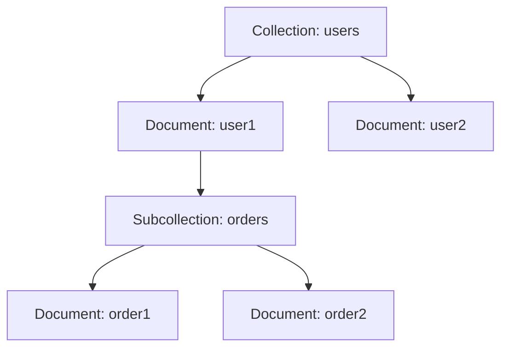

## 10.1.4 Firestore Database

In the realm of modern mobile and web application development, the ability to manage and synchronize data efficiently is paramount. Firebase's Cloud Firestore stands out as a flexible, scalable database solution that caters to these needs, offering real-time data synchronization, offline support, and robust querying capabilities. In this section, we will delve into the integration of Firestore with Flutter, exploring its data model, operations, and best practices to ensure you can leverage its full potential in your applications.

### Introduction to Cloud Firestore

Cloud Firestore is a NoSQL cloud database from Firebase and Google Cloud, designed to support mobile, web, and server development. Unlike traditional relational databases, Firestore organizes data into collections and documents, allowing for a more flexible and scalable structure. This makes it particularly well-suited for applications that require real-time data updates and offline capabilities.

#### Key Features of Firestore

- **Real-Time Synchronization:** Firestore enables real-time data updates, ensuring that all connected clients receive the latest data changes instantly.
- **Offline Support:** Data is cached locally on the device, allowing applications to function seamlessly even without an internet connection. Changes made offline are synchronized once connectivity is restored.
- **Rich Querying:** Firestore supports complex queries, allowing developers to filter, sort, and paginate data efficiently.
- **Scalability:** Designed to handle large volumes of data and high traffic, Firestore scales seamlessly with your application's needs.

### Adding `cloud_firestore` Package

To begin using Firestore in your Flutter application, you need to add the `cloud_firestore` package to your project. This package provides the necessary tools to interact with Firestore from your Flutter app.

1. **Add the Package to `pubspec.yaml`:**

   Open your `pubspec.yaml` file and add the `cloud_firestore` dependency:

   ```yaml
   dependencies:
     flutter:
       sdk: flutter
     cloud_firestore: ^4.2.0
   ```

2. **Install the Package:**

   Run the following command in your terminal to install the package:

   ```bash
   flutter pub get
   ```

### Understanding Firestore Data Model

Firestore's data model is based on collections and documents, offering a flexible and hierarchical structure for storing data.

#### Collections and Documents

- **Collections:** These are containers for documents and can be thought of as analogous to tables in a relational database. However, unlike tables, collections do not enforce a schema, allowing documents within the same collection to have different fields.
- **Documents:** Each document is a key-value pair collection, similar to a JSON object. Documents are identified by a unique ID and can contain subcollections, enabling nested data structures.

#### NoSQL Database Structure

Firestore is a NoSQL database, meaning it does not use tables and rows like traditional relational databases. Instead, it organizes data into collections and documents, providing a more flexible and scalable way to store and retrieve data.

##### Structure Example

Consider a collection named `users`, where each document represents a user. A document might contain fields such as `full_name`, `age`, and `joined_at`. Additionally, a document can have subcollections, allowing for complex data hierarchies.



### Writing Data to Firestore

Firestore provides several methods for writing data, including adding new documents, setting data with known IDs, and updating existing documents.

#### Adding a Document

To add a new document to a collection, use the `add` method. This method automatically generates a unique ID for the document.

```dart
FirebaseFirestore firestore = FirebaseFirestore.instance;

Future<void> addUser() {
  return firestore.collection('users').add({
    'full_name': 'John Doe',
    'age': 30,
    'joined_at': DateTime.now(),
  })
  .then((value) => print("User Added"))
  .catchError((error) => print("Failed to add user: $error"));
}
```

#### Setting Data with a Known Document ID

If you want to specify a document ID, use the `set` method. This is useful when you need predictable document IDs.

```dart
Future<void> setUser() {
  return firestore.collection('users').doc('unique_user_id').set({
    'full_name': 'Jane Smith',
    'age': 25,
  });
}
```

### Reading Data from Firestore

Reading data from Firestore involves retrieving documents or querying collections based on specific criteria.

#### Retrieving Documents

##### Get a Document

To retrieve a specific document, use the `get` method with the document ID.

```dart
Future<void> getUser(String userId) async {
  DocumentSnapshot documentSnapshot = await firestore.collection('users').doc(userId).get();
  if (documentSnapshot.exists) {
    Map<String, dynamic>? data = documentSnapshot.data() as Map<String, dynamic>?;
    print("User Data: $data");
  } else {
    print("No such document!");
  }
}
```

##### Get All Documents in a Collection

To retrieve all documents within a collection, use the `get` method on the collection reference.

```dart
Future<void> getAllUsers() async {
  QuerySnapshot querySnapshot = await firestore.collection('users').get();
  querySnapshot.docs.forEach((document) {
    print(document.data());
  });
}
```

#### Querying Data

Firestore supports complex queries, allowing you to filter and sort data efficiently.

```dart
Future<void> getUsersByAge() async {
  QuerySnapshot querySnapshot = await firestore.collection('users').where('age', isGreaterThan: 20).get();
  querySnapshot.docs.forEach((document) {
    print(document.data());
  });
}
```

### Updating and Deleting Data

Firestore provides methods for updating and deleting documents, enabling you to manage your data effectively.

#### Updating a Document

To update specific fields in a document, use the `update` method.

```dart
Future<void> updateUser(String userId) {
  return firestore.collection('users').doc(userId).update({
    'age': 31,
  });
}
```

#### Deleting a Document

To delete a document, use the `delete` method.

```dart
Future<void> deleteUser(String userId) {
  return firestore.collection('users').doc(userId).delete();
}
```

### Real-Time Updates

One of Firestore's standout features is its ability to provide real-time updates. By setting up listeners, your application can react to data changes instantly.

```dart
void listenToUserChanges(String userId) {
  firestore.collection('users').doc(userId).snapshots().listen((documentSnapshot) {
    if (documentSnapshot.exists) {
      print("User data changed: ${documentSnapshot.data()}");
    }
  });
}
```

### Handling Data Consistency and Offline Support

Firestore's offline capabilities ensure that your application remains functional even without an internet connection. Data is cached locally, and any changes made offline are synchronized once the device reconnects.

### Security Rules

Firestore security rules control access to your data, allowing you to define who can read or write to your database. A dedicated section will cover security rules in detail, but it's important to understand their significance in protecting your data.

### Best Practices

To make the most of Firestore, consider the following best practices:

- **Structure Data Properly:** Organize your data into collections and documents in a way that supports scalability and efficient querying.
- **Use Indexes Wisely:** Firestore automatically indexes fields for queries, but you can create custom indexes for more complex queries.
- **Handle Exceptions Gracefully:** Always handle exceptions and errors to ensure your application remains robust and user-friendly.

### Exercise: Implementing a CRUD Interface

To reinforce your understanding of Firestore, try implementing a simple CRUD (Create, Read, Update, Delete) interface for a collection, such as "notes" or "tasks". This exercise will help you practice the concepts covered in this section and gain hands-on experience with Firestore operations.

#### Step-by-Step Guide

1. **Create a New Flutter Project:**

   Use the Flutter CLI to create a new project:

   ```bash
   flutter create firestore_crud_example
   ```

2. **Add `cloud_firestore` Dependency:**

   Update your `pubspec.yaml` file to include the `cloud_firestore` package.

3. **Set Up Firestore:**

   Initialize Firestore in your `main.dart` file and create a collection named `tasks`.

4. **Implement CRUD Operations:**

   - **Create:** Add a form to create new tasks and save them to Firestore.
   - **Read:** Display a list of tasks retrieved from Firestore.
   - **Update:** Allow users to edit existing tasks and update them in Firestore.
   - **Delete:** Provide an option to delete tasks from Firestore.

5. **Test Your Application:**

   Run your application on a device or emulator to test the CRUD functionality.

By completing this exercise, you'll gain valuable experience working with Firestore and develop a deeper understanding of its capabilities.

## Quiz Time!



### What is Cloud Firestore?

- [x] A NoSQL cloud database from Firebase and Google Cloud
- [ ] A SQL-based database from Firebase
- [ ] A local database for mobile apps
- [ ] A file storage service

> **Explanation:** Cloud Firestore is a NoSQL cloud database designed for mobile, web, and server development, offering real-time synchronization and offline support.

### How do you add the `cloud_firestore` package to a Flutter project?

- [x] By adding it to the `pubspec.yaml` file and running `flutter pub get`
- [ ] By downloading it from the Firebase website
- [ ] By installing it via the Android SDK Manager
- [ ] By adding it to the `gradle.build` file

> **Explanation:** The `cloud_firestore` package is added to a Flutter project by specifying it in the `pubspec.yaml` file and running `flutter pub get` to install it.

### What is the primary data structure used in Firestore?

- [x] Collections and Documents
- [ ] Tables and Rows
- [ ] JSON Files
- [ ] XML Files

> **Explanation:** Firestore uses collections and documents as its primary data structure, allowing for flexible and hierarchical data organization.

### How can you retrieve all documents in a Firestore collection?

- [x] By using the `get` method on the collection reference
- [ ] By using the `list` method on the collection reference
- [ ] By using the `fetch` method on the collection reference
- [ ] By using the `query` method on the collection reference

> **Explanation:** The `get` method on a collection reference retrieves all documents within that collection.

### What method is used to listen for real-time updates in Firestore?

- [x] `snapshots()`
- [ ] `get()`
- [ ] `listen()`
- [ ] `subscribe()`

> **Explanation:** The `snapshots()` method is used to listen for real-time updates to a document or collection in Firestore.

### Which of the following is a best practice when using Firestore?

- [x] Structure data properly for scalability
- [ ] Avoid using indexes
- [ ] Store all data in a single document
- [ ] Disable offline support

> **Explanation:** Proper data structuring is crucial for scalability and efficient querying in Firestore.

### How does Firestore handle offline data?

- [x] It caches data locally and synchronizes changes when online
- [ ] It stores data in a local SQLite database
- [ ] It does not support offline data
- [ ] It requires manual synchronization

> **Explanation:** Firestore caches data locally, allowing offline access and synchronizing changes when the device reconnects.

### What is a key feature of Firestore security rules?

- [x] They control access to data
- [ ] They encrypt all data
- [ ] They provide data backup
- [ ] They optimize query performance

> **Explanation:** Firestore security rules are used to control access to data, ensuring that only authorized users can read or write to the database.

### How can you update a specific field in a Firestore document?

- [x] By using the `update` method
- [ ] By using the `set` method
- [ ] By using the `modify` method
- [ ] By using the `change` method

> **Explanation:** The `update` method is used to modify specific fields in a Firestore document.

### True or False: Firestore requires a fixed schema for all documents in a collection.

- [ ] True
- [x] False

> **Explanation:** Firestore does not require a fixed schema, allowing documents within the same collection to have different fields.


