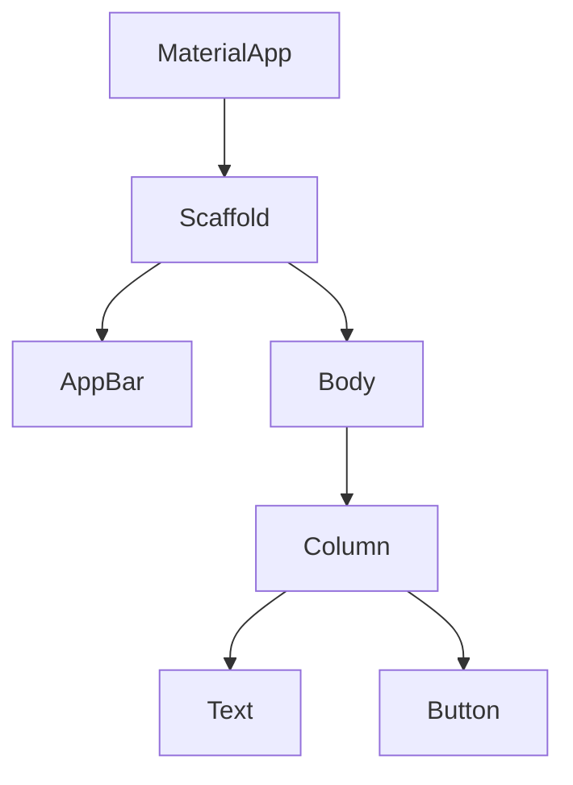

## 11.1.3 Inspecting the Widget Tree

In the world of Flutter development, understanding and inspecting the widget tree is crucial for creating efficient and visually appealing applications. This section will guide you through the process of inspecting the widget tree using Flutter's powerful tools, helping you diagnose and resolve layout and rendering issues with ease.

### Understanding the Widget Tree

At the heart of every Flutter application lies the widget tree, a hierarchical structure that defines the UI. Each node in this tree represents a widget, which can be a simple element like a `Text` or a complex structure like a `Column` containing multiple child widgets. Inspecting this tree is essential for understanding how your UI is constructed and for diagnosing any issues that arise during development.

#### Why Inspect the Widget Tree?

- **Diagnose Layout Issues:** By visualizing the widget tree, you can pinpoint where layout problems occur, such as widgets overflowing their bounds or being misaligned.
- **Optimize Rendering:** Understanding the widget hierarchy helps in optimizing rendering performance, ensuring that your app runs smoothly.
- **Enhance Understanding:** Regular inspection of the widget tree deepens your understanding of Flutter's layout system, making you a more proficient developer.

### Flutter Inspector Tool

The Flutter Inspector is an indispensable tool for visualizing and interacting with the widget tree. It provides a real-time view of your app's UI structure, allowing you to explore and modify widget properties on the fly.

#### Accessing the Flutter Inspector

The Flutter Inspector is integrated into popular IDEs, making it accessible whether you're using Android Studio, IntelliJ IDEA, or Visual Studio Code.

- **Android Studio/IntelliJ IDEA:** Open the **Flutter Inspector** tab, usually located in the right-hand panel during a debugging session.
- **Visual Studio Code:** Navigate to the **Debug** side bar and select the **Flutter Inspector** to begin exploring your app's widget tree.

### Using the Widget Tree Viewer

The widget tree viewer displays your app's UI in a hierarchical structure, similar to a file explorer. This allows you to expand and collapse nodes to delve into the details of your widget hierarchy.

#### Exploring the Widget Tree

- **Expand/Collapse Nodes:** Click on the arrows next to each widget to reveal or hide its children, providing a clear view of the UI structure.
- **Visual Representation:** The tree visually represents the nesting of widgets, helping you understand how different components are composed.

Here is a simple Mermaid.js diagram illustrating a basic widget tree:

### Selecting Widgets

Selecting widgets directly from the device or emulator is a powerful feature of the Flutter Inspector. This allows you to identify and inspect widgets in real-time.

#### How to Select Widgets

- **Select Widget Mode:** Activate this mode by clicking the **target** icon in the Inspector. This allows you to tap on any widget in your app to highlight it in the Inspector.
- **Interactive Selection:** Once a widget is selected, its properties and position in the widget tree are displayed, enabling detailed inspection.

### Inspecting Widget Properties

The Flutter Inspector provides a comprehensive view of widget properties, allowing you to modify them in real-time and see the effects immediately.

#### Property Panel

- **View Properties:** The property panel displays essential information such as size, constraints, and styles of the selected widget.
- **Modify Properties:** Adjust properties directly in the Inspector to experiment with different layouts and styles without altering your code.

### Diagnosing Layout Issues

Common layout issues such as overflowing widgets or misalignment can be easily identified and resolved using the Flutter Inspector.

#### Identifying Problems

- **Visual Indicators:** The Inspector highlights widgets with errors, such as red lines indicating overflow. This visual feedback is invaluable for quickly diagnosing issues.
- **Interpreting Indicators:** Learn to interpret these indicators to understand the root cause of layout problems and how to address them.

### Rendering Layers and Performance Overlay

Understanding rendering performance is crucial for creating smooth and responsive applications. The Performance Overlay is a tool that visualizes rendering performance, helping you identify bottlenecks.

#### Enabling the Performance Overlay

- **How to Enable:** You can enable the Performance Overlay from the Flutter Inspector or by setting the `showPerformanceOverlay` property in your app's `MaterialApp` widget.
- **Interpreting Graphs:** The overlay displays graphs representing the rendering pipeline, allowing you to identify slow frames and optimize performance.

### Using the Layout Explorer

The Layout Explorer is a specialized tool for analyzing flex layouts, such as `Row` and `Column`, helping you understand how space is distributed among child widgets.

#### Analyzing Flex Layouts

- **Visualize Space Distribution:** The Layout Explorer provides a visual representation of how space is allocated, making it easier to adjust flex properties.
- **Experiment with Layouts:** Use the Explorer to experiment with different flex settings and observe the effects on your UI.

### Practical Example: Diagnosing a Layout Issue

Let's walk through a practical example of diagnosing and fixing a layout issue using the Flutter Inspector.

#### Step-by-Step Guide

1. **Identify the Issue:** Suppose you notice an overlapping widget in your app's UI.
2. **Use the Inspector:** Activate the Select Widget Mode and tap on the problematic widget to highlight it in the Inspector.
3. **Locate the Problem:** Examine the widget tree and property panel to identify the cause of the overlap, such as incorrect constraints or padding.
4. **Adjust Properties:** Modify the widget's properties in the Inspector to resolve the issue, such as adjusting padding or alignment.
5. **Verify the Fix:** Check the app's UI to ensure the issue is resolved and the layout appears as expected.

### Best Practices

To make the most of the Flutter Inspector, consider the following best practices:

- **Frequent Inspection:** Regularly inspect the widget tree during development to catch issues early and ensure a smooth UI.
- **Understand Layouts:** Use the Inspector to deepen your understanding of Flutter's layout system, making you a more effective developer.
- **Optimize Performance:** Leverage the Performance Overlay to identify and resolve rendering bottlenecks, ensuring your app runs smoothly.

### Practice Exercises

To reinforce your understanding of the Flutter Inspector, try the following exercises:

#### Exercise 1: Fixing Layout Issues

1. **Create a UI:** Design a simple UI with intentional layout issues, such as overlapping widgets or misaligned elements.
2. **Use the Inspector:** Use the Flutter Inspector to identify and fix these issues, experimenting with different properties and layouts.

#### Exercise 2: Exploring Flex Layouts

1. **Build a Flex Layout:** Create a `Row` or `Column` with multiple child widgets.
2. **Use the Layout Explorer:** Adjust flex properties using the Layout Explorer and observe how space is distributed among the children.

By mastering the Flutter Inspector and understanding the widget tree, you'll be well-equipped to create efficient, visually appealing applications. Regular practice and exploration will enhance your skills, making you a more proficient Flutter developer.

## Quiz Time!



### What is the primary purpose of inspecting the widget tree in Flutter?

- [x] To diagnose layout and rendering issues
- [ ] To add new widgets to the app
- [ ] To compile the Flutter application
- [ ] To manage app state

> **Explanation:** Inspecting the widget tree helps in diagnosing layout and rendering issues by providing a visual representation of the UI structure.

### How can you access the Flutter Inspector in Visual Studio Code?

- [x] Through the Debug side bar
- [ ] By opening the Terminal
- [ ] Through the File menu
- [ ] By using the Command Palette

> **Explanation:** In Visual Studio Code, the Flutter Inspector is accessible through the Debug side bar.

### What does the Performance Overlay in Flutter visualize?

- [x] Rendering performance
- [ ] Network requests
- [ ] Database queries
- [ ] User interactions

> **Explanation:** The Performance Overlay visualizes rendering performance, helping identify slow frames and optimize the app.

### Which icon activates the Select Widget Mode in the Flutter Inspector?

- [x] The target icon
- [ ] The refresh icon
- [ ] The settings icon
- [ ] The play icon

> **Explanation:** The target icon in the Flutter Inspector activates the Select Widget Mode for selecting widgets directly from the app.

### What does the Layout Explorer help analyze?

- [x] Flex layouts like Row and Column
- [ ] Database schemas
- [ ] Network configurations
- [ ] Animation sequences

> **Explanation:** The Layout Explorer is used to analyze flex layouts, such as Row and Column, to understand space distribution.

### What visual indicator does the Flutter Inspector use for overflow issues?

- [x] Red lines
- [ ] Blue circles
- [ ] Green squares
- [ ] Yellow triangles

> **Explanation:** The Flutter Inspector uses red lines to indicate overflow issues in the widget tree.

### How can you modify widget properties in real-time using the Flutter Inspector?

- [x] By adjusting them in the property panel
- [ ] By editing the main.dart file
- [ ] By restarting the app
- [ ] By changing the app settings

> **Explanation:** Widget properties can be modified in real-time using the property panel in the Flutter Inspector.

### What is a common cause of layout issues that can be identified using the Flutter Inspector?

- [x] Incorrect constraints or padding
- [ ] Missing import statements
- [ ] Incorrect variable names
- [ ] Unused functions

> **Explanation:** Incorrect constraints or padding are common causes of layout issues that can be identified using the Flutter Inspector.

### What is the benefit of regularly inspecting the widget tree during development?

- [x] Catching issues early and ensuring a smooth UI
- [ ] Increasing app size
- [ ] Reducing code readability
- [ ] Slowing down development

> **Explanation:** Regularly inspecting the widget tree helps catch issues early, ensuring a smooth and efficient UI.

### True or False: The Flutter Inspector can be used to add new widgets to the app.

- [ ] True
- [x] False

> **Explanation:** The Flutter Inspector is used for inspecting and modifying existing widgets, not for adding new ones.


