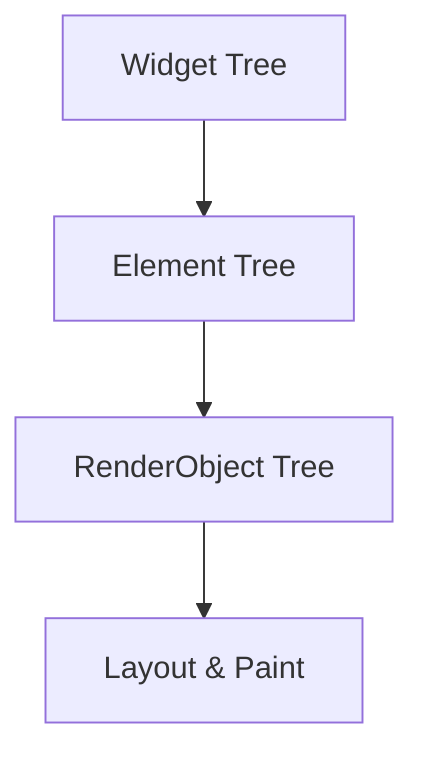

## 11.4.3 Optimizing Rendering

Rendering optimization is a crucial aspect of Flutter development that ensures your applications run smoothly and efficiently. In this section, we will explore the rendering pipeline in Flutter, strategies to avoid unnecessary rebuilds, effective layout techniques, animation optimization, and more. By the end of this chapter, you'll be equipped with the knowledge to enhance the performance of your Flutter applications significantly.

### Understanding Rendering in Flutter

Flutter's rendering system is a sophisticated process that involves multiple layers: the Widget layer, the Element layer, and the RenderObject layer. Understanding these layers is key to optimizing rendering performance.

#### The Rendering Pipeline

1. **Widget Layer**: Widgets are the building blocks of a Flutter application. They describe the configuration of the UI and are immutable. When a widget's configuration changes, Flutter rebuilds the widget tree.

2. **Element Layer**: Elements are the bridge between widgets and the render tree. They manage the lifecycle of widgets and maintain the widget's state. Elements are mutable and can be updated without recreating the entire widget.

3. **RenderObject Layer**: RenderObjects are responsible for the actual layout and painting of the UI. They form the render tree, which is used to compute the layout and paint the UI onto the screen.

Understanding this pipeline helps developers identify where optimizations can be made to improve performance.



### Avoiding Unnecessary Rebuilds

Unnecessary rebuilds can lead to performance bottlenecks. Here are some strategies to minimize them:

#### Use `const` Constructors

Using `const` constructors for widgets that do not change can prevent unnecessary rebuilds. When a widget is marked as `const`, Flutter knows it doesn't need to rebuild it unless its dependencies change.

```dart
const Text('Hello World');
```

#### Implement `shouldRebuild` Methods

For custom widgets, implementing the `shouldRebuild` method can help control when a widget should be rebuilt. This is particularly useful for `InheritedWidget` and `CustomPainter`.

```dart
class MyCustomPainter extends CustomPainter {
  @override
  bool shouldRepaint(covariant MyCustomPainter oldDelegate) {
    return false; // Only repaint if necessary
  }
}
```

### Using Effective Layouts

Choosing the right layout widgets can have a significant impact on performance.

#### Prefer `ListView.builder` Over `ListView`

For large lists, use `ListView.builder` instead of `ListView`. `ListView.builder` lazily builds its children, which means it only constructs the visible items, reducing memory usage and improving performance.

```dart
ListView.builder(
  itemCount: 1000,
  itemBuilder: (context, index) {
    return ListTile(
      title: Text('Item $index'),
    );
  },
);
```

#### Use `RepaintBoundary`

`RepaintBoundary` is a widget that creates a separate layer for its child, preventing unnecessary repaints. This is useful when you have complex widgets that don't need to be repainted frequently.

```dart
RepaintBoundary(
  child: ComplexWidget(),
);
```

### Optimizing Animations

Animations can be resource-intensive, so it's important to keep them efficient.

#### Keep Animations Lightweight

Avoid complex animations that require heavy computation. Use simple animations that can be executed smoothly.

#### Dispose of Animation Controllers

Always dispose of animation controllers to free up resources and prevent memory leaks.

```dart
class MyWidget extends StatefulWidget {
  @override
  _MyWidgetState createState() => _MyWidgetState();
}

class _MyWidgetState extends State<MyWidget> with SingleTickerProviderStateMixin {
  AnimationController _controller;

  @override
  void initState() {
    super.initState();
    _controller = AnimationController(
      duration: const Duration(seconds: 2),
      vsync: this,
    );
  }

  @override
  void dispose() {
    _controller.dispose();
    super.dispose();
  }
}
```

### Batching UI Updates

Batching UI updates can reduce the number of rebuilds and improve performance.

#### Avoid Multiple `setState()` Calls

Avoid calling `setState()` multiple times in quick succession. Instead, batch updates within a single `setState()` call.

```dart
setState(() {
  // Update multiple states at once
  _value1 = newValue1;
  _value2 = newValue2;
});
```

### Using Isolates for Heavy Computation

Flutter's main thread is responsible for rendering the UI, so offloading heavy computations to a separate isolate can keep the UI responsive.

```dart
import 'dart:isolate';

void heavyComputation(SendPort sendPort) {
  // Perform heavy computation
  sendPort.send(result);
}

void main() {
  ReceivePort receivePort = ReceivePort();
  Isolate.spawn(heavyComputation, receivePort.sendPort);

  receivePort.listen((data) {
    // Handle data from isolate
  });
}
```

### Best Practices

- **Profile Rendering Performance**: Use Flutter DevTools to profile and identify performance bottlenecks.
- **Keep Build Methods Fast**: Ensure that build methods are efficient and do not perform heavy computations.

### Practice Exercises

1. **Modify a Complex UI**: Take a complex UI and apply the optimization techniques discussed. Measure the performance before and after using Flutter DevTools.
2. **Measure Impact**: Use the `Performance` tab in Flutter DevTools to measure the impact of your optimizations. Look for improvements in frame rendering times and memory usage.

### Conclusion

Optimizing rendering in Flutter is essential for building high-performance applications. By understanding the rendering pipeline, avoiding unnecessary rebuilds, using effective layouts, and optimizing animations, you can significantly enhance the performance of your Flutter apps. Regular profiling and adherence to best practices will ensure your applications remain responsive and efficient.

## Quiz Time!



### What is the primary role of the RenderObject layer in Flutter's rendering pipeline?

- [ ] To manage widget state
- [ ] To describe the configuration of the UI
- [x] To handle layout and painting
- [ ] To manage the lifecycle of widgets

> **Explanation:** The RenderObject layer is responsible for the layout and painting of the UI, forming the render tree used to compute the layout and paint the UI onto the screen.

### Which constructor should be used to prevent unnecessary widget rebuilds?

- [ ] dynamic
- [x] const
- [ ] final
- [ ] static

> **Explanation:** Using `const` constructors for widgets that do not change can prevent unnecessary rebuilds, as Flutter knows it doesn't need to rebuild them unless their dependencies change.

### What is the advantage of using ListView.builder over ListView for large lists?

- [ ] It is more colorful
- [x] It lazily builds its children
- [ ] It is easier to use
- [ ] It supports more widgets

> **Explanation:** `ListView.builder` lazily builds its children, meaning it only constructs the visible items, reducing memory usage and improving performance.

### How does RepaintBoundary improve performance?

- [ ] By making the UI more responsive
- [ ] By reducing the number of widgets
- [x] By creating a separate layer for its child
- [ ] By increasing the frame rate

> **Explanation:** `RepaintBoundary` creates a separate layer for its child, preventing unnecessary repaints and improving performance.

### What should you do with animation controllers to prevent memory leaks?

- [ ] Ignore them
- [x] Dispose of them
- [ ] Reuse them
- [ ] Clone them

> **Explanation:** Always dispose of animation controllers to free up resources and prevent memory leaks.

### Why is batching UI updates recommended?

- [ ] To make the code more readable
- [ ] To increase the number of rebuilds
- [ ] To slow down the app
- [x] To reduce the number of rebuilds

> **Explanation:** Batching UI updates can reduce the number of rebuilds and improve performance by avoiding multiple `setState()` calls in quick succession.

### How can you keep the UI responsive during heavy computations?

- [ ] By using more widgets
- [ ] By increasing the frame rate
- [x] By using isolates
- [ ] By reducing the number of animations

> **Explanation:** Offloading heavy computations to a separate isolate can keep the UI responsive, as Flutter's main thread is responsible for rendering the UI.

### What tool can be used to profile rendering performance in Flutter?

- [ ] Android Studio
- [ ] Xcode
- [x] Flutter DevTools
- [ ] Visual Studio Code

> **Explanation:** Flutter DevTools can be used to profile rendering performance and identify performance bottlenecks in Flutter applications.

### What is the purpose of the `shouldRebuild` method?

- [ ] To create new widgets
- [ ] To initialize the UI
- [x] To control when a widget should be rebuilt
- [ ] To dispose of resources

> **Explanation:** Implementing the `shouldRebuild` method helps control when a widget should be rebuilt, which is useful for custom widgets like `InheritedWidget` and `CustomPainter`.

### True or False: Using `const` constructors can help in optimizing rendering performance.

- [x] True
- [ ] False

> **Explanation:** True. Using `const` constructors for widgets that do not change can help optimize rendering performance by preventing unnecessary rebuilds.



By mastering these techniques, you will be well on your way to creating Flutter applications that are not only functional but also highly performant. Happy coding!
