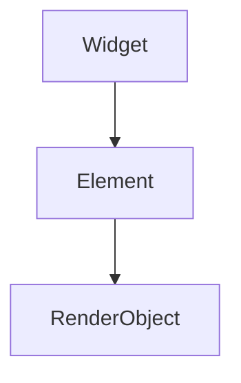

## 12.1.1 Exploring Advanced Topics

As you have journeyed through the foundational aspects of Flutter, you've built a solid base in app development. Now, it's time to elevate your skills by exploring advanced topics that will not only enhance your capabilities but also keep you aligned with the latest industry trends. This chapter delves into complex concepts such as asynchronous programming, custom render objects, platform channels, and more. Each topic is designed to challenge you and expand your understanding of Flutter's potential.

### Introduction to Advanced Flutter Concepts

Congratulations on reaching this advanced stage in your Flutter journey! By now, you should be comfortable with the basics of Flutter and Dart, having built and deployed several applications. As technology evolves, so must your skills. Delving into advanced topics will help you create more efficient, responsive, and feature-rich applications. This chapter encourages you to explore these topics further, experiment with new ideas, and document your learning process to solidify your understanding.

### Asynchronous Programming and Isolates

#### Understanding Isolates

In Dart, isolates are the backbone of concurrency. Unlike threads in other programming languages, each isolate has its own memory heap, which means they do not share memory. This isolation prevents race conditions and makes Dart's concurrency model robust and efficient.

Isolates are particularly useful for performing heavy computational tasks without blocking the main UI thread. By offloading intensive tasks to a separate isolate, you can keep your app responsive.

Here's a simple example of how to spawn a new isolate to perform a heavy computation:

```dart
import 'dart:isolate';

void heavyComputation(SendPort sendPort) {
  // Perform computation
  int result = 0;
  for (int i = 0; i < 1000000000; i++) {
    result += i;
  }
  // Send result back
  sendPort.send(result);
}

void main() async {
  ReceivePort receivePort = ReceivePort();
  await Isolate.spawn(heavyComputation, receivePort.sendPort);
  int result = await receivePort.first;
  print('Result: $result');
}
```

In this example, a new isolate is spawned to perform a heavy computation, and the result is sent back to the main isolate using a `SendPort`.

#### Asynchronous Generators and Streams

Asynchronous programming in Dart is further enhanced by `async*` functions and `Stream`. These tools allow you to handle multiple asynchronous events and implement real-time data flows effectively.

An `async*` function returns a `Stream`, which is a sequence of asynchronous events. Here's an example of using `async*` to generate a stream of numbers:

```dart
Stream<int> numberStream() async* {
  for (int i = 0; i < 5; i++) {
    await Future.delayed(Duration(seconds: 1));
    yield i;
  }
}

void main() async {
  await for (int number in numberStream()) {
    print(number);
  }
}
```

This code snippet demonstrates a stream that emits numbers from 0 to 4, with a one-second delay between each emission. Streams are particularly useful for handling real-time data, such as user input or network requests.

### Custom Render Objects

#### Understanding the Rendering Pipeline

Flutter's rendering pipeline is a sophisticated system that transforms widgets into pixels on the screen. It consists of three main layers: widgets, elements, and render objects. Understanding this pipeline is crucial for creating custom render objects.



- **Widget**: The basic building block of the UI, describing how the UI should look.
- **Element**: An instantiation of a widget, managing the widget's lifecycle.
- **RenderObject**: Responsible for the actual layout and painting of the widget.

#### Creating Custom RenderObjects

Custom render objects allow you to create highly optimized widgets or implement custom layout behaviors. Here's a step-by-step guide to building a simple custom render object that draws a circle:

```dart
import 'package:flutter/rendering.dart';
import 'package:flutter/widgets.dart';

class CircleRenderBox extends RenderBox {
  @override
  void performLayout() {
    size = constraints.constrain(Size(100, 100));
  }

  @override
  void paint(PaintingContext context, Offset offset) {
    final paint = Paint()..color = const Color(0xFF00FF00);
    context.canvas.drawCircle(offset + Offset(50, 50), 50, paint);
  }
}

class CircleWidget extends LeafRenderObjectWidget {
  @override
  RenderObject createRenderObject(BuildContext context) {
    return CircleRenderBox();
  }
}
```

In this example, `CircleRenderBox` is a custom render object that draws a green circle. `CircleWidget` is a widget that uses this render object. Custom render objects are beneficial when you need precise control over layout and painting, such as creating complex animations or custom graphics.

### Platform Channels and Plugins

#### Integrating Native Code

Flutter's platform channels allow you to communicate between Dart and native code, enabling you to leverage platform-specific features. This is essential when you need functionality that isn't available in Flutter's core libraries.

Here's a basic example of using platform channels to call a native method:

**Dart Code:**

```dart
import 'package:flutter/services.dart';

class BatteryLevel {
  static const platform = MethodChannel('samples.flutter.dev/battery');

  Future<int> getBatteryLevel() async {
    try {
      final int result = await platform.invokeMethod('getBatteryLevel');
      return result;
    } on PlatformException catch (e) {
      print("Failed to get battery level: '${e.message}'.");
      return -1;
    }
  }
}
```

**Android (Kotlin) Code:**

```kotlin
class MainActivity: FlutterActivity() {
  private val CHANNEL = "samples.flutter.dev/battery"

  override fun configureFlutterEngine(@NonNull flutterEngine: FlutterEngine) {
    super.configureFlutterEngine(flutterEngine)
    MethodChannel(flutterEngine.dartExecutor.binaryMessenger, CHANNEL).setMethodCallHandler {
      call, result ->
      if (call.method == "getBatteryLevel") {
        val batteryLevel = getBatteryLevel()

        if (batteryLevel != -1) {
          result.success(batteryLevel)
        } else {
          result.error("UNAVAILABLE", "Battery level not available.", null)
        }
      } else {
        result.notImplemented()
      }
    }
  }

  private fun getBatteryLevel(): Int {
    val batteryManager = getSystemService(Context.BATTERY_SERVICE) as BatteryManager
    return batteryManager.getIntProperty(BatteryManager.BATTERY_PROPERTY_CAPACITY)
  }
}
```

This example demonstrates how to retrieve the battery level from an Android device using a platform channel.

#### Building a Simple Plugin

Creating a Flutter plugin involves writing both Dart and native code. Plugins are useful for encapsulating platform-specific functionality and sharing it across multiple projects.

Here's a simplified guide to creating a Flutter plugin:

1. **Create the Plugin Project:**

   Use the Flutter CLI to create a new plugin:

   ```bash
   flutter create --template=plugin my_plugin
   ```

2. **Implement the Dart Code:**

   Define the interface for your plugin in Dart.

3. **Implement the Native Code:**

   Write the platform-specific code for Android and iOS.

4. **Test the Plugin:**

   Use the example app generated with the plugin to test its functionality.

### Flutter Web and Desktop

#### Expanding to Web and Desktop Platforms

Flutter's versatility extends beyond mobile devices, allowing you to build applications for web browsers and desktop environments. This opens up new possibilities for reaching users across different platforms with a single codebase.

#### Adapting Mobile Apps for Web/Desktop

When adapting your mobile app for web or desktop, consider the following:

- **Responsive Design**: Ensure your UI adapts to different screen sizes and orientations.
- **Input Methods**: Handle mouse and keyboard inputs in addition to touch.
- **Platform-Specific UI Conventions**: Adhere to the design guidelines of each platform.

Here's an example of using `LayoutBuilder` to create a responsive layout:

```dart
Widget build(BuildContext context) {
  return LayoutBuilder(
    builder: (context, constraints) {
      if (constraints.maxWidth > 600) {
        return _buildWideLayout();
      } else {
        return _buildNarrowLayout();
      }
    },
  );
}
```

This code snippet demonstrates how to switch between different layouts based on the screen width.

### State Restoration and Deep Linking

#### State Restoration

State restoration is crucial for maintaining a seamless user experience, especially when users navigate away from your app or when the app is terminated by the system. Flutter provides the `RestorableProperty` API to help you preserve state across sessions.

Here's a basic example of using `RestorableInt`:

```dart
class MyStatefulWidget extends StatefulWidget {
  @override
  _MyStatefulWidgetState createState() => _MyStatefulWidgetState();
}

class _MyStatefulWidgetState extends State<MyStatefulWidget> with RestorationMixin {
  RestorableInt _counter = RestorableInt(0);

  @override
  String get restorationId => 'counter';

  @override
  void restoreState(RestorationBucket oldBucket, bool initialRestore) {
    registerForRestoration(_counter, 'counter');
  }

  @override
  Widget build(BuildContext context) {
    return Text('Counter: ${_counter.value}');
  }
}
```

In this example, the counter value is preserved across app restarts.

#### Deep Linking

Deep linking allows external links to navigate directly to specific parts of your app. This is particularly useful for marketing campaigns or integrating with other apps.

**Android Setup:**

1. Add an intent filter to your `AndroidManifest.xml`:

   ```xml
   <intent-filter>
     <action android:name="android.intent.action.VIEW"/>
     <category android:name="android.intent.category.DEFAULT"/>
     <category android:name="android.intent.category.BROWSABLE"/>
     <data android:scheme="https" android:host="www.example.com"/>
   </intent-filter>
   ```

2. Handle the link in your Dart code:

   ```dart
   void main() {
     runApp(MyApp());
     _handleIncomingLinks();
   }

   void _handleIncomingLinks() {
     uriLinkStream.listen((Uri uri) {
       if (uri != null) {
         // Navigate to the appropriate screen
       }
     });
   }
   ```

**iOS Setup:**

1. Configure your app's `Info.plist`:

   ```xml
   <key>CFBundleURLTypes</key>
   <array>
     <dict>
       <key>CFBundleURLSchemes</key>
       <array>
         <string>https</string>
       </array>
     </dict>
   </array>
   ```

2. Handle the link in your Dart code as shown above.

### Engaging the Reader

As you explore these advanced topics, choose those that resonate with your interests and project needs. Experiment with the concepts, build mini-projects, and document your learning journey. This practice not only reinforces your understanding but also creates a valuable resource for future reference.

## Quiz Time!



### What are isolates in Dart?

- [x] Separate threads of execution with their own memory heap
- [ ] Shared threads of execution with shared memory
- [ ] A type of widget in Flutter
- [ ] A method for handling state management

> **Explanation:** Isolates are separate threads of execution in Dart that do not share memory, making them ideal for concurrent programming.

### How does the `async*` function in Dart work?

- [x] It returns a `Stream` of asynchronous events
- [ ] It returns a `Future` of asynchronous events
- [ ] It blocks the main thread until completion
- [ ] It is used for synchronous programming

> **Explanation:** The `async*` function returns a `Stream`, allowing you to handle sequences of asynchronous events.

### What is the purpose of a custom render object in Flutter?

- [x] To create highly optimized widgets or custom layout behaviors
- [ ] To manage state across widgets
- [ ] To handle user input
- [ ] To perform network requests

> **Explanation:** Custom render objects allow for precise control over layout and painting, useful for creating optimized widgets.

### What is the role of platform channels in Flutter?

- [x] To communicate between Dart code and native code
- [ ] To manage widget state
- [ ] To perform asynchronous programming
- [ ] To handle user input

> **Explanation:** Platform channels enable communication between Dart and native code, allowing access to platform-specific features.

### Which platforms can Flutter apps run on?

- [x] Mobile, Web, and Desktop
- [ ] Mobile only
- [ ] Web only
- [ ] Desktop only

> **Explanation:** Flutter supports building applications for mobile, web, and desktop platforms.

### What is state restoration in Flutter?

- [x] Preserving application state across sessions and navigation
- [ ] Managing widget lifecycle
- [ ] Handling user input
- [ ] Performing network requests

> **Explanation:** State restoration involves techniques for preserving application state across sessions and during navigation.

### How is deep linking used in Flutter apps?

- [x] To navigate to specific parts of the app from external links
- [ ] To manage widget state
- [ ] To perform asynchronous programming
- [ ] To handle user input

> **Explanation:** Deep linking allows external links to navigate directly to specific parts of your app.

### What is an example of a platform-specific UI convention?

- [x] Using a hamburger menu on Android and a tab bar on iOS
- [ ] Using the same UI for all platforms
- [ ] Ignoring platform-specific guidelines
- [ ] Using only native widgets

> **Explanation:** Platform-specific UI conventions involve adhering to design guidelines specific to each platform, such as using a hamburger menu on Android and a tab bar on iOS.

### What is the primary benefit of using `RestorableProperty` in Flutter?

- [x] To preserve widget state across app restarts
- [ ] To manage network requests
- [ ] To handle user input
- [ ] To perform animations

> **Explanation:** `RestorableProperty` is used to preserve widget state across app restarts, ensuring a seamless user experience.

### True or False: Flutter plugins can encapsulate platform-specific functionality.

- [x] True
- [ ] False

> **Explanation:** Flutter plugins allow developers to encapsulate platform-specific functionality, making it reusable across multiple projects.


