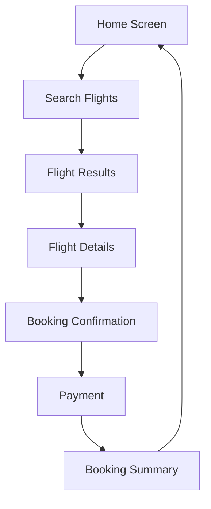

## 12.4.2 Planning and Design

Embarking on a Flutter app development journey requires meticulous planning and design to ensure the final product meets user needs and is technically sound. This section delves into the essential steps of planning and designing a Flutter app, covering everything from gathering requirements to technical planning and project management. By the end of this chapter, you'll have a solid foundation to kickstart your app development process effectively.

### Gathering Requirements

The first step in any app development process is to gather and understand the requirements. This involves capturing what the users need and translating those needs into technical specifications.

#### User Stories

User stories are a powerful tool for capturing requirements from the user's perspective. They help developers understand what the user wants to achieve with the app. A user story typically follows the format: "As a [type of user], I want [an action] so that [a benefit]."

**Example User Story:**

- As a **frequent traveler**, I want to **book flights quickly** so that I can **save time and avoid hassle**.

**Creating Effective User Stories:**

1. **Identify User Roles:** Determine who will use the app. This could be end-users, administrators, or other stakeholders.
2. **Define Actions:** Specify what each user role wants to accomplish with the app.
3. **Clarify Benefits:** Explain why the user wants to perform the action, focusing on the value it provides.

User stories should be concise, clear, and focused on the user's needs. They serve as a foundation for developing functional specifications.

#### Functional Specifications

Once user stories are established, the next step is to detail the app's features and functionalities in technical terms. Functional specifications describe how the app will behave and interact with users.

**Components of Functional Specifications:**

- **Feature List:** A comprehensive list of features the app will include.
- **User Interactions:** Descriptions of how users will interact with the app, including input methods and expected responses.
- **System Requirements:** Technical requirements such as platform compatibility, performance benchmarks, and security protocols.

**Example Functional Specification:**

- **Feature:** Flight Booking
  - **User Interaction:** Users can search for flights by entering departure and destination cities, dates, and number of passengers.
  - **System Requirements:** The app should support iOS and Android platforms, handle up to 1000 concurrent users, and ensure secure payment processing.

### Designing the App

With a clear understanding of the requirements, the next phase involves designing the app's user interface and experience.

#### Wireframing

Wireframing is the process of creating a visual guide that represents the skeletal framework of an app. It helps in visualizing the layout and navigation flow before diving into detailed design.

**Tools for Wireframing:**

- **Figma:** A popular tool for creating interactive wireframes and prototypes.
- **Adobe XD:** Offers robust features for designing and prototyping user interfaces.
- **Balsamiq:** Known for its simplicity and ease of use for creating low-fidelity wireframes.

**Example Wireframe:**

Below is a simple wireframe diagram outlining the navigation flow of a hypothetical flight booking app:

#### User Experience Considerations

Designing an app is not just about aesthetics; it's about creating an intuitive and accessible experience for users.

**Best Practices for Intuitive Navigation:**

- **Consistency:** Maintain consistent design elements throughout the app to help users understand how to interact with different components.
- **Feedback:** Provide immediate feedback for user actions, such as button clicks or form submissions.
- **Simplicity:** Avoid clutter and focus on essential features to make navigation straightforward.

**Accessibility Considerations:**

- **Color Contrast:** Ensure text is readable against background colors.
- **Text Size:** Use scalable text sizes to accommodate different user preferences.
- **Screen Reader Support:** Implement accessibility labels and descriptions for screen reader compatibility.

### Technical Planning

Technical planning involves making critical decisions about the app's architecture, technology stack, and data modeling.

#### Architecture Selection

Choosing the right architectural pattern is crucial for building a scalable and maintainable app.

**Recommended Architectural Patterns:**

- **MVC (Model-View-Controller):** Separates the app into three interconnected components, promoting organized code.
- **MVVM (Model-View-ViewModel):** Facilitates separation of development of the graphical user interface from business logic.
- **BLoC (Business Logic Component):** A popular pattern in Flutter that separates business logic from UI, making apps more testable and reusable.

**Example Architecture:**

For a Flutter app, the BLoC pattern is often recommended due to its ability to manage state efficiently and separate concerns.

#### Technology Stack

Defining the tools, packages, and services to be used is a critical step in technical planning.

**Typical Flutter Technology Stack:**

- **Flutter SDK:** The core framework for building the app.
- **Dart Language:** The programming language used with Flutter.
- **Firebase:** For backend services such as authentication, database, and cloud functions.
- **Provider or Riverpod:** For state management solutions.

**Example Technology Stack:**

- **Frontend:** Flutter, Dart
- **Backend:** Firebase (Firestore, Authentication)
- **State Management:** Riverpod

#### Data Modeling

Data modeling involves structuring data models and relationships to ensure efficient data handling.

**Steps for Data Modeling:**

1. **Identify Entities:** Determine the main objects in your app, such as users, products, or orders.
2. **Define Relationships:** Establish how entities relate to each other, such as one-to-many or many-to-many relationships.
3. **Create Schemas:** Design database schemas to represent entities and relationships.

**Example Data Model:**

For a flight booking app, the primary entities might include Users, Flights, and Bookings. Relationships could be defined as follows:

- A **User** can have multiple **Bookings**.
- A **Booking** is associated with one **Flight**.

### Project Management

Effective project management ensures that the app development process stays on track and within budget.

#### Task Breakdown

Breaking down the project into manageable tasks is essential for tracking progress and ensuring timely delivery.

**Guidelines for Task Breakdown:**

- **Define Milestones:** Identify key phases in the project, such as design completion, development, and testing.
- **Create Tasks:** Break down milestones into smaller tasks that can be assigned to team members.
- **Prioritize Tasks:** Determine the order of task execution based on dependencies and importance.

**Example Task Breakdown:**

- **Milestone:** Design Completion
  - **Task 1:** Create wireframes for all screens.
  - **Task 2:** Design UI components.
  - **Task 3:** Conduct design review with stakeholders.

#### Scheduling

Scheduling involves setting timelines for tasks and tracking progress using tools like Gantt charts or Kanban boards.

**Tools for Scheduling:**

- **Trello:** A flexible Kanban board tool for managing tasks and workflows.
- **Asana:** Offers task management features with timeline views.
- **Jira:** A robust tool for agile project management with support for sprints and backlog management.

**Example Scheduling Tool:**

Using Trello, you can create boards for each project phase, with cards representing tasks. Move cards across columns to track progress from "To Do" to "In Progress" and "Done."

### Conclusion

Planning and designing a Flutter app is a multifaceted process that requires careful consideration of user needs, technical requirements, and project management strategies. By following the steps outlined in this chapter, you can lay a strong foundation for your app development journey, ensuring that your final product is both user-friendly and technically robust.

## Quiz Time!



### What is the primary purpose of user stories in app development?

- [x] To capture requirements from the user's perspective
- [ ] To detail technical specifications
- [ ] To outline the app's architecture
- [ ] To manage project tasks

> **Explanation:** User stories are used to capture requirements from the user's perspective, focusing on what the user wants to achieve.

### Which tool is commonly used for creating wireframes?

- [x] Figma
- [ ] Visual Studio Code
- [ ] GitHub
- [ ] Firebase

> **Explanation:** Figma is a popular tool for creating interactive wireframes and prototypes.

### What does the BLoC pattern in Flutter help achieve?

- [x] Separation of business logic from UI
- [ ] Direct manipulation of the database
- [ ] Enhanced graphics rendering
- [ ] Automatic state management

> **Explanation:** The BLoC pattern helps separate business logic from UI, making apps more testable and reusable.

### Which of the following is a key consideration for app accessibility?

- [x] Color contrast
- [ ] Database schema
- [ ] API design
- [ ] Code comments

> **Explanation:** Color contrast is important for ensuring text readability and overall accessibility.

### What is the role of functional specifications in app development?

- [x] To detail the app's features and functionalities in technical terms
- [ ] To capture user feedback
- [ ] To manage source code
- [ ] To design the UI

> **Explanation:** Functional specifications describe the app's features and functionalities in technical terms.

### Which architectural pattern is often recommended for Flutter apps?

- [x] BLoC
- [ ] REST
- [ ] SOAP
- [ ] MVC

> **Explanation:** The BLoC pattern is recommended for Flutter apps due to its efficient state management and separation of concerns.

### What is a common tool for project management and task tracking?

- [x] Trello
- [ ] Android Studio
- [ ] DartPad
- [ ] Flutter SDK

> **Explanation:** Trello is a flexible Kanban board tool used for managing tasks and workflows.

### What is a key benefit of using wireframes in app design?

- [x] Visualizing the layout and navigation flow
- [ ] Writing backend code
- [ ] Testing the app's performance
- [ ] Managing user accounts

> **Explanation:** Wireframes help visualize the layout and navigation flow before detailed design.

### What should be considered when selecting a technology stack for a Flutter app?

- [x] Compatibility with Flutter and project requirements
- [ ] The number of developers available
- [ ] The color scheme of the app
- [ ] The size of the user base

> **Explanation:** The technology stack should be compatible with Flutter and meet the project's technical requirements.

### True or False: User stories should be written from the developer's perspective.

- [ ] True
- [x] False

> **Explanation:** User stories should be written from the user's perspective to focus on their needs and goals.


