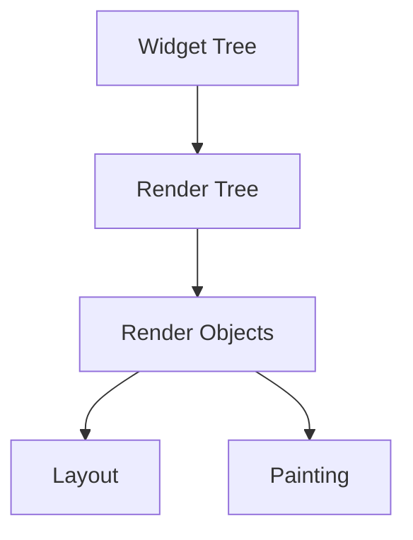
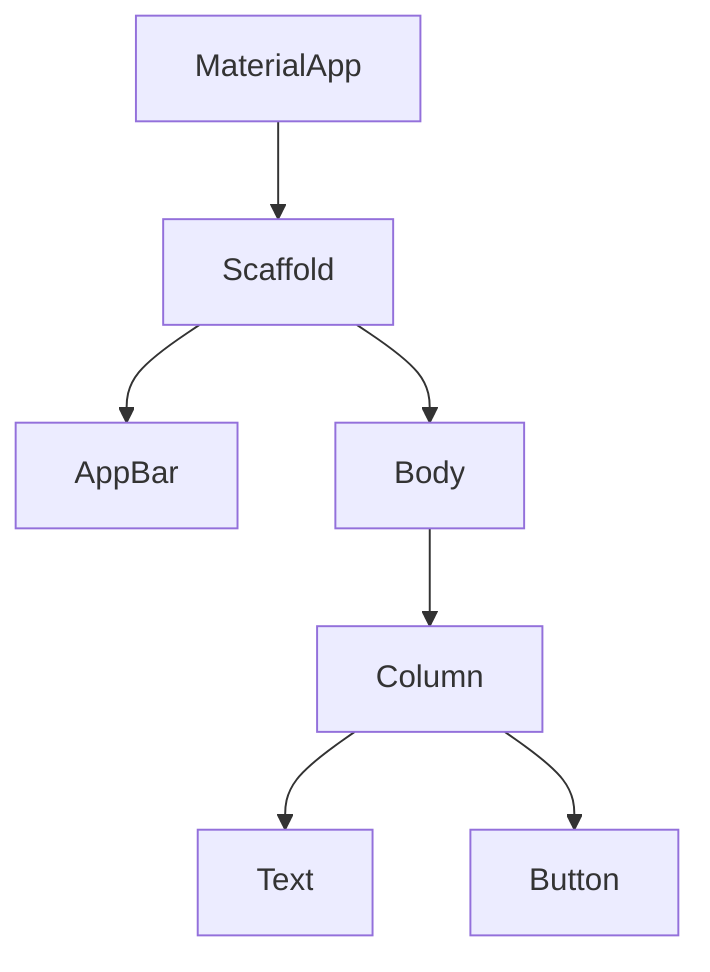

## A.4 Glossary of Terms

Welcome to the glossary section of "Flutter Journey: A Beginner's Roadmap to App Development." This glossary is designed to provide clear and concise definitions of key terms and concepts used throughout the book. It serves as a quick reference to clarify terminology, especially for beginners venturing into the world of Flutter app development. The terms are arranged alphabetically for easy navigation.

### A

#### API (Application Programming Interface)
An API is a set of protocols and tools for building software applications. It specifies how software components should interact. In Flutter, APIs are often used to interact with backend services or to access device features.

**Example:** Using the `http` package in Flutter to make network requests to a REST API.

```dart
import 'package:http/http.dart' as http;

Future<void> fetchData() async {
  final response = await http.get(Uri.parse('https://api.example.com/data'));
  if (response.statusCode == 200) {
    print('Data fetched successfully');
  } else {
    throw Exception('Failed to load data');
  }
}
```

#### Asynchronous Programming
Asynchronous programming is a paradigm that allows for executing tasks without blocking the main execution thread. In Flutter, this is often achieved using futures and the `async`/`await` keywords, enabling smooth and responsive user interfaces.

**Example:** Fetching data asynchronously in Flutter.

```dart
Future<void> fetchData() async {
  try {
    final data = await getDataFromServer();
    print('Data: $data');
  } catch (error) {
    print('Error fetching data: $error');
  }
}
```

### B

#### Build Context
The build context is an object that represents the location of a widget within the widget tree. It is used to locate other widgets and themes, providing access to the widget's position in the hierarchy.

**Example:** Accessing the theme data using the build context.

```dart
@override
Widget build(BuildContext context) {
  final theme = Theme.of(context);
  return Text(
    'Hello, Flutter!',
    style: TextStyle(color: theme.primaryColor),
  );
}
```

#### Bloc (Business Logic Component)
Bloc is a design pattern that separates business logic from the UI, using streams to manage state. It helps in creating scalable and maintainable applications by organizing code into distinct layers.

**Example:** Implementing a simple counter using Bloc.

```dart
class CounterBloc {
  int _counter = 0;
  final _counterController = StreamController<int>();

  Stream<int> get counterStream => _counterController.stream;

  void increment() {
    _counter++;
    _counterController.sink.add(_counter);
  }

  void dispose() {
    _counterController.close();
  }
}
```

### C

#### Const Constructor
A const constructor creates an immutable widget, allowing for compile-time instantiation and optimization. This can improve performance by reducing the need for repeated widget rebuilds.

**Example:** Defining a const constructor in a widget.

```dart
class MyWidget extends StatelessWidget {
  const MyWidget({Key? key}) : super(key: key);

  @override
  Widget build(BuildContext context) {
    return Container();
  }
}
```

#### Cross-Platform Development
Cross-platform development is the practice of developing applications that run seamlessly on multiple operating systems or platforms. Flutter excels in this area by allowing developers to create apps for iOS, Android, web, and desktop from a single codebase.

**Example:** A Flutter app running on both iOS and Android without platform-specific code.

### D

#### Dart
Dart is the programming language used by Flutter, optimized for building UIs. It is a client-optimized language for fast apps on any platform, featuring a rich set of libraries and tools.

**Example:** A simple Dart function.

```dart
void main() {
  print('Hello, Dart!');
}
```

#### Dependency Injection
Dependency injection is a design pattern where dependencies are passed into a class rather than being hard-coded. This enhances modularity and testability by decoupling classes from their dependencies.

**Example:** Using dependency injection in Flutter.

```dart
class ApiService {
  final String apiUrl;

  ApiService(this.apiUrl);

  Future<void> fetchData() async {
    // Fetch data from apiUrl
  }
}

class MyApp extends StatelessWidget {
  final ApiService apiService;

  MyApp(this.apiService);

  @override
  Widget build(BuildContext context) {
    return MaterialApp(
      home: HomeScreen(apiService: apiService),
    );
  }
}
```

### F

#### Flutter SDK (Software Development Kit)
The Flutter SDK is a collection of tools, libraries, and APIs for developing Flutter applications. It includes everything needed to build, test, and deploy Flutter apps.

**Example:** Installing the Flutter SDK on your machine.

```bash
git clone https://github.com/flutter/flutter.git -b stable

export PATH="$PATH:`pwd`/flutter/bin"
```

#### Flutter Widget
A Flutter widget is the basic building block of a Flutter app's UI. Everything in Flutter is a widget, from layout structures to interactive elements.

**Example:** Creating a simple Flutter widget.

```dart
class MyButton extends StatelessWidget {
  @override
  Widget build(BuildContext context) {
    return ElevatedButton(
      onPressed: () {
        print('Button pressed');
      },
      child: Text('Press Me'),
    );
  }
}
```

### I

#### InheritedWidget
An InheritedWidget allows data to be efficiently propagated down the widget tree. It is commonly used for state management, enabling widgets to access shared data without passing it explicitly through constructors.

**Example:** Creating a custom InheritedWidget.

```dart
class MyInheritedWidget extends InheritedWidget {
  final int data;

  MyInheritedWidget({required this.data, required Widget child}) : super(child: child);

  @override
  bool updateShouldNotify(MyInheritedWidget oldWidget) {
    return oldWidget.data != data;
  }

  static MyInheritedWidget? of(BuildContext context) {
    return context.dependOnInheritedWidgetOfExactType<MyInheritedWidget>();
  }
}
```

### M

#### Material Design
Material Design is a design language developed by Google, emphasizing clean and intuitive interfaces. Flutter provides a rich set of Material Design widgets to create visually appealing apps.

**Example:** Using Material Design widgets in Flutter.

```dart
class MyApp extends StatelessWidget {
  @override
  Widget build(BuildContext context) {
    return MaterialApp(
      theme: ThemeData(primarySwatch: Colors.blue),
      home: Scaffold(
        appBar: AppBar(title: Text('Material Design')),
        body: Center(child: Text('Hello, Material!')),
      ),
    );
  }
}
```

#### Mixin
A mixin is a way to reuse code in multiple class hierarchies. It allows a class to inherit properties and methods from multiple sources, promoting code reuse and modularity.

**Example:** Using a mixin in Dart.

```dart
mixin Flyable {
  void fly() {
    print('Flying');
  }
}

class Bird with Flyable {}

void main() {
  Bird bird = Bird();
  bird.fly(); // Output: Flying
}
```

### P

#### Pubspec.yaml
The `pubspec.yaml` file is a configuration file for Flutter projects. It manages dependencies, assets, and package information, serving as the project's manifest.

**Example:** A sample `pubspec.yaml` file.

```yaml
name: my_flutter_app
description: A new Flutter project.

dependencies:
  flutter:
    sdk: flutter
  http: ^0.13.3

flutter:
  assets:
    - assets/images/
```

#### Provider
Provider is a wrapper around InheritedWidget for managing and providing state to widgets. It simplifies state management by offering a more intuitive API for accessing shared data.

**Example:** Using Provider for state management.

```dart
class Counter with ChangeNotifier {
  int _count = 0;

  int get count => _count;

  void increment() {
    _count++;
    notifyListeners();
  }
}

void main() {
  runApp(
    ChangeNotifierProvider(
      create: (context) => Counter(),
      child: MyApp(),
    ),
  );
}
```

### R

#### Rest API (Representational State Transfer)
A REST API is an architectural style for designing networked applications. It uses standard HTTP methods like GET, POST, PUT, and DELETE to perform operations on resources.

**Example:** Making a REST API call in Flutter.

```dart
Future<void> fetchData() async {
  final response = await http.get(Uri.parse('https://api.example.com/data'));
  if (response.statusCode == 200) {
    print('Data fetched successfully');
  } else {
    throw Exception('Failed to load data');
  }
}
```

#### Render Tree
The render tree is the hierarchy of render objects that describe how to render the widgets onto the screen. It is a lower-level representation of the widget tree, focusing on layout and painting.

**Example:** Visualizing the render tree in Flutter.



### S

#### StatefulWidget
A StatefulWidget is a widget that maintains mutable state that may change during the widget's lifecycle. It is used when a widget needs to update dynamically based on user interaction or other events.

**Example:** Creating a simple StatefulWidget.

```dart
class CounterWidget extends StatefulWidget {
  @override
  _CounterWidgetState createState() => _CounterWidgetState();
}

class _CounterWidgetState extends State<CounterWidget> {
  int _counter = 0;

  void _incrementCounter() {
    setState(() {
      _counter++;
    });
  }

  @override
  Widget build(BuildContext context) {
    return Column(
      children: [
        Text('Counter: $_counter'),
        ElevatedButton(
          onPressed: _incrementCounter,
          child: Text('Increment'),
        ),
      ],
    );
  }
}
```

#### StatelessWidget
A StatelessWidget is a widget that does not require mutable state. It builds itself based solely on the information provided and does not react to changes.

**Example:** Creating a simple StatelessWidget.

```dart
class GreetingWidget extends StatelessWidget {
  final String greeting;

  GreetingWidget({required this.greeting});

  @override
  Widget build(BuildContext context) {
    return Text(greeting);
  }
}
```

### T

#### Tree Shaking
Tree shaking is a compiler optimization that removes unused code, reducing the app size. It is particularly beneficial in Flutter, where it helps produce smaller, more efficient applications.

**Example:** Enabling tree shaking in Flutter.

```bash
flutter build apk --release
```

### W

#### Widget Tree
The widget tree is the hierarchical structure that represents how widgets are organized in a Flutter app. It defines the layout and behavior of the UI components.

**Example:** Visualizing a simple widget tree.



---

This glossary provides a foundational understanding of key terms and concepts in Flutter app development. As you progress through the book, refer back to this section whenever you encounter unfamiliar terminology. Understanding these terms will enhance your ability to build and maintain Flutter applications effectively.

## Quiz Time!



### What is an API in the context of Flutter development?

- [x] A set of protocols and tools for building software applications.
- [ ] A widget that allows data to be efficiently propagated down the widget tree.
- [ ] A programming language used by Flutter.
- [ ] A design pattern that separates business logic from the UI.

> **Explanation:** An API (Application Programming Interface) specifies how software components should interact, often used to interact with backend services or access device features.

### What is the main purpose of asynchronous programming in Flutter?

- [x] To execute tasks without blocking the main execution thread.
- [ ] To create immutable widgets.
- [ ] To manage state using streams.
- [ ] To define the layout and behavior of UI components.

> **Explanation:** Asynchronous programming allows tasks to run without blocking the main thread, enabling smooth and responsive user interfaces.

### Which design pattern separates business logic from the UI in Flutter?

- [x] Bloc (Business Logic Component)
- [ ] Provider
- [ ] InheritedWidget
- [ ] Tree Shaking

> **Explanation:** The Bloc pattern separates business logic from the UI, using streams to manage state, promoting scalability and maintainability.

### What is a const constructor used for in Flutter?

- [x] To create an immutable widget.
- [ ] To manage dependencies.
- [ ] To define the widget's position in the hierarchy.
- [ ] To enable tree shaking.

> **Explanation:** A const constructor creates an immutable widget, allowing for compile-time instantiation and optimization.

### What is the primary language used for Flutter development?

- [x] Dart
- [ ] JavaScript
- [ ] Swift
- [ ] Kotlin

> **Explanation:** Dart is the programming language used by Flutter, optimized for building UIs.

### What does the `pubspec.yaml` file manage in a Flutter project?

- [x] Dependencies, assets, and package information.
- [ ] The widget tree hierarchy.
- [ ] The render tree layout.
- [ ] The application's state management.

> **Explanation:** The `pubspec.yaml` file is a configuration file that manages dependencies, assets, and package information in a Flutter project.

### What is tree shaking in the context of Flutter?

- [x] A compiler optimization that removes unused code.
- [ ] A design pattern for managing state.
- [ ] A method for creating immutable widgets.
- [ ] A way to propagate data down the widget tree.

> **Explanation:** Tree shaking is a compiler optimization that removes unused code, reducing the app size and improving performance.

### What is the role of a StatefulWidget in Flutter?

- [x] To maintain mutable state that may change during the widget's lifecycle.
- [ ] To build itself based solely on the information provided.
- [ ] To define the layout and behavior of UI components.
- [ ] To provide a collection of tools, libraries, and APIs.

> **Explanation:** A StatefulWidget maintains mutable state that can change during its lifecycle, allowing dynamic updates based on user interaction or other events.

### What is the purpose of the widget tree in a Flutter app?

- [x] To represent how widgets are organized in a hierarchical structure.
- [ ] To manage and provide state to widgets.
- [ ] To remove unused code from the app.
- [ ] To separate business logic from the UI.

> **Explanation:** The widget tree defines the layout and behavior of UI components, representing how widgets are organized in a hierarchical structure.

### True or False: InheritedWidget is commonly used for state management in Flutter.

- [x] True
- [ ] False

> **Explanation:** InheritedWidget is commonly used for state management, allowing data to be efficiently propagated down the widget tree.


