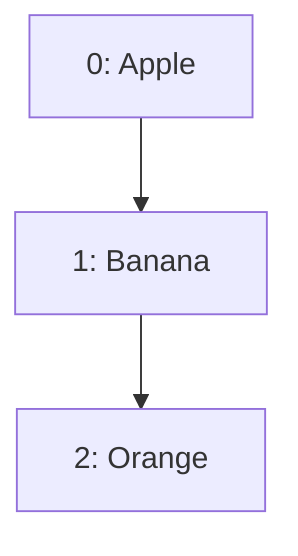
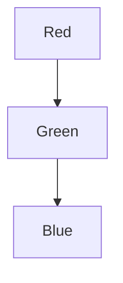
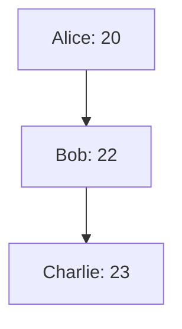

## 2.1.1 Lists, Sets, and Maps

In the realm of programming, collections are indispensable tools that allow developers to manage and manipulate groups of related data efficiently. In Flutter, which uses the Dart programming language, collections such as Lists, Sets, and Maps play a crucial role in handling data within applications. This section will delve into these fundamental data structures, providing a comprehensive understanding of their usage, operations, and practical applications in Flutter development.

### Introduction to Collections

Collections are data structures that store multiple values in a single entity, making it easier to manage and manipulate data. They are foundational elements in programming, enabling developers to perform complex data operations with ease. In Flutter, collections are particularly important because they allow developers to handle dynamic data efficiently, which is essential for building responsive and interactive applications.

### Lists

#### Definition and Usage

A List in Dart is an ordered collection of items, where each item can be accessed by its index. Lists are versatile and can store any type of data, including numbers, strings, and even other collections. They are similar to arrays in other programming languages but offer more flexibility and functionality.

To declare and initialize a List in Dart, you can use the following syntax:

```dart
// Creating a list of strings
List<String> fruits = ['Apple', 'Banana', 'Orange'];

// Using var with type inference
var numbers = [1, 2, 3, 4, 5];
```

Lists in Dart are zero-based, meaning the first element is accessed with index 0. Here's how you can access elements in a List:

```dart
print(fruits[0]); // Outputs: Apple
```

#### Common List Operations

##### Adding Elements

Lists provide several methods to add elements:

- `add()`: Adds a single element to the end of the list.
- `insert()`: Inserts an element at a specified index.
- `addAll()`: Adds multiple elements from another collection.

```dart
fruits.add('Grapes');
fruits.insert(1, 'Mango');
fruits.addAll(['Pineapple', 'Strawberry']);
```

##### Removing Elements

To remove elements from a List, you can use:

- `remove()`: Removes the first occurrence of a specified element.
- `removeAt()`: Removes the element at a specified index.
- `removeWhere()`: Removes elements that satisfy a condition.
- `clear()`: Removes all elements from the list.

```dart
fruits.remove('Banana');
fruits.removeAt(0);
fruits.removeWhere((fruit) => fruit.startsWith('P'));
fruits.clear();
```

##### Iterating Over Lists

You can iterate over Lists using `for` loops or the `forEach()` method:

```dart
for (var fruit in fruits) {
  print(fruit);
}

fruits.forEach((fruit) {
  print(fruit);
});
```

##### List Properties and Methods

Lists come with a variety of properties and methods:

- `length`: Returns the number of elements in the list.
- `isEmpty`: Checks if the list is empty.
- `contains()`: Checks if the list contains a specified element.
- `sort()`: Sorts the list in place.

```dart
print(fruits.length);
print(fruits.isEmpty);
print(fruits.contains('Apple'));
fruits.sort();
```

### Sets

#### Definition and Usage

A Set in Dart is an unordered collection of unique items. Sets are ideal when you need to store unique elements and perform operations like union, intersection, and difference.

To declare and initialize a Set, you can use the following syntax:

```dart
var uniqueNumbers = {1, 2, 3, 4, 4, 5}; // Duplicate 4 will be ignored
Set<String> colors = {'Red', 'Green', 'Blue'};
```

#### Common Set Operations

##### Adding and Removing Elements

Sets provide methods to add and remove elements:

- `add()`: Adds a single element.
- `addAll()`: Adds multiple elements from another collection.
- `remove()`: Removes a specified element.
- `clear()`: Removes all elements.

```dart
colors.add('Yellow');
colors.addAll({'Purple', 'Orange'});
colors.remove('Red');
colors.clear();
```

##### Set Operations

Sets support mathematical operations like union, intersection, and difference:

- `union`: Combines two sets, keeping unique elements.
- `intersection`: Returns common elements between two sets.
- `difference`: Returns elements present in one set but not in the other.

```dart
var setA = {1, 2, 3};
var setB = {3, 4, 5};
var unionSet = setA.union(setB); // {1, 2, 3, 4, 5}
var intersectionSet = setA.intersection(setB); // {3}
var differenceSet = setA.difference(setB); // {1, 2}
```

##### Iterating Over Sets

Similar to Lists, you can iterate over Sets using `for` loops or the `forEach()` method:

```dart
for (var color in colors) {
  print(color);
}

colors.forEach((color) {
  print(color);
});
```

### Maps

#### Definition and Usage

A Map in Dart is a collection of key-value pairs, where each key is unique. Maps are useful for storing data that can be accessed by a unique identifier, such as a username or ID.

To declare and initialize a Map, you can use the following syntax:

```dart
Map<String, int> studentAges = {
  'Alice': 20,
  'Bob': 22,
  'Charlie': 23,
};
```

Keys in a Map must be unique, while values can be of any data type.

#### Common Map Operations

##### Accessing Elements

You can access values in a Map using their keys:

```dart
print(studentAges['Alice']); // Outputs: 20
```

##### Adding and Updating Entries

Maps allow you to add new entries or update existing ones:

```dart
studentAges['David'] = 25; // Adds a new entry
studentAges['Alice'] = 21; // Updates the value for 'Alice'
```

##### Removing Entries

To remove entries from a Map, you can use:

- `remove()`: Removes an entry by its key.
- `removeWhere()`: Removes entries that satisfy a condition.
- `clear()`: Removes all entries.

```dart
studentAges.remove('Bob');
studentAges.removeWhere((key, value) => value < 21);
studentAges.clear();
```

##### Iterating Over Maps

You can iterate over Maps using the `forEach()` method or by iterating over the `keys` and `values` properties:

```dart
studentAges.forEach((key, value) {
  print('$key is $value years old');
});

for (var key in studentAges.keys) {
  print('$key is ${studentAges[key]} years old');
}
```

#### Use Cases and Examples

Each collection type has its own use cases. Lists are ideal for ordered data, Sets are perfect for unique elements, and Maps are great for key-value pairs. Here are some practical examples:

- **Lists**: Use Lists to store a sequence of items like a list of tasks or a series of numbers.
- **Sets**: Use Sets to manage unique elements, such as a list of unique tags or categories.
- **Maps**: Use Maps to store data that requires quick lookup by a key, such as user profiles or configuration settings.

Encourage readers to create small programs that manipulate these collections to reinforce their understanding.

### Mermaid.js Diagrams

To better understand how Lists, Sets, and Maps store data internally, consider the following diagrams:

#### List Structure



#### Set Structure



#### Map Structure



These diagrams illustrate the flow of data when performing operations like adding or removing elements.

## Quiz Time!



### What is a List in Dart?

- [x] An ordered collection of items.
- [ ] An unordered collection of unique items.
- [ ] A collection of key-value pairs.
- [ ] A single data type variable.

> **Explanation:** A List in Dart is an ordered collection of items, allowing access by index.

### How do you add an element to a List in Dart?

- [x] Using the `add()` method.
- [ ] Using the `insert()` method.
- [ ] Using the `put()` method.
- [ ] Using the `append()` method.

> **Explanation:** The `add()` method is used to add an element to the end of a List in Dart.

### What is a Set in Dart?

- [ ] An ordered collection of items.
- [x] An unordered collection of unique items.
- [ ] A collection of key-value pairs.
- [ ] A single data type variable.

> **Explanation:** A Set in Dart is an unordered collection of unique items.

### How do you perform a union operation on two Sets in Dart?

- [x] Using the `union` method.
- [ ] Using the `addAll` method.
- [ ] Using the `merge` method.
- [ ] Using the `combine` method.

> **Explanation:** The `union` method is used to combine two Sets, keeping unique elements.

### What is a Map in Dart?

- [ ] An ordered collection of items.
- [ ] An unordered collection of unique items.
- [x] A collection of key-value pairs.
- [ ] A single data type variable.

> **Explanation:** A Map in Dart is a collection of key-value pairs, where each key is unique.

### How do you access a value in a Map using its key?

- [x] Using square brackets with the key.
- [ ] Using the `get()` method.
- [ ] Using the `fetch()` method.
- [ ] Using the `retrieve()` method.

> **Explanation:** You access a value in a Map using its key within square brackets.

### How do you remove an entry from a Map in Dart?

- [x] Using the `remove()` method.
- [ ] Using the `delete()` method.
- [ ] Using the `discard()` method.
- [ ] Using the `erase()` method.

> **Explanation:** The `remove()` method is used to remove an entry from a Map by its key.

### Which method is used to iterate over a Map in Dart?

- [x] `forEach()`
- [ ] `iterate()`
- [ ] `loop()`
- [ ] `cycle()`

> **Explanation:** The `forEach()` method is used to iterate over each key-value pair in a Map.

### What property would you use to check if a List is empty?

- [x] `isEmpty`
- [ ] `length`
- [ ] `isNull`
- [ ] `isBlank`

> **Explanation:** The `isEmpty` property is used to check if a List is empty.

### True or False: In a Dart Map, keys must be unique.

- [x] True
- [ ] False

> **Explanation:** In a Dart Map, keys must be unique to ensure each key-value pair is distinct.



By understanding these fundamental data structures, you can effectively manage data in your Flutter applications, leading to more efficient and organized code. Experiment with these collections in your projects to see their power and versatility firsthand.
