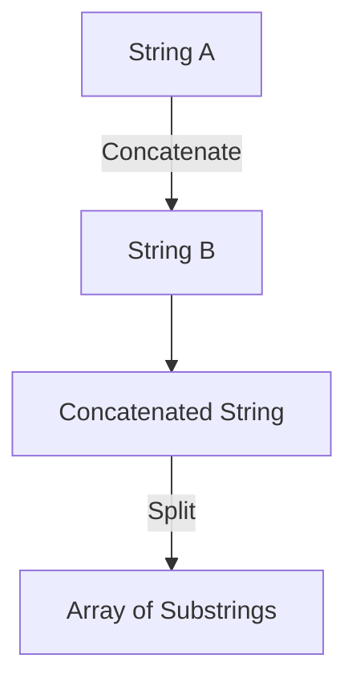

## 2.1.2 Strings and Text Manipulation

In the world of programming, strings are fundamental components used to represent text. They are sequences of characters that can be manipulated in various ways to achieve desired outcomes in your applications. In Flutter, strings are a core part of the Dart language, and understanding how to work with them is crucial for any developer. This section will guide you through the essentials of string manipulation in Flutter, providing you with the knowledge and tools to handle text effectively in your apps.

### String Basics

Strings in Dart, the language behind Flutter, are immutable sequences of UTF-16 code units. This means once a string is created, it cannot be changed. However, you can create new strings based on existing ones. Strings can be declared using either single or double quotes, allowing for flexibility in how you define them.

```dart
String greeting = 'Hello, World!';
String anotherGreeting = "Welcome to Flutter!";
```

Both declarations above are valid and demonstrate the use of single and double quotes. This flexibility is particularly useful when dealing with strings that contain quotes themselves.

### String Interpolation

String interpolation is a powerful feature in Dart that allows you to embed expressions within string literals. This is done using the `$` symbol for simple variables or `${}` for more complex expressions.

```dart
String name = 'Alice';
print('Hello, $name!'); // Outputs: Hello, Alice!
print('2 + 2 equals ${2 + 2}'); // Outputs: 2 + 2 equals 4
```

Interpolation makes it easy to construct strings dynamically, enhancing readability and maintainability of your code.

### Common String Methods

Dart provides a rich set of methods for string manipulation. Understanding these methods will enable you to perform a wide range of operations on strings.

#### Concatenation

Concatenation is the process of joining two or more strings together. In Dart, you can use the `+` operator or the `concat()` method.

```dart
String firstName = 'John';
String lastName = 'Doe';
String fullName = firstName + ' ' + lastName; // Outputs: John Doe
```

#### Substrings

Extracting parts of a string is a common requirement. The `substring()` method allows you to obtain a portion of a string by specifying the start and end indices.

```dart
String word = 'Dart';
print(word.substring(1)); // Outputs: 'art'
print(word.substring(1, 3)); // Outputs: 'ar'
```

#### Changing Case

Changing the case of a string is straightforward with the `toUpperCase()` and `toLowerCase()` methods.

```dart
String text = 'Flutter';
print(text.toUpperCase()); // Outputs: FLUTTER
print(text.toLowerCase()); // Outputs: flutter
```

#### Trimming Spaces

Whitespace can often be an issue when dealing with user input. Dart provides methods such as `trim()`, `trimLeft()`, and `trimRight()` to remove unwanted spaces.

```dart
String padded = '  Hello, World!  ';
print(padded.trim()); // Outputs: 'Hello, World!'
```

#### Replacing Parts of a String

The `replaceAll()` and `replaceFirst()` methods are used to replace occurrences of a substring within a string.

```dart
String sentence = 'Dart is great!';
print(sentence.replaceAll('great', 'awesome')); // Outputs: Dart is awesome!
```

#### Splitting Strings

Splitting a string into a list of substrings is useful for parsing data. The `split()` method divides a string based on a specified delimiter.

```dart
String csv = 'apple,banana,orange';
List<String> fruits = csv.split(',');
print(fruits); // Outputs: [apple, banana, orange]
```

### String Comparison

Comparing strings is essential for sorting, searching, and validating text. Dart provides several ways to compare strings.

#### Equality

The simplest form of comparison is checking for equality using the `==` operator.

```dart
String a = 'Flutter';
String b = 'flutter';
print(a == b); // Outputs: false
```

#### Lexicographical Comparison

The `compareTo()` method compares two strings lexicographically.

```dart
String a = 'apple';
String b = 'banana';
print(a.compareTo(b)); // Outputs: -1 (a is less than b)
```

#### Case-Insensitive Comparison

To perform case-insensitive comparisons, convert both strings to the same case using `toLowerCase()` or `toUpperCase()`.

```dart
String a = 'Flutter';
String b = 'flutter';
print(a.toLowerCase() == b.toLowerCase()); // Outputs: true
```

### Regular Expressions (RegExp)

Regular expressions are powerful tools for pattern matching and text processing. Dart's `RegExp` class allows you to define patterns and search for matches within strings.

```dart
RegExp exp = RegExp(r'^[a-z]+$');
print(exp.hasMatch('hello')); // Outputs: true
print(exp.hasMatch('Hello123')); // Outputs: false
```

Regular expressions can be used for tasks such as validating input, searching for patterns, and replacing text.

### Practice Exercises

To solidify your understanding of string manipulation, try the following exercises:

1. **Format User Input:**
   Write a program that takes a user's full name as input and outputs it in the format "Last, First".

2. **Parse CSV Data:**
   Create a function that takes a CSV string and returns a list of maps, where each map represents a row with column names as keys.

3. **Validate Email Addresses:**
   Use regular expressions to validate a list of email addresses, ensuring they follow a standard format.

### Mermaid.js Diagrams

To visualize string operations, let's use Mermaid.js diagrams. Below is a diagram illustrating the process of concatenating and splitting strings.



This diagram shows how two strings are concatenated to form a new string, which is then split into an array of substrings.

### Conclusion

Mastering string manipulation is a vital skill in Flutter development. By understanding the basics of strings, leveraging interpolation, utilizing common methods, and employing regular expressions, you can handle text efficiently in your applications. Practice these concepts through exercises and explore the vast possibilities of text manipulation in Flutter.

## Quiz Time!



### What is the correct way to declare a string in Dart?

- [x] `String greeting = 'Hello, World!';`
- [x] `String greeting = "Hello, World!";`
- [ ] `String greeting = Hello, World!;`
- [ ] `String greeting = Hello, World!`

> **Explanation:** Strings in Dart can be declared using either single or double quotes.

### How do you perform string interpolation in Dart?

- [x] Using `$` for simple variables
- [x] Using `${}` for complex expressions
- [ ] Using `+` operator
- [ ] Using `concat()` method

> **Explanation:** String interpolation in Dart is done using `$` for simple variables and `${}` for complex expressions.

### Which method is used to extract a part of a string?

- [x] `substring()`
- [ ] `slice()`
- [ ] `extract()`
- [ ] `part()`

> **Explanation:** The `substring()` method is used to extract parts of a string in Dart.

### How can you change the case of a string to uppercase?

- [x] `toUpperCase()`
- [ ] `toLowerCase()`
- [ ] `toCaseUpper()`
- [ ] `upperCase()`

> **Explanation:** The `toUpperCase()` method converts a string to uppercase.

### Which method is used to remove whitespace from both ends of a string?

- [x] `trim()`
- [ ] `trimLeft()`
- [ ] `trimRight()`
- [ ] `strip()`

> **Explanation:** The `trim()` method removes whitespace from both ends of a string.

### How do you replace all occurrences of a substring in a string?

- [x] `replaceAll()`
- [ ] `replaceFirst()`
- [ ] `replace()`
- [ ] `substitute()`

> **Explanation:** The `replaceAll()` method replaces all occurrences of a substring in a string.

### Which method is used to split a string into a list?

- [x] `split()`
- [ ] `divide()`
- [ ] `separate()`
- [ ] `partition()`

> **Explanation:** The `split()` method divides a string into a list based on a specified delimiter.

### How do you compare two strings for equality in Dart?

- [x] Using `==` operator
- [ ] Using `equals()`
- [ ] Using `compareTo()`
- [ ] Using `isEqual()`

> **Explanation:** The `==` operator is used to compare two strings for equality in Dart.

### What is the purpose of regular expressions in Dart?

- [x] Pattern matching
- [x] Text processing
- [ ] Arithmetic operations
- [ ] Data storage

> **Explanation:** Regular expressions are used for pattern matching and text processing.

### True or False: Strings in Dart are mutable.

- [ ] True
- [x] False

> **Explanation:** Strings in Dart are immutable, meaning they cannot be changed once created.


