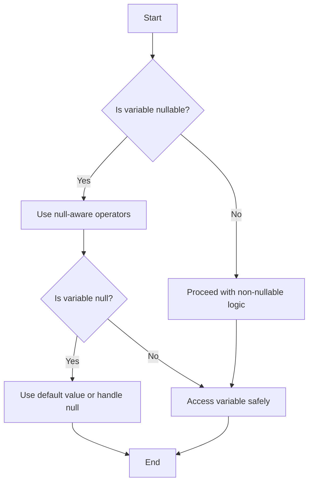

## 2.1.4 Null Safety in Dart

Null safety is one of the most significant advancements in the Dart programming language, introduced in Dart 2.12. It aims to eliminate a common source of bugs: null reference errors. This feature ensures that your code is more robust, reliable, and easier to maintain. In this section, we will delve into the intricacies of null safety, explore its benefits, and provide practical examples to help you master this essential concept in Dart.

### Introduction to Null Safety

Null reference errors, often referred to as "null pointer exceptions," have been a notorious source of bugs in programming. They occur when a program attempts to access or modify an object that has not been initialized, leading to runtime crashes. Dart's null safety feature addresses this issue by ensuring that variables cannot contain null values unless explicitly declared as nullable.

With Dart 2.12 and above, null safety is a core feature of the language. This means that by default, all variables are non-nullable, and you must explicitly opt-in to allow null values. This shift encourages developers to think more critically about nullability and significantly reduces the likelihood of encountering null reference errors.

### Non-Nullable and Nullable Types

Understanding the distinction between non-nullable and nullable types is crucial when working with null safety in Dart.

#### Non-Nullable Types

By default, variables in Dart are non-nullable. This means they cannot hold a null value, and you must initialize them with a valid value before use. Here's an example:

```dart
int age = 30; // Cannot be null
```

In this example, the `age` variable is of type `int` and cannot be null. Attempting to assign a null value to a non-nullable variable will result in a compile-time error.

#### Nullable Types

To declare a variable that can hold a null value, you append a question mark (`?`) to the type. This indicates that the variable is nullable:

```dart
int? nullableAge;
nullableAge = null;
```

Here, `nullableAge` is a nullable integer, meaning it can either hold an integer value or be null. This explicit declaration of nullability helps prevent unintended null assignments and improves code clarity.

### Null-Aware Operators

Dart provides several null-aware operators that make it easier to work with nullable types and handle null values gracefully.

#### Null Check Operator (`!`)

The null check operator (`!`) asserts that a nullable expression is not null. If the expression is null, it throws an error. Use this operator with caution:

```dart
int? nullableNumber;
int number = nullableNumber!; // May throw an error if nullableNumber is null
```

In this example, if `nullableNumber` is null, the program will throw an error. It's essential to ensure that the variable is not null before using this operator.

#### Null-Coalescing Operator (`??`)

The null-coalescing operator (`??`) provides a default value if the expression is null. This operator is useful for setting fallback values:

```dart
int? input;
int output = input ?? 0; // output will be 0 if input is null
```

Here, if `input` is null, `output` will be assigned the value `0`. This operator simplifies code by reducing the need for explicit null checks.

#### Null-Aware Access (`?.`)

The null-aware access operator (`?.`) allows you to safely access a property or method of an object if it is not null. If the object is null, the expression evaluates to null:

```dart
String? name;
print(name?.length); // Prints null if name is null
```

In this example, if `name` is null, the expression `name?.length` returns null instead of throwing an error. This operator is particularly useful when working with deeply nested objects.

### Definite Assignment

In Dart, variables must be initialized before use. This rule ensures that variables are always in a valid state when accessed. However, there are cases where you may want to delay initialization until later in the program. The `late` keyword allows for lazy initialization:

```dart
late String description;
description = 'This is a description';
```

The `late` keyword indicates that the variable will be initialized at a later point, but before it is accessed. This feature is useful for variables that depend on runtime information or require complex initialization logic.

### Benefits of Null Safety

Null safety offers several advantages that contribute to more reliable and maintainable code:

- **Improved Code Reliability:** By eliminating null reference errors, null safety reduces the likelihood of runtime crashes and unexpected behavior.
- **Explicit Nullability:** Developers must explicitly declare nullable variables, encouraging thoughtful consideration of nullability and reducing accidental null assignments.
- **Enhanced Code Clarity:** Null-aware operators and definite assignment rules make code more readable and self-explanatory.
- **Better Tooling Support:** Dart's null safety is supported by robust tooling, including static analysis and migration tools, making it easier to adopt and maintain.

### Migrating to Null Safety

Migrating existing Dart code to null safety can be a straightforward process with the right tools and approach. Dart provides a comprehensive migration guide and tools to assist developers in transitioning their codebases.

- **Migration Guide:** The official Dart migration guide offers step-by-step instructions for migrating to null safety. It covers common scenarios, best practices, and potential pitfalls.
- **Dart Analyzer:** The Dart analyzer helps identify code that needs to be updated for null safety. It provides suggestions and warnings to guide the migration process.
- **Migration Tool:** Dart's migration tool automates much of the migration process, making it easier to update large codebases. It analyzes your code, suggests changes, and allows for interactive migration.

### Practice Exercises

To solidify your understanding of null safety, try the following exercises:

1. **Exercise 1:** Write a function that takes a nullable integer and returns its double value. Use the null-coalescing operator to provide a default value if the input is null.

2. **Exercise 2:** Create a class with a nullable property and demonstrate how to safely access it using the null-aware access operator.

3. **Exercise 3:** Implement a function that initializes a `late` variable based on user input and prints its value.

These exercises will help you practice handling null values and reinforce your understanding of null safety concepts.

### Mermaid.js Diagrams

To visualize how null-aware operators work in different cases, consider the following flowchart:



This flowchart illustrates the decision-making process when working with nullable and non-nullable variables, highlighting the use of null-aware operators to handle null values gracefully.

## Quiz Time!



### What is the primary purpose of null safety in Dart?

- [x] To prevent null reference errors
- [ ] To improve performance
- [ ] To simplify syntax
- [ ] To enhance UI design

> **Explanation:** Null safety is designed to prevent null reference errors, a common source of bugs in programming.

### How do you declare a nullable integer in Dart?

- [ ] int age;
- [x] int? age;
- [ ] nullable int age;
- [ ] int age?;

> **Explanation:** The `?` symbol is used to declare a nullable type in Dart.

### What does the null-coalescing operator (`??`) do?

- [ ] Asserts that a value is not null
- [ ] Safely accesses a property
- [x] Provides a default value if the expression is null
- [ ] Converts a nullable type to non-nullable

> **Explanation:** The null-coalescing operator provides a default value if the expression is null.

### Which operator would you use to safely access a property of a nullable object?

- [ ] !
- [ ] ??
- [x] ?.
- [ ] :

> **Explanation:** The null-aware access operator (`?.`) is used to safely access properties of nullable objects.

### What is the purpose of the `late` keyword in Dart?

- [ ] To declare a nullable variable
- [ ] To provide a default value
- [x] To allow for lazy initialization
- [ ] To convert a type to non-nullable

> **Explanation:** The `late` keyword allows for lazy initialization, meaning the variable is initialized later in the program.

### What happens if you use the null check operator (`!`) on a null value?

- [ ] It returns null
- [x] It throws an error
- [ ] It converts the value to non-nullable
- [ ] It provides a default value

> **Explanation:** Using the null check operator on a null value throws an error.

### Which tool helps identify code that needs updating for null safety?

- [ ] Dart Formatter
- [x] Dart Analyzer
- [ ] Dart Compiler
- [ ] Dart Debugger

> **Explanation:** The Dart analyzer helps identify code that needs to be updated for null safety.

### What is a benefit of null safety in Dart?

- [x] Improved code reliability
- [ ] Faster execution
- [ ] Simplified syntax
- [ ] Enhanced graphics

> **Explanation:** Null safety improves code reliability by reducing null reference errors.

### How can you migrate existing Dart code to null safety?

- [ ] Rewrite all code manually
- [x] Use Dart's migration tools and guides
- [ ] Ignore null safety features
- [ ] Use a different programming language

> **Explanation:** Dart provides migration tools and guides to assist in transitioning existing code to null safety.

### True or False: In Dart, all variables are nullable by default.

- [ ] True
- [x] False

> **Explanation:** In Dart, variables are non-nullable by default unless explicitly declared as nullable.



By understanding and implementing null safety in your Dart and Flutter projects, you can significantly enhance the robustness and reliability of your applications. This comprehensive guide provides the foundation you need to master null safety and leverage its benefits in your development journey.
