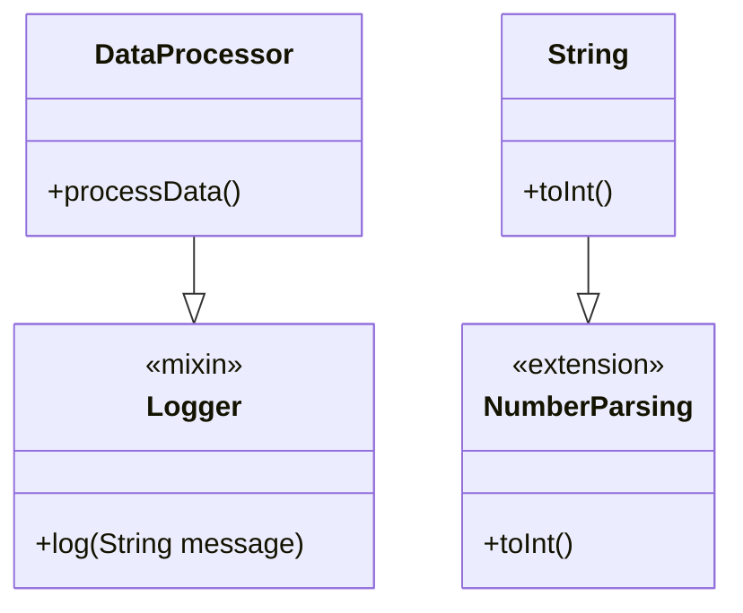

## 2.2.4 Mixins and Extensions

In the realm of software development, especially in Flutter, the concepts of mixins and extensions play a pivotal role in enhancing code reusability and flexibility. They allow developers to write cleaner, more maintainable code by promoting the reuse of methods and properties across different classes without the need for traditional inheritance. This section will delve into the intricacies of mixins and extensions, providing you with the knowledge and tools to leverage these powerful features in your Flutter applications.

### Understanding Mixins

Mixins are a powerful feature in Dart that allows a class to inherit methods and properties from multiple classes. Unlike traditional inheritance, where a class can only inherit from one superclass, mixins enable a class to incorporate functionalities from multiple sources. This is particularly useful for code reuse, as it allows you to compose behaviors in a modular fashion.

#### Creating a Mixin

To create a mixin in Dart, you use the `mixin` keyword. A mixin is essentially a class that is intended to be used as a building block for other classes. Here's a simple example of a mixin:

```dart
mixin Logger {
  void log(String message) {
    print('Log: $message');
  }
}
```

In this example, the `Logger` mixin provides a `log` method that can be used to log messages. This mixin can be applied to any class that needs logging functionality.

#### Using Mixins

To apply a mixin to a class, you use the `with` keyword. Here's how you can use the `Logger` mixin in a class:

```dart
class DataProcessor with Logger {
  void processData() {
    log('Processing started');
    // Processing logic
    log('Processing completed');
  }
}
```

In this example, the `DataProcessor` class uses the `Logger` mixin to gain access to the `log` method. This allows `DataProcessor` to log messages without having to implement the logging functionality itself.

#### Constraints on Mixins

Mixins in Dart have some constraints:

- **No Constructors:** Mixins cannot have constructors. This is because mixins are intended to be used as a way to share behavior, not as a way to create instances.
- **Constraints with `on` Keyword:** You can specify constraints on mixins using the `on` keyword. This allows you to restrict the types of classes that can use the mixin. For example:

  ```dart
  class Performer {
    void perform() {
      print('Performing');
    }
  }

  mixin Musical on Performer {
    void performMusic() {
      print('Performing music');
    }
  }
  ```

  In this example, the `Musical` mixin can only be used by classes that extend or implement `Performer`.

### Understanding Extensions

Extensions in Dart provide a way to add new functionality to existing libraries, classes, or types without modifying them. This is particularly useful when you want to enhance the capabilities of a class without altering its source code.

#### Creating Extensions

To create an extension in Dart, you use the `extension` keyword. Here's an example of an extension that adds a method to the `String` class:

```dart
extension NumberParsing on String {
  int toInt() {
    return int.parse(this);
  }
}
```

With this extension, you can now call the `toInt` method on any `String` instance:

```dart
String numberString = '42';
int number = numberString.toInt(); // Outputs: 42
```

#### Use Cases for Extensions

Extensions are particularly useful in scenarios where you want to add utility methods to existing classes. For instance, you might use extensions to add commonly used methods to built-in types like `String`, `List`, or `Map`.

### Practical Use Cases

Mixins and extensions simplify code and enhance functionality in various scenarios:

- **Mixins for Common Behavior:** Use mixins to add common behavior to multiple classes. For example, you might create a `Serializable` mixin that provides methods for converting objects to and from JSON.
- **Extensions for Utility Methods:** Use extensions to add utility methods to existing types. For example, you might create an extension on `List` to add a method for calculating the sum of all elements.

### Practice Exercises

To reinforce your understanding of mixins and extensions, try the following exercises:

1. **Create a Mixin:** Write a mixin that adds a `saveToFile` method to classes, allowing them to save their data to a file.
2. **Create an Extension:** Write an extension on `List` that adds a `shuffle` method to randomly shuffle the elements of the list.

### Visualizing Mixins and Extensions

To better understand how mixins and extensions integrate with classes, consider the following Mermaid.js diagram:



In this diagram, the `DataProcessor` class uses the `Logger` mixin to gain logging capabilities, and the `String` class is extended with a `toInt` method through the `NumberParsing` extension.

### Best Practices and Common Pitfalls

When using mixins and extensions, keep the following best practices and common pitfalls in mind:

- **Keep Mixins Focused:** Mixins should be focused on a specific behavior or functionality. Avoid creating mixins that do too much, as this can lead to complex and hard-to-maintain code.
- **Avoid Overusing Extensions:** While extensions are powerful, overusing them can lead to code that is difficult to understand. Use extensions judiciously to add meaningful functionality.
- **Be Mindful of Conflicts:** When using multiple mixins or extensions, be aware of potential conflicts, such as method name clashes. Dart resolves these conflicts by using the method from the last mixin or extension applied.

### Conclusion

Mixins and extensions are powerful tools in Flutter that enable developers to write more modular and reusable code. By understanding how to create and use mixins and extensions effectively, you can enhance the flexibility and maintainability of your Flutter applications. Practice creating your own mixins and extensions to gain a deeper understanding of these concepts and how they can benefit your projects.

## Quiz Time!



### What is the primary purpose of mixins in Dart?

- [x] To allow classes to inherit methods and properties from multiple classes
- [ ] To create instances of classes
- [ ] To define constructors for classes
- [ ] To override methods in a superclass

> **Explanation:** Mixins allow classes to inherit methods and properties from multiple classes, promoting code reuse without traditional inheritance.

### How do you apply a mixin to a class in Dart?

- [x] Using the `with` keyword
- [ ] Using the `extends` keyword
- [ ] Using the `implements` keyword
- [ ] Using the `apply` keyword

> **Explanation:** The `with` keyword is used to apply a mixin to a class in Dart.

### What is a constraint of mixins in Dart?

- [x] Mixins cannot have constructors
- [ ] Mixins cannot have methods
- [ ] Mixins cannot have properties
- [ ] Mixins cannot be used with interfaces

> **Explanation:** Mixins cannot have constructors, as they are intended for sharing behavior, not creating instances.

### How can you restrict the types of classes that can use a mixin?

- [x] Using the `on` keyword
- [ ] Using the `extends` keyword
- [ ] Using the `implements` keyword
- [ ] Using the `restrict` keyword

> **Explanation:** The `on` keyword is used to specify constraints on mixins, restricting the types of classes that can use them.

### What is the purpose of extensions in Dart?

- [x] To add new functionality to existing libraries, classes, or types without modifying them
- [ ] To create new classes
- [ ] To override methods in a superclass
- [ ] To define constructors for classes

> **Explanation:** Extensions allow you to add new functionality to existing libraries, classes, or types without modifying them.

### How do you create an extension in Dart?

- [x] Using the `extension` keyword
- [ ] Using the `extends` keyword
- [ ] Using the `implements` keyword
- [ ] Using the `create` keyword

> **Explanation:** The `extension` keyword is used to create an extension in Dart.

### What is a common use case for extensions?

- [x] Adding utility methods to existing types
- [ ] Creating new classes
- [ ] Defining constructors for classes
- [ ] Overriding methods in a superclass

> **Explanation:** Extensions are commonly used to add utility methods to existing types.

### How can you avoid conflicts when using multiple mixins or extensions?

- [x] Be aware of potential method name clashes
- [ ] Avoid using mixins and extensions together
- [ ] Use only one mixin or extension per class
- [ ] Always define constructors in mixins

> **Explanation:** Being aware of potential method name clashes can help avoid conflicts when using multiple mixins or extensions.

### What is a best practice when creating mixins?

- [x] Keep mixins focused on a specific behavior or functionality
- [ ] Create mixins that do as much as possible
- [ ] Avoid using mixins in large projects
- [ ] Always define constructors in mixins

> **Explanation:** Keeping mixins focused on a specific behavior or functionality helps maintain code simplicity and readability.

### True or False: Extensions can modify the source code of existing classes.

- [x] False
- [ ] True

> **Explanation:** Extensions cannot modify the source code of existing classes; they only add new functionality.


