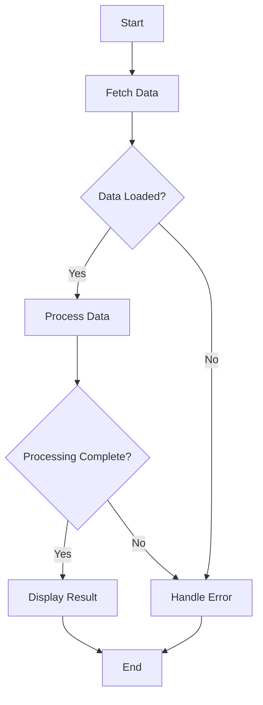

## 2.3.2 Working with Futures

In the realm of Flutter development, understanding Futures is crucial for handling asynchronous operations efficiently. As mobile applications often rely on network requests, file I/O, and other time-consuming tasks, mastering Futures can significantly enhance your app's performance and responsiveness. This section delves into the concept of Futures, how to create and handle them, and best practices for chaining and managing multiple asynchronous operations.

### What is a Future?

A `Future` in Dart is a placeholder for a value that will be available at some point in the future. It represents the result of an asynchronous operation, which might be a successful value or an error. Futures are integral to Dart's asynchronous programming model, allowing developers to write non-blocking code that can handle operations like network requests, database queries, and more.

In essence, a Future is like a promise that a value will be provided later. This allows your application to continue executing other tasks while waiting for the asynchronous operation to complete.

### Creating Futures

Creating a Future in Dart is straightforward. You can use the `Future` class to define an asynchronous operation. Here's a simple example of a function that simulates fetching data with a delay:

```dart
Future<String> fetchData() {
  return Future.delayed(Duration(seconds: 2), () => 'Data loaded');
}
```

In this example, `fetchData` returns a `Future<String>`. The `Future.delayed` constructor is used to simulate a delay of 2 seconds before returning the string `'Data loaded'`. This is a common pattern for simulating network requests or other time-consuming operations in a development environment.

### Handling Future Results

Once you have a Future, you need to handle its result. Dart provides several methods for this, including `then()` and `catchError()`.

#### Using `then()`

The `then()` method is used to register a callback that will be executed when the Future completes successfully. Here's how you can use it:

```dart
fetchData().then((data) {
  print(data);
}).catchError((error) {
  print('An error occurred: $error');
});
```

In this example, the `then()` method is used to print the data once it is loaded. If an error occurs during the asynchronous operation, the `catchError()` method handles it. This pattern ensures that your application can gracefully handle both successful and failed operations.

#### Using `catchError()`

The `catchError()` method is specifically designed to handle errors that occur during the execution of a Future. It's important to always handle potential errors in asynchronous code to prevent unexpected crashes or unresponsive behavior in your application.

### Chaining Futures

Chaining Futures allows you to perform multiple asynchronous operations in sequence. This is useful when each operation depends on the result of the previous one. Here's an example of chaining Futures:

```dart
fetchData().then((data) {
  return processData(data);
}).then((result) {
  print('Processing result: $result');
}).catchError((error) {
  print('An error occurred: $error');
});
```

In this example, `processData` is another asynchronous operation that takes the result of `fetchData` as input. By chaining these operations, you can create a sequence of dependent tasks that execute in order.

### Future Methods

Dart provides several methods for working with multiple Futures, including `Future.wait()` and `Future.any()`. These methods are useful for managing multiple asynchronous operations simultaneously.

#### `Future.wait()`

The `Future.wait()` method allows you to run multiple Futures in parallel and wait for all of them to complete. This is useful when you have several independent tasks that can be executed concurrently. Here's an example:

```dart
Future.wait([future1, future2]).then((List results) {
  // Use results from both futures
});
```

In this example, `Future.wait()` takes a list of Futures and returns a new Future that completes when all the provided Futures complete. The result is a list containing the results of each Future in the order they were provided.

#### `Future.any()`

The `Future.any()` method completes when any of the provided Futures completes. This is useful when you want to proceed as soon as the first result is available, regardless of the order of completion. Here's an example:

```dart
Future.any([future1, future2]).then((result) {
  print('First completed result: $result');
});
```

In this example, `Future.any()` returns a Future that completes with the result of the first Future that completes successfully.

### Error Handling

Handling errors in asynchronous code is crucial for building robust applications. Dart provides several mechanisms to handle errors in Futures, including `catchError()` and the `onError` parameter in the `then()` method. Always ensure that your asynchronous code includes error handling to prevent unexpected behavior.

### Best Practices for Working with Futures

1. **Always Handle Errors:** Use `catchError()` or the `onError` parameter to handle errors in your Futures. This prevents unhandled exceptions that can crash your application.

2. **Use `async` and `await`:** For more readable and maintainable code, consider using the `async` and `await` keywords. These allow you to write asynchronous code that looks synchronous, improving readability.

3. **Chain Futures When Necessary:** Use chaining to perform dependent asynchronous operations in sequence. This ensures that each operation waits for the previous one to complete before proceeding.

4. **Use `Future.wait()` for Parallel Operations:** When you have multiple independent asynchronous operations, use `Future.wait()` to execute them in parallel and wait for all to complete.

5. **Optimize for Performance:** Minimize the number of asynchronous operations and avoid unnecessary delays to improve the performance of your application.

### Practical Code Example

Let's build a small Flutter application that demonstrates the use of Futures to fetch data from a mock API and process it. This example will illustrate the concepts discussed above.

```dart
import 'package:flutter/material.dart';

void main() => runApp(MyApp());

class MyApp extends StatelessWidget {
  @override
  Widget build(BuildContext context) {
    return MaterialApp(
      home: Scaffold(
        appBar: AppBar(title: Text('Futures in Flutter')),
        body: DataFetcher(),
      ),
    );
  }
}

class DataFetcher extends StatefulWidget {
  @override
  _DataFetcherState createState() => _DataFetcherState();
}

class _DataFetcherState extends State<DataFetcher> {
  Future<String> fetchData() async {
    await Future.delayed(Duration(seconds: 2));
    return 'Data loaded';
  }

  Future<String> processData(String data) async {
    await Future.delayed(Duration(seconds: 1));
    return 'Processed $data';
  }

  @override
  Widget build(BuildContext context) {
    return Center(
      child: FutureBuilder<String>(
        future: fetchData().then((data) => processData(data)),
        builder: (context, snapshot) {
          if (snapshot.connectionState == ConnectionState.waiting) {
            return CircularProgressIndicator();
          } else if (snapshot.hasError) {
            return Text('Error: ${snapshot.error}');
          } else {
            return Text('Result: ${snapshot.data}');
          }
        },
      ),
    );
  }
}
```

In this example, the `DataFetcher` widget uses a `FutureBuilder` to manage the asynchronous operations. The `fetchData` and `processData` methods simulate fetching and processing data, respectively. The `FutureBuilder` widget handles the different states of the Future, displaying a loading indicator while waiting, and showing the result or error once the Future completes.

### Visualizing Future Chains

To better understand how Futures work, let's visualize the process of chaining Futures using a flowchart. This will help illustrate the sequence of operations and how errors are handled.



This flowchart represents the sequence of operations when chaining Futures. The process begins with fetching data, followed by processing it, and finally displaying the result. If an error occurs at any stage, it is handled appropriately.

### Conclusion

Futures are a powerful tool for handling asynchronous operations in Flutter. By understanding how to create, handle, and chain Futures, you can build responsive and efficient applications. Remember to always handle errors and consider using `async` and `await` for more readable code. With these skills, you'll be well-equipped to tackle the challenges of asynchronous programming in Flutter.

## Quiz Time!



### What is a Future in Dart?

- [x] A placeholder for a value that will be available in the future
- [ ] A synchronous operation
- [ ] A data type for storing strings
- [ ] A method for handling errors

> **Explanation:** A Future is a placeholder for a value that will be available at some point in the future, representing the result of an asynchronous operation.

### How do you create a Future in Dart?

- [x] Using the `Future` class
- [ ] Using the `Stream` class
- [ ] Using the `List` class
- [ ] Using the `Map` class

> **Explanation:** You create a Future in Dart using the `Future` class, which allows you to define asynchronous operations.

### Which method is used to handle successful completion of a Future?

- [x] `then()`
- [ ] `catchError()`
- [ ] `await`
- [ ] `async`

> **Explanation:** The `then()` method is used to register a callback that executes when the Future completes successfully.

### How can you handle errors in a Future?

- [x] Using `catchError()`
- [ ] Using `await`
- [ ] Using `async`
- [ ] Using `then()`

> **Explanation:** The `catchError()` method is used to handle errors that occur during the execution of a Future.

### What is the purpose of `Future.wait()`?

- [x] To run multiple Futures in parallel and wait for all to complete
- [ ] To handle errors in Futures
- [ ] To execute Futures sequentially
- [ ] To cancel a Future

> **Explanation:** `Future.wait()` is used to run multiple Futures in parallel and wait for all of them to complete.

### How do you chain multiple Futures?

- [x] Using the `then()` method
- [ ] Using the `catchError()` method
- [ ] Using `await`
- [ ] Using `async`

> **Explanation:** You can chain multiple Futures using the `then()` method, which allows you to perform dependent asynchronous operations in sequence.

### What does `Future.any()` do?

- [x] Completes when any of the provided Futures completes
- [ ] Completes when all provided Futures complete
- [ ] Cancels all Futures
- [ ] Handles errors in Futures

> **Explanation:** `Future.any()` completes when any of the provided Futures completes, allowing you to proceed with the first available result.

### Why is error handling important in asynchronous code?

- [x] To prevent crashes and unresponsive behavior
- [ ] To increase execution speed
- [ ] To reduce memory usage
- [ ] To simplify code

> **Explanation:** Error handling is crucial in asynchronous code to prevent crashes and ensure the application remains responsive.

### What is the benefit of using `async` and `await`?

- [x] They make asynchronous code more readable and maintainable
- [ ] They increase the speed of execution
- [ ] They reduce memory usage
- [ ] They handle errors automatically

> **Explanation:** `async` and `await` make asynchronous code more readable and maintainable by allowing you to write it in a synchronous style.

### True or False: Futures are only used for network requests.

- [ ] True
- [x] False

> **Explanation:** False. Futures are used for any asynchronous operation, not just network requests. They can be used for file I/O, database queries, and more.


