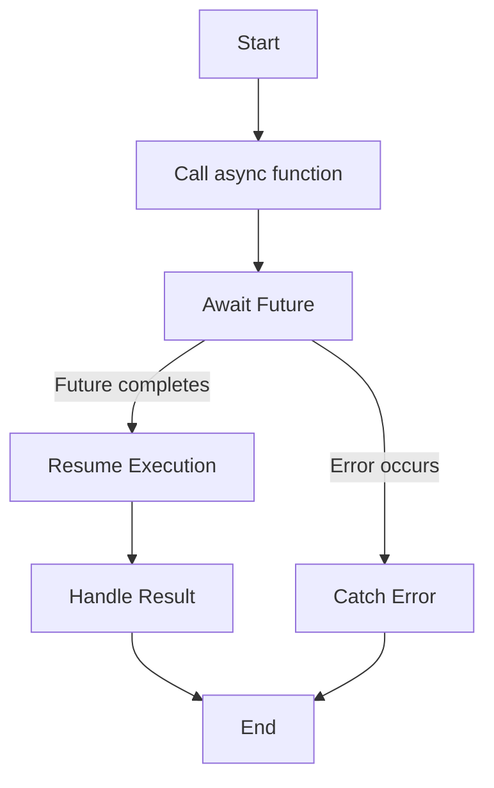

## 2.3.3 Async and Await Keywords

In the realm of modern mobile app development, handling asynchronous operations efficiently is crucial. Flutter, powered by Dart, provides robust support for asynchronous programming through the `async` and `await` keywords. These keywords transform complex asynchronous code into a more readable, maintainable format, resembling synchronous code execution. In this section, we will delve deeply into the mechanics of `async` and `await`, explore their usage, and highlight best practices to optimize your Flutter applications.

### Simplifying Asynchronous Code

Asynchronous programming is essential for performing tasks such as network requests, file I/O, and database operations without blocking the main thread. Traditionally, handling asynchronous operations involved using callbacks or chaining `Future` methods like `then()`, which often led to what is known as "callback hell" or convoluted code structures. The introduction of `async` and `await` in Dart simplifies this by allowing developers to write asynchronous code that looks and behaves like synchronous code.

Consider the following traditional approach using `then()`:

```dart
void fetchUserOrder() {
  getUserOrder().then((order) {
    print('Order: $order');
  }).catchError((error) {
    print('An error occurred: $error');
  });
}
```

This code can become cumbersome as more asynchronous operations are added. By using `async` and `await`, the same logic becomes more straightforward:

```dart
Future<void> fetchUserOrder() async {
  try {
    var order = await getUserOrder();
    print('Order: $order');
  } catch (e) {
    print('An error occurred: $e');
  }
}
```

### Using `async` Functions

The `async` keyword is used to mark a function as asynchronous, allowing the use of `await` within it. An `async` function always returns a `Future`, even if the return type is `void`. This is because the function's execution is paused at each `await` and resumes when the awaited `Future` completes.

#### Declaring an Async Function

Here is a simple example of declaring an `async` function:

```dart
Future<void> fetchUserOrder() async {
  var order = await getUserOrder();
  print('Order: $order');
}
```

In this example, `fetchUserOrder` is an asynchronous function that waits for `getUserOrder()` to complete before printing the order.

### Using `await`

The `await` keyword is used to pause the execution of an `async` function until a `Future` completes. This allows you to write code that appears to execute sequentially, even though it is non-blocking.

#### Awaiting a Future

When you use `await`, the function execution is paused until the `Future` resolves. This is particularly useful for operations that depend on the result of an asynchronous task:

```dart
Future<void> fetchData() async {
  var data = await getDataFromApi();
  print(data);
}
```

In this example, the execution of `fetchData` pauses at `await getDataFromApi()`, resuming only after the data is retrieved.

### Error Handling with Try-Catch

Handling errors in asynchronous code is crucial to ensure your application remains robust and user-friendly. Dart allows you to use try-catch blocks within `async` functions to handle exceptions gracefully.

#### Using Try-Catch in Async Functions

Here's how you can implement error handling in an `async` function:

```dart
Future<void> fetchData() async {
  try {
    var data = await getDataFromApi();
    print(data);
  } catch (e) {
    print('An error occurred: $e');
  }
}
```

In this example, if `getDataFromApi()` throws an error, the catch block handles it, preventing the application from crashing and providing a user-friendly error message.

### Avoiding Blocking UI

One of the key benefits of using `async` and `await` is that they do not block the UI thread. This means your application remains responsive while performing time-consuming operations in the background. Even though `await` pauses the execution of the `async` function, it does not freeze the UI, allowing animations, user interactions, and other tasks to continue seamlessly.

### Best Practices

To make the most of `async` and `await` in your Flutter applications, consider the following best practices:

#### Consistent Use of Async and Await

- **Maintain Consistency:** Use `async` and `await` consistently throughout your codebase to improve readability and maintainability. Mixing `then()` and `await` styles can lead to confusion and errors.

- **Avoid Blocking Operations:** Ensure that any long-running operations are performed asynchronously to prevent blocking the UI thread.

- **Error Handling:** Always implement error handling in your asynchronous functions to manage exceptions gracefully.

- **Return Types:** Be mindful of the return types of your `async` functions. Even if a function does not return a value, it should return `Future<void>`.

#### Avoid Mixing Styles

Mixing `then()` and `await` in the same codebase can lead to inconsistencies and potential errors. Choose one style and stick with it for clarity and maintainability.

### Practical Code Examples

Let's explore some practical scenarios where `async` and `await` can be applied effectively.

#### Fetching Data from an API

Consider an application that fetches user data from a remote API. Using `async` and `await`, the code becomes clean and easy to follow:

```dart
Future<void> fetchUserData() async {
  try {
    var response = await http.get(Uri.parse('https://api.example.com/user'));
    if (response.statusCode == 200) {
      var userData = jsonDecode(response.body);
      print('User Data: $userData');
    } else {
      print('Failed to load user data');
    }
  } catch (e) {
    print('An error occurred: $e');
  }
}
```

#### Performing Multiple Asynchronous Operations

When multiple asynchronous operations are required, `async` and `await` help maintain a clear flow of execution:

```dart
Future<void> performOperations() async {
  try {
    var data = await fetchData();
    var processedData = await processData(data);
    await saveData(processedData);
    print('Operations completed successfully');
  } catch (e) {
    print('An error occurred: $e');
  }
}
```

In this example, each operation depends on the result of the previous one, and `await` ensures they are executed in order.

### Diagrams and Visualizations

To better understand the flow of asynchronous operations, let's visualize the process using a flowchart:



This flowchart illustrates how an `async` function pauses at `await`, resumes upon completion, and handles errors if they occur.

### Conclusion

Mastering the `async` and `await` keywords in Flutter is essential for building responsive, efficient applications. By transforming asynchronous code into a synchronous-like format, these keywords enhance code readability and maintainability. Remember to handle errors gracefully, avoid blocking the UI, and maintain consistency in your codebase. With these practices, you'll be well-equipped to tackle complex asynchronous operations in your Flutter projects.

## Quiz Time!



### What is the primary benefit of using `async` and `await` in Dart?

- [x] They make asynchronous code look like synchronous code, improving readability.
- [ ] They increase the execution speed of the code.
- [ ] They are required for all Dart functions.
- [ ] They automatically handle all errors.

> **Explanation:** `async` and `await` transform asynchronous code into a format that resembles synchronous execution, enhancing readability and maintainability.

### Which keyword is used to pause the execution of an `async` function until a `Future` completes?

- [x] await
- [ ] async
- [ ] Future
- [ ] pause

> **Explanation:** The `await` keyword is used to pause the execution of an `async` function until the `Future` it is waiting for completes.

### What does an `async` function always return?

- [x] Future
- [ ] void
- [ ] int
- [ ] String

> **Explanation:** An `async` function always returns a `Future`, even if the return type is `void`.

### How can you handle errors in an `async` function?

- [x] Using try-catch blocks
- [ ] Using if-else statements
- [ ] Using switch-case statements
- [ ] Errors cannot be handled in async functions

> **Explanation:** Errors in `async` functions can be handled using try-catch blocks to manage exceptions gracefully.

### What happens to the UI thread when using `await` in an `async` function?

- [x] The UI thread is not blocked.
- [ ] The UI thread is blocked until the `Future` completes.
- [ ] The UI thread crashes.
- [ ] The UI thread is paused indefinitely.

> **Explanation:** Even though `await` pauses the execution of the `async` function, it does not block the UI thread, allowing the application to remain responsive.

### Why should you avoid mixing `then()` and `await` styles in the same codebase?

- [x] It can lead to inconsistencies and potential errors.
- [ ] It is not supported by Dart.
- [ ] It decreases code execution speed.
- [ ] It increases the size of the application.

> **Explanation:** Mixing `then()` and `await` styles can lead to inconsistencies and potential errors, making the codebase harder to maintain.

### What should you always implement in your asynchronous functions?

- [x] Error handling
- [ ] Logging
- [ ] UI updates
- [ ] Data caching

> **Explanation:** Implementing error handling in asynchronous functions is crucial to manage exceptions and ensure application stability.

### What is the return type of an `async` function that does not return a value?

- [x] Future<void>
- [ ] void
- [ ] Future
- [ ] Null

> **Explanation:** An `async` function that does not return a value should have a return type of `Future<void>`.

### What is a common pitfall when using `async` and `await`?

- [x] Forgetting to handle exceptions
- [ ] Using too many `await` statements
- [ ] Not using enough `await` statements
- [ ] Using `await` outside of `async` functions

> **Explanation:** A common pitfall is forgetting to handle exceptions, which can lead to unhandled errors and application crashes.

### True or False: An `async` function can be called without using `await`.

- [x] True
- [ ] False

> **Explanation:** An `async` function can be called without using `await`, but the caller will not wait for the `Future` to complete unless `await` is used.


