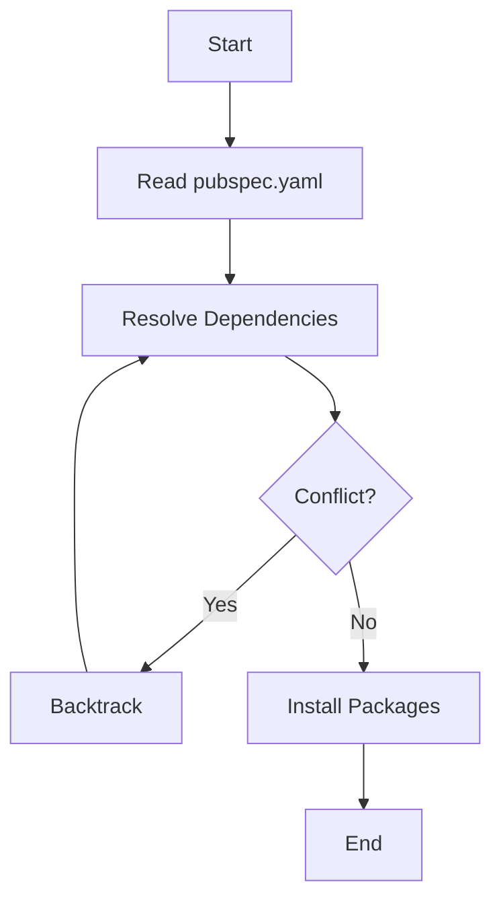

## 2.4.4 Version Management

In the dynamic world of Flutter app development, managing package versions effectively is crucial for maintaining the stability and functionality of your applications. This section delves into the intricacies of version management in Flutter, providing you with the knowledge and tools to handle dependencies with confidence. From understanding version constraints to utilizing automated tools for tracking updates, this comprehensive guide will equip you with best practices and practical insights.

### Understanding Version Constraints

Version constraints in Flutter are defined in the `pubspec.yaml` file, which is the heart of your project's configuration. Properly specifying version constraints ensures that your application uses compatible versions of dependencies, minimizing the risk of conflicts and breaking changes.

#### Caret Syntax (`^`)

The caret syntax is a common way to specify version constraints in Flutter. It allows updates that do not change the leftmost non-zero digit of the version number. This means you can receive minor updates and patches without worrying about breaking changes.

```yaml
dependencies:
  http: ^0.13.0
```

In this example, the `http` package can be updated to any version from `0.13.0` up to, but not including, `1.0.0`. This syntax is particularly useful for maintaining compatibility while benefiting from bug fixes and minor improvements.

#### Range Constraints

For more granular control over version updates, you can specify a range of acceptable versions. This approach is useful when you need to ensure compatibility with specific versions.

```yaml
dependencies:
  http: '>=0.12.0 <0.14.0'
```

Here, the `http` package can be updated to any version between `0.12.0` (inclusive) and `0.14.0` (exclusive). Range constraints provide flexibility while allowing you to avoid known issues in certain versions.

### Resolving Dependencies

When you run `flutter pub get`, the `pub` tool resolves dependencies by considering the constraints specified in your `pubspec.yaml` file and those of your dependencies. This process involves finding a set of package versions that satisfy all constraints.

#### Conflict Resolution Strategies

Conflicts can arise when two or more dependencies require different versions of the same package. To resolve these conflicts, `pub` employs several strategies:

- **Backtracking:** `pub` may backtrack to try different combinations of versions to find a compatible set.
- **Error Reporting:** If no compatible set is found, `pub` will report an error, allowing you to adjust your constraints.

Understanding how `pub` resolves dependencies can help you troubleshoot and resolve conflicts effectively.

### Dependency Overrides

In some cases, you may need to force a specific version of a dependency, overriding the constraints specified by other packages. This can be achieved using the `dependency_overrides` section in your `pubspec.yaml`.

```yaml
dependency_overrides:
  http: 0.13.0
```

While dependency overrides can be a powerful tool, they should be used sparingly and with caution, as they can lead to unexpected behavior if not managed carefully.

### Updating Dependencies

Keeping your dependencies up to date is essential for leveraging new features, improvements, and security patches. The `flutter pub upgrade` command updates your packages to the latest versions allowed by your constraints.

```bash
flutter pub upgrade
```

#### Importance of Testing After Updates

After updating dependencies, it's crucial to thoroughly test your application to ensure that everything functions as expected. Updates, especially major ones, may introduce changes that affect your app's behavior.

### Lock File (`pubspec.lock`)

The `pubspec.lock` file records the exact versions of packages used in your project. This file ensures that your application builds consistently across different environments and setups.

#### When to Commit Lock Files

- **Applications:** Commit the `pubspec.lock` file to your version control system to ensure consistent builds.
- **Packages:** Do not commit the `pubspec.lock` file for libraries or packages, as it can restrict users from resolving dependencies according to their constraints.

### Best Practices

Adhering to best practices in version management can significantly enhance the stability and maintainability of your Flutter projects.

- **Regularly Check for Updates:** Stay informed about updates to your dependencies and apply them as needed.
- **Be Cautious with Major Updates:** Major version updates may introduce breaking changes. Review release notes and test thoroughly before upgrading.
- **Use Semantic Versioning:** Understand and leverage semantic versioning to make informed decisions about updates.

### Automated Tools

Automated tools can help you track and manage dependency updates efficiently. One such tool is `dependabot`, which can automatically create pull requests for dependency updates.

#### Introducing Dependabot

Dependabot integrates with your version control system to monitor your dependencies and propose updates. It provides a convenient way to keep your project up to date without manual intervention.

### Practical Code Examples

Let's explore some practical examples to reinforce the concepts discussed.

#### Example 1: Specifying Version Constraints

```yaml
dependencies:
  flutter:
    sdk: flutter
  cupertino_icons: ^1.0.2
  provider: '>=5.0.0 <6.0.0'
```

In this example, we specify the `cupertino_icons` package using caret syntax and the `provider` package with range constraints.

#### Example 2: Resolving Conflicts

Imagine you have two dependencies with conflicting version constraints:

```yaml
dependencies:
  package_a: ^1.0.0
  package_b: ^2.0.0
```

If `package_a` requires `http: ^0.12.0` and `package_b` requires `http: ^0.13.0`, you may encounter a conflict. To resolve this, consider adjusting constraints or using dependency overrides.

#### Example 3: Using Dependency Overrides

```yaml
dependencies:
  package_a: ^1.0.0
  package_b: ^2.0.0

dependency_overrides:
  http: 0.13.0
```

In this scenario, we override the `http` package version to `0.13.0` to satisfy both dependencies.

### Diagrams and Visualizations

To enhance your understanding, let's visualize the dependency resolution process using a flowchart.



This flowchart illustrates the steps involved in resolving dependencies and handling conflicts.

### Conclusion

Effective version management is a cornerstone of successful Flutter app development. By understanding version constraints, resolving dependencies, and adhering to best practices, you can maintain a stable and reliable application. Utilize automated tools like `dependabot` to streamline the update process and ensure your project remains up to date with the latest improvements and security patches.

## Quiz Time!



### What does the caret (`^`) syntax in version constraints allow?

- [x] Updates that do not change the leftmost non-zero digit
- [ ] Updates to any version
- [ ] Updates only to patch versions
- [ ] No updates at all

> **Explanation:** The caret syntax allows updates that do not change the leftmost non-zero digit, enabling minor updates and patches.

### How do you specify a range of acceptable versions in `pubspec.yaml`?

- [x] Using the `>=` and `<` operators
- [ ] Using the `^` symbol
- [ ] Using the `*` wildcard
- [ ] Using the `=` operator

> **Explanation:** Range constraints are specified using the `>=` and `<` operators to define a minimum and maximum version.

### What command is used to update packages to the latest versions allowed by constraints?

- [x] `flutter pub upgrade`
- [ ] `flutter pub get`
- [ ] `flutter pub outdated`
- [ ] `flutter pub install`

> **Explanation:** The `flutter pub upgrade` command updates packages to the latest versions allowed by the constraints.

### What is the purpose of the `pubspec.lock` file?

- [x] To record the exact package versions used in a project
- [ ] To define the project's dependencies
- [ ] To override dependency constraints
- [ ] To specify the Flutter SDK version

> **Explanation:** The `pubspec.lock` file records the exact package versions used in a project to ensure consistent builds.

### When should you commit the `pubspec.lock` file?

- [x] For applications
- [ ] For packages
- [x] For both applications and packages
- [ ] Never

> **Explanation:** The `pubspec.lock` file should be committed for applications to ensure consistent builds, but not for packages.

### What tool can automatically create pull requests for dependency updates?

- [x] Dependabot
- [ ] GitHub Actions
- [ ] Travis CI
- [ ] Jenkins

> **Explanation:** Dependabot is a tool that can automatically create pull requests for dependency updates.

### Which versioning practice helps in making informed decisions about updates?

- [x] Semantic Versioning
- [ ] Random Versioning
- [ ] Manual Versioning
- [ ] Automatic Versioning

> **Explanation:** Semantic Versioning helps in making informed decisions about updates by indicating the nature of changes.

### What should you do after updating dependencies?

- [x] Thoroughly test your application
- [ ] Immediately deploy to production
- [ ] Revert to previous versions
- [ ] Ignore any changes

> **Explanation:** After updating dependencies, it's crucial to thoroughly test your application to ensure everything functions as expected.

### What happens if `pub` cannot find a compatible set of package versions?

- [x] It reports an error
- [ ] It installs the latest versions
- [ ] It ignores the conflict
- [ ] It automatically resolves the conflict

> **Explanation:** If `pub` cannot find a compatible set of package versions, it reports an error, allowing you to adjust your constraints.

### True or False: Dependency overrides should be used frequently to manage versions.

- [ ] True
- [x] False

> **Explanation:** Dependency overrides should be used sparingly and with caution, as they can lead to unexpected behavior if not managed carefully.


