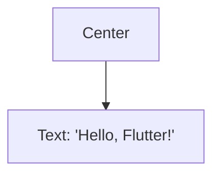

## 3.1.1 What are Widgets?

In the world of Flutter, widgets are the fundamental building blocks of an application's user interface. They are the core concept that underpins the entire framework, enabling developers to create visually appealing and highly interactive mobile applications. Understanding widgets is crucial for anyone looking to master Flutter development, as they form the basis of everything you see and interact with in a Flutter app.

### Definition and Core Concept

At its core, a widget is a class that describes a part of the user interface. In Flutter, everything is a widget, from structural elements like buttons and text to stylistic elements like padding and alignment. This means that whether you're creating a simple button or a complex layout, you're working with widgets.

Widgets are designed to be lightweight and efficient. They are immutable, meaning that once a widget is created, its properties cannot change. Instead, when the state of a widget needs to change, a new widget is created with the updated properties. This immutability is a key feature of Flutter's design, allowing for efficient UI updates and rendering.

### Widget Composition

One of the most powerful aspects of Flutter is its ability to compose complex user interfaces by nesting widgets within each other. This is known as widget composition. By combining simple widgets, you can build intricate and dynamic UIs that are both flexible and reusable.

#### Widget Trees

In Flutter, widgets are organized into a tree structure, known as the widget tree. This tree represents the hierarchy of widgets in your application, with each widget having a parent and potentially multiple children. The root of the widget tree is typically the `MaterialApp` or `CupertinoApp` widget, which provides the basic structure for your app.

Here's a simple example of widget composition using a widget tree:

```dart
Widget build(BuildContext context) {
  return Center(
    child: Text('Hello, Flutter!'),
  );
}
```

In this example, the `Center` widget is the parent, and the `Text` widget is its child. The `Center` widget centers its child within the available space.

To better visualize this, let's look at a **Mermaid.js diagram** representing the widget tree for the above code:



This diagram illustrates the hierarchical relationship between the `Center` and `Text` widgets, with the `Center` widget being the parent and the `Text` widget being the child.

### Stateless and Stateful Widgets

In Flutter, widgets can be categorized into two types: stateless and stateful. This distinction is crucial for understanding how Flutter manages changes in the user interface.

- **Stateless Widgets:** These are widgets that do not maintain any state. They are immutable and are typically used for static content that does not change over time. Stateless widgets are ideal for displaying static text, images, or icons.

- **Stateful Widgets:** These widgets can maintain state and are capable of updating their appearance in response to user interactions or other events. Stateful widgets are used for dynamic content that can change over time, such as forms, animations, or interactive elements.

The choice between stateless and stateful widgets depends on the needs of your application and the behavior you want to implement. We'll explore this topic in more detail in the next subsection.

### Immutability

As mentioned earlier, widgets in Flutter are immutable. This means that once a widget is created, its properties cannot be changed. Instead, when a change is needed, a new widget is created with the updated properties, and the old widget is replaced.

This immutability is a key feature of Flutter's design, allowing for efficient UI updates and rendering. By creating new widgets instead of modifying existing ones, Flutter can quickly and efficiently update the user interface without the need for complex state management.

### Role in the Flutter Framework

Widgets play a crucial role in the Flutter framework, working in conjunction with the framework to render elements on the screen. They describe what their view should look like given their current configuration and state.

When a widget is created, it is added to the widget tree, and the Flutter framework takes care of rendering it on the screen. The framework uses a combination of widgets, elements, and render objects to manage the rendering process, ensuring that the user interface is updated efficiently and accurately.

### Encourage Hands-On Practice

To truly understand widgets and their role in Flutter, it's important to get hands-on experience. We encourage you to create a simple app that uses basic widgets to display text and images. Here's a basic example to get you started:

```dart
import 'package:flutter/material.dart';

void main() {
  runApp(MyApp());
}

class MyApp extends StatelessWidget {
  @override
  Widget build(BuildContext context) {
    return MaterialApp(
      home: Scaffold(
        appBar: AppBar(
          title: Text('Flutter Widgets'),
        ),
        body: Center(
          child: Column(
            mainAxisAlignment: MainAxisAlignment.center,
            children: <Widget>[
              Text(
                'Hello, Flutter!',
                style: TextStyle(fontSize: 24),
              ),
              Image.network(
                'https://flutter.dev/images/flutter-logo-sharing.png',
              ),
            ],
          ),
        ),
      ),
    );
  }
}
```

This code creates a simple Flutter app with a `Text` widget and an `Image` widget displayed in the center of the screen. You can modify and experiment with this code to better understand how widgets work and how they can be composed to create complex UIs.

### Best Practices and Common Pitfalls

When working with widgets in Flutter, there are several best practices and common pitfalls to keep in mind:

- **Keep Widgets Small and Focused:** Each widget should have a single responsibility. This makes it easier to manage and reuse widgets across your application.

- **Use Stateless Widgets When Possible:** If a widget does not need to maintain state, use a stateless widget. This can improve performance and simplify your code.

- **Avoid Deep Widget Trees:** While widget composition is powerful, deep widget trees can become difficult to manage and understand. Try to keep your widget trees as shallow as possible.

- **Leverage Flutter's Built-in Widgets:** Flutter provides a wide range of built-in widgets for common UI elements. Use these widgets whenever possible to save time and ensure consistency.

- **Test Your Widgets:** Flutter provides excellent support for testing widgets. Use widget tests to ensure that your UI behaves as expected and to catch any issues early in the development process.

### Troubleshooting Tips

When working with widgets, you may encounter some common issues. Here are a few troubleshooting tips to help you resolve them:

- **UI Not Updating:** If your UI is not updating as expected, ensure that you are using stateful widgets where necessary and that you are calling `setState()` to trigger a rebuild.

- **Layout Issues:** If your layout is not displaying correctly, check your widget tree for any incorrect nesting or missing widgets. Use Flutter's `debugPrint()` function to print the widget tree and identify any issues.

- **Performance Issues:** If your app is experiencing performance issues, consider using the `const` keyword for stateless widgets to prevent unnecessary rebuilds. Also, use Flutter's performance tools to identify any bottlenecks.

### Conclusion

Widgets are the foundation of Flutter development, providing a powerful and flexible way to build user interfaces. By understanding the core concepts of widgets, including their composition, immutability, and role in the framework, you can create dynamic and efficient applications that provide a seamless user experience.

As you continue your journey into Flutter development, remember to experiment with different widgets, practice building complex UIs, and explore the vast ecosystem of built-in widgets that Flutter provides. With practice and experience, you'll become proficient in using widgets to create beautiful and functional applications.

## Quiz Time!



### What is a widget in Flutter?

- [x] A class that describes a part of the user interface
- [ ] A function that handles user input
- [ ] A tool for managing application state
- [ ] A library for network requests

> **Explanation:** In Flutter, a widget is a class that describes a part of the user interface. Everything in Flutter is a widget, from buttons and text to layout and styling elements.

### How are complex UIs built in Flutter?

- [x] By composing widgets together
- [ ] By writing complex algorithms
- [ ] By using external libraries
- [ ] By modifying the Flutter framework

> **Explanation:** Complex UIs in Flutter are built by composing widgets together. Widgets are nested within other widgets to create a hierarchy, known as the widget tree.

### What is the difference between stateless and stateful widgets?

- [x] Stateless widgets do not maintain state, while stateful widgets do
- [ ] Stateless widgets are faster than stateful widgets
- [ ] Stateful widgets cannot be used for dynamic content
- [ ] Stateless widgets are only for displaying text

> **Explanation:** Stateless widgets do not maintain any state and are used for static content. Stateful widgets can maintain state and are used for dynamic content that can change over time.

### What does it mean that widgets are immutable?

- [x] Once created, their properties cannot change
- [ ] They cannot be used in multiple places
- [ ] They cannot be deleted
- [ ] They cannot be nested

> **Explanation:** Widgets in Flutter are immutable, meaning that once a widget is created, its properties cannot change. Changes in the UI are achieved by creating new widgets with updated properties.

### What is the role of widgets in the Flutter framework?

- [x] They describe what their view should look like given their current configuration and state
- [ ] They handle network requests
- [ ] They manage application state
- [ ] They provide security features

> **Explanation:** Widgets in Flutter describe what their view should look like given their current configuration and state. The Flutter framework takes care of rendering these widgets on the screen.

### How can you visualize the hierarchy of widgets in Flutter?

- [x] Using a widget tree
- [ ] Using a state diagram
- [ ] Using a flowchart
- [ ] Using a sequence diagram

> **Explanation:** The hierarchy of widgets in Flutter is visualized using a widget tree, which represents the nesting and relationships between widgets in an application.

### What is a common best practice when working with widgets?

- [x] Keep widgets small and focused
- [ ] Use as many widgets as possible
- [ ] Avoid using built-in widgets
- [ ] Write custom widgets for every UI element

> **Explanation:** A common best practice when working with widgets is to keep them small and focused, with each widget having a single responsibility. This makes them easier to manage and reuse.

### What should you do if your UI is not updating as expected?

- [x] Ensure you are using stateful widgets where necessary and calling `setState()`
- [ ] Restart the application
- [ ] Clear the application cache
- [ ] Reinstall the Flutter framework

> **Explanation:** If your UI is not updating as expected, ensure that you are using stateful widgets where necessary and that you are calling `setState()` to trigger a rebuild of the widget.

### What is the purpose of the `const` keyword in Flutter?

- [x] To prevent unnecessary rebuilds of stateless widgets
- [ ] To declare a variable
- [ ] To create a new widget
- [ ] To manage application state

> **Explanation:** The `const` keyword in Flutter is used to prevent unnecessary rebuilds of stateless widgets by indicating that the widget's properties will not change.

### True or False: Widgets in Flutter can be modified after they are created.

- [x] False
- [ ] True

> **Explanation:** Widgets in Flutter are immutable, meaning they cannot be modified after they are created. Changes in the UI are achieved by creating new widgets with updated properties.


