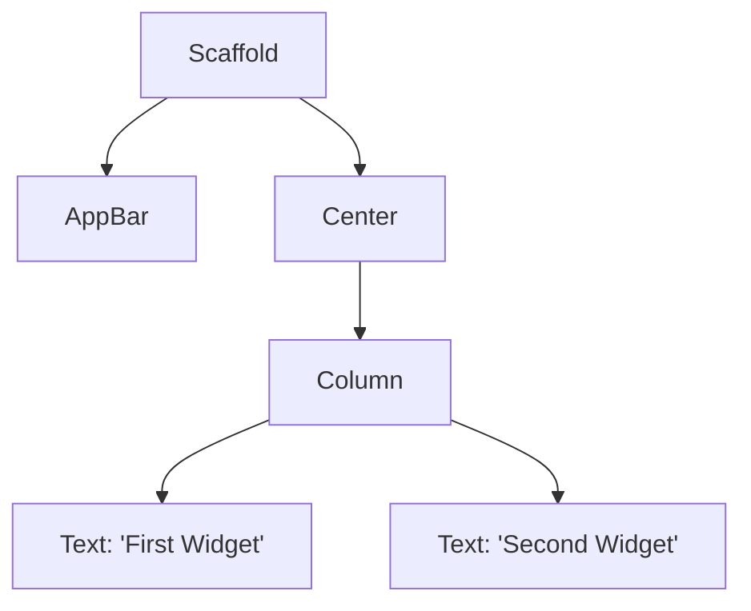

## 3.1.3 Widget Tree and Element Tree

In the world of Flutter development, understanding the architecture of your application is crucial for building efficient and responsive user interfaces. Two fundamental concepts in this architecture are the **Widget Tree** and the **Element Tree**. These structures not only define how your app's UI is constructed but also how it is rendered and updated efficiently. In this section, we will explore these concepts in detail, providing you with the knowledge needed to harness their power in your Flutter journey.

### The Widget Tree: Building Blocks of the UI

The **Widget Tree** is the backbone of any Flutter application. It is a hierarchical structure that represents the user interface of your app. Each widget in Flutter nests inside its parent widget, forming a tree-like structure. This tree is a blueprint for the UI, defining how elements are arranged and interact with each other.

#### Understanding the Widget Tree

In Flutter, everything is a widget. From the smallest text label to complex layouts, widgets are the building blocks of the UI. The widget tree is a dynamic structure that can change in response to user interactions or data updates. This flexibility is a key feature of Flutter, allowing developers to create highly interactive and responsive applications.

Here's a simple code example to illustrate a widget tree with multiple nested widgets:

```dart
Widget build(BuildContext context) {
  return Scaffold(
    appBar: AppBar(
      title: Text('Widget Tree Example'),
    ),
    body: Center(
      child: Column(
        children: [
          Text('First Widget'),
          Text('Second Widget'),
        ],
      ),
    ),
  );
}
```

In this example, the `Scaffold` widget is the root of the tree, with an `AppBar` and a `Center` widget as its children. The `Center` widget contains a `Column`, which in turn has two `Text` widgets as its children. This hierarchical structure forms the widget tree.

#### Visualizing the Widget Tree

To better understand the widget tree, let's represent it using a **Mermaid.js diagram**:



This diagram visually represents the hierarchy of widgets, making it easier to grasp the structure of the UI.

### The Element Tree: Managing the UI State

While the widget tree defines the configuration of the UI, the **Element Tree** is responsible for managing the state and lifecycle of the widgets. During the rendering process, Flutter creates a tree of `Element` objects, which are mutable and manage the widget's place in the tree.

#### Understanding the Element Tree

Elements are the bridge between the immutable widget configuration and the mutable render objects that draw the UI to the screen. Each widget in the widget tree has a corresponding element in the element tree. These elements manage the lifecycle of the widgets, including creation, updates, and disposal.

The element tree is crucial for Flutter's efficient UI updates. When a widget needs to be rebuilt, Flutter can update only the necessary elements, minimizing the performance impact. This process is known as "reconciliation" and is a key feature of Flutter's reactive framework.

### The Render Tree: Drawing the UI

In addition to the widget and element trees, Flutter uses a **Render Tree** to draw the UI on the screen. The render tree consists of `RenderObject` objects, which are responsible for the actual rendering of the UI elements.

#### Relationship Between Trees

The widget tree, element tree, and render tree work together to create and update the UI:

- **Widget Tree**: Defines the configuration and hierarchy of the UI.
- **Element Tree**: Manages the state and lifecycle of the widgets.
- **Render Tree**: Handles the rendering of the UI on the screen.

Understanding the relationship between these trees is essential for optimizing your Flutter applications. By knowing how these structures interact, you can make informed decisions about widget updates and state management.

### Tree Visualization: Using the Widget Inspector

Flutter provides powerful tools for visualizing and debugging the widget tree. The **Widget Inspector** is an invaluable tool that allows you to explore the widget tree in real-time. It provides a visual representation of the tree, making it easier to understand the structure and diagnose layout issues.

#### Accessing the Widget Inspector

To access the widget inspector, follow these steps in common IDEs:

- **Android Studio**: Open the Flutter Inspector tab in the right sidebar. Click on the "Select Widget Mode" button to interactively select widgets in your app.
- **Visual Studio Code**: Use the command palette (`Ctrl + Shift + P` or `Cmd + Shift + P` on macOS) and search for "Flutter: Inspect Widget".

The widget inspector provides a wealth of information, including widget properties, layout constraints, and performance metrics. By using this tool, you can gain a deeper understanding of your app's UI and identify potential issues.

### Practical Understanding: Hands-On Exploration

To solidify your understanding of the widget tree and element tree, we encourage you to build a simple Flutter app and use the widget inspector to explore the widget tree. This hands-on practice will help you visualize the structure and see how changes in the code affect the UI.

#### Debugging Layout Issues

Understanding the widget tree is also crucial for debugging layout issues. By examining the tree, you can identify misaligned widgets, incorrect constraints, and other common problems. The widget inspector can highlight these issues, allowing you to make necessary adjustments.

### Conclusion

The widget tree and element tree are fundamental concepts in Flutter development. By mastering these structures, you can create efficient, responsive, and maintainable applications. The widget tree defines the UI's configuration, while the element tree manages the state and lifecycle of the widgets. Together with the render tree, these structures form the backbone of Flutter's architecture.

As you continue your Flutter journey, remember to leverage the widget inspector and other tools to explore and optimize your applications. Understanding these concepts will empower you to build high-quality apps that delight users.

## Quiz Time!



### What is the primary role of the widget tree in Flutter?

- [x] To define the hierarchy and configuration of the UI
- [ ] To manage the state and lifecycle of widgets
- [ ] To handle the rendering of the UI on the screen
- [ ] To optimize the performance of the app

> **Explanation:** The widget tree defines the hierarchy and configuration of the UI, serving as a blueprint for how widgets are arranged and interact.

### Which of the following best describes the element tree?

- [ ] A tree structure that defines the UI configuration
- [x] A tree of `Element` objects managing widget state and lifecycle
- [ ] A tree of `RenderObject` objects responsible for drawing the UI
- [ ] A tool for visualizing the widget hierarchy

> **Explanation:** The element tree consists of `Element` objects that manage the state and lifecycle of widgets, bridging the gap between the widget tree and render tree.

### How does Flutter efficiently update the UI?

- [ ] By rebuilding the entire widget tree
- [x] By updating only the necessary elements in the element tree
- [ ] By recreating the render tree from scratch
- [ ] By using the widget inspector tool

> **Explanation:** Flutter updates only the necessary elements in the element tree, minimizing performance impact through a process called reconciliation.

### What is the role of the render tree in Flutter?

- [ ] To define the hierarchy of widgets
- [ ] To manage widget state and lifecycle
- [x] To handle the rendering of the UI on the screen
- [ ] To provide a visual representation of the widget tree

> **Explanation:** The render tree consists of `RenderObject` objects responsible for drawing the UI on the screen.

### Which tool can you use to visualize the widget tree in real-time?

- [x] Widget Inspector
- [ ] Dart Analyzer
- [ ] Flutter Doctor
- [ ] Code Linter

> **Explanation:** The Widget Inspector is a tool that allows developers to visualize and explore the widget tree in real-time.

### How can the widget inspector help in debugging layout issues?

- [x] By highlighting misaligned widgets and incorrect constraints
- [ ] By providing code suggestions for optimization
- [ ] By automatically fixing layout issues
- [ ] By generating test cases for the UI

> **Explanation:** The widget inspector highlights misaligned widgets and incorrect constraints, helping developers diagnose and fix layout issues.

### What is the relationship between the widget tree and element tree?

- [x] Each widget in the widget tree has a corresponding element in the element tree
- [ ] The widget tree is a subset of the element tree
- [ ] The element tree is a subset of the widget tree
- [ ] The widget tree and element tree are independent of each other

> **Explanation:** Each widget in the widget tree corresponds to an element in the element tree, which manages its state and lifecycle.

### Why is understanding the widget tree important for Flutter developers?

- [x] It aids in debugging layout issues and optimizing UI performance
- [ ] It is necessary for writing unit tests
- [ ] It helps in managing app state
- [ ] It is required for using third-party libraries

> **Explanation:** Understanding the widget tree aids in debugging layout issues and optimizing UI performance, making it crucial for Flutter developers.

### What happens during the reconciliation process in Flutter?

- [ ] The entire widget tree is rebuilt
- [x] Only the necessary elements in the element tree are updated
- [ ] The render tree is recreated from scratch
- [ ] The widget inspector is used to visualize changes

> **Explanation:** During reconciliation, Flutter updates only the necessary elements in the element tree, ensuring efficient UI updates.

### True or False: The widget tree is immutable, while the element tree is mutable.

- [x] True
- [ ] False

> **Explanation:** The widget tree is immutable, representing the configuration of the UI, while the element tree is mutable, managing the state and lifecycle of widgets.


