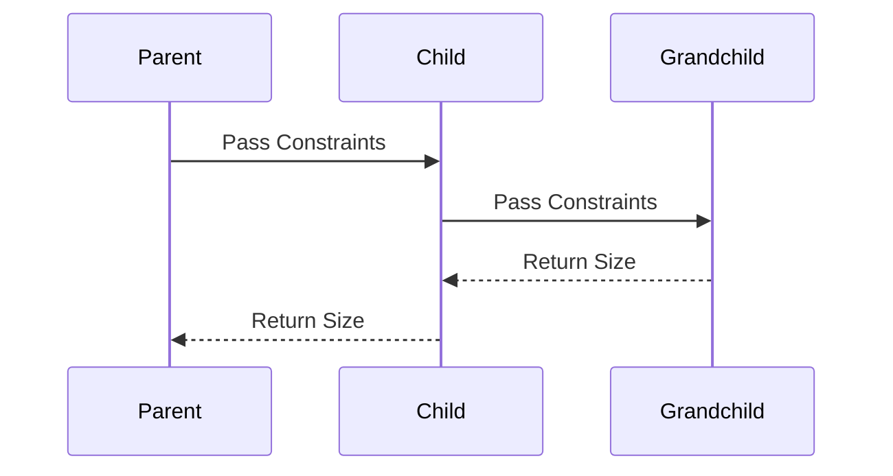

## 3.1.4 Rendering Process

In the world of Flutter, the rendering process is a fascinating journey that transforms your code into beautiful, interactive user interfaces. Understanding this process is crucial for any Flutter developer aiming to build efficient and performant applications. In this section, we will explore the rendering pipeline in detail, breaking it down into its core phases: Build, Layout, and Paint. We will also delve into optimization strategies and performance considerations to help you create smooth and responsive apps.

### Overview of the Rendering Pipeline

The rendering pipeline in Flutter is a systematic process that takes your widget descriptions and brings them to life on the screen. This pipeline consists of three main stages:

1. **Build Phase**: Constructing the widget tree.
2. **Layout Phase**: Calculating the size and position of each widget.
3. **Paint Phase**: Rendering the widgets onto the screen.

Each phase plays a critical role in ensuring that your app's UI is rendered correctly and efficiently.

### Build Phase

The Build Phase is where the magic begins. During this phase, Flutter constructs the widget tree by calling the `build()` method on each widget. This method is responsible for describing how the widget should look and behave.

#### Constructing the Widget Tree

When Flutter starts the build process, it begins by calling the `build()` method on the root widget. This method returns a tree of widgets that describe the UI. Each widget in this tree can, in turn, call the `build()` method on its child widgets, creating a hierarchical structure.

```dart
class MyHomePage extends StatelessWidget {
  @override
  Widget build(BuildContext context) {
    return Scaffold(
      appBar: AppBar(
        title: Text('Flutter Rendering Process'),
      ),
      body: Center(
        child: Column(
          mainAxisAlignment: MainAxisAlignment.center,
          children: <Widget>[
            Text('Hello, Flutter!'),
            ElevatedButton(
              onPressed: () {},
              child: Text('Click Me'),
            ),
          ],
        ),
      ),
    );
  }
}
```

In the example above, the `MyHomePage` widget builds a simple UI with a `Scaffold`, `AppBar`, `Text`, and `ElevatedButton`. Each widget's `build()` method is called recursively to construct the entire widget tree.

#### Determining Widgets to Display

During the build phase, Flutter determines which widgets need to be displayed based on the current state and configuration. This is a crucial step, as it sets the stage for the subsequent layout and paint phases.

### Layout Phase

Once the widget tree is constructed, Flutter moves on to the Layout Phase. This phase is responsible for calculating the size and position of each widget on the screen.

#### Size and Position Calculation

In the layout phase, widgets communicate their size constraints up and down the tree. This process ensures that each widget knows its available space and can determine its size accordingly.

- **Constraints Passing Down**: Parent widgets pass size constraints to their children. These constraints define the maximum and minimum size a child widget can occupy.

- **Sizes Flowing Up**: Child widgets report their size back to their parent after determining how much space they need within the given constraints.

Below is a **Mermaid.js sequence diagram** illustrating this process:



This diagram shows how constraints flow from the parent to the child and grandchild, and how sizes are reported back up the tree.

### Paint Phase

The final stage of the rendering pipeline is the Paint Phase. In this phase, Flutter translates the layout information into actual drawings on the screen.

#### Rendering Widgets on the Screen

During the paint phase, each widget's `RenderObject` is responsible for painting itself onto a canvas. This involves drawing shapes, text, images, and other visual elements.

```dart
class MyCustomPainter extends CustomPainter {
  @override
  void paint(Canvas canvas, Size size) {
    final paint = Paint()
      ..color = Colors.blue
      ..strokeWidth = 4.0;

    canvas.drawLine(Offset(0, 0), Offset(size.width, size.height), paint);
  }

  @override
  bool shouldRepaint(CustomPainter oldDelegate) => false;
}
```

In the example above, a `CustomPainter` is used to draw a blue line on the canvas. The `paint()` method is where the actual drawing commands are executed.

### Rebuilding and Optimization

Flutter is designed to minimize unnecessary rebuilds and repaints to maintain performance. However, understanding how to optimize your code can further enhance your app's efficiency.

#### Minimizing Unnecessary Rebuilds

Flutter uses a mechanism called "dirty checking" to determine which parts of the widget tree need to be rebuilt. Widgets are marked as "dirty" when they need to be updated, and only those widgets are rebuilt.

#### The Role of Keys

Keys play a crucial role in helping Flutter identify widgets across rebuilds. By assigning a `Key` to a widget, you can ensure that Flutter maintains its state even if its position in the widget tree changes.

```dart
class MyStatefulWidget extends StatefulWidget {
  MyStatefulWidget({Key? key}) : super(key: key);

  @override
  _MyStatefulWidgetState createState() => _MyStatefulWidgetState();
}
```

In the example above, a `Key` is assigned to a `StatefulWidget` to preserve its state during rebuilds.

### Performance Considerations

To optimize the build process and improve performance, consider the following tips:

- **Avoid Large Build Methods**: Break down your UI into smaller, reusable widgets to make the build process more efficient.

- **Use the `const` Keyword**: Use `const` constructors where possible to cache widgets and reduce rebuilds.

```dart
const Text('Hello, Flutter!');
```

By using `const`, you can ensure that the `Text` widget is only built once and reused across rebuilds.

### Visual Aids

To further illustrate the rendering pipeline, consider comparing it to real-world processes. For example, think of the build phase as creating a blueprint, the layout phase as arranging furniture in a room, and the paint phase as decorating the room with colors and textures.

### Conclusion

Understanding the rendering process in Flutter is essential for building efficient and performant applications. By mastering the build, layout, and paint phases, and implementing optimization strategies, you can create smooth and responsive UIs that delight users.

## Quiz Time!



### What is the first phase in Flutter's rendering pipeline?

- [x] Build Phase
- [ ] Layout Phase
- [ ] Paint Phase
- [ ] Initialization Phase

> **Explanation:** The Build Phase is the first step in Flutter's rendering pipeline, where the widget tree is constructed.

### During which phase does Flutter calculate the size and position of each widget?

- [ ] Build Phase
- [x] Layout Phase
- [ ] Paint Phase
- [ ] Initialization Phase

> **Explanation:** The Layout Phase is responsible for calculating the size and position of each widget.

### What is the purpose of the `build()` method in Flutter?

- [x] To construct the widget tree
- [ ] To paint widgets on the screen
- [ ] To calculate widget sizes
- [ ] To initialize the app

> **Explanation:** The `build()` method constructs the widget tree by describing the UI structure.

### How does Flutter minimize unnecessary rebuilds?

- [x] By using dirty checking
- [ ] By caching all widgets
- [ ] By repainting the entire screen
- [ ] By using only stateless widgets

> **Explanation:** Flutter uses dirty checking to determine which parts of the widget tree need to be rebuilt.

### What role do Keys play in Flutter?

- [x] Help identify widgets across rebuilds
- [ ] Improve painting performance
- [ ] Calculate widget sizes
- [ ] Initialize the app

> **Explanation:** Keys help Flutter identify and maintain the state of widgets across rebuilds.

### Which keyword can be used to cache widgets and reduce rebuilds?

- [x] const
- [ ] final
- [ ] var
- [ ] dynamic

> **Explanation:** The `const` keyword is used to cache widgets and reduce rebuilds.

### What is the purpose of the Paint Phase?

- [ ] To construct the widget tree
- [ ] To calculate widget sizes
- [x] To render widgets onto the screen
- [ ] To initialize the app

> **Explanation:** The Paint Phase is responsible for rendering widgets onto the screen.

### How do constraints and sizes flow in the widget tree?

- [x] Constraints pass down, sizes flow up
- [ ] Sizes pass down, constraints flow up
- [ ] Both constraints and sizes pass down
- [ ] Both constraints and sizes flow up

> **Explanation:** Constraints pass down from parent to child, and sizes flow up from child to parent.

### What is a `CustomPainter` used for in Flutter?

- [ ] To construct the widget tree
- [ ] To calculate widget sizes
- [x] To draw custom graphics on the canvas
- [ ] To initialize the app

> **Explanation:** A `CustomPainter` is used to draw custom graphics on the canvas.

### True or False: The Layout Phase is responsible for painting widgets on the screen.

- [ ] True
- [x] False

> **Explanation:** The Layout Phase is responsible for calculating the size and position of widgets, not painting them.


