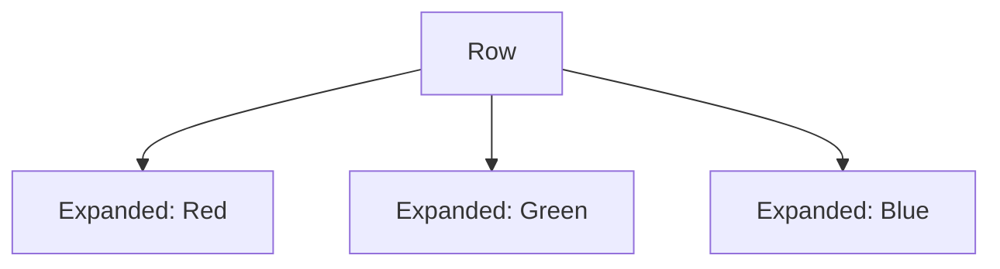
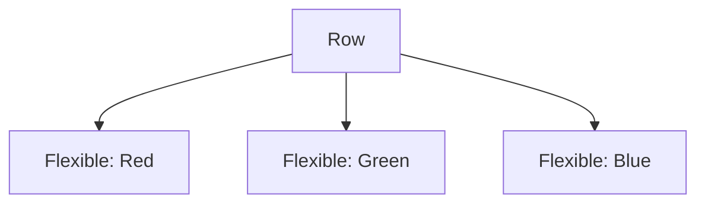

---

linkTitle: "3.3.2 Expanded and Flexible"
title: "Expanded and Flexible Widgets in Flutter: Mastering Layout Control"
description: "Explore the power of Expanded and Flexible widgets in Flutter to effectively manage space within Row and Column layouts. Learn through examples, diagrams, and practical exercises."
categories:
- Flutter Development
- Mobile App Development
- UI Design
tags:
- Flutter
- Expanded Widget
- Flexible Widget
- Layout Management
- UI Design
date: 2024-10-25
type: docs
nav_weight: 332000
canonical: "https://fluttermasterylibrary.com/1/3/3/2"
license: "© 2023 Tokenizer Inc. CC BY-NC-SA 4.0"
---

## 3.3.2 Expanded and Flexible

In the world of Flutter, creating responsive and adaptive user interfaces is a fundamental skill. As you embark on your journey to mastering Flutter, understanding how to effectively manage space within `Row` and `Column` layouts is crucial. This section delves into the `Expanded` and `Flexible` widgets, two powerful tools that allow you to control how child widgets fill the available space.

### Understanding the Need

When designing user interfaces, you often encounter situations where the child widgets within a `Row` or `Column` do not fit neatly within the available space. This can lead to layouts that either overflow or do not utilize the space efficiently. To address this, Flutter provides the `Expanded` and `Flexible` widgets, which offer a way to manage how child widgets occupy space within these layouts.

#### The Challenge of Space Management

Consider a scenario where you have a `Row` with multiple child widgets. Without any control over how these widgets fill the space, you might end up with a layout that looks cluttered or uneven. The `Expanded` and `Flexible` widgets come to the rescue by providing mechanisms to control the distribution of space among child widgets.

### The Expanded Widget

The `Expanded` widget is a powerful tool that instructs a child widget to fill the available space within a `Row` or `Column`. It effectively stretches the child to occupy as much space as possible, ensuring that the layout is balanced and visually appealing.

#### How Expanded Works

When you wrap a child widget with `Expanded`, it takes up the remaining space in the parent widget. If multiple children are wrapped with `Expanded`, they share the available space equally by default. However, you can customize this behavior using the `flex` property.

#### Code Example: Using Expanded

Let's explore a simple example to understand how `Expanded` works:

```dart
Row(
  children: [
    Expanded(
      child: Container(color: Colors.red),
    ),
    Expanded(
      child: Container(color: Colors.green),
    ),
    Expanded(
      child: Container(color: Colors.blue),
    ),
  ],
);
```

In this example, each `Container` is wrapped with an `Expanded` widget, ensuring that they occupy equal portions of the available space within the `Row`.

#### The Flex Property

The `flex` property allows you to control the proportion of space each child takes. By default, the `flex` value is set to 1, meaning each child takes an equal share of the space. However, you can adjust this value to change the distribution:

```dart
Row(
  children: [
    Expanded(
      flex: 2,
      child: Container(color: Colors.red),
    ),
    Expanded(
      flex: 1,
      child: Container(color: Colors.green),
    ),
    Expanded(
      flex: 1,
      child: Container(color: Colors.blue),
    ),
  ],
);
```

In this modified example, the red container takes twice the space compared to the green and blue containers.

### The Flexible Widget

While `Expanded` forces a child to fill the available space, `Flexible` provides a more nuanced approach. It allows a child to assert how much space it needs, but it can shrink if necessary to fit within the parent widget.

#### How Flexible Works

The `Flexible` widget is similar to `Expanded`, but with more flexibility. It allows the child to be smaller if it doesn't need all the available space. This is particularly useful when you want a child widget to wrap its content rather than stretching to fill the space.

#### Code Example: Using Flexible

Here's an example demonstrating the use of `Flexible`:

```dart
Row(
  children: [
    Flexible(
      child: Container(
        color: Colors.red,
        child: Text('Short text'),
      ),
    ),
    Flexible(
      child: Container(
        color: Colors.green,
        child: Text('A bit longer text that might wrap'),
      ),
    ),
    Flexible(
      child: Container(
        color: Colors.blue,
        child: Text('Even longer text that definitely wraps to the next line'),
      ),
    ),
  ],
);
```

In this example, each `Container` is wrapped with a `Flexible` widget, allowing the text to wrap within the available space.

### Comparing Expanded and Flexible

Understanding the differences between `Expanded` and `Flexible` is key to mastering layout management in Flutter.

- **Expanded**: Forces the child to fill the available space. Ideal for evenly distributing space among children.
- **Flexible**: Allows the child to be smaller if it doesn't need all the space. Useful for wrapping content or when children have varying space requirements.

#### Visualizing the Differences

To better understand the differences, let's visualize the layouts using Mermaid.js diagrams.



In the diagram above, each child widget is wrapped with `Expanded`, resulting in an equal distribution of space.



In this diagram, each child widget is wrapped with `Flexible`, allowing them to adjust their size based on content.

### Common Use Cases

Knowing when to use `Expanded` and `Flexible` is crucial for creating effective layouts.

#### When to Use Expanded

- **Evenly Distributing Space**: Use `Expanded` when you want child widgets to take equal portions of the available space.
- **Filling Remaining Space**: Ideal for scenarios where a widget should occupy all remaining space, such as a footer or header.

#### When to Use Flexible

- **Content Wrapping**: Use `Flexible` when you want child widgets to wrap their content rather than stretching.
- **Variable Space Requirements**: Suitable for layouts where children have varying space needs.

### Practice Exercises

To reinforce your understanding of `Expanded` and `Flexible`, try modifying the previous `Row` and `Column` examples to include these widgets. Experiment with different `flex` values to see how they affect the layout.

#### Exercise 1: Modify a Row

Take the following `Row` and modify it to use `Expanded` and `Flexible`:

```dart
Row(
  children: [
    Container(color: Colors.red, width: 50),
    Container(color: Colors.green, width: 100),
    Container(color: Colors.blue, width: 150),
  ],
);
```

- Wrap the red container with `Expanded`.
- Wrap the green container with `Flexible`.
- Adjust the `flex` values to see the impact on layout.

#### Exercise 2: Experiment with Columns

Create a `Column` with three text widgets. Use `Expanded` and `Flexible` to control their layout:

```dart
Column(
  children: [
    Text('First line of text'),
    Text('Second line of text'),
    Text('Third line of text'),
  ],
);
```

- Use `Expanded` for the first text widget.
- Use `Flexible` for the second and third text widgets.
- Experiment with different `flex` values.

### Conclusion

Mastering the `Expanded` and `Flexible` widgets is essential for creating responsive and adaptive layouts in Flutter. By understanding how these widgets control space within `Row` and `Column` layouts, you can design user interfaces that are both visually appealing and functionally effective.

### Troubleshooting Tips

- **Overflow Errors**: If you encounter overflow errors, check if the child widgets are properly wrapped with `Expanded` or `Flexible`.
- **Unexpected Layouts**: Experiment with different `flex` values to achieve the desired layout.
- **Debugging Layouts**: Use Flutter's `debugPaintSizeEnabled` property to visualize layout boundaries and identify issues.

### Additional Resources

- [Flutter Documentation on Expanded](https://api.flutter.dev/flutter/widgets/Expanded-class.html)
- [Flutter Documentation on Flexible](https://api.flutter.dev/flutter/widgets/Flexible-class.html)
- [Flutter Layout Cheat Sheet](https://medium.com/flutter-community/flutter-layout-cheat-sheet-5363348d037e)

By leveraging the power of `Expanded` and `Flexible`, you can create layouts that are both dynamic and responsive, ensuring a seamless user experience across different devices and screen sizes.

## Quiz Time!



### What is the primary purpose of the `Expanded` widget in Flutter?

- [x] To fill the available space within a `Row` or `Column`.
- [ ] To shrink the child widget if necessary.
- [ ] To wrap the content of the child widget.
- [ ] To align the child widget to the center.

> **Explanation:** The `Expanded` widget is used to fill the available space within a `Row` or `Column`, ensuring that the child widget occupies as much space as possible.

### How does the `flex` property affect the `Expanded` widget?

- [x] It controls the proportion of space each child takes.
- [ ] It determines the alignment of the child widget.
- [ ] It specifies the color of the child widget.
- [ ] It sets the padding of the child widget.

> **Explanation:** The `flex` property controls the proportion of space each child takes in a `Row` or `Column` when using `Expanded`.

### What is the key difference between `Expanded` and `Flexible`?

- [x] `Expanded` forces the child to fill the space, while `Flexible` allows the child to be smaller.
- [ ] `Flexible` forces the child to fill the space, while `Expanded` allows the child to be smaller.
- [ ] Both widgets have the same functionality.
- [ ] `Expanded` is used only in `Column`, while `Flexible` is used only in `Row`.

> **Explanation:** `Expanded` forces the child to fill the available space, while `Flexible` allows the child to be smaller if it doesn't need all the space.

### Which widget would you use to allow a child to wrap its content?

- [ ] Expanded
- [x] Flexible
- [ ] Container
- [ ] Align

> **Explanation:** The `Flexible` widget allows a child to wrap its content, making it suitable for scenarios where the child doesn't need to fill all the available space.

### In a `Row` with three `Expanded` children, what happens if one child has a `flex` value of 2 and the others have a `flex` value of 1?

- [x] The child with a `flex` value of 2 takes twice the space of the others.
- [ ] All children take equal space.
- [ ] The child with a `flex` value of 2 takes half the space of the others.
- [ ] The layout will throw an error.

> **Explanation:** The child with a `flex` value of 2 takes twice the space compared to the children with a `flex` value of 1.

### Which widget is more suitable for evenly distributing space among children?

- [x] Expanded
- [ ] Flexible
- [ ] Padding
- [ ] Align

> **Explanation:** The `Expanded` widget is more suitable for evenly distributing space among children in a `Row` or `Column`.

### What happens if you wrap a child with both `Expanded` and `Flexible`?

- [ ] The layout will throw an error.
- [x] The `Expanded` widget takes precedence.
- [ ] The `Flexible` widget takes precedence.
- [ ] Both widgets will be ignored.

> **Explanation:** If a child is wrapped with both `Expanded` and `Flexible`, the `Expanded` widget takes precedence, forcing the child to fill the available space.

### Which property would you adjust to change the space distribution in a `Row` with `Expanded` children?

- [x] flex
- [ ] padding
- [ ] margin
- [ ] alignment

> **Explanation:** The `flex` property is used to change the space distribution among `Expanded` children in a `Row` or `Column`.

### What is a common use case for the `Flexible` widget?

- [ ] Evenly distributing space
- [x] Allowing a child to wrap its content
- [ ] Aligning widgets to the center
- [ ] Setting the background color

> **Explanation:** A common use case for the `Flexible` widget is allowing a child to wrap its content, providing flexibility in layout.

### True or False: The `Expanded` widget can be used in both `Row` and `Column` layouts.

- [x] True
- [ ] False

> **Explanation:** The `Expanded` widget can be used in both `Row` and `Column` layouts to control how child widgets fill the available space.



By completing this section, you now have a solid understanding of how to use `Expanded` and `Flexible` widgets in Flutter to create responsive and adaptive layouts. Continue experimenting with these widgets to further enhance your Flutter development skills.
