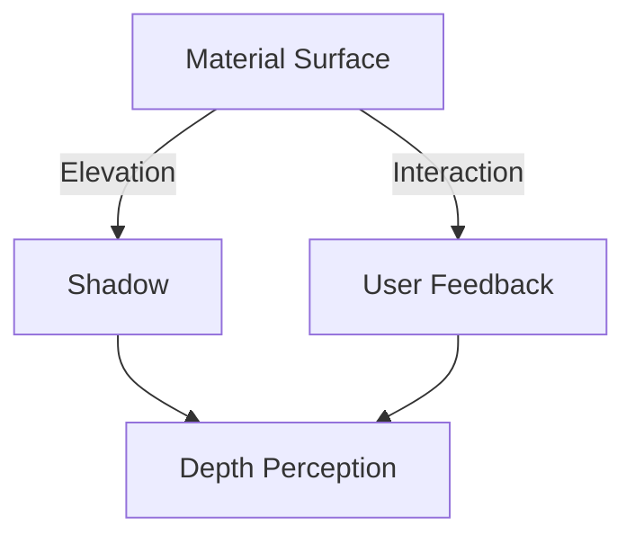
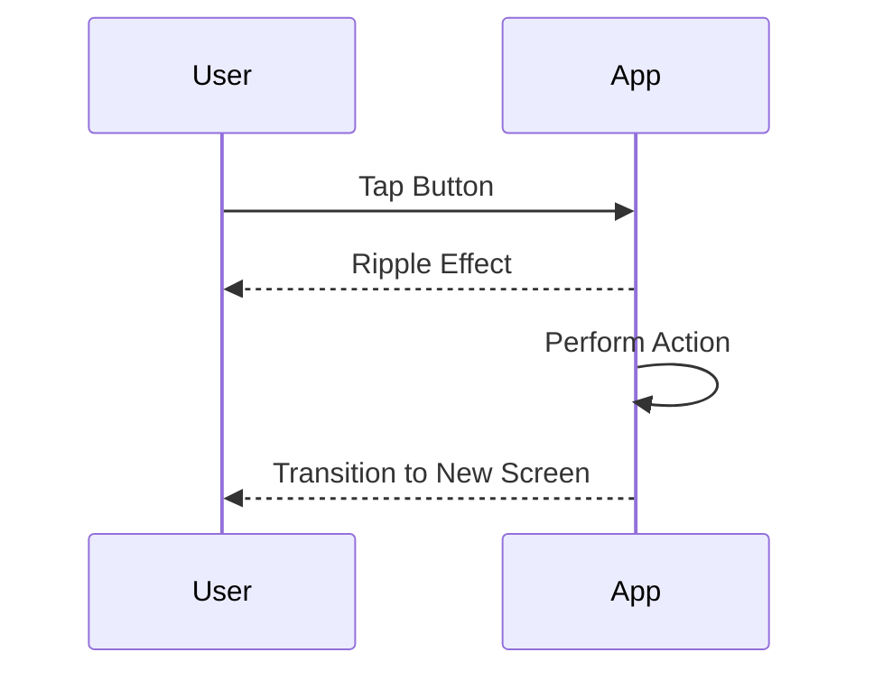

## 4.1.1 Understanding Material Design

### Introduction to Material Design

Material Design is a design language developed by Google that has transformed the way we think about digital interfaces. It provides a comprehensive set of guidelines aimed at creating visually appealing, intuitive, and user-friendly interfaces. By integrating principles of classic design with the innovation of technology and science, Material Design offers a cohesive and adaptable system that enhances user experiences across various platforms.

Flutter, Google's UI toolkit for building natively compiled applications, offers built-in support for Material Design. This integration simplifies the process of implementing Material Design principles in your applications, ensuring that your apps not only look great but also provide a consistent and intuitive user experience.

### Core Principles of Material Design

Material Design is built upon three core principles that guide the creation of dynamic and engaging user interfaces:

#### Material as Metaphor

The concept of "Material as Metaphor" is foundational to Material Design. It envisions UI elements as tangible surfaces that exist in a three-dimensional space. This metaphor is inspired by the physical world, where materials have properties such as texture, light, and movement.

- **3D Space and Surfaces:** Material surfaces are depicted as sheets of paper that can move along the z-axis, creating a sense of depth and hierarchy. This spatial model allows users to perceive the structure and organization of the interface intuitively.

- **Shadows and Elevation:** Shadows are used to convey elevation, helping users understand the relationship between different elements. Elevated surfaces cast shadows, indicating their position above other elements. This visual cue is crucial for guiding user interaction and focus.



#### Bold, Graphic, Intentional

Material Design emphasizes the use of bold colors, typography, and imagery to create interfaces that are not only visually striking but also purposeful.

- **Color:** A vibrant color palette is used to create contrast and draw attention to key elements. Colors are chosen to enhance readability and accessibility, ensuring that users can easily navigate the interface.

- **Typography:** Typography is used strategically to establish hierarchy and guide the user's eye. Clear, legible fonts are paired with varying sizes and weights to differentiate between headings, subheadings, and body text.

- **Imagery:** Imagery is used to convey meaning and context. High-quality images and icons are integrated seamlessly into the design, enhancing the overall aesthetic and functionality.

#### Motion Provides Meaning

Motion is a powerful tool in Material Design, used to provide feedback, guide users, and create a sense of continuity.

- **Animations and Transitions:** Animations are used to indicate changes in state, provide feedback, and guide users through complex interactions. Transitions between screens and elements are smooth and purposeful, helping users understand the flow of the application.

- **Feedback and Continuity:** Motion helps maintain continuity by providing visual feedback during interactions. For example, a button press might trigger a ripple effect, confirming the action and enhancing the user's sense of control.



### Importance in Flutter Development

Adhering to Material Design principles in Flutter development is crucial for creating applications that are not only aesthetically pleasing but also functional and intuitive. By using Material Design widgets, developers can ensure that their apps have a native look and feel on Android devices, providing users with a seamless experience.

- **Consistency:** Material Design provides a consistent framework for designing interfaces, ensuring that users can easily navigate and interact with your app.

- **Intuitive User Experience:** By following Material Design guidelines, developers can create interfaces that are intuitive and user-friendly, reducing the learning curve for new users.

- **Native Look and Feel:** Material Design widgets in Flutter ensure that your app looks and feels native on Android devices, enhancing user satisfaction and engagement.

### Resources

To further explore Material Design and its implementation in Flutter, consider the following resources:

- [Material Design Guidelines](https://material.io/design): The official Material Design guidelines provide comprehensive information on design principles, components, and patterns.

- [Flutter Material Design Widgets](https://flutter.dev/docs/development/ui/widgets/material): Flutter's documentation offers detailed information on Material Design widgets and how to use them effectively in your applications.

- [Material Design Components](https://material.io/components): Explore the various components available in Material Design and learn how to integrate them into your projects.

### Encourage Reader Engagement

To deepen your understanding of Material Design, observe how it is implemented in the apps you use daily. Pay attention to the use of color, typography, motion, and elevation. Consider how these elements contribute to the overall user experience.

As you develop your applications, keep the Material Design guidelines handy for reference. Experiment with different components and layouts, and don't hesitate to iterate on your designs to achieve the best possible user experience.

### Practical Code Examples

Let's explore some practical code examples to illustrate how Material Design principles can be implemented in Flutter applications.

#### Example 1: Implementing Elevation and Shadows

```dart
import 'package:flutter/material.dart';

void main() => runApp(MyApp());

class MyApp extends StatelessWidget {
  @override
  Widget build(BuildContext context) {
    return MaterialApp(
      home: Scaffold(
        appBar: AppBar(
          title: Text('Material Design Example'),
        ),
        body: Center(
          child: Card(
            elevation: 5, // Elevation to create shadow
            child: Padding(
              padding: const EdgeInsets.all(16.0),
              child: Text(
                'Elevated Card',
                style: TextStyle(fontSize: 24),
              ),
            ),
          ),
        ),
      ),
    );
  }
}
```

In this example, we use a `Card` widget with an elevation property to create a shadow effect, giving the card a sense of depth.

#### Example 2: Using Bold Colors and Typography

```dart
import 'package:flutter/material.dart';

void main() => runApp(MyApp());

class MyApp extends StatelessWidget {
  @override
  Widget build(BuildContext context) {
    return MaterialApp(
      theme: ThemeData(
        primarySwatch: Colors.blue,
        textTheme: TextTheme(
          headline1: TextStyle(fontSize: 32.0, fontWeight: FontWeight.bold, color: Colors.blue),
          bodyText1: TextStyle(fontSize: 16.0, color: Colors.black),
        ),
      ),
      home: Scaffold(
        appBar: AppBar(
          title: Text('Material Design Example'),
        ),
        body: Center(
          child: Column(
            mainAxisAlignment: MainAxisAlignment.center,
            children: <Widget>[
              Text('Bold Headline', style: Theme.of(context).textTheme.headline1),
              Text('Body Text', style: Theme.of(context).textTheme.bodyText1),
            ],
          ),
        ),
      ),
    );
  }
}
```

This example demonstrates the use of bold colors and typography to create a visually striking interface.

#### Example 3: Implementing Motion with Animations

```dart
import 'package:flutter/material.dart';

void main() => runApp(MyApp());

class MyApp extends StatelessWidget {
  @override
  Widget build(BuildContext context) {
    return MaterialApp(
      home: Scaffold(
        appBar: AppBar(
          title: Text('Material Design Example'),
        ),
        body: Center(
          child: AnimatedButton(),
        ),
      ),
    );
  }
}

class AnimatedButton extends StatefulWidget {
  @override
  _AnimatedButtonState createState() => _AnimatedButtonState();
}

class _AnimatedButtonState extends State<AnimatedButton> with SingleTickerProviderStateMixin {
  AnimationController _controller;
  Animation<double> _animation;

  @override
  void initState() {
    super.initState();
    _controller = AnimationController(
      duration: const Duration(seconds: 1),
      vsync: this,
    )..repeat(reverse: true);
    _animation = CurvedAnimation(parent: _controller, curve: Curves.easeInOut);
  }

  @override
  void dispose() {
    _controller.dispose();
    super.dispose();
  }

  @override
  Widget build(BuildContext context) {
    return ScaleTransition(
      scale: _animation,
      child: ElevatedButton(
        onPressed: () {},
        child: Text('Press Me'),
      ),
    );
  }
}
```

In this example, we use an `AnimationController` and `ScaleTransition` to create a simple animation that scales a button, adding a dynamic element to the interface.

### Conclusion

Understanding and implementing Material Design principles is essential for creating modern, user-friendly applications. By leveraging Flutter's built-in support for Material Design, developers can create apps that are not only visually appealing but also intuitive and consistent across platforms.

As you continue your journey in app development, keep exploring and experimenting with Material Design to enhance your skills and create exceptional user experiences.

## Quiz Time!



### What is Material Design?

- [x] A design language developed by Google
- [ ] A programming language for Android development
- [ ] A tool for creating animations
- [ ] A type of database management system

> **Explanation:** Material Design is a design language developed by Google to create visually appealing and user-friendly interfaces.

### Which principle of Material Design involves using shadows and elevations?

- [x] Material as Metaphor
- [ ] Bold, Graphic, Intentional
- [ ] Motion Provides Meaning
- [ ] User-Centric Design

> **Explanation:** The "Material as Metaphor" principle involves using shadows and elevations to give depth to UI components.

### How does Material Design use motion?

- [x] To provide feedback and continuity
- [ ] To increase app loading times
- [ ] To reduce the number of UI elements
- [ ] To create static interfaces

> **Explanation:** Motion is used in Material Design to provide feedback, guide users, and create a sense of continuity.

### What is the benefit of using Material Design widgets in Flutter?

- [x] Ensures apps have a native look and feel on Android devices
- [ ] Increases the size of the app
- [ ] Limits the app to only Android devices
- [ ] Reduces the need for testing

> **Explanation:** Material Design widgets ensure that apps have a native look and feel on Android devices, enhancing user satisfaction.

### What does the principle "Bold, Graphic, Intentional" emphasize?

- [x] Use of bold colors, typography, and imagery
- [ ] Use of minimalistic design
- [ ] Use of only grayscale colors
- [ ] Use of complex animations

> **Explanation:** This principle emphasizes the use of bold colors, typography, and imagery to guide the user's attention.

### How can developers create a sense of depth in Material Design?

- [x] By using shadows and elevations
- [ ] By reducing the number of colors
- [ ] By using only flat design elements
- [ ] By minimizing text usage

> **Explanation:** Shadows and elevations are used to create a sense of depth in Material Design.

### What role does typography play in Material Design?

- [x] Establishes hierarchy and guides the user's eye
- [ ] Reduces the need for images
- [ ] Increases the complexity of the design
- [ ] Limits the use of colors

> **Explanation:** Typography is used to establish hierarchy and guide the user's eye through the interface.

### Why is consistency important in Material Design?

- [x] It ensures users can easily navigate and interact with the app
- [ ] It reduces the number of features in the app
- [ ] It limits the app to a single platform
- [ ] It increases the app's loading time

> **Explanation:** Consistency ensures that users can easily navigate and interact with the app, providing a better user experience.

### What is the purpose of using animations in Material Design?

- [x] To indicate changes in state and provide feedback
- [ ] To increase the app's complexity
- [ ] To reduce the number of UI elements
- [ ] To create static interfaces

> **Explanation:** Animations are used to indicate changes in state, provide feedback, and guide users through interactions.

### True or False: Material Design is only applicable to Android applications.

- [ ] True
- [x] False

> **Explanation:** Material Design is a design language that can be applied across various platforms, not just Android applications.


