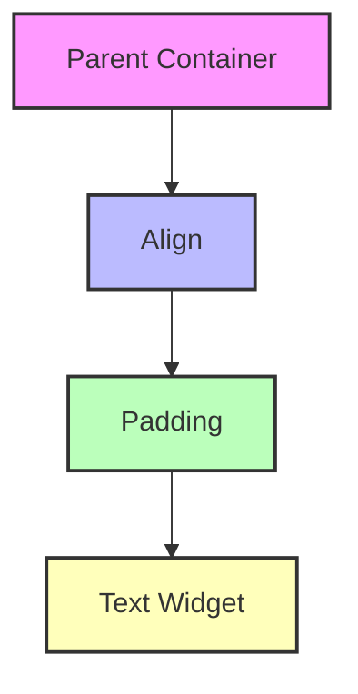

## 4.3.1 Mastering Alignment and Padding in Flutter

In the world of Flutter app development, creating visually appealing and user-friendly interfaces is paramount. Two fundamental concepts that play a crucial role in achieving this are **alignment** and **padding**. Understanding how to effectively use these concepts can significantly enhance the layout and design of your Flutter applications. In this section, we will delve deep into alignment and padding, exploring their usage, differences, and best practices.

### Understanding Alignment

Alignment in Flutter refers to the positioning of a widget within its parent. The `Align` widget is a powerful tool that allows developers to specify where a child widget should be placed within its parent. This is particularly useful when you want to position a widget in a specific area of its parent container.

#### The `Align` Widget

The `Align` widget is used to align a child widget within its parent. It takes an `alignment` parameter, which is an instance of the `Alignment` class. The `Alignment` class provides several predefined constants that make it easy to position widgets.

#### The `Alignment` Class

The `Alignment` class in Flutter provides a coordinate system for positioning widgets. The origin (0, 0) is at the center of the container, with values ranging from -1 to 1 in both x and y directions. Here are some common alignment values:

- `Alignment.topLeft`: Aligns the widget to the top-left corner.
- `Alignment.center`: Centers the widget within the parent.
- `Alignment.bottomRight`: Aligns the widget to the bottom-right corner.

#### Example of Using `Align`

Let's look at a simple example of using the `Align` widget to position a `Text` widget at the bottom-right corner of its parent:

```dart
Align(
  alignment: Alignment.bottomRight,
  child: Text('Aligned Text'),
)
```

In this example, the `Text` widget is aligned to the bottom-right corner of its parent container. The `Align` widget provides a flexible way to position widgets precisely within their parent.

### Using Padding

Padding is another essential concept in Flutter that involves adding empty space around a widget. The `Padding` widget is used to create space between a widget and its surrounding elements. This is particularly useful for creating visually appealing layouts and ensuring that widgets do not overlap or touch each other.

#### The `Padding` Widget

The `Padding` widget takes a `padding` parameter, which is an instance of the `EdgeInsets` class. The `EdgeInsets` class provides several options for specifying padding:

- `EdgeInsets.all(double value)`: Applies the same padding value to all four sides.
- `EdgeInsets.symmetric({double vertical, double horizontal})`: Applies symmetric padding vertically and horizontally.
- `EdgeInsets.only({double left, double top, double right, double bottom})`: Applies padding to specific sides.

#### Example of Using `Padding`

Here's an example of using the `Padding` widget to add space around a `Text` widget:

```dart
Padding(
  padding: EdgeInsets.all(16.0),
  child: Text('Padded Text'),
)
```

In this example, the `Text` widget has 16 pixels of padding on all sides, creating a buffer between the text and its surrounding elements.

### Margin vs. Padding

While padding adds space inside a widget, margin adds space outside a widget. In Flutter, margin can be applied using the `Container` widget's `margin` property. Understanding the difference between margin and padding is crucial for creating clean and organized layouts.

#### When to Use Margin and Padding

- **Padding**: Use padding when you want to create space inside a widget, such as adding space between the content and the widget's border.
- **Margin**: Use margin when you want to create space outside a widget, such as separating the widget from other widgets or the edge of the screen.

### Combining Alignment and Padding

In many cases, you'll want to use both alignment and padding to position widgets precisely. By combining these two concepts, you can create complex and visually appealing layouts.

#### Example of Combining Alignment and Padding

Let's create a layout where a `Text` widget is aligned to the bottom-right corner with padding applied:

```dart
Align(
  alignment: Alignment.bottomRight,
  child: Padding(
    padding: EdgeInsets.all(16.0),
    child: Text('Aligned and Padded Text'),
  ),
)
```

In this example, the `Text` widget is aligned to the bottom-right corner with 16 pixels of padding on all sides. This combination ensures that the text is positioned correctly and has adequate space around it.

### Best Practices

When working with alignment and padding, it's important to follow best practices to ensure clean and responsive layouts:

- **Consistent Use**: Use consistent padding and alignment values throughout your application to maintain a cohesive design.
- **Use `SafeArea`**: The `SafeArea` widget ensures that your content is not obscured by system UI elements, such as the status bar or notch. It's a good practice to wrap your main content with `SafeArea` to avoid layout issues.
- **Experiment**: Don't be afraid to experiment with different alignment and padding values to achieve the desired layout.

### Practice Exercises

To reinforce your understanding of alignment and padding, try the following exercises:

1. **Create a Layout with Multiple Widgets**: Design a layout with multiple widgets aligned differently. Use the `Align` widget to position each widget in a unique location within the parent container.

2. **Experiment with Padding**: Adjust the padding values of different widgets to see how it affects the overall layout. Try using different `EdgeInsets` options to create varied spacing.

### Visualizing Alignment and Padding

To better understand how alignment and padding work together, let's visualize these concepts using a diagram. The following diagram illustrates a widget tree with alignment and padding applied:



In this diagram, the `Text Widget` is wrapped with `Padding`, which is then wrapped with `Align`. This structure allows for precise positioning and spacing within the `Parent Container`.

### Troubleshooting Tips

When working with alignment and padding, you may encounter some common issues:

- **Overlapping Widgets**: If widgets overlap, check your alignment and padding values to ensure they are set correctly.
- **Content Clipping**: If content is clipped, consider adjusting the padding or using a `SafeArea` to prevent system UI elements from obscuring your content.
- **Unexpected Layout Changes**: If your layout changes unexpectedly, review your widget tree to ensure that alignment and padding are applied in the correct order.

By understanding and effectively using alignment and padding, you can create clean, organized, and visually appealing layouts in your Flutter applications. These concepts are fundamental to mastering Flutter UI design and will serve as a solid foundation for building more complex interfaces.

## Quiz Time!



### What is the purpose of the `Align` widget in Flutter?

- [x] To position a child widget within its parent
- [ ] To add space around a widget
- [ ] To change the color of a widget
- [ ] To animate a widget

> **Explanation:** The `Align` widget is used to position a child widget within its parent container.

### Which class provides predefined constants for alignment in Flutter?

- [ ] Padding
- [x] Alignment
- [ ] EdgeInsets
- [ ] Container

> **Explanation:** The `Alignment` class provides predefined constants for positioning widgets within their parent.

### How do you apply padding to all sides of a widget in Flutter?

- [ ] `EdgeInsets.symmetric()`
- [x] `EdgeInsets.all()`
- [ ] `EdgeInsets.only()`
- [ ] `EdgeInsets.none()`

> **Explanation:** `EdgeInsets.all()` applies the same padding value to all four sides of a widget.

### What is the difference between margin and padding?

- [x] Margin adds space outside a widget; padding adds space inside a widget.
- [ ] Padding adds space outside a widget; margin adds space inside a widget.
- [ ] Both margin and padding add space inside a widget.
- [ ] Both margin and padding add space outside a widget.

> **Explanation:** Margin adds space outside a widget, while padding adds space inside a widget.

### Which widget ensures that content is not obscured by system UI elements?

- [ ] Align
- [ ] Padding
- [x] SafeArea
- [ ] Container

> **Explanation:** The `SafeArea` widget ensures that content is not obscured by system UI elements like the status bar or notch.

### How can you apply padding only to the left and right sides of a widget?

- [ ] `EdgeInsets.all()`
- [ ] `EdgeInsets.only()`
- [x] `EdgeInsets.symmetric(horizontal: value)`
- [ ] `EdgeInsets.symmetric(vertical: value)`

> **Explanation:** `EdgeInsets.symmetric(horizontal: value)` applies padding only to the left and right sides of a widget.

### Which alignment value centers a widget within its parent?

- [ ] `Alignment.topLeft`
- [x] `Alignment.center`
- [ ] `Alignment.bottomRight`
- [ ] `Alignment.topRight`

> **Explanation:** `Alignment.center` centers a widget within its parent container.

### What is the default alignment of a widget in Flutter if not specified?

- [ ] `Alignment.topLeft`
- [x] `Alignment.center`
- [ ] `Alignment.bottomRight`
- [ ] `Alignment.topRight`

> **Explanation:** By default, widgets are centered within their parent container if no specific alignment is provided.

### Which widget property is used to add margin to a widget?

- [ ] `padding`
- [ ] `alignment`
- [x] `margin`
- [ ] `border`

> **Explanation:** The `margin` property is used to add space outside a widget, typically applied using the `Container` widget.

### True or False: Padding and margin can be used interchangeably in Flutter.

- [ ] True
- [x] False

> **Explanation:** Padding and margin serve different purposes and cannot be used interchangeably. Padding adds space inside a widget, while margin adds space outside a widget.



By mastering alignment and padding, you can create sophisticated and responsive layouts in your Flutter applications. These concepts are essential for any Flutter developer aiming to build high-quality mobile apps.
