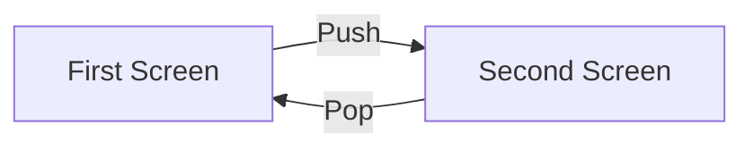

## 5.1.2 Navigator and Routes

Navigating between different screens is a fundamental aspect of mobile app development. In Flutter, this is achieved through the use of the `Navigator` class and routes. Understanding how to effectively use these tools is crucial for creating intuitive and user-friendly applications. This section will guide you through the process of managing navigation in Flutter, from basic operations to more advanced techniques.

### Using the Navigator Class

The `Navigator` class in Flutter is a powerful widget that manages a stack of `Route` objects. It allows you to push new routes onto the stack and pop them off, enabling seamless transitions between different screens in your app.

#### Navigator.push

The `Navigator.push` method is used to navigate to a new screen by pushing a route onto the navigation stack. This method is essential for transitioning from one screen to another, such as moving from a home screen to a details screen.

**Code Example:**

```dart
Navigator.push(
  context,
  MaterialPageRoute(builder: (context) => SecondScreen()),
);
```

**Breaking Down the Code:**

- **`context`:** This is the `BuildContext` of the current widget. It provides the location in the widget tree where this widget is being built.
- **`MaterialPageRoute`:** This is a modal route that replaces the entire screen with a platform-specific animation. It is one of the most commonly used routes in Flutter because it provides a consistent look and feel across different platforms.
  - **`builder`:** This property is a function that returns the widget for the route's content. In this example, it returns the `SecondScreen` widget.

#### Navigator.pop

The `Navigator.pop` method is used to return to the previous screen by popping the current route off the stack. This is typically used when you want to close a screen after an action is completed, such as after saving data or confirming an action.

**Code Example:**

```dart
Navigator.pop(context);
```

**When and Why to Use `pop`:**

- **Closing a Screen:** After completing an action, such as submitting a form or confirming a choice, you can use `pop` to return to the previous screen.
- **User Navigation:** Allow users to navigate back to the previous screen, maintaining a natural flow within the app.

### Defining Routes

Routes in Flutter define the transition between different screens. They can be simple or complex, depending on the needs of your application.

#### MaterialPageRoute

`MaterialPageRoute` is a commonly used route that provides platform-specific transitions. It is ideal for most applications because it automatically handles the animations and transitions that users expect.

**Properties of MaterialPageRoute:**

- **`builder`:** A function that returns the widget for the route's content.
- **`settings`:** Optional settings for the route, such as the route name. This can be useful for analytics or debugging.

#### Route Objects

While `MaterialPageRoute` and `CupertinoPageRoute` are sufficient for most applications, Flutter allows you to create custom route classes if needed. This can be useful for implementing custom animations or transitions that are not supported by the default routes.

### Example Application

To solidify your understanding of navigation in Flutter, let's walk through the creation of a simple app with two screens. The first screen will contain a button that navigates to the second screen, and the second screen will have a button to navigate back to the first screen.

#### First Screen

The first screen will have a button that, when pressed, navigates to the second screen.

**Code Example:**

```dart
import 'package:flutter/material.dart';

class FirstScreen extends StatelessWidget {
  @override
  Widget build(BuildContext context) {
    return Scaffold(
      appBar: AppBar(
        title: Text('First Screen'),
      ),
      body: Center(
        child: ElevatedButton(
          onPressed: () {
            Navigator.push(
              context,
              MaterialPageRoute(builder: (context) => SecondScreen()),
            );
          },
          child: Text('Go to Second Screen'),
        ),
      ),
    );
  }
}
```

#### Second Screen

The second screen will have a button that, when pressed, navigates back to the first screen.

**Code Example:**

```dart
import 'package:flutter/material.dart';

class SecondScreen extends StatelessWidget {
  @override
  Widget build(BuildContext context) {
    return Scaffold(
      appBar: AppBar(
        title: Text('Second Screen'),
      ),
      body: Center(
        child: ElevatedButton(
          onPressed: () {
            Navigator.pop(context);
          },
          child: Text('Back to First Screen'),
        ),
      ),
    );
  }
}
```

### Visual Aids

To help visualize the navigation flow between the two screens, here is a Mermaid.js flowchart:



### Best Practices

When implementing navigation in your Flutter app, consider the following best practices:

- **Keep Navigation Logic Simple:** Avoid overly complex navigation logic. Use descriptive names for routes and maintain a clear structure.
- **Use Descriptive Route Names:** As your app grows in complexity, using descriptive names for routes can help maintain clarity and organization.
- **Consistent User Experience:** Ensure that navigation transitions are consistent across different parts of your app to provide a seamless user experience.

### Troubleshooting Tips

- **Context Issues:** Ensure that the `context` used in `Navigator.push` and `Navigator.pop` is valid and corresponds to the current widget.
- **Route Management:** Keep track of your routes and ensure that they are correctly defined and managed to avoid navigation errors.

By mastering the use of `Navigator` and routes in Flutter, you can create dynamic and engaging applications that provide a smooth and intuitive user experience. Practice these concepts by experimenting with different navigation flows and exploring more advanced routing techniques as you become more comfortable with Flutter development.

## Quiz Time!



### What is the primary purpose of the Navigator class in Flutter?

- [x] To manage a stack of Route objects for screen navigation
- [ ] To style widgets
- [ ] To handle network requests
- [ ] To manage state

> **Explanation:** The Navigator class manages a stack of Route objects, allowing for screen navigation in Flutter apps.

### Which method is used to navigate to a new screen in Flutter?

- [x] Navigator.push
- [ ] Navigator.pop
- [ ] Navigator.replace
- [ ] Navigator.remove

> **Explanation:** Navigator.push is used to navigate to a new screen by pushing a route onto the navigation stack.

### What does the MaterialPageRoute class provide?

- [x] Platform-specific transitions for routes
- [ ] Custom animations
- [ ] Network connectivity
- [ ] State management

> **Explanation:** MaterialPageRoute provides platform-specific transitions, making it ideal for most applications.

### How do you return to the previous screen in Flutter?

- [x] Navigator.pop(context)
- [ ] Navigator.push(context)
- [ ] Navigator.replace(context)
- [ ] Navigator.remove(context)

> **Explanation:** Navigator.pop(context) is used to return to the previous screen by popping the current route off the stack.

### What is the role of the builder property in MaterialPageRoute?

- [x] To define the widget for the route's content
- [ ] To manage state
- [ ] To handle network requests
- [ ] To style the widget

> **Explanation:** The builder property is a function that returns the widget for the route's content.

### What is a common use case for Navigator.pop?

- [x] Closing a screen after an action is completed
- [ ] Opening a new screen
- [ ] Fetching data from the internet
- [ ] Styling a widget

> **Explanation:** Navigator.pop is commonly used to close a screen after an action is completed, such as after saving data.

### Which of the following is a best practice for managing routes in a complex app?

- [x] Use descriptive names for routes
- [ ] Avoid using routes
- [ ] Use random names for routes
- [ ] Hardcode all routes

> **Explanation:** Using descriptive names for routes helps maintain clarity and organization in a complex app.

### What is the role of the context parameter in Navigator methods?

- [x] It provides the location in the widget tree where the widget is being built
- [ ] It styles the widget
- [ ] It manages state
- [ ] It handles network requests

> **Explanation:** The context parameter provides the location in the widget tree where the widget is being built, which is essential for navigation.

### What does the settings property in MaterialPageRoute allow you to do?

- [x] Define optional settings like route name
- [ ] Manage state
- [ ] Handle network requests
- [ ] Style the widget

> **Explanation:** The settings property allows you to define optional settings like route name, useful for analytics or debugging.

### True or False: Custom Route classes are necessary for all Flutter applications.

- [ ] True
- [x] False

> **Explanation:** Custom Route classes are not necessary for all applications; MaterialPageRoute or CupertinoPageRoute suffice for most cases.


