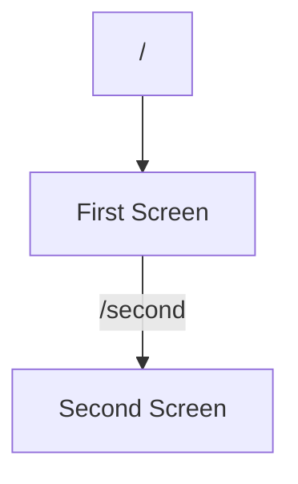

## 5.1.3 Named Routes

In the realm of Flutter app development, managing navigation efficiently is crucial, especially as your application grows in complexity. Named routes offer a structured way to handle navigation, making your code more organized and maintainable. This section delves into the intricacies of named routes, from setting them up to leveraging their full potential in your Flutter applications.

### Purpose of Named Routes

Named routes allow developers to define routes using string identifiers, providing a clear and concise way to manage navigation paths within an app. This approach is particularly beneficial in larger applications where managing navigation can become cumbersome. By using named routes, you can:

- Simplify navigation management by using descriptive string identifiers.
- Enhance code readability and maintainability.
- Centralize route definitions, making it easier to manage and update navigation paths.

### Setting Up Named Routes

Setting up named routes in Flutter involves defining them within the `MaterialApp` widget. This process is straightforward and involves specifying a map of route names to their corresponding widget builders.

#### Defining Routes in MaterialApp

To define named routes, you use the `routes` property of the `MaterialApp` widget. Here's a basic example:

```dart
MaterialApp(
  initialRoute: '/',
  routes: {
    '/': (context) => FirstScreen(),
    '/second': (context) => SecondScreen(),
  },
);
```

- **`initialRoute`:** This property sets the default route that the app displays when it starts. In this example, the initial route is set to `'/'`, which corresponds to the `FirstScreen` widget.
- **`routes`:** This is a map where the keys are route names (strings), and the values are functions that return the widget to display for each route.

### Navigating with Named Routes

Once you've set up your routes, navigating between them is simple and intuitive.

#### Navigator.pushNamed

To navigate to a new screen using a named route, you use the `Navigator.pushNamed` method. Here's how you can navigate to the `SecondScreen`:

```dart
Navigator.pushNamed(context, '/second');
```

This method pushes the route onto the navigation stack, displaying the corresponding screen.

#### Navigator.pop

To return to the previous screen, you use the `Navigator.pop` method, which remains unchanged when using named routes:

```dart
Navigator.pop(context);
```

This method pops the current route off the stack, returning to the previous screen.

### Passing Arguments with Named Routes

Named routes also support passing arguments, allowing you to send data between screens. This is achieved using the `arguments` parameter in the `Navigator.pushNamed` method.

#### Passing Arguments

Here's an example of how to pass arguments to a named route:

```dart
Navigator.pushNamed(
  context,
  '/second',
  arguments: 'Hello from First Screen',
);
```

In this example, a string message is passed as an argument to the `SecondScreen`.

#### Retrieving Arguments

To retrieve the arguments in the destination screen, you use the `ModalRoute.of(context)!.settings.arguments` property. Here's how you can access the passed arguments:

```dart
@override
Widget build(BuildContext context) {
  final args = ModalRoute.of(context)!.settings.arguments as String;
  // Use args
}
```

This code snippet retrieves the arguments and casts them to the expected type.

### Benefits of Named Routes

Named routes offer several advantages that make them a preferred choice for managing navigation in Flutter apps:

- **Improved Code Readability:** By using descriptive string identifiers, named routes make your code easier to read and understand.
- **Centralized Route Management:** Defining all routes in one place simplifies navigation management, especially in apps with many screens.
- **Reduced Boilerplate Code:** Named routes eliminate the need for repetitive code, streamlining the navigation process.

### Visual Aids

To better understand how named routes map to screens, consider the following **Mermaid.js diagram**:



This diagram illustrates the flow of navigation from the initial route to the second screen using named routes.

### Best Practices

To maximize the benefits of named routes, consider the following best practices:

- **Define Routes in One Place:** Centralize all route definitions in the `MaterialApp` widget to improve maintainability.
- **Use Constants for Route Names:** Define route names as constants to avoid typos and ensure consistency across your codebase.

```dart
const String homeRoute = '/';
const String secondRoute = '/second';
```

### Hands-On Activity: Implementing Named Routes

To reinforce your understanding of named routes, let's create a simple Flutter app that implements named routes for navigation.

#### Step 1: Create a New Flutter Project

Start by creating a new Flutter project using the following command:

```bash
flutter create named_routes_example
```

Navigate to the project directory:

```bash
cd named_routes_example
```

#### Step 2: Define Screens

Create two simple screens: `FirstScreen` and `SecondScreen`.

**FirstScreen.dart:**

```dart
import 'package:flutter/material.dart';

class FirstScreen extends StatelessWidget {
  @override
  Widget build(BuildContext context) {
    return Scaffold(
      appBar: AppBar(title: Text('First Screen')),
      body: Center(
        child: ElevatedButton(
          onPressed: () {
            Navigator.pushNamed(context, '/second', arguments: 'Hello from First Screen');
          },
          child: Text('Go to Second Screen'),
        ),
      ),
    );
  }
}
```

**SecondScreen.dart:**

```dart
import 'package:flutter/material.dart';

class SecondScreen extends StatelessWidget {
  @override
  Widget build(BuildContext context) {
    final args = ModalRoute.of(context)!.settings.arguments as String;

    return Scaffold(
      appBar: AppBar(title: Text('Second Screen')),
      body: Center(
        child: Text(args),
      ),
    );
  }
}
```

#### Step 3: Set Up Named Routes in `main.dart`

In your `main.dart` file, define the named routes and set the initial route.

```dart
import 'package:flutter/material.dart';
import 'first_screen.dart';
import 'second_screen.dart';

void main() {
  runApp(MyApp());
}

class MyApp extends StatelessWidget {
  @override
  Widget build(BuildContext context) {
    return MaterialApp(
      initialRoute: '/',
      routes: {
        '/': (context) => FirstScreen(),
        '/second': (context) => SecondScreen(),
      },
    );
  }
}
```

#### Step 4: Run the App

Run your app using the following command:

```bash
flutter run
```

Navigate between the screens using the button on the `FirstScreen`. Observe how the argument is passed and displayed on the `SecondScreen`.

### Troubleshooting Tips

- **Route Not Found Error:** Ensure that the route name is correctly defined in the `routes` map and that you are using the correct string identifier when navigating.
- **Argument Type Mismatch:** When retrieving arguments, ensure you cast them to the correct type to avoid runtime errors.

### Conclusion

Named routes in Flutter provide a robust mechanism for managing navigation in your applications. By defining routes with string identifiers, you can simplify navigation, improve code readability, and maintain a centralized route management system. As you continue your Flutter journey, mastering named routes will be an invaluable skill in building scalable and maintainable applications.

## Quiz Time!



### What is the primary purpose of named routes in Flutter?

- [x] To define routes using string identifiers for easier navigation management.
- [ ] To create complex animations between screens.
- [ ] To handle state management across widgets.
- [ ] To improve the performance of Flutter applications.

> **Explanation:** Named routes allow developers to define routes with string identifiers, simplifying navigation management in larger apps.

### How do you set the initial route in a Flutter app using named routes?

- [x] By using the `initialRoute` property in `MaterialApp`.
- [ ] By calling `Navigator.pushNamed()` with the initial route.
- [ ] By setting a default route in the `routes` map.
- [ ] By using the `home` property in `MaterialApp`.

> **Explanation:** The `initialRoute` property in `MaterialApp` sets the default route when the app starts.

### Which method is used to navigate to a new screen using a named route?

- [x] `Navigator.pushNamed`
- [ ] `Navigator.push`
- [ ] `Navigator.pop`
- [ ] `Navigator.replace`

> **Explanation:** `Navigator.pushNamed` is used to navigate to a new screen using a named route.

### How can you pass arguments to a named route?

- [x] By using the `arguments` parameter in `Navigator.pushNamed`.
- [ ] By including them in the route name string.
- [ ] By setting a global variable.
- [ ] By using the `context` parameter.

> **Explanation:** Arguments can be passed using the `arguments` parameter in `Navigator.pushNamed`.

### How do you retrieve arguments passed to a named route in the destination screen?

- [x] Using `ModalRoute.of(context)!.settings.arguments`.
- [ ] By accessing a global variable.
- [ ] By using a callback function.
- [ ] By reading the route name string.

> **Explanation:** Arguments are retrieved using `ModalRoute.of(context)!.settings.arguments` in the destination screen.

### What is a recommended best practice for defining route names?

- [x] Use constants for route names to avoid typos.
- [ ] Use random strings for route names.
- [ ] Define routes in multiple places for flexibility.
- [ ] Use numerical identifiers for route names.

> **Explanation:** Using constants for route names helps avoid typos and ensures consistency.

### What happens when you call `Navigator.pop(context)`?

- [x] It returns to the previous screen by popping the current route off the stack.
- [ ] It navigates to the initial route.
- [ ] It closes the app.
- [ ] It refreshes the current screen.

> **Explanation:** `Navigator.pop(context)` pops the current route off the stack, returning to the previous screen.

### Which property in `MaterialApp` is used to define named routes?

- [x] `routes`
- [ ] `home`
- [ ] `navigatorKey`
- [ ] `theme`

> **Explanation:** The `routes` property in `MaterialApp` is used to define named routes.

### How does using named routes improve code readability?

- [x] By using descriptive string identifiers for routes.
- [ ] By reducing the number of widgets.
- [ ] By eliminating the need for comments.
- [ ] By using fewer lines of code.

> **Explanation:** Named routes use descriptive string identifiers, making the code easier to read and understand.

### True or False: Named routes eliminate the need for the `Navigator` widget.

- [ ] True
- [x] False

> **Explanation:** Named routes do not eliminate the need for the `Navigator` widget; they simplify navigation management.


