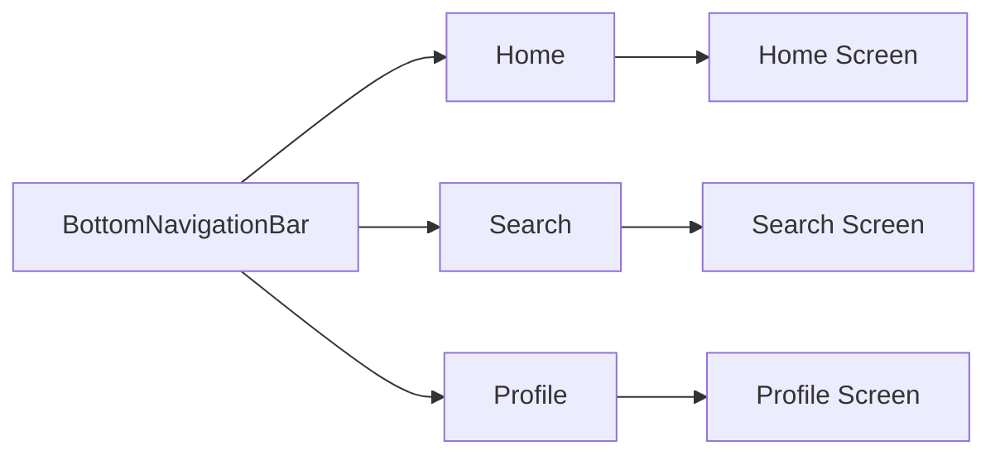

## 5.2.1 BottomNavigationBar

In the world of mobile app development, providing a seamless and intuitive navigation experience is crucial for user engagement and retention. One of the most effective ways to achieve this in Flutter is through the `BottomNavigationBar` widget. This widget is a staple in many mobile applications, offering users quick access to top-level views within the app. In this section, we will delve into the intricacies of the `BottomNavigationBar`, exploring its implementation, customization options, and best practices to ensure you can leverage its full potential in your Flutter projects.

### Understanding Bottom Navigation

The `BottomNavigationBar` is a widget that provides a convenient way for users to navigate between different sections of an app. It is typically used in applications with three to five main sections, such as a home screen, search, notifications, and user profile. This navigation pattern is prevalent in many popular apps, including social media platforms, e-commerce sites, and productivity tools, due to its simplicity and ease of use.

The primary purpose of a `BottomNavigationBar` is to allow users to switch between different content views quickly. Each item in the bar represents a distinct section of the app, and tapping on an item transitions the user to the corresponding view. This navigation pattern helps maintain a clean and organized user interface, making it easier for users to find and access the features they need.

### Implementing BottomNavigationBar

#### Basic Structure

To implement a `BottomNavigationBar`, you typically start by adding it to a `Scaffold` widget. The `Scaffold` provides a structure for your app's layout, and the `BottomNavigationBar` is placed at the bottom of the screen. Here's a basic example of how to set up a `BottomNavigationBar` in a Flutter app:

```dart
import 'package:flutter/material.dart';

void main() => runApp(MyApp());

class MyApp extends StatelessWidget {
  @override
  Widget build(BuildContext context) {
    return MaterialApp(
      home: MyHomePage(),
    );
  }
}

class MyHomePage extends StatefulWidget {
  @override
  _MyHomePageState createState() => _MyHomePageState();
}

class _MyHomePageState extends State<MyHomePage> {
  int _selectedIndex = 0;

  static const List<Widget> _pages = <Widget>[
    HomeScreen(),
    SearchScreen(),
    // Add more screens
  ];

  void _onItemTapped(int index) {
    setState(() {
      _selectedIndex = index;
    });
  }

  @override
  Widget build(BuildContext context) {
    return Scaffold(
      body: _pages[_selectedIndex],
      bottomNavigationBar: BottomNavigationBar(
        items: const <BottomNavigationBarItem>[
          BottomNavigationBarItem(
            icon: Icon(Icons.home),
            label: 'Home',
          ),
          BottomNavigationBarItem(
            icon: Icon(Icons.search),
            label: 'Search',
          ),
          // Add more items
        ],
        currentIndex: _selectedIndex,
        onTap: _onItemTapped,
      ),
    );
  }
}

class HomeScreen extends StatelessWidget {
  @override
  Widget build(BuildContext context) {
    return Center(child: Text('Home Screen'));
  }
}

class SearchScreen extends StatelessWidget {
  @override
  Widget build(BuildContext context) {
    return Center(child: Text('Search Screen'));
  }
}
```

##### Explanation of Properties

- **`items`**: This property takes a list of `BottomNavigationBarItem` widgets, each representing a tab in the navigation bar. Each item consists of an icon and a label, which are displayed to the user.

- **`currentIndex`**: This property holds the index of the currently selected item. It is used to highlight the active tab and determine which content to display.

- **`onTap`**: This callback is triggered when a user taps on a navigation item. It receives the index of the tapped item, allowing you to update the `currentIndex` and change the displayed content accordingly.

#### Managing State

To manage the state of the selected index, you need to use a `StatefulWidget`. This allows you to update the UI dynamically based on user interactions. In the example above, the `_onItemTapped` method is used to update the `_selectedIndex` state variable:

```dart
void _onItemTapped(int index) {
  setState(() {
    _selectedIndex = index;
  });
}
```

This method updates the `_selectedIndex` variable and triggers a rebuild of the `Scaffold`, displaying the content associated with the newly selected tab.

#### Displaying Different Screens

To display different screens based on the selected tab, you can use a list to store the pages. In the example, the `_pages` list holds instances of `HomeScreen` and `SearchScreen`. The `body` of the `Scaffold` is set to the widget at the `_selectedIndex` position in the `_pages` list.

```dart
static const List<Widget> _pages = <Widget>[
  HomeScreen(),
  SearchScreen(),
  // Add more screens
];
```

### Customizing Appearance

The `BottomNavigationBar` widget offers several customization options to match the look and feel of your app. Here are some of the key properties you can use to customize its appearance:

- **`selectedItemColor`**: This property sets the color of the selected item's icon and label. You can use it to highlight the active tab and make it stand out from the others.

- **`unselectedItemColor`**: This property sets the color of the unselected items' icons and labels. It helps to differentiate inactive tabs from the active one.

- **`type`**: The `type` property determines the layout behavior of the navigation bar. It can be set to `BottomNavigationBarType.fixed` or `BottomNavigationBarType.shifting`. The `fixed` type keeps all items the same size, while the `shifting` type animates the items when selected, providing a more dynamic effect.

Here's an example of how to customize the appearance of a `BottomNavigationBar`:

```dart
bottomNavigationBar: BottomNavigationBar(
  items: const <BottomNavigationBarItem>[
    BottomNavigationBarItem(
      icon: Icon(Icons.home),
      label: 'Home',
    ),
    BottomNavigationBarItem(
      icon: Icon(Icons.search),
      label: 'Search',
    ),
    // Add more items
  ],
  currentIndex: _selectedIndex,
  selectedItemColor: Colors.blue,
  unselectedItemColor: Colors.grey,
  type: BottomNavigationBarType.fixed,
  onTap: _onItemTapped,
),
```

### Best Practices

When implementing a `BottomNavigationBar`, consider the following best practices to ensure a smooth and user-friendly experience:

- **Limit the Number of Items**: It's recommended to keep the number of items between three and five. Having too many items can make the navigation bar cluttered and difficult to use.

- **Use Meaningful Icons and Labels**: Choose icons and labels that clearly represent the sections they lead to. This helps users understand the purpose of each tab at a glance.

- **Ensure Consistent Design**: The design of the `BottomNavigationBar` should be consistent with the overall theme of your app. Use colors, fonts, and styles that align with your app's branding.

### Visual Aids

To better understand how a `BottomNavigationBar` looks and functions, let's visualize it using a diagram. The diagram below illustrates a typical layout of a `BottomNavigationBar` with three items: Home, Search, and Profile.



This diagram shows the relationship between the `BottomNavigationBar` and the different screens it navigates to. Each item in the bar corresponds to a specific screen, providing users with quick access to key sections of the app.

### Practice Exercises

To reinforce your understanding of the `BottomNavigationBar`, try implementing it in your own Flutter app. Here are some exercises to get you started:

1. **Create a BottomNavigationBar with Custom Screens**: Implement a `BottomNavigationBar` with at least three items, each leading to a different screen. Customize the appearance of the navigation bar to match your app's theme.

2. **Experiment with Different Styles**: Try using both `BottomNavigationBarType.fixed` and `BottomNavigationBarType.shifting` to see how they affect the navigation bar's behavior. Adjust the colors of the selected and unselected items to create a visually appealing design.

3. **Add a Badge to a Navigation Item**: Implement a badge on one of the navigation items to indicate new notifications or messages. This can be done by overlaying a small widget on top of the navigation item.

By completing these exercises, you'll gain hands-on experience with the `BottomNavigationBar` and learn how to customize it to suit your app's needs.

### Troubleshooting Tips

While working with the `BottomNavigationBar`, you may encounter some common issues. Here are a few troubleshooting tips to help you resolve them:

- **Items Not Displaying Correctly**: Ensure that you have provided a valid list of `BottomNavigationBarItem` widgets to the `items` property. Each item should have both an icon and a label.

- **Incorrect Index Handling**: If the selected index is not updating correctly, check that the `_onItemTapped` method is properly updating the `_selectedIndex` variable and calling `setState`.

- **Inconsistent Styling**: If the navigation bar's appearance doesn't match your expectations, verify that you have set the `selectedItemColor`, `unselectedItemColor`, and `type` properties correctly.

By following these guidelines and best practices, you'll be well-equipped to implement a functional and visually appealing `BottomNavigationBar` in your Flutter applications.

## Quiz Time!



### What is the primary purpose of a BottomNavigationBar in a Flutter app?

- [x] To provide quick navigation between top-level views
- [ ] To display a list of items
- [ ] To manage app settings
- [ ] To handle user authentication

> **Explanation:** The `BottomNavigationBar` is used to provide quick navigation between top-level views in an app, allowing users to switch between different sections easily.

### How many items are recommended for a BottomNavigationBar?

- [x] Between three and five
- [ ] One or two
- [ ] Six or more
- [ ] Any number

> **Explanation:** It is recommended to keep the number of items between three and five to maintain a clean and user-friendly interface.

### Which property of BottomNavigationBar is used to set the color of the selected item's icon and label?

- [x] selectedItemColor
- [ ] unselectedItemColor
- [ ] currentIndex
- [ ] onTap

> **Explanation:** The `selectedItemColor` property is used to set the color of the selected item's icon and label.

### What does the BottomNavigationBarType.shifting type do?

- [x] Animates the items when selected
- [ ] Keeps all items the same size
- [ ] Disables the navigation bar
- [ ] Changes the background color

> **Explanation:** The `BottomNavigationBarType.shifting` type animates the items when selected, providing a dynamic effect.

### How do you manage the state of the selected index in a BottomNavigationBar?

- [x] Using a StatefulWidget
- [ ] Using a StatelessWidget
- [ ] Using a StreamBuilder
- [ ] Using a FutureBuilder

> **Explanation:** To manage the state of the selected index, you need to use a `StatefulWidget` to update the UI dynamically based on user interactions.

### What is the purpose of the onTap callback in a BottomNavigationBar?

- [x] To handle item tap events and update the selected index
- [ ] To display a dialog
- [ ] To fetch data from an API
- [ ] To close the app

> **Explanation:** The `onTap` callback is used to handle item tap events and update the selected index, allowing the app to display the corresponding content.

### Which property holds the index of the currently selected item in a BottomNavigationBar?

- [x] currentIndex
- [ ] selectedItemColor
- [ ] items
- [ ] type

> **Explanation:** The `currentIndex` property holds the index of the currently selected item, determining which content to display.

### What should you do if the BottomNavigationBar items are not displaying correctly?

- [x] Ensure each item has both an icon and a label
- [ ] Restart the app
- [ ] Clear the app cache
- [ ] Update the Flutter SDK

> **Explanation:** If the items are not displaying correctly, ensure that each `BottomNavigationBarItem` has both an icon and a label.

### How can you add a badge to a navigation item in a BottomNavigationBar?

- [x] Overlay a small widget on top of the navigation item
- [ ] Use the badge property
- [ ] Add a new BottomNavigationBarItem
- [ ] Change the icon color

> **Explanation:** To add a badge, you can overlay a small widget on top of the navigation item to indicate new notifications or messages.

### True or False: The BottomNavigationBar is suitable for apps with more than five main sections.

- [ ] True
- [x] False

> **Explanation:** False. The `BottomNavigationBar` is best suited for apps with three to five main sections. Having more than five items can make the navigation bar cluttered and difficult to use.


