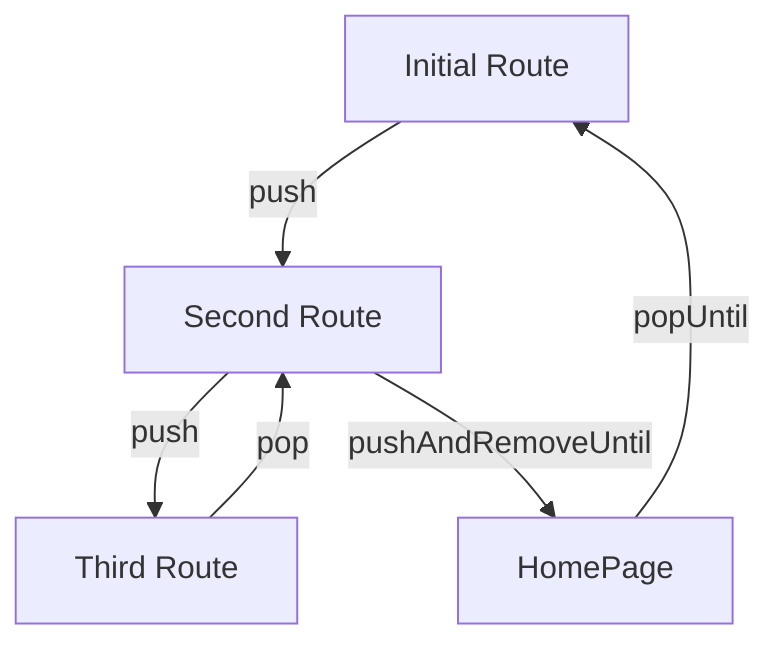

## 5.4.1 Navigation Stack and History

Navigating between screens is a fundamental aspect of mobile app development. In Flutter, navigation is primarily managed through a stack structure, which is both powerful and flexible. Understanding how to effectively use this stack is crucial for creating seamless user experiences. This section will delve into the intricacies of Flutter's navigation stack, explore methods for managing navigation history, and introduce route observers for monitoring navigation events.

### Understanding the Navigation Stack

Flutter's navigation system is built on a stack structure, similar to a stack of plates. Each screen or page in your app is a route, and these routes are managed using a stack. When a new route is pushed onto the stack, it becomes the active screen, and when a route is popped off, the previous screen is revealed.

#### How the Stack Works

- **Pushing a Route:** When you navigate to a new screen, you push a route onto the stack. This is typically done using `Navigator.push`.
- **Popping a Route:** To go back to the previous screen, you pop the current route off the stack using `Navigator.pop`.

Here's a simple example of pushing and popping routes:

```dart
// Pushing a new route
Navigator.push(
  context,
  MaterialPageRoute(builder: (context) => SecondScreen()),
);

// Popping the current route
Navigator.pop(context);
```

### Managing Navigation History

Managing the navigation history is essential for controlling the flow of your app. Flutter provides several methods to manipulate the navigation stack, allowing you to tailor the user experience.

#### Navigator.pushAndRemoveUntil

The `Navigator.pushAndRemoveUntil` method is used to push a new route and remove all the routes until a specified condition is met. This is particularly useful for scenarios like logging in, where you want to navigate to the home screen and remove all previous routes.

```dart
Navigator.pushAndRemoveUntil(
  context,
  MaterialPageRoute(builder: (context) => HomePage()),
  ModalRoute.withName('/login'),
);
```

In this example, the app navigates to `HomePage` and removes all routes until the `/login` route is reached.

#### Navigator.popUntil

The `Navigator.popUntil` method allows you to pop routes off the stack until a specified condition is met. This is useful for returning to a specific screen without knowing how many routes are on the stack.

```dart
Navigator.popUntil(context, ModalRoute.withName('/home'));
```

This code pops all routes until the `/home` route is reached, effectively taking the user back to the home screen.

### Replacing Routes

Sometimes, you may want to replace the current route with a new one without adding to the stack. This can be achieved using `Navigator.pushReplacement`.

#### Navigator.pushReplacement

The `Navigator.pushReplacement` method replaces the current route with a new route. This is useful for scenarios like onboarding, where you want to replace the onboarding screen with the main app screen.

```dart
Navigator.pushReplacement(
  context,
  MaterialPageRoute(builder: (context) => NewScreen()),
);
```

### Understanding Route Observers

Route observers are a powerful feature in Flutter that allow you to monitor navigation events. This can be useful for analytics, logging, or any scenario where you need to track route changes.

#### Implementing RouteObserver

To use a `RouteObserver`, you need to define it and then attach it to your navigator. Here's a basic implementation:

```dart
final RouteObserver<PageRoute> routeObserver = RouteObserver<PageRoute>();

class MyApp extends StatelessWidget {
  @override
  Widget build(BuildContext context) {
    return MaterialApp(
      navigatorObservers: [routeObserver],
      home: HomeScreen(),
    );
  }
}

class RouteAwareWidget extends StatefulWidget {
  @override
  _RouteAwareWidgetState createState() => _RouteAwareWidgetState();
}

class _RouteAwareWidgetState extends State<RouteAwareWidget> with RouteAware {
  @override
  void didChangeDependencies() {
    super.didChangeDependencies();
    routeObserver.subscribe(this, ModalRoute.of(context)!);
  }

  @override
  void dispose() {
    routeObserver.unsubscribe(this);
    super.dispose();
  }

  @override
  void didPush() {
    print('Route was pushed onto the navigator.');
  }

  @override
  void didPop() {
    print('Route was popped off the navigator.');
  }
}
```

In this example, `RouteAwareWidget` listens for navigation events and logs when routes are pushed or popped.

### Visual Aids

To better understand how the navigation stack changes with different methods, let's use a Mermaid.js diagram to visualize these operations.



This diagram illustrates the sequence of navigation operations, showing how routes are pushed and popped from the stack.

### Best Practices

- **Consistency:** Ensure that the navigation flow is consistent and intuitive. Users expect the back button to behave predictably.
- **Stack Management:** Be cautious when manipulating the navigation stack to prevent unexpected behaviors. Always test navigation thoroughly.
- **Performance:** Avoid unnecessary route pushes and pops to maintain performance.

### Practice Exercises

To reinforce your understanding, try implementing the following exercises:

1. **Logout Function:** Create a logout function that clears the navigation stack and navigates to the login screen.

```dart
void logout(BuildContext context) {
  Navigator.pushAndRemoveUntil(
    context,
    MaterialPageRoute(builder: (context) => LoginScreen()),
    (route) => false,
  );
}
```

2. **Track Navigation History:** Implement a feature that tracks and displays the navigation history. Use a `List<String>` to store route names and update it on navigation events.

### Conclusion

Mastering Flutter's navigation stack and history management is crucial for building robust and user-friendly applications. By understanding how to manipulate the stack, replace routes, and observe navigation events, you can create seamless navigation flows that enhance the user experience.

## Quiz Time!



### What is the primary structure used for navigation in Flutter?

- [x] Stack
- [ ] Queue
- [ ] List
- [ ] Tree

> **Explanation:** Flutter uses a stack structure for navigation, where routes are pushed onto and popped off the stack.

### How can you navigate to a new screen and remove all previous routes until a specific route?

- [x] Navigator.pushAndRemoveUntil
- [ ] Navigator.popUntil
- [ ] Navigator.pushReplacement
- [ ] Navigator.push

> **Explanation:** `Navigator.pushAndRemoveUntil` is used to navigate to a new screen and remove all previous routes until a specified condition is met.

### Which method would you use to replace the current route with a new one?

- [x] Navigator.pushReplacement
- [ ] Navigator.push
- [ ] Navigator.pop
- [ ] Navigator.popUntil

> **Explanation:** `Navigator.pushReplacement` replaces the current route with a new one.

### What is a RouteObserver used for in Flutter?

- [x] To monitor navigation events
- [ ] To manage state
- [ ] To handle user input
- [ ] To render UI elements

> **Explanation:** A `RouteObserver` is used to monitor navigation events, such as when routes are pushed or popped.

### Which method would you use to pop routes until a specific route is reached?

- [x] Navigator.popUntil
- [ ] Navigator.pushAndRemoveUntil
- [ ] Navigator.pushReplacement
- [ ] Navigator.push

> **Explanation:** `Navigator.popUntil` is used to pop routes until a specific route is reached.

### What should you be cautious about when manipulating the navigation stack?

- [x] Unexpected behaviors
- [ ] Memory leaks
- [ ] Network requests
- [ ] UI rendering

> **Explanation:** Be cautious of unexpected behaviors when manipulating the navigation stack, as it can affect the user experience.

### How can you ensure the back button behaves as expected?

- [x] By maintaining a consistent navigation flow
- [ ] By disabling it
- [ ] By overriding its functionality
- [ ] By using a different navigation method

> **Explanation:** Ensuring a consistent navigation flow helps maintain expected back button behavior.

### What is the purpose of the `didPush` method in a `RouteAware` widget?

- [x] To notify when a route is pushed onto the navigator
- [ ] To notify when a route is popped off the navigator
- [ ] To manage state changes
- [ ] To handle user input

> **Explanation:** The `didPush` method is called when a route is pushed onto the navigator.

### What is the effect of using `Navigator.pushReplacement`?

- [x] It replaces the current route with a new one
- [ ] It adds a new route to the stack
- [ ] It removes all routes from the stack
- [ ] It pops the current route off the stack

> **Explanation:** `Navigator.pushReplacement` replaces the current route with a new one.

### True or False: Route observers can be used for analytics and logging.

- [x] True
- [ ] False

> **Explanation:** True. Route observers can be used to track navigation events for analytics and logging purposes.


