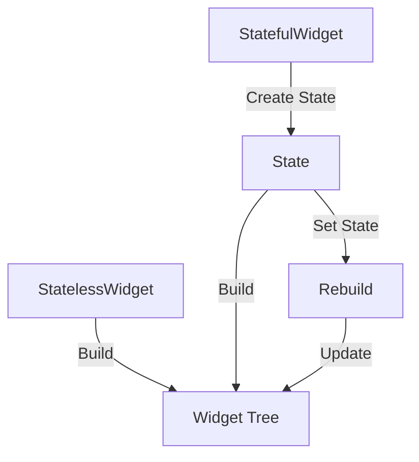

## 6.1.2 Stateful vs. Stateless Widgets Revisited

In the world of Flutter, understanding the distinction between Stateful and Stateless Widgets is crucial for building efficient and responsive applications. These widgets form the cornerstone of Flutter's UI framework, and knowing when and how to use each type can significantly enhance your app's performance and maintainability. In this section, we will delve deep into the characteristics of both Stateful and Stateless Widgets, provide practical examples, and offer guidelines to help you make informed decisions in your app development journey.

### Deep Dive into StatelessWidget

A `StatelessWidget` is one of the simplest forms of widgets in Flutter. As the name suggests, it is immutable, meaning that once it is built, it cannot change its state. This immutability makes `StatelessWidget` ideal for static content that does not require any dynamic updates or interactions.

#### Characteristics of StatelessWidget

- **Immutability:** All properties of a `StatelessWidget` are final and cannot be changed after the widget is constructed.
- **Simplicity:** Since they do not require state management, `StatelessWidget`s are simpler to implement and understand.
- **Performance:** Due to their immutable nature, `StatelessWidget`s are lightweight and have minimal overhead.

#### Example of a StatelessWidget

Consider the following example of a `StatelessWidget`:

```dart
class GreetingWidget extends StatelessWidget {
  final String name;

  GreetingWidget({required this.name});

  @override
  Widget build(BuildContext context) {
    return Text('Hello, $name!');
  }
}
```

In this example, the `GreetingWidget` takes a `name` parameter, which is required at the time of construction. This parameter is final, meaning it cannot be changed once the widget is built. The widget simply displays a greeting message using the provided name.

#### When to Use StatelessWidget

- **Static Content:** Use `StatelessWidget` for content that does not change over time, such as static text, images, or icons.
- **Performance Optimization:** Since `StatelessWidget`s do not require state management, they are more efficient and should be used whenever possible to reduce complexity and improve performance.

### Deep Dive into StatefulWidget

In contrast to `StatelessWidget`, a `StatefulWidget` is designed for dynamic content that can change over time. A `StatefulWidget` is composed of two classes: the `StatefulWidget` class itself, which is immutable, and the `State` class, which holds the mutable state.

#### Characteristics of StatefulWidget

- **Mutability:** The `State` class allows for mutable state, enabling dynamic updates to the widget's appearance or behavior.
- **Complexity:** `StatefulWidget`s are more complex than `StatelessWidget`s due to the need for state management.
- **Reactivity:** They can respond to user interactions, network requests, or other events that require the widget to update.

#### Example of a StatefulWidget

Let's explore a simple example of a `StatefulWidget`:

```dart
class CounterWidget extends StatefulWidget {
  @override
  _CounterWidgetState createState() => _CounterWidgetState();
}

class _CounterWidgetState extends State<CounterWidget> {
  int _counter = 0;

  void _incrementCounter() {
    setState(() {
      _counter++;
    });
  }

  @override
  Widget build(BuildContext context) {
    return Column(
      children: [
        Text('Counter: $_counter'),
        ElevatedButton(
          onPressed: _incrementCounter,
          child: Text('Increment'),
        ),
      ],
    );
  }
}
```

In this example, the `CounterWidget` is a `StatefulWidget` that maintains a counter value. The `_CounterWidgetState` class holds the mutable state, and the `setState()` method is used to update the counter and trigger a rebuild of the widget.

#### How `setState()` Works

- **State Update:** The `setState()` method is called to update the widget's state. It takes a callback function where the state changes are made.
- **Rebuild Trigger:** Calling `setState()` notifies the Flutter framework that the state has changed, prompting it to rebuild the widget.
- **Efficient Rebuilds:** Flutter optimizes the rebuild process by only updating the parts of the widget tree that need to change, ensuring efficient performance.

### When to Choose Which

Choosing between `StatelessWidget` and `StatefulWidget` depends on the specific requirements of your application. Here are some guidelines to help you decide:

- **Use `StatelessWidget`:** When the widget does not depend on any mutable state and its content remains static.
- **Use `StatefulWidget`:** When you need to modify the widget's appearance or behavior in response to user interactions, network requests, or other events.

### Best Practices

To make the most of Flutter's widget system, consider the following best practices:

- **Minimize Stateful Widgets:** Use `StatefulWidget` only when necessary to keep the widget tree simple and maintainable.
- **Lift State Up:** When multiple widgets need to access or modify the same state, consider lifting the state up to a common ancestor widget to promote reusability and separation of concerns.

### Practical Code Examples and Snippets

To further illustrate the concepts discussed, let's explore some practical code examples and snippets that demonstrate the use of `StatelessWidget` and `StatefulWidget` in real-world scenarios.

#### Example: StatelessWidget for Static UI

Here's an example of using a `StatelessWidget` to create a simple static UI:

```dart
class StaticInfoCard extends StatelessWidget {
  final String title;
  final String description;

  StaticInfoCard({required this.title, required this.description});

  @override
  Widget build(BuildContext context) {
    return Card(
      child: Padding(
        padding: const EdgeInsets.all(16.0),
        child: Column(
          crossAxisAlignment: CrossAxisAlignment.start,
          children: [
            Text(
              title,
              style: TextStyle(fontSize: 20, fontWeight: FontWeight.bold),
            ),
            SizedBox(height: 8),
            Text(description),
          ],
        ),
      ),
    );
  }
}
```

In this example, the `StaticInfoCard` widget displays a title and description. Since the content is static and does not change, a `StatelessWidget` is used.

#### Example: StatefulWidget for Interactive UI

Now, let's look at an example of using a `StatefulWidget` to create an interactive UI:

```dart
class ToggleSwitch extends StatefulWidget {
  @override
  _ToggleSwitchState createState() => _ToggleSwitchState();
}

class _ToggleSwitchState extends State<ToggleSwitch> {
  bool _isOn = false;

  void _toggleSwitch() {
    setState(() {
      _isOn = !_isOn;
    });
  }

  @override
  Widget build(BuildContext context) {
    return Row(
      mainAxisAlignment: MainAxisAlignment.center,
      children: [
        Text(_isOn ? 'ON' : 'OFF'),
        Switch(
          value: _isOn,
          onChanged: (value) {
            _toggleSwitch();
          },
        ),
      ],
    );
  }
}
```

In this example, the `ToggleSwitch` widget allows the user to toggle a switch on or off. The `_ToggleSwitchState` class manages the mutable state, and the `setState()` method is used to update the UI in response to user interactions.

### Diagrams and Visualizations

To enhance your understanding of the widget lifecycle and state management, let's incorporate some diagrams using Mermaid syntax.

#### Widget Lifecycle Diagram



This diagram illustrates the lifecycle of `StatelessWidget` and `StatefulWidget`, highlighting the build process and state updates.

### Common Pitfalls and Optimization Tips

While working with Flutter widgets, it's important to be aware of common pitfalls and optimization tips:

- **Avoid Unnecessary Rebuilds:** Use `const` constructors for `StatelessWidget`s when possible to prevent unnecessary rebuilds.
- **Optimize State Management:** Consider using state management solutions like Provider, Riverpod, or Bloc for complex applications with extensive state management needs.
- **Profile and Optimize:** Use Flutter's performance profiling tools to identify and optimize performance bottlenecks in your application.

### Hands-On Activities and Mini-Projects

To reinforce your learning, try the following hands-on activities and mini-projects:

1. **Create a Simple Calculator:** Build a basic calculator app using `StatefulWidget` to manage the input and output state.
2. **Develop a Weather App:** Use `StatelessWidget` to display static weather information and `StatefulWidget` to update the UI based on user input or API responses.
3. **Implement a Todo List:** Create a todo list app with `StatefulWidget` to manage the list items and their completion status.

### Troubleshooting Tips

When working with Flutter widgets, you may encounter common issues or misunderstandings. Here are some troubleshooting tips:

- **Widget Not Updating:** Ensure that you are calling `setState()` when updating the state in a `StatefulWidget`.
- **Performance Issues:** Profile your app to identify performance bottlenecks and optimize your widget tree.
- **State Management Confusion:** Consider using state management libraries for complex applications to simplify state handling.

### Conclusion

Understanding the differences between Stateful and Stateless Widgets is fundamental to mastering Flutter development. By choosing the right widget type for your application's needs and following best practices, you can create efficient, responsive, and maintainable apps. Remember to experiment with the provided examples, engage in hands-on activities, and explore further resources to deepen your knowledge.

## Quiz Time!



### What is a key characteristic of a StatelessWidget?

- [x] Immutability
- [ ] Mutability
- [ ] Requires state management
- [ ] Complex to implement

> **Explanation:** A StatelessWidget is immutable, meaning its properties cannot change after it is built.

### Which method is used to update the state in a StatefulWidget?

- [ ] build()
- [ ] initState()
- [x] setState()
- [ ] dispose()

> **Explanation:** The setState() method is used to update the state in a StatefulWidget and trigger a rebuild.

### When should you use a StatelessWidget?

- [x] For static content
- [ ] For dynamic content
- [ ] When user interaction is required
- [ ] For complex state management

> **Explanation:** StatelessWidget is ideal for static content that does not change over time.

### What does the setState() method do?

- [ ] Initializes the widget
- [x] Notifies the framework of state changes
- [ ] Disposes of the widget
- [ ] Builds the widget tree

> **Explanation:** setState() notifies the framework that the state has changed and triggers a rebuild of the widget.

### Which widget type is more complex to implement?

- [ ] StatelessWidget
- [x] StatefulWidget
- [ ] Both are equally complex
- [ ] Neither is complex

> **Explanation:** StatefulWidget is more complex due to the need for state management.

### What is a best practice for managing state in Flutter?

- [ ] Use StatefulWidget for all widgets
- [x] Minimize the use of StatefulWidget
- [ ] Avoid using StatelessWidget
- [ ] Use only global variables

> **Explanation:** Minimizing the use of StatefulWidget helps keep the widget tree simple and maintainable.

### What is the purpose of lifting state up?

- [ ] To make widgets more complex
- [x] To share state between multiple widgets
- [ ] To reduce performance
- [ ] To simplify individual widgets

> **Explanation:** Lifting state up allows multiple widgets to access or modify the same state, promoting reusability.

### Which widget type should you use for a button that changes its label when clicked?

- [ ] StatelessWidget
- [x] StatefulWidget
- [ ] Both can be used
- [ ] Neither can be used

> **Explanation:** StatefulWidget is needed to manage the dynamic state of the button's label.

### What is a common pitfall when using StatefulWidget?

- [ ] Forgetting to call build()
- [x] Not using setState() for state updates
- [ ] Using too many StatelessWidgets
- [ ] Avoiding state management libraries

> **Explanation:** Not using setState() for state updates can lead to widgets not updating as expected.

### True or False: StatelessWidget can be used for dynamic content.

- [ ] True
- [x] False

> **Explanation:** StatelessWidget is not suitable for dynamic content as it cannot change its state after being built.


