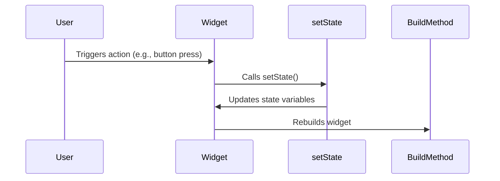

## 6.1.3 `setState` Method

In the realm of Flutter development, managing state is a fundamental aspect of creating dynamic and responsive applications. At the heart of this state management lies the `setState()` method, a pivotal function that enables developers to update the UI in response to state changes. This section delves into the intricacies of the `setState()` method, exploring its functionality, proper usage, and the implications of neglecting its use.

### Understanding `setState()`

The `setState()` method is a cornerstone of Flutter's state management, provided by the `State` class. It plays a crucial role in notifying the Flutter framework that the internal state of a widget has changed, prompting a rebuild of the widget tree to reflect these changes. Let's break down how `setState()` works:

- **Takes a Function as an Argument:** The `setState()` method accepts a function as its argument. This function encapsulates the code responsible for modifying the state variables.
- **Modifies State Variables:** Within the function passed to `setState()`, developers can alter the state variables that determine the widget's appearance or behavior.
- **Schedules a Rebuild:** After executing the function, `setState()` schedules a rebuild of the widget. This ensures that the UI is updated to reflect the new state.

### Proper Use of `setState()`

To harness the full potential of `setState()`, it's essential to use it correctly. Misuse can lead to performance issues or unintended side effects. Here are some guidelines and examples to ensure proper usage:

#### Example of Correct Usage

Consider a simple counter application where a button press increments a counter displayed on the screen. The following code snippet demonstrates the correct use of `setState()`:

```dart
void _incrementCounter() {
  setState(() {
    _counter++;
  });
}
```

In this example, the `_incrementCounter` method calls `setState()`, passing a function that increments the `_counter` variable. This change triggers a rebuild of the widget, updating the displayed counter value.

#### What Goes Inside `setState()`

When using `setState()`, it's crucial to include only the code that modifies state variables within the callback function. Avoid placing expensive computations or long-running functions inside `setState()`, as this can degrade performance and lead to a sluggish UI.

- **Modify State Variables:** Ensure that the function passed to `setState()` focuses solely on altering state variables.
- **Avoid Expensive Computations:** Perform any necessary calculations or data processing outside of `setState()` to prevent unnecessary delays in the UI update process.

#### Avoid Side Effects

It's important to avoid side effects within the `setState()` callback. Side effects are actions that can trigger additional rebuilds or alter the application's state in unintended ways. Examples include network requests, database operations, or triggering animations.

- **No Additional Rebuilds:** Ensure that the code within `setState()` does not inadvertently cause further rebuilds.
- **Isolate Side Effects:** Perform side effects outside of `setState()` to maintain predictable and efficient state management.

### Implications of Not Using `setState()`

Failing to use `setState()` when modifying state variables can lead to a disconnect between the application's state and its UI. When state changes occur without calling `setState()`, the framework remains unaware of these changes, resulting in a static UI that does not reflect the current state.

- **UI Stagnation:** Without `setState()`, changes to state variables will not trigger a rebuild, leaving the UI unchanged.
- **Framework Notification:** `setState()` serves as a mechanism to notify the framework of state changes, ensuring that the widget tree is rebuilt to reflect the new state.

### Lifecycle of State Changes

Understanding the lifecycle of state changes in Flutter is crucial for effective state management. The following **Mermaid.js sequence diagram** illustrates the flow of state changes from user interaction to widget rebuild:



This diagram highlights the sequence of events that occur when a user interacts with a widget, leading to a state change and subsequent UI update.

### Examples and Exercises

To solidify your understanding of `setState()`, let's explore some examples and exercises that demonstrate both correct and incorrect usage.

#### Correct Usage Example

Consider a simple to-do list application where users can add and remove tasks. The following code snippet illustrates the correct use of `setState()` to update the task list:

```dart
void _addTask(String task) {
  setState(() {
    _tasks.add(task);
  });
}

void _removeTask(int index) {
  setState(() {
    _tasks.removeAt(index);
  });
}
```

In these examples, `setState()` is used to modify the `_tasks` list, ensuring that the UI reflects the updated task list.

#### Incorrect Usage Example

Let's examine an incorrect usage scenario where `setState()` is misused:

```dart
void _updateTasks() {
  setState(() {
    // Incorrect: Performing network request inside setState()
    fetchTasksFromServer().then((fetchedTasks) {
      _tasks = fetchedTasks;
    });
  });
}
```

In this example, a network request is initiated within `setState()`, which can lead to performance issues and unpredictable behavior. The network request should be performed outside of `setState()`, with the state update occurring only after the data is fetched.

#### Exercise: Practice Modifying State

To reinforce your understanding, try modifying the state in a sample Flutter application. Create a simple app with a counter and a button to increment the counter. Experiment with placing different types of code inside and outside of `setState()` to observe the effects on the UI.

### Conclusion

Mastering the `setState()` method is essential for effective state management in Flutter applications. By understanding its functionality, proper usage, and potential pitfalls, developers can create dynamic and responsive UIs that accurately reflect the application's state. Remember to use `setState()` judiciously, focusing on modifying state variables and avoiding side effects to ensure optimal performance and a seamless user experience.

## Quiz Time!



### What is the primary purpose of the `setState()` method in Flutter?

- [x] To notify the framework of state changes and trigger a widget rebuild
- [ ] To perform network requests
- [ ] To handle user input
- [ ] To manage application routing

> **Explanation:** The `setState()` method is used to notify the Flutter framework of changes to state variables, prompting a rebuild of the widget to reflect these changes.

### Which of the following should be included inside the `setState()` callback?

- [x] Code that modifies state variables
- [ ] Expensive computations
- [ ] Network requests
- [ ] Animation triggers

> **Explanation:** Only the code that modifies state variables should be included inside the `setState()` callback to ensure efficient state management and UI updates.

### What happens if you change state variables without calling `setState()`?

- [x] The UI will not update to reflect the changes
- [ ] The application will crash
- [ ] The framework will automatically rebuild the widget
- [ ] The state variables will reset to their initial values

> **Explanation:** Without calling `setState()`, the framework is not notified of state changes, resulting in a static UI that does not reflect the updated state.

### Which of the following is a side effect that should be avoided inside `setState()`?

- [x] Performing network requests
- [ ] Modifying state variables
- [ ] Updating the UI
- [ ] Triggering a rebuild

> **Explanation:** Side effects such as network requests should be avoided inside `setState()` to prevent performance issues and unintended behavior.

### In the lifecycle of state changes, what is the role of the `BuildMethod`?

- [x] To rebuild the widget tree based on the updated state
- [ ] To handle user input
- [ ] To manage application routing
- [ ] To perform network requests

> **Explanation:** The `BuildMethod` is responsible for rebuilding the widget tree to reflect the updated state after `setState()` is called.

### Which of the following is a best practice when using `setState()`?

- [x] Perform expensive computations outside of `setState()`
- [ ] Include network requests inside `setState()`
- [ ] Trigger animations inside `setState()`
- [ ] Modify unrelated state variables inside `setState()`

> **Explanation:** Expensive computations should be performed outside of `setState()` to ensure efficient state management and UI updates.

### What is the consequence of placing expensive computations inside `setState()`?

- [x] Degraded performance and sluggish UI
- [ ] Immediate UI updates
- [ ] Automatic optimization by the framework
- [ ] Increased application stability

> **Explanation:** Placing expensive computations inside `setState()` can lead to degraded performance and a sluggish UI due to unnecessary delays in the update process.

### How can you ensure that side effects do not occur inside `setState()`?

- [x] Isolate side effects outside of `setState()`
- [ ] Include all code inside `setState()`
- [ ] Trigger animations inside `setState()`
- [ ] Perform network requests inside `setState()`

> **Explanation:** To prevent side effects, isolate them outside of `setState()` and focus on modifying state variables within the callback.

### What is the role of the `setState()` method in the widget lifecycle?

- [x] To update state variables and schedule a widget rebuild
- [ ] To manage application routing
- [ ] To handle user input
- [ ] To perform network requests

> **Explanation:** The `setState()` method updates state variables and schedules a widget rebuild to ensure the UI reflects the current state.

### True or False: `setState()` should be used for all types of state changes in Flutter.

- [x] True
- [ ] False

> **Explanation:** `setState()` should be used for all types of state changes to ensure that the Flutter framework is notified and the UI is updated accordingly.


