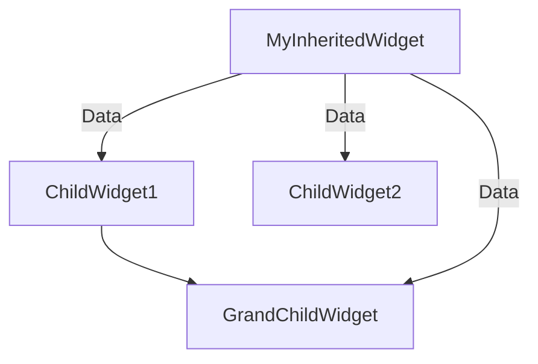

## 6.2.1 InheritedWidget Basics

In the world of Flutter development, managing state and data flow efficiently is crucial for building responsive and scalable applications. One of the foundational tools for achieving this is the `InheritedWidget`. This chapter will delve deep into the purpose, functionality, and implementation of `InheritedWidget`, providing you with the knowledge to leverage it effectively in your Flutter projects.

### Purpose of InheritedWidget

The `InheritedWidget` serves as a mechanism to pass data down the widget tree without the cumbersome need to pass it through constructors at every level. This capability is particularly useful in Flutter's declarative UI framework, where widgets are often deeply nested. By using `InheritedWidget`, descendant widgets can access shared data efficiently, promoting a cleaner and more maintainable codebase.

#### Key Benefits:
- **Centralized Data Management:** `InheritedWidget` allows you to centralize data management, reducing redundancy and potential errors.
- **Efficient Data Access:** Descendant widgets can access data directly from the `InheritedWidget`, minimizing the need for complex data passing mechanisms.
- **Reactivity:** When the data in the `InheritedWidget` changes, only the widgets that depend on that data are rebuilt, optimizing performance.

### How InheritedWidget Works

At its core, `InheritedWidget` is designed to notify its dependent widgets when its data changes. This notification mechanism ensures that only the necessary parts of the widget tree are rebuilt, enhancing the performance of your application.

#### Notification and Rebuilding:
- **Data Change Detection:** The `InheritedWidget` monitors changes in its data. When a change is detected, it triggers a rebuild of all dependent widgets.
- **Dependency Tracking:** Widgets that rely on the data provided by an `InheritedWidget` are automatically registered as dependents. This is achieved through the `context.dependOnInheritedWidgetOfExactType` method.

#### Base Class for State Management:
`InheritedWidget` serves as the foundation for many state management solutions in Flutter, such as `Provider` and `Bloc`. Understanding its workings is essential for mastering these advanced state management techniques.

### Creating a Custom InheritedWidget

Creating a custom `InheritedWidget` involves extending the `InheritedWidget` class and implementing its key methods. Below is a basic example to illustrate this process:

```dart
class MyInheritedWidget extends InheritedWidget {
  final int data;

  MyInheritedWidget({required this.data, required Widget child})
      : super(child: child);

  @override
  bool updateShouldNotify(MyInheritedWidget oldWidget) {
    return data != oldWidget.data;
  }

  static MyInheritedWidget? of(BuildContext context) {
    return context.dependOnInheritedWidgetOfExactType<MyInheritedWidget>();
  }
}
```

#### Explanation of Key Components:
- **`data`:** This is the shared data that the `InheritedWidget` provides to its descendants. In this example, it's an integer, but it can be any type of data.
- **`updateShouldNotify`:** This method determines whether the dependent widgets should be notified of changes. It compares the current data with the old data to decide if a rebuild is necessary.
- **`of` Method:** This static method is a convenience method that allows descendant widgets to access the `InheritedWidget` instance. It uses the `context.dependOnInheritedWidgetOfExactType` method to register the widget as a dependent.

### Accessing Data in Descendants

Once you have defined your `InheritedWidget`, descendant widgets can access its data using the `of` method. Here's how a child widget can retrieve the data:

```dart
final inheritedWidget = MyInheritedWidget.of(context);
final data = inheritedWidget?.data;
```

This approach ensures that the widget is registered as a dependent, allowing it to be rebuilt when the data changes.

### Limitations of InheritedWidget

While `InheritedWidget` is a powerful tool for managing data flow, it does have some limitations:

- **Complexity in Custom Implementations:** Creating custom `InheritedWidget` implementations can be complex, especially for beginners. It requires a good understanding of Flutter's widget lifecycle and context.
- **State Modification:** `InheritedWidget` does not provide a straightforward way to modify state. It is primarily designed for data propagation rather than state management. For state modification, other solutions like `StatefulWidget` or state management libraries are more appropriate.

### Visualizing Data Flow with Mermaid.js

To better understand how data flows from an `InheritedWidget` to its descendants, let's visualize it using a Mermaid.js diagram:



In this diagram, the `MyInheritedWidget` provides data to `ChildWidget1`, `ChildWidget2`, and `GrandChildWidget`. The arrows indicate the flow of data, demonstrating how the `InheritedWidget` serves as a central data source for its descendants.

### Best Practices and Common Pitfalls

#### Best Practices:
- **Use for Immutable Data:** `InheritedWidget` is best suited for immutable data that does not change frequently.
- **Combine with Other Widgets:** For more complex state management, consider combining `InheritedWidget` with other widgets or libraries like `Provider`.

#### Common Pitfalls:
- **Overusing InheritedWidget:** Avoid using `InheritedWidget` for every piece of data. It is most effective for data that needs to be accessed by multiple widgets.
- **Ignoring Performance Implications:** Be mindful of the performance implications of rebuilding widgets. Ensure that only necessary widgets are rebuilt when data changes.

### Hands-On Activity: Implementing a Simple Counter

To reinforce your understanding of `InheritedWidget`, let's implement a simple counter application. This activity will guide you through creating an `InheritedWidget` to manage the counter state and display it in a child widget.

#### Step-by-Step Implementation:

1. **Define the InheritedWidget:**

```dart
class CounterInheritedWidget extends InheritedWidget {
  final int counter;

  CounterInheritedWidget({required this.counter, required Widget child})
      : super(child: child);

  @override
  bool updateShouldNotify(CounterInheritedWidget oldWidget) {
    return counter != oldWidget.counter;
  }

  static CounterInheritedWidget? of(BuildContext context) {
    return context.dependOnInheritedWidgetOfExactType<CounterInheritedWidget>();
  }
}
```

2. **Create the Counter Widget:**

```dart
class CounterWidget extends StatelessWidget {
  @override
  Widget build(BuildContext context) {
    final counter = CounterInheritedWidget.of(context)?.counter ?? 0;

    return Text(
      'Counter: $counter',
      style: TextStyle(fontSize: 24),
    );
  }
}
```

3. **Build the Main Application:**

```dart
class MyApp extends StatefulWidget {
  @override
  _MyAppState createState() => _MyAppState();
}

class _MyAppState extends State<MyApp> {
  int _counter = 0;

  void _incrementCounter() {
    setState(() {
      _counter++;
    });
  }

  @override
  Widget build(BuildContext context) {
    return MaterialApp(
      home: Scaffold(
        appBar: AppBar(title: Text('InheritedWidget Counter')),
        body: Center(
          child: CounterInheritedWidget(
            counter: _counter,
            child: CounterWidget(),
          ),
        ),
        floatingActionButton: FloatingActionButton(
          onPressed: _incrementCounter,
          child: Icon(Icons.add),
        ),
      ),
    );
  }
}
```

#### Explanation:
- **CounterInheritedWidget:** Manages the counter state and notifies dependents when the counter changes.
- **CounterWidget:** Displays the current counter value by accessing it from the `CounterInheritedWidget`.
- **MyApp:** The main application widget that manages the counter state and provides it to the `CounterInheritedWidget`.

### Conclusion

The `InheritedWidget` is a fundamental tool in Flutter for managing data flow efficiently across the widget tree. By understanding its purpose, functionality, and limitations, you can leverage it to build responsive and scalable applications. As you continue your Flutter journey, remember to combine `InheritedWidget` with other state management solutions to address more complex requirements.

## Quiz Time!



### What is the primary purpose of an InheritedWidget in Flutter?

- [x] To pass data down the widget tree without passing it through constructors at every level.
- [ ] To manage animations in the widget tree.
- [ ] To handle network requests efficiently.
- [ ] To provide a built-in database for Flutter applications.

> **Explanation:** The primary purpose of an `InheritedWidget` is to pass data down the widget tree efficiently, allowing descendant widgets to access shared data without passing it through constructors at every level.

### How does an InheritedWidget notify its dependents of data changes?

- [x] By rebuilding only the widgets that depend on the changed data.
- [ ] By sending a notification to all widgets in the tree.
- [ ] By logging a message to the console.
- [ ] By triggering a global state change.

> **Explanation:** An `InheritedWidget` notifies its dependents by rebuilding only the widgets that rely on the changed data, optimizing performance.

### Which method in an InheritedWidget determines if dependents should be notified of data changes?

- [x] updateShouldNotify
- [ ] notifyDependents
- [ ] shouldRebuild
- [ ] onDataChange

> **Explanation:** The `updateShouldNotify` method determines if dependents should be notified of data changes by comparing the current data with the old data.

### What is a common limitation of using InheritedWidget?

- [x] It does not provide a straightforward way to modify state.
- [ ] It cannot be used with StatefulWidgets.
- [ ] It is incompatible with third-party libraries.
- [ ] It requires internet connectivity to function.

> **Explanation:** A common limitation of `InheritedWidget` is that it does not provide a straightforward way to modify state, as it is primarily designed for data propagation.

### Which of the following is a best practice when using InheritedWidget?

- [x] Use it for immutable data that does not change frequently.
- [ ] Use it for every piece of data in the application.
- [ ] Avoid using it with other state management solutions.
- [ ] Use it only for network-related data.

> **Explanation:** It is best to use `InheritedWidget` for immutable data that does not change frequently, as it is optimized for data propagation rather than state management.

### How can a descendant widget access data from an InheritedWidget?

- [x] Using the static `of` method defined in the InheritedWidget.
- [ ] By directly accessing the data property of the InheritedWidget.
- [ ] By calling a global function.
- [ ] By using a network request.

> **Explanation:** A descendant widget can access data from an `InheritedWidget` using the static `of` method, which registers the widget as a dependent.

### What is the role of the `context.dependOnInheritedWidgetOfExactType` method?

- [x] It registers the widget as a dependent on the InheritedWidget.
- [ ] It updates the data in the InheritedWidget.
- [ ] It removes the widget from the widget tree.
- [ ] It logs the data to the console.

> **Explanation:** The `context.dependOnInheritedWidgetOfExactType` method registers the widget as a dependent on the `InheritedWidget`, ensuring it is rebuilt when the data changes.

### What is a common pitfall when using InheritedWidget?

- [x] Overusing it for every piece of data.
- [ ] Using it with StatefulWidgets.
- [ ] Combining it with other state management solutions.
- [ ] Using it for network-related data.

> **Explanation:** A common pitfall is overusing `InheritedWidget` for every piece of data, which can lead to unnecessary complexity and performance issues.

### True or False: InheritedWidget is the base class for many state management solutions in Flutter.

- [x] True
- [ ] False

> **Explanation:** True. `InheritedWidget` is the base class for many state management solutions in Flutter, such as `Provider` and `Bloc`.

### Which of the following is NOT a benefit of using InheritedWidget?

- [ ] Centralized Data Management
- [ ] Efficient Data Access
- [ ] Reactivity
- [x] Built-in Database Functionality

> **Explanation:** `InheritedWidget` does not provide built-in database functionality. Its benefits include centralized data management, efficient data access, and reactivity.


