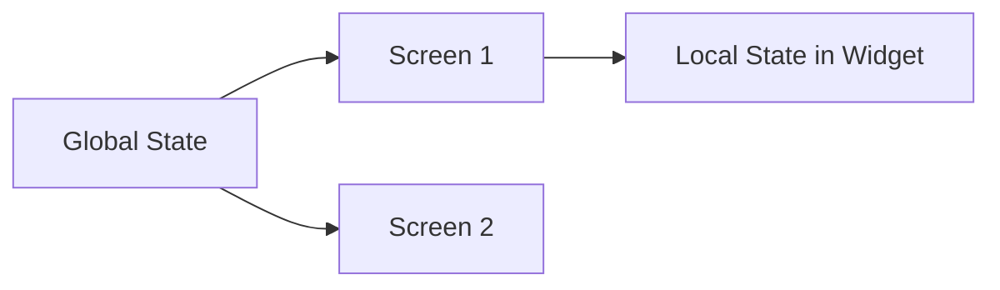

---

linkTitle: "6.3.1 Local vs. Global State"
title: "Understanding Local vs. Global State in Flutter"
description: "Explore the intricacies of managing local and global state in Flutter applications, including best practices and challenges."
categories:
- Flutter Development
- Mobile App Development
- State Management
tags:
- Flutter
- State Management
- Local State
- Global State
- Provider
- Bloc
date: 2024-10-25
type: docs
nav_weight: 631000
---

## 6.3.1 Local vs. Global State

In the realm of Flutter app development, understanding the distinction between local and global state is crucial for building efficient, maintainable, and scalable applications. This section delves into the nuances of local and global state management, providing insights into when and how to use each, along with practical examples and best practices.

### Local State

Local state refers to the state that is only relevant to a specific widget or a small part of the app. It is typically used for managing UI-related data that does not need to be shared across different parts of the application. Examples of local state include:

- The visibility of a widget, such as a dialog or a tooltip.
- The value of a text field in a form.
- The selected tab in a `TabBar`.

#### Managing Local State with `setState()`

In Flutter, the `setState()` method is commonly used to manage local state. It is a straightforward and efficient way to update the UI in response to state changes within a widget. Here's a simple example:

```dart
import 'package:flutter/material.dart';

class CounterWidget extends StatefulWidget {
  @override
  _CounterWidgetState createState() => _CounterWidgetState();
}

class _CounterWidgetState extends State<CounterWidget> {
  int _counter = 0;

  void _incrementCounter() {
    setState(() {
      _counter++;
    });
  }

  @override
  Widget build(BuildContext context) {
    return Column(
      children: [
        Text('Counter: $_counter'),
        ElevatedButton(
          onPressed: _incrementCounter,
          child: Text('Increment'),
        ),
      ],
    );
  }
}
```

In this example, the `_counter` variable is a local state managed by the `CounterWidget`. The `setState()` method is used to update the `_counter` value and rebuild the widget.

### Global State

Global state, on the other hand, refers to the state that needs to be accessed and modified from multiple widgets or screens. It is essential for managing data that is shared across different parts of the application. Examples of global state include:

- User authentication status.
- App-wide settings or preferences.
- Shared data between screens, such as a shopping cart in an e-commerce app.

#### Challenges with `setState` for Global State

Using `setState()` for managing global state can lead to several challenges:

- **Prop Drilling:** Passing state and callbacks down the widget tree can become cumbersome and error-prone, especially in large applications. This practice, known as "prop drilling," can make the codebase harder to manage and maintain.
- **Code Complexity:** As the application grows, managing global state with `setState()` can lead to increased complexity and potential for bugs.

### Appropriate Use Cases

#### Using `setState()` for Local State

`setState()` is ideal for simple, local state management where the state does not need to be shared across multiple widgets. It is efficient and easy to implement for small, self-contained components.

#### Using State Management Solutions for Global State

For managing global state, it is advisable to use state management solutions that provide a more structured and scalable approach. Popular state management solutions in Flutter include:

- **Provider:** A lightweight and flexible solution for managing global state. It leverages the `InheritedWidget` to provide a clean and efficient way to share state across the widget tree.
- **Bloc (Business Logic Component):** A powerful state management library that enforces a clear separation between business logic and UI. It uses streams to manage state changes, providing a reactive programming model.
- **Riverpod:** An improvement over Provider, offering a simpler and more robust API for managing state.
- **Redux:** A predictable state container that uses a unidirectional data flow pattern, suitable for complex applications.

### Diagramming State Scope

To better understand the scope of local and global state, consider the following **Mermaid.js diagram**:



In this diagram, the global state is accessible by multiple screens (Screen 1 and Screen 2), while the local state is confined to a specific widget within Screen 1.

### Practical Code Examples

#### Managing Global State with Provider

Here's an example of using the `Provider` package to manage global state:

```dart
import 'package:flutter/material.dart';
import 'package:provider/provider.dart';

void main() {
  runApp(
    ChangeNotifierProvider(
      create: (context) => CounterModel(),
      child: MyApp(),
    ),
  );
}

class CounterModel extends ChangeNotifier {
  int _counter = 0;

  int get counter => _counter;

  void increment() {
    _counter++;
    notifyListeners();
  }
}

class MyApp extends StatelessWidget {
  @override
  Widget build(BuildContext context) {
    return MaterialApp(
      home: CounterScreen(),
    );
  }
}

class CounterScreen extends StatelessWidget {
  @override
  Widget build(BuildContext context) {
    final counterModel = Provider.of<CounterModel>(context);

    return Scaffold(
      appBar: AppBar(
        title: Text('Counter App'),
      ),
      body: Center(
        child: Column(
          mainAxisAlignment: MainAxisAlignment.center,
          children: [
            Text('Counter: ${counterModel.counter}'),
            ElevatedButton(
              onPressed: counterModel.increment,
              child: Text('Increment'),
            ),
          ],
        ),
      ),
    );
  }
}
```

In this example, the `CounterModel` class manages the global state, and the `ChangeNotifierProvider` is used to provide this state to the widget tree. The `CounterScreen` widget accesses the global state using the `Provider.of<CounterModel>(context)` method.

### Best Practices

- **Keep Local State Local:** Use `setState()` for managing state that is only relevant to a specific widget. Avoid unnecessary complexity by keeping local state management simple.
- **Use Appropriate State Management Solutions:** For global state, choose a state management solution that fits the needs of your application. Consider factors such as the complexity of the app, team familiarity with the library, and performance requirements.
- **Avoid Prop Drilling:** Minimize the need to pass state and callbacks through multiple layers of widgets by using context-based state management solutions like Provider or Bloc.
- **Optimize Performance:** Be mindful of performance implications when managing state. Use `shouldRebuild` methods and other optimization techniques to minimize unnecessary widget rebuilds.

### Common Pitfalls

- **Overusing Global State:** Avoid using global state for data that is only relevant to a specific part of the app. This can lead to unnecessary complexity and potential for bugs.
- **Ignoring Performance:** Failing to optimize state management can lead to performance issues, especially in large applications with complex widget trees.
- **Neglecting Testing:** Ensure that your state management logic is well-tested to prevent bugs and ensure maintainability.

### Conclusion

Understanding the distinction between local and global state is essential for effective Flutter app development. By leveraging the right state management techniques and tools, you can build applications that are both efficient and maintainable. Whether you are managing simple local state with `setState()` or using advanced state management solutions for global state, the key is to choose the right approach for your specific use case.

## Quiz Time!



### What is local state in Flutter?

- [x] State that is only relevant to a specific widget or a small part of the app.
- [ ] State that is shared across multiple screens.
- [ ] State that is managed by a backend server.
- [ ] State that is stored in a database.

> **Explanation:** Local state is specific to a widget or a small part of the app and is not shared across multiple screens.

### Which method is commonly used to manage local state in Flutter?

- [x] `setState()`
- [ ] `notifyListeners()`
- [ ] `dispatch()`
- [ ] `streamController.add()`

> **Explanation:** `setState()` is used to manage local state by triggering a rebuild of the widget with updated state.

### What is a common challenge when using `setState()` for global state?

- [x] Prop drilling
- [ ] Lack of performance
- [ ] Inability to update the UI
- [ ] Difficulty in creating widgets

> **Explanation:** Prop drilling involves passing state and callbacks down the widget tree, which can become cumbersome and error-prone.

### Which state management solution is known for using streams and a reactive programming model?

- [ ] Provider
- [x] Bloc
- [ ] Redux
- [ ] Riverpod

> **Explanation:** Bloc uses streams and a reactive programming model to manage state changes.

### What is a benefit of using Provider for global state management?

- [x] It provides a clean and efficient way to share state across the widget tree.
- [ ] It requires less code than `setState()`.
- [ ] It automatically optimizes performance.
- [ ] It eliminates the need for testing.

> **Explanation:** Provider leverages `InheritedWidget` to efficiently share state across the widget tree.

### What should you avoid when managing state in Flutter?

- [x] Overusing global state for data that is only relevant to a specific part of the app.
- [ ] Using `setState()` for local state management.
- [ ] Using Provider for global state management.
- [ ] Testing state management logic.

> **Explanation:** Overusing global state can lead to unnecessary complexity and potential for bugs.

### Which state management solution is an improvement over Provider?

- [ ] Bloc
- [ ] Redux
- [x] Riverpod
- [ ] MobX

> **Explanation:** Riverpod offers a simpler and more robust API compared to Provider.

### What is the main purpose of the `notifyListeners()` method in Flutter?

- [x] To notify widgets that are listening to changes in a `ChangeNotifier`.
- [ ] To update the UI immediately.
- [ ] To manage local state.
- [ ] To handle user input events.

> **Explanation:** `notifyListeners()` is used in a `ChangeNotifier` to notify widgets of state changes.

### Which of the following is an example of global state?

- [x] User authentication status
- [ ] The value of a text field
- [ ] The visibility of a widget
- [ ] The selected tab in a `TabBar`

> **Explanation:** Global state is shared across multiple screens, such as user authentication status.

### True or False: Local state should be used for data that needs to be accessed by multiple screens.

- [ ] True
- [x] False

> **Explanation:** Local state is specific to a widget or a small part of the app and should not be used for data that needs to be accessed by multiple screens.


