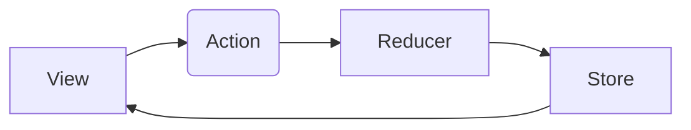

## 6.4.1 Overview of Redux

In the realm of modern application development, managing state efficiently is crucial, especially as applications grow in complexity. Redux emerges as a powerful state management tool, offering a predictable state container that is particularly beneficial for large-scale applications. This section delves into the core concepts of Redux, its workflow, implementation in Flutter, and considerations for its use.

### What is Redux?

Redux is a state management library that provides a predictable state container for JavaScript apps. It is particularly popular in the React ecosystem but is versatile enough to be used with other frameworks, including Flutter. The primary goal of Redux is to centralize the app's state in a single store, making state changes more traceable and manageable. This centralization allows developers to maintain a consistent state across the application, facilitating debugging and testing.

### Core Concepts of Redux

Understanding Redux requires familiarity with its core concepts: Store, Actions, and Reducers. These components work together to manage the application's state in a predictable manner.

#### Store

The Store is the heart of a Redux application. It holds the entire state of the app in a single object. This central repository of state ensures that all parts of the application can access the state in a consistent manner. The Store is immutable, meaning that the state cannot be changed directly. Instead, the state is updated through a process involving actions and reducers.

#### Actions

Actions are plain JavaScript objects that describe a change in the state. They are the only source of information for the Store. Actions must have a `type` property that indicates the type of action being performed. Additional data required to update the state can be included in the action object. Actions are dispatched to the Store, triggering the reducers to calculate the new state.

#### Reducers

Reducers are pure functions that take the current state and an action as arguments and return a new state. They specify how the application's state changes in response to actions. Since reducers are pure functions, they do not modify the original state but return a new state object, ensuring immutability.

### Redux Workflow

The Redux workflow is a unidirectional data flow that ensures a predictable state management process. The following Mermaid.js flowchart illustrates the Redux data flow:



1. **View**: The user interacts with the view, triggering an action.
2. **Action**: The action is dispatched to the Store.
3. **Reducer**: The reducer processes the action and the current state to produce a new state.
4. **Store**: The Store updates with the new state, and the view re-renders to reflect the changes.

### Implementing Redux in Flutter

To integrate Redux into a Flutter application, the `flutter_redux` package is commonly used. This package provides bindings that allow Flutter widgets to interact with the Redux Store.

#### Setting Up Redux in Flutter

1. **Add Dependencies**: First, add the `flutter_redux` package to your `pubspec.yaml` file.

   ```yaml
   dependencies:
     flutter:
       sdk: flutter
     flutter_redux: ^0.8.2
     redux: ^4.0.0
   ```

2. **Define Actions**: Create action classes to represent the different actions in your application.

   ```dart
   class IncrementAction {}
   class DecrementAction {}
   ```

3. **Create a Reducer**: Define a reducer function that updates the state based on the action received.

   ```dart
   int counterReducer(int state, dynamic action) {
     if (action is IncrementAction) {
       return state + 1;
     } else if (action is DecrementAction) {
       return state - 1;
     }
     return state;
   }
   ```

4. **Initialize the Store**: Create a Store instance, passing the reducer and an initial state.

   ```dart
   final store = Store<int>(counterReducer, initialState: 0);
   ```

5. **Connect the Store to the App**: Use the `StoreProvider` widget to make the Store available to the widget tree.

   ```dart
   void main() {
     runApp(MyApp());
   }

   class MyApp extends StatelessWidget {
     @override
     Widget build(BuildContext context) {
       return StoreProvider<int>(
         store: store,
         child: MaterialApp(
           home: CounterScreen(),
         ),
       );
     }
   }
   ```

6. **Access the Store in Widgets**: Use the `StoreConnector` widget to connect the Store to your widgets.

   ```dart
   class CounterScreen extends StatelessWidget {
     @override
     Widget build(BuildContext context) {
       return Scaffold(
         appBar: AppBar(title: Text('Redux Counter')),
         body: StoreConnector<int, String>(
           converter: (store) => store.state.toString(),
           builder: (context, count) {
             return Center(
               child: Text(
                 count,
                 style: TextStyle(fontSize: 24.0),
               ),
             );
           },
         ),
         floatingActionButton: Column(
           mainAxisAlignment: MainAxisAlignment.end,
           children: [
             FloatingActionButton(
               onPressed: () => StoreProvider.of<int>(context).dispatch(IncrementAction()),
               child: Icon(Icons.add),
             ),
             SizedBox(height: 10),
             FloatingActionButton(
               onPressed: () => StoreProvider.of<int>(context).dispatch(DecrementAction()),
               child: Icon(Icons.remove),
             ),
           ],
         ),
       );
     }
   }
   ```

### When to Use Redux

Redux is particularly suitable for complex applications where state management is critical. It offers several benefits:

- **Predictability**: The unidirectional data flow and strict structure make state changes predictable.
- **Maintainability**: Centralized state management simplifies debugging and understanding the application's data flow.
- **Testing**: The pure functions used in reducers make testing straightforward.

However, Redux can introduce additional complexity and boilerplate code, which may not be necessary for smaller applications. In such cases, simpler state management solutions like Provider or Riverpod might be more appropriate.

### Considerations

Before adopting Redux, consider the following:

- **Complexity**: Redux can add complexity to your application, especially if the app is small or medium-sized.
- **Boilerplate Code**: Setting up Redux involves writing a significant amount of boilerplate code, which can be cumbersome for simple applications.
- **Learning Curve**: Developers new to Redux may face a steep learning curve due to its concepts and architecture.

### Conclusion

Redux is a powerful tool for managing state in complex applications, offering predictability, maintainability, and ease of testing. By centralizing state in a single store and using a unidirectional data flow, Redux simplifies the process of managing application state. However, developers should weigh the benefits against the potential complexity and boilerplate code, opting for simpler solutions when appropriate.

## Quiz Time!



### What is the primary purpose of Redux?

- [x] To centralize the app's state in a single store
- [ ] To enhance the UI design
- [ ] To improve network requests
- [ ] To manage user authentication

> **Explanation:** Redux centralizes the app's state in a single store, making state changes more traceable and manageable.

### What is the role of a reducer in Redux?

- [x] To calculate the new state based on the current state and an action
- [ ] To dispatch actions to the store
- [ ] To render the UI components
- [ ] To handle network requests

> **Explanation:** Reducers are pure functions that take the current state and an action, and return a new state.

### Which package is commonly used to implement Redux in Flutter?

- [x] flutter_redux
- [ ] flutter_bloc
- [ ] provider
- [ ] riverpod

> **Explanation:** The `flutter_redux` package provides bindings to integrate Redux with Flutter applications.

### What is an action in Redux?

- [x] A description of a state change
- [ ] A UI component
- [ ] A network request
- [ ] A database query

> **Explanation:** Actions are plain JavaScript objects that describe a change in the state.

### What is a key benefit of using Redux?

- [x] Predictability in state management
- [ ] Reduced code complexity
- [ ] Enhanced UI design
- [ ] Faster network requests

> **Explanation:** Redux offers predictability in state management through its unidirectional data flow and centralized state.

### What is a potential drawback of using Redux?

- [x] Additional complexity and boilerplate code
- [ ] Limited scalability
- [ ] Poor performance
- [ ] Lack of community support

> **Explanation:** Redux can introduce additional complexity and boilerplate code, which may not be necessary for smaller apps.

### In Redux, where is the entire state of the app stored?

- [x] In the Store
- [ ] In the Reducer
- [ ] In the Action
- [ ] In the View

> **Explanation:** The Store holds the entire state of the app in a Redux application.

### What is the first step in the Redux workflow?

- [x] The user interacts with the view, triggering an action
- [ ] The reducer processes the action
- [ ] The store updates with the new state
- [ ] The view re-renders

> **Explanation:** The Redux workflow begins with the user interacting with the view, which triggers an action.

### How does Redux ensure immutability of the state?

- [x] By using reducers that return a new state object
- [ ] By storing state in local variables
- [ ] By using mutable data structures
- [ ] By caching state changes

> **Explanation:** Reducers are pure functions that do not modify the original state but return a new state object, ensuring immutability.

### True or False: Redux is always the best choice for state management in Flutter applications.

- [ ] True
- [x] False

> **Explanation:** Redux is not always the best choice, especially for smaller applications where simpler state management solutions may be more appropriate.


