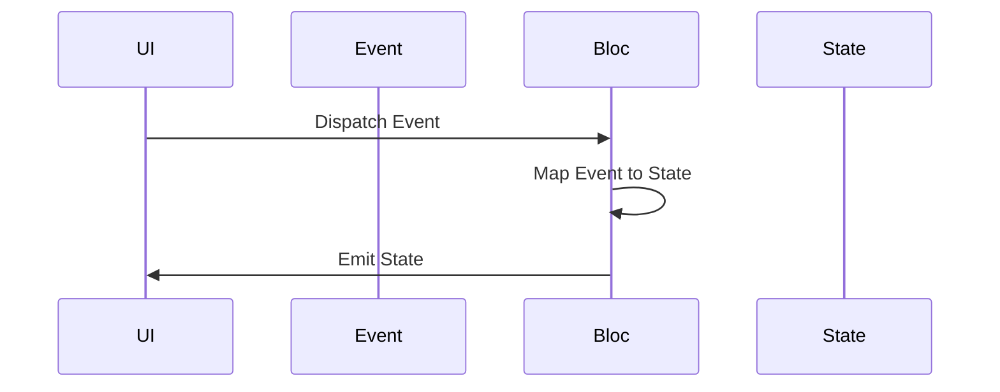

## 6.4.2 Introduction to Bloc Pattern

In the rapidly evolving world of mobile app development, managing state efficiently is crucial for building scalable and maintainable applications. Flutter, with its rich ecosystem, offers several state management solutions, among which the Bloc (Business Logic Component) pattern stands out for its robust architecture and clear separation of concerns. This section will introduce you to the Bloc pattern, its core concepts, implementation in Flutter, and its advantages, while also acknowledging the learning curve associated with it.

### What is Bloc?

The Bloc pattern is a design pattern that helps in separating the business logic from the user interface in Flutter applications. It leverages the power of Streams, a core concept in Dart, to handle state changes reactively. By using the Bloc pattern, developers can ensure that their applications are not only well-structured but also easier to test and maintain.

#### Key Characteristics of Bloc:

- **Separation of Concerns:** Bloc promotes a clear separation between the UI and the business logic, making the codebase more modular and easier to manage.
- **Reactive Programming:** By utilizing Streams, Bloc allows for reactive programming, enabling the UI to react to changes in the underlying data dynamically.
- **Testability:** With business logic encapsulated within Blocs, unit testing becomes straightforward, ensuring that the application behaves as expected.

### Core Concepts of Bloc

To effectively use the Bloc pattern, it's essential to understand its core components: Events, Bloc, and States.

#### Events

Events are the triggers that initiate state changes within the Bloc. They can be user interactions, such as button clicks or form submissions, or other triggers like network responses or timer events. Events are dispatched to the Bloc, which then processes them to produce new states.

#### Bloc

The Bloc acts as the central hub that receives events and emits new states. It listens for incoming events, processes them, and maps them to the appropriate states. This mapping is where the business logic resides, making Bloc the heart of the pattern.

#### States

States represent the current condition of the UI or data at any given time. They are the output of the Bloc after processing events. The UI listens for state changes and updates itself accordingly, ensuring that it always reflects the latest data.

### Implementing Bloc in Flutter

To implement the Bloc pattern in Flutter, the `flutter_bloc` package is commonly used. This package provides a set of tools and utilities to simplify the integration of the Bloc pattern into Flutter applications.

#### Step-by-Step Implementation

1. **Add the `flutter_bloc` Package:**

   Begin by adding the `flutter_bloc` package to your `pubspec.yaml` file:

   ```yaml
   dependencies:
     flutter:
       sdk: flutter
     flutter_bloc: ^8.0.0
   ```

2. **Define Events:**

   Events are typically defined as classes. For example, consider a counter application where we want to increment and decrement a counter:

   ```dart
   abstract class CounterEvent {}

   class Increment extends CounterEvent {}

   class Decrement extends CounterEvent {}
   ```

3. **Define States:**

   States are also defined as classes. In the counter example, the state can simply be the current counter value:

   ```dart
   class CounterState {
     final int counterValue;

     CounterState(this.counterValue);
   }
   ```

4. **Create the Bloc Class:**

   The Bloc class receives events and emits states. Here's how you can implement a simple CounterBloc:

   ```dart
   import 'package:flutter_bloc/flutter_bloc.dart';

   class CounterBloc extends Bloc<CounterEvent, CounterState> {
     CounterBloc() : super(CounterState(0));

     @override
     Stream<CounterState> mapEventToState(CounterEvent event) async* {
       if (event is Increment) {
         yield CounterState(state.counterValue + 1);
       } else if (event is Decrement) {
         yield CounterState(state.counterValue - 1);
       }
     }
   }
   ```

5. **Integrate Bloc with UI:**

   Use the `BlocProvider` and `BlocBuilder` widgets to integrate the Bloc with your Flutter UI:

   ```dart
   import 'package:flutter/material.dart';
   import 'package:flutter_bloc/flutter_bloc.dart';

   void main() {
     runApp(MyApp());
   }

   class MyApp extends StatelessWidget {
     @override
     Widget build(BuildContext context) {
       return MaterialApp(
         home: BlocProvider(
           create: (context) => CounterBloc(),
           child: CounterScreen(),
         ),
       );
     }
   }

   class CounterScreen extends StatelessWidget {
     @override
     Widget build(BuildContext context) {
       return Scaffold(
         appBar: AppBar(title: Text('Counter')),
         body: BlocBuilder<CounterBloc, CounterState>(
           builder: (context, state) {
             return Center(
               child: Text('Counter: ${state.counterValue}'),
             );
           },
         ),
         floatingActionButton: Column(
           mainAxisAlignment: MainAxisAlignment.end,
           children: [
             FloatingActionButton(
               onPressed: () => context.read<CounterBloc>().add(Increment()),
               child: Icon(Icons.add),
             ),
             SizedBox(height: 8),
             FloatingActionButton(
               onPressed: () => context.read<CounterBloc>().add(Decrement()),
               child: Icon(Icons.remove),
             ),
           ],
         ),
       );
     }
   }
   ```

### Bloc Workflow

Understanding the workflow of the Bloc pattern is crucial for its effective implementation. The following Mermaid.js sequence diagram illustrates the typical flow of events and states in a Bloc:



### Advantages of Bloc

The Bloc pattern offers several advantages that make it a popular choice among Flutter developers:

- **Separation of Concerns:** By clearly separating the UI from the business logic, Bloc makes the codebase more organized and maintainable.
- **Testability:** With business logic encapsulated within Blocs, unit tests can be written easily to verify the correctness of the logic.
- **Reactive Programming:** Bloc leverages Streams, allowing the UI to react to data changes in real-time, providing a smooth user experience.

### Learning Curve

While the Bloc pattern offers numerous benefits, it can be complex for beginners to grasp initially. The concept of Streams, along with the separation of events and states, may require some time to understand fully. However, with practice and by studying examples and documentation, developers can master the Bloc pattern and leverage its full potential in their applications.

#### Tips for Learning Bloc:

- **Start Small:** Begin with simple examples to understand the basic concepts of events, states, and Bloc.
- **Explore Documentation:** The [Bloc library documentation](https://bloclibrary.dev/#/) provides comprehensive guides and examples.
- **Practice:** Implement small projects or features using Bloc to gain hands-on experience.

### Conclusion

The Bloc pattern is a powerful tool for managing state in Flutter applications. By separating the UI from the business logic and utilizing Streams for reactive programming, Bloc enables developers to build scalable, maintainable, and testable applications. While it may have a steep learning curve, the benefits it offers make it a worthwhile investment for any Flutter developer.

## Quiz Time!



### What is the primary purpose of the Bloc pattern in Flutter?

- [x] To separate UI from business logic
- [ ] To enhance UI animations
- [ ] To improve network performance
- [ ] To simplify database operations

> **Explanation:** The Bloc pattern is designed to separate the UI from business logic, making the codebase more modular and maintainable.

### Which core concept of Bloc represents the current state of the UI?

- [ ] Events
- [ ] Bloc
- [x] States
- [ ] Widgets

> **Explanation:** States represent the current condition of the UI or data at any given time.

### What package is commonly used to implement Bloc in Flutter?

- [ ] flutter_state
- [x] flutter_bloc
- [ ] flutter_stream
- [ ] flutter_redux

> **Explanation:** The `flutter_bloc` package is commonly used to implement the Bloc pattern in Flutter applications.

### In the Bloc pattern, what triggers state changes?

- [ ] Widgets
- [x] Events
- [ ] Streams
- [ ] UI

> **Explanation:** Events are the triggers that initiate state changes within the Bloc.

### What is the role of the Bloc in the Bloc pattern?

- [ ] To render the UI
- [x] To map events to states
- [ ] To manage database connections
- [ ] To handle network requests

> **Explanation:** The Bloc receives events and maps them to states, encapsulating the business logic.

### Which of the following is an advantage of using Bloc?

- [x] Promotes separation of concerns
- [ ] Increases code complexity
- [ ] Reduces testability
- [ ] Slows down app performance

> **Explanation:** Bloc promotes separation of concerns, making the codebase more organized and maintainable.

### What is a common challenge when learning Bloc?

- [ ] Lack of documentation
- [x] Complexity for beginners
- [ ] Limited community support
- [ ] Poor performance

> **Explanation:** The Bloc pattern can be complex for beginners due to its use of Streams and separation of events and states.

### How does Bloc handle state changes?

- [ ] Through direct manipulation of UI
- [x] Using Streams
- [ ] By modifying global variables
- [ ] Through HTTP requests

> **Explanation:** Bloc uses Streams to handle state changes reactively.

### What should you do to effectively learn Bloc?

- [x] Start with simple examples
- [ ] Avoid reading documentation
- [ ] Focus only on UI components
- [ ] Ignore testing

> **Explanation:** Starting with simple examples and exploring documentation are effective ways to learn Bloc.

### True or False: Bloc makes it difficult to test business logic.

- [ ] True
- [x] False

> **Explanation:** Bloc encapsulates business logic within Blocs, making it easier to write unit tests and verify correctness.


