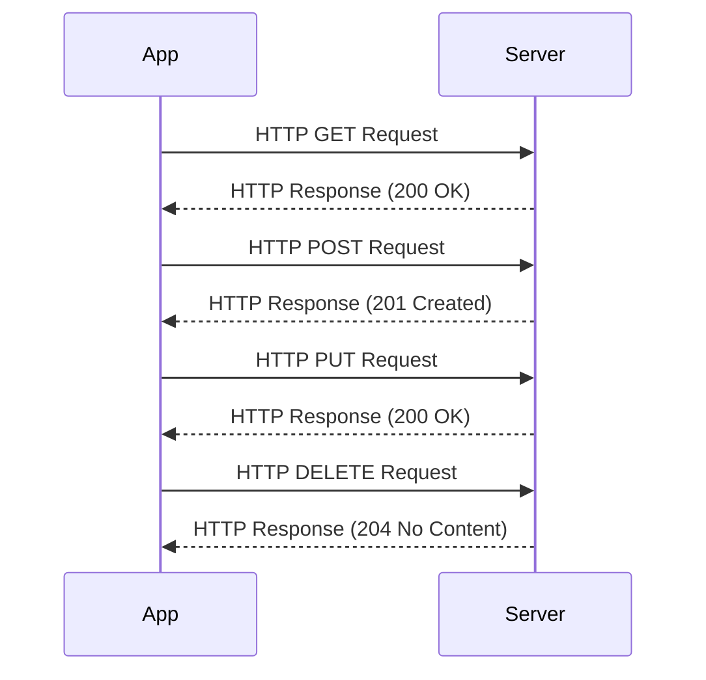

## 7.1.1 HTTP Requests with `http` Package

In the digital age, networking is the backbone of modern applications. From social media platforms to e-commerce sites, the ability to fetch and send data over the internet is crucial. This chapter delves into how Flutter developers can harness the power of the `http` package to make HTTP requests, enabling their apps to access APIs, download content, and interact with web services seamlessly.

### Introduction to Networking

Networking in mobile applications allows for dynamic content, real-time updates, and interaction with remote servers. Whether it's fetching the latest news, uploading a photo, or syncing data across devices, HTTP requests are the conduit through which apps communicate with the web. Understanding how to efficiently make these requests is essential for any Flutter developer aiming to create robust and responsive applications.

### Adding the `http` Package

To start making HTTP requests in Flutter, you need to add the `http` package to your project. This package provides a high-level API for making HTTP requests, making it easier to interact with web services.

1. **Update `pubspec.yaml`:**

   Add the `http` package under the dependencies section:

   ```yaml
   dependencies:
     http: ^0.13.0
   ```

2. **Install the Package:**

   Run the following command in your terminal to install the package:

   ```bash
   flutter pub get
   ```

### Basic Usage of `http` Package

Once the package is added, you can import it into your Dart code to start making HTTP requests.

```dart
import 'package:http/http.dart' as http;
```

This import statement allows you to use the `http` package's functionality with a simple prefix.

### Making GET Requests

GET requests are used to retrieve data from a server. Here's a simple example of making a GET request using the `http` package:

```dart
Future<void> fetchData() async {
  final response = await http.get(Uri.parse('https://api.example.com/data'));

  if (response.statusCode == 200) {
    // Parse the JSON response
    print(response.body);
  } else {
    // Handle the error
    print('Request failed with status: ${response.statusCode}.');
  }
}
```

#### Explain the Code

- **Asynchronous Request:** The `await` keyword is used to asynchronously wait for the HTTP response. This prevents the UI from freezing while the request is being processed.
- **Status Code Check:** The `statusCode` property of the response is checked to determine if the request was successful. A status code of 200 indicates success.
- **Response Body:** The `response.body` contains the data returned by the server, which can be parsed and used within the app.

### Making POST Requests

POST requests are used to send data to a server. Here's how you can make a POST request with a JSON body:

```dart
import 'dart:convert';

Future<void> sendData(Map<String, dynamic> data) async {
  final response = await http.post(
    Uri.parse('https://api.example.com/data'),
    headers: {'Content-Type': 'application/json'},
    body: jsonEncode(data),
  );

  if (response.statusCode == 201) {
    print('Data sent successfully.');
  } else {
    print('Request failed with status: ${response.statusCode}.');
  }
}
```

#### Explain the Code

- **Content-Type Header:** The `Content-Type` header is set to `application/json` to indicate that the request body contains JSON data.
- **JSON Encoding:** The `jsonEncode` function is used to convert the `data` map into a JSON string, which is then sent in the request body.

### Handling Common HTTP Methods

Besides GET and POST, there are other HTTP methods like PUT, DELETE, and PATCH that are commonly used in RESTful APIs.

- **PUT:** Used to update existing data on the server.
- **DELETE:** Used to remove data from the server.
- **PATCH:** Similar to PUT but used for partial updates.

Here's a brief example of a PUT request:

```dart
Future<void> updateData(int id, Map<String, dynamic> data) async {
  final response = await http.put(
    Uri.parse('https://api.example.com/data/$id'),
    headers: {'Content-Type': 'application/json'},
    body: jsonEncode(data),
  );

  if (response.statusCode == 200) {
    print('Data updated successfully.');
  } else {
    print('Request failed with status: ${response.statusCode}.');
  }
}
```

### Error Handling

Network errors, timeouts, and exceptions are inevitable when dealing with HTTP requests. Proper error handling ensures that your app can gracefully handle these situations.

- **Try-Catch Blocks:** Use try-catch blocks to manage exceptions and provide user-friendly error messages.

```dart
try {
  final response = await http.get(Uri.parse('https://api.example.com/data'));
  // Process response
} catch (e) {
  print('An error occurred: $e');
}
```

- **Timeouts:** You can set a timeout for requests to prevent them from hanging indefinitely.

```dart
try {
  final response = await http.get(Uri.parse('https://api.example.com/data')).timeout(Duration(seconds: 10));
  // Process response
} catch (e) {
  print('An error occurred: $e');
}
```

### Best Practices

- **Error Handling:** Always handle errors gracefully and provide feedback to the user.
- **Secure API Keys:** Never hardcode API keys or sensitive data in your app. Use environment variables or secure storage solutions.
- **Efficient Data Parsing:** Use libraries like `json_serializable` to efficiently parse JSON data into Dart objects.

### Practice Exercises

To reinforce your understanding, try creating a simple app that fetches data from a public API and displays it. Experiment with different endpoints and parameters to see how they affect the response.

1. **Fetch and Display Data:**

   Create an app that fetches a list of items from a public API and displays them in a list view.

2. **Experiment with Endpoints:**

   Modify the endpoint URL to fetch different types of data and observe how the app's behavior changes.

3. **Implement Error Handling:**

   Simulate network errors and implement error handling to ensure the app remains responsive.

### Visualizing HTTP Requests

To better understand the flow of HTTP requests and responses, let's visualize the process using a sequence diagram:



This diagram illustrates the typical interaction between a Flutter app and a server during various HTTP operations.

## Quiz Time!



### What is the primary purpose of the `http` package in Flutter?

- [x] To make HTTP requests to web services.
- [ ] To handle local database operations.
- [ ] To manage state within the app.
- [ ] To render UI components.

> **Explanation:** The `http` package is used to make HTTP requests, allowing the app to interact with web services.

### Which HTTP method is used to retrieve data from a server?

- [x] GET
- [ ] POST
- [ ] PUT
- [ ] DELETE

> **Explanation:** The GET method is used to request data from a specified resource.

### How do you specify the content type for a POST request in the `http` package?

- [x] By setting the `Content-Type` header to `application/json`.
- [ ] By using a special JSON function.
- [ ] By encoding the data in XML format.
- [ ] By using a POST-specific method.

> **Explanation:** The `Content-Type` header is set to `application/json` to indicate the data format being sent.

### What is the purpose of the `await` keyword in HTTP requests?

- [x] To wait for the HTTP response asynchronously.
- [ ] To block the UI until the request completes.
- [ ] To parallelize multiple requests.
- [ ] To handle errors automatically.

> **Explanation:** The `await` keyword is used to asynchronously wait for the completion of an HTTP request.

### Which HTTP method is typically used for updating existing data?

- [x] PUT
- [ ] GET
- [ ] DELETE
- [ ] HEAD

> **Explanation:** The PUT method is used to update existing resources on the server.

### How can you handle network errors in Flutter?

- [x] By using try-catch blocks.
- [ ] By ignoring them.
- [ ] By using a special error-handling library.
- [ ] By restarting the app.

> **Explanation:** Try-catch blocks are used to handle exceptions and errors that occur during HTTP requests.

### What should you do to prevent a request from hanging indefinitely?

- [x] Set a timeout for the request.
- [ ] Use a faster internet connection.
- [ ] Increase the server's response time.
- [ ] Use a different HTTP method.

> **Explanation:** Setting a timeout ensures that the request does not hang indefinitely if the server does not respond.

### Why is it important to secure API keys in your app?

- [x] To prevent unauthorized access to your services.
- [ ] To make the app run faster.
- [ ] To improve the app's UI.
- [ ] To reduce the app's size.

> **Explanation:** Securing API keys prevents unauthorized access and protects sensitive data.

### What is the function of the `statusCode` property in an HTTP response?

- [x] To indicate the success or failure of the request.
- [ ] To provide the size of the response.
- [ ] To specify the type of data returned.
- [ ] To list the headers used.

> **Explanation:** The `statusCode` indicates whether the request was successful or if an error occurred.

### True or False: The `http` package can only be used for GET and POST requests.

- [ ] True
- [x] False

> **Explanation:** The `http` package supports various HTTP methods, including GET, POST, PUT, DELETE, and PATCH.



By mastering the `http` package, you empower your Flutter applications to effectively communicate with the web, unlocking a world of possibilities for dynamic and interactive app experiences.
