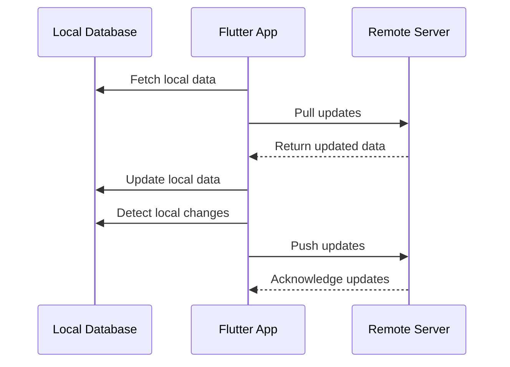

## 7.4.4 Data Synchronization

In the world of mobile app development, data synchronization is a critical component that ensures consistency between local data stored on a device and data stored on a remote server. This section delves into the intricacies of data synchronization in Flutter, providing a comprehensive guide on implementing effective sync logic, resolving conflicts, and handling synchronization failures.

### Synchronizing Local and Remote Data

Data synchronization is essential for applications that need to operate offline and then update the server once connectivity is restored. This capability is crucial for providing a seamless user experience, as it allows users to continue using the app without interruption, even when network connectivity is unstable or unavailable.

#### Why Synchronize Data?

- **Consistency:** Ensures that all users see the same data, regardless of the device they are using.
- **Reliability:** Allows the app to function offline and sync changes when online.
- **User Experience:** Provides a seamless experience by minimizing disruptions due to network issues.

### Implementing Sync Logic

Implementing synchronization logic involves two main operations: pulling updates from the server and pushing updates to the server.

#### Pull Updates

Pulling updates involves fetching new or updated data from the server. This can be done at regular intervals or when the app starts. Here’s how you can implement this in Flutter:

```dart
import 'package:http/http.dart' as http;
import 'dart:convert';

Future<void> fetchUpdates() async {
  try {
    final response = await http.get(Uri.parse('https://api.example.com/data'));
    if (response.statusCode == 200) {
      final data = jsonDecode(response.body);
      // Update local database with fetched data
      updateLocalDatabase(data);
    } else {
      throw Exception('Failed to load data');
    }
  } catch (e) {
    print('Error fetching updates: $e');
  }
}

void updateLocalDatabase(dynamic data) {
  // Logic to update local database
}
```

#### Push Updates

Pushing updates involves sending locally changed data to the server. This should be done when connectivity is available to ensure data consistency.

```dart
Future<void> pushUpdates(dynamic localData) async {
  try {
    final response = await http.post(
      Uri.parse('https://api.example.com/update'),
      headers: {'Content-Type': 'application/json'},
      body: jsonEncode(localData),
    );

    if (response.statusCode == 200) {
      print('Data successfully pushed to server');
    } else {
      throw Exception('Failed to push data');
    }
  } catch (e) {
    print('Error pushing updates: $e');
  }
}
```

### Conflict Resolution Strategies

Data conflicts can occur when changes are made to the same data on both the client and server. Effective conflict resolution strategies are crucial to maintaining data integrity.

#### Last Write Wins

In this strategy, the most recent change overwrites previous ones. It’s simple but can lead to data loss if not carefully managed.

```dart
void resolveConflictLastWriteWins(dynamic localData, dynamic serverData) {
  if (localData['timestamp'] > serverData['timestamp']) {
    // Local data is more recent
    pushUpdates(localData);
  } else {
    // Server data is more recent
    updateLocalDatabase(serverData);
  }
}
```

#### Merge Changes

This strategy involves combining changes from different sources. It requires a more complex implementation but can preserve more data.

```dart
dynamic mergeChanges(dynamic localData, dynamic serverData) {
  // Example merge logic
  return {
    'field1': localData['field1'] ?? serverData['field1'],
    'field2': serverData['field2'] ?? localData['field2'],
    // More fields...
  };
}
```

#### User Intervention

In some cases, it might be best to prompt the user to resolve conflicts, especially when automatic resolution could lead to significant data loss.

```dart
void promptUserForConflictResolution(dynamic localData, dynamic serverData) {
  // Display a dialog to the user to resolve the conflict
  // Example: showDialog(...)
}
```

### Using Timestamps and Versioning

Assigning timestamps or version numbers to data entries is a common practice to manage synchronization. This helps in determining which data is more recent and should be prioritized during conflicts.

```dart
class DataEntry {
  final String id;
  final String content;
  final DateTime timestamp;
  final int version;

  DataEntry({required this.id, required this.content, required this.timestamp, required this.version});
}
```

### Handling Synchronization Failures

Synchronization failures can occur due to network issues or server errors. Implementing retry mechanisms and error logging can help mitigate these issues.

#### Retry Mechanisms

Implementing a retry mechanism ensures that failed sync attempts are retried until successful.

```dart
Future<void> retrySync(Function syncFunction, {int retries = 3}) async {
  int attempt = 0;
  while (attempt < retries) {
    try {
      await syncFunction();
      return;
    } catch (e) {
      attempt++;
      if (attempt >= retries) {
        print('Failed to sync after $retries attempts');
      }
    }
  }
}
```

#### Error Logging and Alerts

Logging errors and alerting users or developers can help in diagnosing and fixing issues quickly.

```dart
void logError(String message) {
  // Log error to a file or monitoring service
  print('Error: $message');
}
```

### Best Practices

- **Minimize Data Transfer:** Sync only changed data to reduce network usage and improve performance.
- **Encrypt Data:** Ensure data is encrypted during transmission and storage to protect user privacy.

### Practice Exercises

1. **Implement Data Synchronization:** Build a Flutter app that synchronizes data between local storage and a remote server.
2. **Simulate Conflicts:** Create scenarios where data conflicts occur and test different conflict resolution strategies.

### Visualizing Data Synchronization

To better understand the flow of data synchronization, consider the following diagram illustrating the process:



### Conclusion

Data synchronization is a vital aspect of modern app development, ensuring that users have a consistent and reliable experience across devices. By implementing robust synchronization logic, handling conflicts effectively, and following best practices, you can create apps that are both efficient and user-friendly.

## Quiz Time!



### What is the primary purpose of data synchronization in mobile apps?

- [x] To ensure consistency between local and remote data
- [ ] To improve app performance
- [ ] To reduce data usage
- [ ] To enhance app security

> **Explanation:** Data synchronization ensures that local data on a device is consistent with data stored on a remote server, providing a seamless user experience.

### Which of the following is a strategy for resolving data conflicts?

- [x] Last Write Wins
- [ ] First Write Wins
- [ ] Data Overwrite
- [ ] User Ignorance

> **Explanation:** Last Write Wins is a common strategy where the most recent change overwrites previous ones.

### How can you minimize data transfer during synchronization?

- [x] Sync only changed data
- [ ] Sync all data every time
- [ ] Use larger data packets
- [ ] Increase sync frequency

> **Explanation:** By syncing only changed data, you reduce the amount of data transferred, improving efficiency.

### What is a common method to determine which data is more recent?

- [x] Using timestamps
- [ ] Using data size
- [ ] Using data type
- [ ] Using data source

> **Explanation:** Timestamps help identify the most recent data, aiding in conflict resolution.

### What should you do if a sync attempt fails due to network issues?

- [x] Implement a retry mechanism
- [ ] Ignore the failure
- [ ] Delete local data
- [ ] Alert the user immediately

> **Explanation:** A retry mechanism attempts to sync again, increasing the chances of success once connectivity is restored.

### Why is it important to encrypt data during transmission?

- [x] To protect user privacy
- [ ] To reduce data size
- [ ] To increase sync speed
- [ ] To simplify data processing

> **Explanation:** Encryption protects data from unauthorized access during transmission, ensuring user privacy.

### Which conflict resolution strategy involves user input?

- [x] User Intervention
- [ ] Last Write Wins
- [ ] Merge Changes
- [ ] Automatic Resolution

> **Explanation:** User Intervention prompts the user to resolve conflicts, especially when automatic resolution might lead to data loss.

### What is the role of version numbers in data synchronization?

- [x] To track changes and manage conflicts
- [ ] To increase data size
- [ ] To simplify data structure
- [ ] To enhance app performance

> **Explanation:** Version numbers help track changes and manage conflicts by indicating the sequence of updates.

### How can you handle synchronization failures effectively?

- [x] Use retry mechanisms and error logging
- [ ] Ignore errors and continue
- [ ] Increase sync frequency
- [ ] Reduce data size

> **Explanation:** Retry mechanisms and error logging help ensure that synchronization eventually succeeds and issues are diagnosed.

### True or False: Data synchronization is only necessary for apps that operate offline.

- [ ] True
- [x] False

> **Explanation:** Data synchronization is important for all apps that need to maintain consistency between local and remote data, regardless of offline capabilities.


