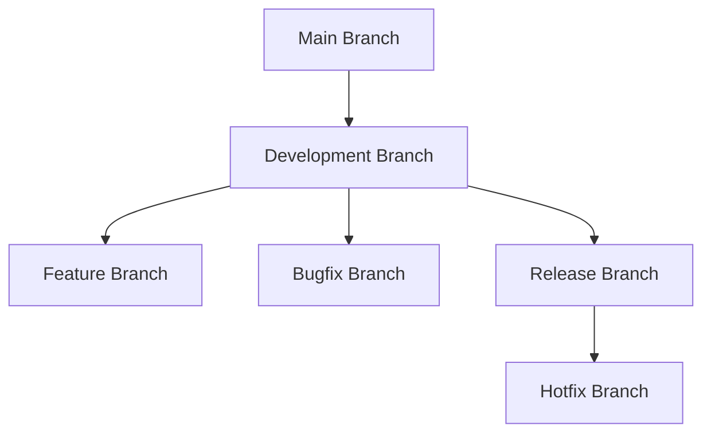

## 9.4.3 Updating Your App

Updating your app is a crucial part of the development lifecycle. It not only ensures that your app remains relevant and functional but also helps in maintaining user engagement and satisfaction. In this section, we will explore the comprehensive process of updating your Flutter app, covering everything from planning and implementing updates to monitoring post-update performance and communicating with users.

### Planning Updates

**Establishing a Release Schedule**

One of the first steps in planning updates is to establish a release schedule. This schedule can be weekly, bi-weekly, or monthly, depending on the complexity of your app and the resources available. A consistent release schedule helps in setting expectations for your users and allows your team to plan and prioritize tasks effectively.

- **Weekly Releases:** Suitable for apps with frequent bug fixes and minor feature additions.
- **Bi-Weekly Releases:** Ideal for balancing new features, improvements, and bug fixes.
- **Monthly Releases:** Best for major updates and significant feature rollouts.

**Balancing Features, Improvements, and Bug Fixes**

When planning updates, it's essential to strike a balance between introducing new features, making improvements, and fixing bugs. This balance ensures that your app remains competitive while maintaining a high level of quality and reliability.

- **New Features:** Keep your app fresh and engaging by introducing new functionalities.
- **Improvements:** Enhance existing features to improve user experience and performance.
- **Bug Fixes:** Address known issues to maintain app stability and user satisfaction.

### Managing Version Control

Version control is a critical aspect of managing updates. It allows you to track changes, collaborate with team members, and maintain a history of your project's evolution.

**Using Git for Code Management**

Git is a widely used version control system that provides robust tools for managing code changes. It allows you to create branches, merge changes, and revert to previous states if necessary.

- **Branching Strategies:** Implement a branching strategy that suits your development workflow. Common strategies include:
  - **Feature Branching:** Create a new branch for each feature or bug fix.
  - **Release Branching:** Use a separate branch for preparing releases.
  - **Hotfix Branching:** Quickly address critical issues with a dedicated hotfix branch.

**Implementing Branching Strategies**

A well-defined branching strategy helps in organizing your codebase and streamlining the development process. Here's a typical branching strategy you can adopt:

This strategy allows for parallel development of features and bug fixes while maintaining a stable release branch for production-ready code.

### Implementing Updates

Implementing updates involves making changes to your app's codebase and ensuring that these changes are introduced in a controlled and manageable manner.

**Incremental Changes**

Introducing changes incrementally reduces the risk of introducing new bugs and makes it easier to identify and fix issues. It also allows for more frequent updates, keeping your app fresh and responsive to user feedback.

- **Small, Manageable Changes:** Break down large updates into smaller, manageable tasks.
- **Continuous Integration:** Use continuous integration tools to automate testing and deployment of incremental changes.

**Deprecation Strategy**

As your app evolves, some features may become outdated or unnecessary. It's important to have a strategy for deprecating these features while providing alternatives or migration paths for users.

- **Phasing Out Features:** Gradually remove outdated features while communicating changes to users.
- **Providing Alternatives:** Offer new or improved features as replacements for deprecated ones.
- **Migration Paths:** Guide users through the transition process with clear instructions.

### Testing Updates

Testing is a critical step in the update process. It ensures that your app functions correctly and meets user expectations before being released.

**Conducting Thorough Testing**

Thorough testing involves checking all aspects of your app's functionality, performance, and compatibility.

- **Unit Testing:** Test individual components or functions for correctness.
- **Integration Testing:** Ensure that different parts of your app work together as expected.
- **UI Testing:** Verify that the user interface behaves correctly and is user-friendly.

**Utilizing Beta Testing**

Beta testing involves releasing your app to a limited group of users to catch issues that may not have been identified during internal testing.

- **Select a Diverse Group:** Choose beta testers who represent your app's target audience.
- **Collect Feedback:** Gather feedback on usability, performance, and any issues encountered.
- **Iterate Based on Feedback:** Make necessary changes based on the feedback received.

### Releasing Updates

Releasing updates involves submitting your app to app stores and informing users about the changes.

**Submitting to App Stores**

The submission process for updates is similar to the initial submission. However, there are additional considerations to keep in mind.

- **Version Numbers:** Increment version numbers to reflect the changes made.
- **Build Notes:** Provide detailed build notes to help reviewers understand the update.

**Writing Release Notes**

Release notes are an essential part of the update process. They inform users about the changes and improvements made in the update.

- **Clear and Informative:** Write release notes that clearly explain the changes and their benefits.
- **Engage Users:** Use release notes to engage users and encourage them to explore new features.

### Monitoring Post-Update Performance

After releasing an update, it's important to monitor your app's performance to identify any new issues or crashes.

**Watching for New Issues**

Use analytics and crash reporting tools to track your app's performance and identify any new issues that arise after an update.

- **Crash Reports:** Monitor crash reports to identify and fix critical issues quickly.
- **User Feedback:** Pay attention to user feedback to identify potential problems.

**Releasing Hotfixes**

If critical issues are identified, be prepared to release hotfixes to address them promptly.

- **Quick Response:** Respond quickly to critical issues to minimize user impact.
- **Thorough Testing:** Ensure that hotfixes are thoroughly tested before release.

### Communicating with Users

Effective communication with users is key to maintaining engagement and satisfaction.

**Informing Users About Updates**

Use in-app notifications, newsletters, or social media to inform users about updates and new features.

- **Highlight New Features:** Emphasize new features and improvements to encourage user engagement.
- **Provide Support:** Offer support and resources to help users with any issues they encounter.

### Best Practices

Following best practices ensures that your update process is efficient and effective.

**Change Management Process**

Implement a change management process to plan, implement, and monitor changes effectively.

- **Document Changes:** Keep detailed records of changes made in each update.
- **Respect User Feedback:** Listen to user feedback and make adjustments as needed.

**Practice Exercises**

To reinforce the concepts covered in this section, try the following practice exercises:

1. **Simulate Releasing an Update:** Practice releasing an update for a sample app, including planning, testing, and submitting to app stores.
2. **Develop a Plan for a New Feature:** Create a plan for implementing and testing a new feature, including branching strategy and testing plan.

By following these guidelines and best practices, you can ensure that your Flutter app remains up-to-date, functional, and engaging for your users.

## Quiz Time!



### What is the primary benefit of establishing a release schedule for your app updates?

- [x] It sets user expectations and helps in planning and prioritizing tasks.
- [ ] It allows you to skip testing phases.
- [ ] It ensures that all updates are major releases.
- [ ] It eliminates the need for version control.

> **Explanation:** A release schedule helps in setting expectations for users and allows the development team to plan and prioritize tasks effectively.

### Which version control system is widely used for managing code changes?

- [x] Git
- [ ] SVN
- [ ] Mercurial
- [ ] CVS

> **Explanation:** Git is a widely used version control system that provides robust tools for managing code changes.

### What is the purpose of a branching strategy in version control?

- [x] To organize the codebase and streamline the development process.
- [ ] To eliminate the need for testing.
- [ ] To ensure all changes are made in the main branch.
- [ ] To prevent any changes from being made to the codebase.

> **Explanation:** A branching strategy helps in organizing the codebase and streamlining the development process by allowing parallel development of features and bug fixes.

### What is a key advantage of introducing changes incrementally?

- [x] It reduces the risk of introducing new bugs.
- [ ] It allows for skipping the testing phase.
- [ ] It ensures all changes are made at once.
- [ ] It prevents user feedback from being considered.

> **Explanation:** Introducing changes incrementally reduces the risk of introducing new bugs and makes it easier to identify and fix issues.

### How can beta testing benefit the update process?

- [x] By catching issues that may not have been identified during internal testing.
- [ ] By eliminating the need for unit testing.
- [x] By providing feedback from a diverse group of users.
- [ ] By ensuring all updates are released without user input.

> **Explanation:** Beta testing helps catch issues that may not have been identified during internal testing and provides valuable feedback from a diverse group of users.

### What should be included in release notes?

- [x] Clear explanations of changes and their benefits.
- [ ] Detailed technical specifications.
- [ ] Personal opinions of the developers.
- [ ] Confidential company information.

> **Explanation:** Release notes should include clear explanations of changes and their benefits to inform and engage users.

### What is the purpose of monitoring post-update performance?

- [x] To identify any new issues or crashes after an update.
- [ ] To eliminate the need for future updates.
- [x] To gather user feedback on the update.
- [ ] To ensure all updates are perfect.

> **Explanation:** Monitoring post-update performance helps identify any new issues or crashes and gather user feedback on the update.

### How can effective communication with users be achieved?

- [x] Through in-app notifications, newsletters, or social media.
- [ ] By ignoring user feedback.
- [ ] By only communicating during major updates.
- [ ] By providing minimal information.

> **Explanation:** Effective communication with users can be achieved through in-app notifications, newsletters, or social media to inform them about updates and new features.

### What is a key aspect of a change management process?

- [x] Documenting changes thoroughly.
- [ ] Eliminating user feedback.
- [ ] Skipping the testing phase.
- [ ] Ensuring all changes are made in the main branch.

> **Explanation:** A key aspect of a change management process is documenting changes thoroughly to keep detailed records of changes made in each update.

### True or False: Hotfixes should be released without thorough testing.

- [ ] True
- [x] False

> **Explanation:** Hotfixes should be thoroughly tested before release to ensure they address critical issues without introducing new problems.


