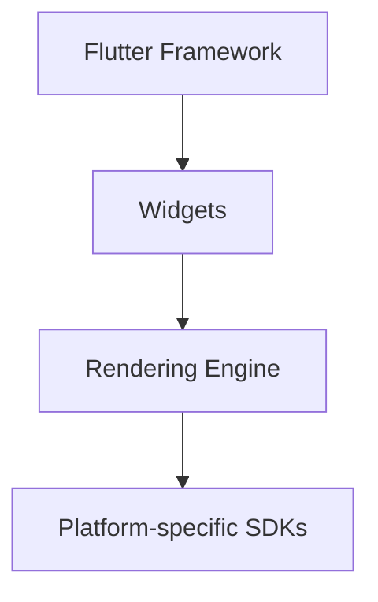

## 1.1.1 What is Flutter?

In the rapidly evolving world of app development, the demand for creating seamless, high-performance applications across multiple platforms has never been greater. Enter Flutter, an open-source UI software development toolkit created by Google, designed to address this very need. This section will provide you with a comprehensive understanding of Flutter, its architecture, and its role in the landscape of cross-platform app development.

### Definition of Flutter

Flutter is an open-source UI toolkit developed by Google, aimed at building natively compiled applications for mobile (Android and iOS), web, and desktop from a single codebase. It is renowned for its ability to deliver high-quality, high-performance apps with a consistent look and feel across different platforms. Flutter achieves this by providing its own rendering engine and a rich set of pre-designed widgets, eliminating the need for platform-specific UI components.

### Cross-Platform Development with Flutter

One of Flutter's standout features is its capability for cross-platform development. This means that developers can write a single codebase and deploy it across multiple platforms, including Android, iOS, web, Windows, macOS, and Linux. This approach significantly reduces development time and costs, as it eliminates the need to maintain separate codebases for each platform.

#### Key Benefits of Cross-Platform Development with Flutter:

- **Single Codebase**: Write once, run anywhere. This reduces the complexity and effort involved in maintaining multiple codebases.
- **Consistent UI/UX**: Flutter's widget-based architecture ensures a uniform look and feel across platforms.
- **Faster Development Cycles**: Features like hot reload allow developers to see changes in real-time, speeding up the development process.
- **Access to Native Features**: Flutter provides plugins and packages that allow developers to access native device features and APIs.

### History and Evolution of Flutter

Flutter's journey began with its initial release in May 2017. Since then, it has undergone significant evolution, marked by several key milestones:

- **Flutter 1.0**: Released in December 2018, this was the first stable version of Flutter, marking its readiness for production use.
- **Flutter for Web**: Announced in 2019, this extension brought Flutter's capabilities to the web, allowing developers to create web applications using the same codebase.
- **Flutter 2.0**: Launched in March 2021, this version introduced support for desktop applications, further expanding Flutter's cross-platform capabilities.
- **Continuous Updates**: Google has consistently updated Flutter, adding new features, improving performance, and expanding its ecosystem.

### Architecture Overview

Understanding Flutter's architecture is crucial for leveraging its full potential. At its core, Flutter consists of three main components: the Flutter engine, the foundation library, and the widget system.

#### Flutter Engine

The Flutter engine is the heart of Flutter, responsible for rendering the UI and handling input. It is written in C++ and provides low-level rendering support using Google's Skia graphics library. The engine also includes the Dart runtime, which executes the Dart code.

#### Foundation Library

The foundation library is a collection of essential classes and functions that provide basic building blocks for Flutter applications. It includes APIs for handling animations, gestures, and more.

#### Widget System

Flutter's widget system is one of its most defining features. Everything in Flutter is a widget, from buttons and text to complex layouts. Widgets are immutable and describe the configuration of a part of the UI. They can be composed to build complex UIs.

Here's a simplified diagram illustrating Flutter's architecture:

### Flutter and Dart

Flutter uses the Dart programming language, also developed by Google. Dart is an object-oriented, class-based language with a syntax similar to JavaScript. It is designed for building high-performance applications and is particularly well-suited for Flutter due to its fast compilation times and support for both ahead-of-time (AOT) and just-in-time (JIT) compilation.

#### Why Dart?

- **Performance**: Dart's AOT compilation results in fast startup times and smooth animations.
- **Productivity**: Dart's JIT compilation allows for hot reload, enabling developers to see changes instantly without restarting the app.
- **Simplicity**: Dart's syntax is easy to learn, especially for developers familiar with JavaScript or Java.

### How Flutter Differs from Other Frameworks

Flutter stands out from other cross-platform frameworks in several ways:

- **Custom Rendering**: Unlike frameworks that rely on native UI components, Flutter provides its own rendering engine and widgets. This allows for greater control over the UI and ensures consistent performance across platforms.
- **Hot Reload**: Flutter's hot reload feature is a game-changer for developers, allowing them to make changes to the code and see the results instantly without losing the app's state.
- **Rich Set of Widgets**: Flutter offers a comprehensive set of widgets for building complex UIs, along with a flexible layout system.

### Best Practices for Using Flutter

To make the most of Flutter, consider the following best practices:

- **Leverage Widgets**: Take advantage of Flutter's rich widget library to build responsive and adaptive UIs.
- **Optimize Performance**: Use tools like Flutter DevTools to profile and optimize your app's performance.
- **Stay Updated**: Keep up with the latest Flutter releases and community packages to benefit from new features and improvements.
- **Write Clean Code**: Follow Dart's style guide and use tools like `dartfmt` and `dartanalyzer` to maintain clean and readable code.

### Common Pitfalls and Troubleshooting

While Flutter simplifies many aspects of app development, developers may encounter some common pitfalls:

- **State Management**: Managing state can be challenging in complex applications. Consider using state management solutions like Provider, Riverpod, or Bloc.
- **Platform-Specific Code**: While Flutter provides many plugins, some platform-specific features may require writing native code.
- **Performance Issues**: Ensure your app is optimized for performance by minimizing widget rebuilds and using efficient data structures.

### Conclusion

Flutter is a powerful tool for cross-platform development, offering a unique combination of performance, flexibility, and ease of use. By understanding its architecture, leveraging its features, and following best practices, you can build high-quality applications that run seamlessly across multiple platforms.

## Quiz Time!



### What is Flutter primarily used for?

- [x] Building natively compiled applications for mobile, web, and desktop from a single codebase
- [ ] Creating server-side applications
- [ ] Developing operating systems
- [ ] Designing hardware components

> **Explanation:** Flutter is an open-source UI toolkit designed for building natively compiled applications across mobile, web, and desktop platforms from a single codebase.

### Which programming language does Flutter use?

- [x] Dart
- [ ] JavaScript
- [ ] Python
- [ ] Kotlin

> **Explanation:** Flutter uses the Dart programming language, which is also developed by Google, for building applications.

### What is a key feature of Flutter that speeds up development cycles?

- [x] Hot Reload
- [ ] Cold Restart
- [ ] Code Freeze
- [ ] Slow Compile

> **Explanation:** Hot Reload allows developers to see changes in real-time without restarting the app, significantly speeding up the development process.

### What is the role of the Flutter engine?

- [x] Rendering the UI and handling input
- [ ] Managing database connections
- [ ] Compiling the Dart code to JavaScript
- [ ] Providing cloud storage solutions

> **Explanation:** The Flutter engine is responsible for rendering the UI and handling input, using Google's Skia graphics library.

### How does Flutter differ from other cross-platform frameworks?

- [x] It provides its own rendering engine and widgets
- [ ] It uses native UI components
- [x] It allows for hot reload
- [ ] It only supports mobile platforms

> **Explanation:** Flutter provides its own rendering engine and widgets, allowing for greater control over the UI and ensuring consistent performance across platforms. It also supports hot reload.

### What is the significance of Flutter's widget system?

- [x] It allows for building complex UIs using a composable structure
- [ ] It limits UI customization
- [ ] It only supports static layouts
- [ ] It is incompatible with animations

> **Explanation:** Flutter's widget system allows developers to build complex UIs by composing widgets, which are the building blocks of the UI.

### Which of the following is a best practice for using Flutter?

- [x] Leverage Flutter's rich widget library
- [ ] Avoid using third-party packages
- [x] Optimize app performance using Flutter DevTools
- [ ] Write platform-specific code for every feature

> **Explanation:** Leveraging Flutter's rich widget library and optimizing app performance using Flutter DevTools are best practices for developing with Flutter.

### What is a common pitfall when using Flutter?

- [x] Managing state in complex applications
- [ ] Writing too much native code
- [ ] Using too many widgets
- [ ] Avoiding performance optimization

> **Explanation:** Managing state can be challenging in complex applications, and developers should consider using state management solutions like Provider or Bloc.

### What is the primary benefit of using a single codebase in Flutter?

- [x] Reduces development time and costs
- [ ] Increases the complexity of the app
- [ ] Limits the app to a single platform
- [ ] Requires more developers

> **Explanation:** Using a single codebase reduces development time and costs by eliminating the need to maintain separate codebases for each platform.

### True or False: Flutter applications can only be deployed on mobile platforms.

- [ ] True
- [x] False

> **Explanation:** False. Flutter applications can be deployed on mobile, web, and desktop platforms, making it a versatile tool for cross-platform development.


