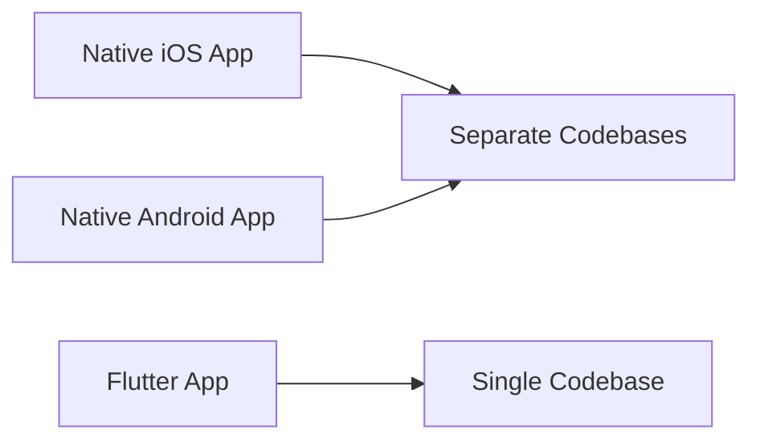

---

linkTitle: "1.1.2 Benefits of Using Flutter"
title: "Benefits of Using Flutter: Accelerate Your App Development"
description: "Discover the numerous advantages of using Flutter for app development, including hot reload, single codebase, fast performance, expressive UIs, and strong community support."
categories:
- Mobile App Development
- Flutter
- Cross-Platform Development
tags:
- Flutter
- Mobile Development
- Cross-Platform
- Hot Reload
- UI Design
date: 2024-10-25
type: docs
nav_weight: 1120

canonical: "https://fluttermasterylibrary.com/2/1/1/2"
license: "© 2023 Tokenizer Inc. CC BY-NC-SA 4.0"
---

## 1.1.2 Benefits of Using Flutter

In the rapidly evolving world of mobile app development, choosing the right framework can significantly impact the success of your project. Flutter, Google's open-source UI software development kit, has emerged as a powerful tool for developers aiming to create high-quality, cross-platform applications. This section explores the myriad benefits of using Flutter, providing compelling reasons to consider it for your next app development project.

### Hot Reload: Instant Feedback Loop

One of the standout features of Flutter is its **hot reload** capability. This feature dramatically accelerates the development process by allowing developers to see the results of their code changes almost instantly. Unlike traditional development workflows, where changes require a full app restart, Flutter's hot reload injects updated source code files into the running Dart Virtual Machine (VM). This means you can tweak your UI, fix bugs, or experiment with new features without losing the current state of your app.

#### How Hot Reload Works

When you make a change in your Flutter app's code, the hot reload feature updates the UI in less than a second. This is achieved by injecting the updated source code into the Dart VM, which then rebuilds the widget tree, reflecting the changes immediately. This rapid feedback loop not only saves time but also encourages experimentation and iterative design.

```dart
// Example of using hot reload to change a button's color
ElevatedButton(
  onPressed: () {},
  child: Text('Press Me'),
  style: ElevatedButton.styleFrom(
    primary: Colors.blue, // Change this to Colors.red and see the change instantly
  ),
)
```

### Single Codebase for Multiple Platforms

Flutter's ability to use a **single codebase** for both iOS and Android is a game-changer in the realm of app development. Traditionally, developing for multiple platforms required separate teams and codebases, leading to increased costs and longer development times. Flutter simplifies this by allowing developers to write once and deploy everywhere.

#### Efficiency and Cost-Effectiveness

By maintaining a single codebase, Flutter reduces the complexity and cost associated with managing separate codebases for different platforms. This not only streamlines the development process but also ensures consistency across platforms. Furthermore, updates and bug fixes can be implemented simultaneously for all platforms, significantly reducing maintenance overhead.



### Fast Performance: Native Speed

Performance is a critical factor in app development, and Flutter excels in this area by compiling to native code. Unlike frameworks that rely on interpreters or bridges, Flutter uses the Dart language, which compiles directly to native ARM code for both iOS and Android. This eliminates the performance bottlenecks associated with interpreted languages, resulting in smooth animations and fast load times.

#### Real-World Performance

Apps built with Flutter are known for their high performance. For instance, the Alibaba app, used by millions of users, leverages Flutter to deliver a seamless user experience with fast loading times and smooth animations. Similarly, Google's Stadia app uses Flutter to provide a responsive and engaging interface for its cloud gaming service.

### Expressive and Flexible UIs

Flutter's rich set of **customizable widgets** allows developers to create expressive and flexible user interfaces. Whether you're aiming for a sleek, modern design or a playful, colorful interface, Flutter's widget library provides the building blocks to bring your vision to life.

#### Customization and Theming

Flutter's widgets are highly customizable, enabling developers to tailor the look and feel of their apps to match their brand's identity. The framework also supports theming, allowing you to define a consistent color scheme and typography throughout your app.

```dart
// Example of a custom themed Flutter app
MaterialApp(
  theme: ThemeData(
    primarySwatch: Colors.green,
    textTheme: TextTheme(
      bodyText1: TextStyle(fontSize: 18.0, fontFamily: 'Hind'),
    ),
  ),
  home: MyHomePage(),
)
```

### Strong Community and Support

The strength of a development framework often lies in its community, and Flutter boasts a vibrant and active community of developers. This community contributes to a vast ecosystem of packages and plugins, making it easier to add functionality to your app without reinventing the wheel.

#### Continuous Improvement and Support

Backed by Google, Flutter receives regular updates and improvements, ensuring it remains at the forefront of mobile app development. The community also plays a crucial role in providing support through forums, tutorials, and open-source projects, making it easier for newcomers to get started and for seasoned developers to find solutions to complex problems.

### Real-World Examples and Testimonials

Several well-known companies have adopted Flutter for their app development needs, citing significant time savings and performance gains. For instance, Reflectly, a popular journaling app, used Flutter to reduce development time by 30% while maintaining a high-quality user experience. Similarly, the Alibaba app leveraged Flutter to create a consistent and engaging interface across multiple platforms.

### Conclusion

Flutter offers a compelling suite of features that make it an attractive choice for mobile app development. From its hot reload capability and single codebase efficiency to its fast performance and expressive UIs, Flutter empowers developers to create high-quality apps with ease. Coupled with a strong community and continuous support from Google, Flutter is poised to remain a leading framework in the mobile app development landscape.

## Quiz Time!



### What is a key feature of Flutter that allows developers to see changes instantly without restarting the app?

- [x] Hot Reload
- [ ] Cold Restart
- [ ] Live Update
- [ ] Quick Refresh

> **Explanation:** Hot reload is a feature in Flutter that allows developers to see changes instantly without restarting the app.

### How does Flutter's single codebase benefit developers?

- [x] Reduces development time and costs
- [ ] Increases complexity
- [ ] Requires separate teams for iOS and Android
- [ ] Limits app functionality

> **Explanation:** Flutter's single codebase allows developers to write once and deploy on multiple platforms, reducing development time and costs.

### What language does Flutter use to compile to native code?

- [x] Dart
- [ ] JavaScript
- [ ] Kotlin
- [ ] Swift

> **Explanation:** Flutter uses the Dart language, which compiles directly to native ARM code for both iOS and Android.

### What advantage does Flutter's widget library provide?

- [x] Customizable and expressive UIs
- [ ] Limited design options
- [ ] Requires third-party libraries for UI
- [ ] Inflexible theming

> **Explanation:** Flutter's widget library is highly customizable, allowing developers to create expressive and flexible UIs.

### Which company backs Flutter, ensuring continuous improvements and support?

- [x] Google
- [ ] Apple
- [ ] Microsoft
- [ ] Facebook

> **Explanation:** Flutter is backed by Google, which provides continuous improvements and support.

### Which app is an example of a well-known application built with Flutter?

- [x] Alibaba
- [ ] Instagram
- [ ] WhatsApp
- [ ] TikTok

> **Explanation:** The Alibaba app is a well-known application built with Flutter, showcasing its capabilities.

### How does Flutter's hot reload feature work?

- [x] Injects updated source code into the running Dart VM
- [ ] Restarts the app completely
- [ ] Compiles code in the background
- [ ] Uses a separate debugging tool

> **Explanation:** Flutter's hot reload injects updated source code into the running Dart VM, allowing for instant UI updates.

### What is a benefit of Flutter's strong community?

- [x] Access to a vast ecosystem of packages and plugins
- [ ] Limited support for new developers
- [ ] Slow response to issues
- [ ] Lack of tutorials

> **Explanation:** Flutter's strong community provides access to a vast ecosystem of packages and plugins, aiding development.

### What performance advantage does Flutter have over interpreted frameworks?

- [x] Compiles to native code
- [ ] Uses a slower interpreter
- [ ] Requires more resources
- [ ] Has higher latency

> **Explanation:** Flutter compiles to native code, eliminating performance bottlenecks associated with interpreted frameworks.

### True or False: Flutter requires separate codebases for iOS and Android.

- [x] False
- [ ] True

> **Explanation:** False. Flutter uses a single codebase for both iOS and Android, simplifying the development process.


