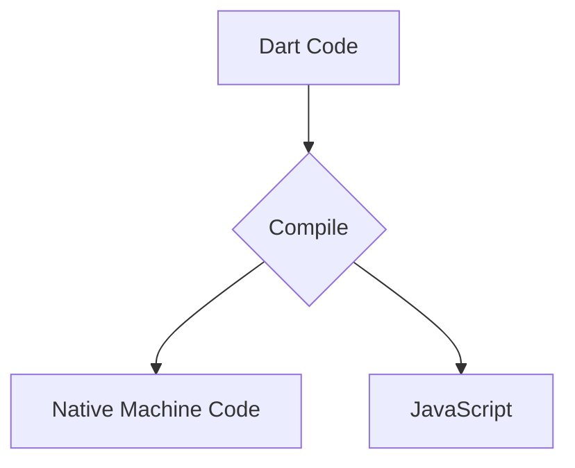

## 1.1.3 Understanding Dart Programming Language

As you embark on your journey to publish your first Flutter app, understanding the Dart programming language is crucial. Dart is the backbone of Flutter, and mastering it will empower you to build high-performance, cross-platform applications with ease. This section will introduce you to Dart, highlight its key features, and explain why it is the perfect companion for Flutter development.

### Introduction to Dart

Dart is a client-optimized programming language developed by Google. It is designed to build fast applications on any platform, including mobile, web, and desktop. Dart's syntax is clean and concise, making it easy to read and write. It combines the best features of other popular programming languages, offering a familiar experience for developers with backgrounds in Java, C#, or JavaScript.

Dart's primary goal is to provide a productive programming environment for developers. It achieves this through features like strong typing, object-oriented principles, and support for asynchronous programming. Whether you're building a mobile app with Flutter or a web application, Dart's versatility and performance make it an excellent choice.

### Key Features of Dart

Dart is packed with features that make it a powerful language for modern app development. Let's explore some of its key features:

#### Object-Oriented Principles

Dart is an object-oriented language, meaning it uses classes and objects to structure code. This approach promotes code reuse and modularity, making it easier to manage large codebases. Here's a simple example of a Dart class:

```dart
class Car {
  String brand;
  int year;

  Car(this.brand, this.year);

  void displayInfo() {
    print('Brand: $brand, Year: $year');
  }
}

void main() {
  Car myCar = Car('Toyota', 2020);
  myCar.displayInfo();
}
```

In this example, we define a `Car` class with properties `brand` and `year`. The `displayInfo` method prints the car's details. The `main` function creates an instance of `Car` and calls the method to display information.

#### Strong Typing

Dart is a strongly typed language, which means variables have specific types that are checked at compile time. This helps catch errors early and improves code reliability. Here's how you declare variables in Dart:

```dart
int number = 42;
String greeting = 'Hello, World!';
bool isActive = true;
```

Strong typing ensures that you use variables correctly, reducing runtime errors and making your code more predictable.

#### Asynchronous Programming with async/await

Asynchronous programming is essential for building responsive applications. Dart provides built-in support for asynchronous operations using `async` and `await` keywords. This makes it easy to perform tasks like network requests without blocking the main thread. Here's an example:

```dart
Future<void> fetchData() async {
  print('Fetching data...');
  await Future.delayed(Duration(seconds: 2));
  print('Data fetched!');
}

void main() {
  fetchData();
  print('Doing other work...');
}
```

In this example, `fetchData` is an asynchronous function that simulates a network request with a delay. The `await` keyword pauses execution until the operation completes, allowing other code to run concurrently.

#### Just-In-Time (JIT) and Ahead-Of-Time (AOT) Compilation

Dart supports both JIT and AOT compilation, providing flexibility and performance benefits. JIT compilation is used during development, enabling features like hot reload, which allows you to see changes instantly without restarting the app. AOT compilation is used for production builds, optimizing the app for speed and efficiency.

Here's a visual representation of how Dart compiles code:



This diagram illustrates that Dart can compile to native machine code for mobile and desktop platforms or JavaScript for web applications.

### Why Dart for Flutter?

Dart is the language of choice for Flutter development, and for good reason. Let's explore why Dart is perfectly suited for building Flutter apps:

#### Hot Reload Capability

One of the standout features of Flutter is its hot reload capability, which is made possible by Dart's JIT compilation. Hot reload allows you to see changes in your code instantly, speeding up the development process and making it easier to experiment with different designs and features.

#### High Performance

Dart's AOT compilation ensures that Flutter apps are fast and efficient. By compiling to native machine code, Dart eliminates the overhead associated with interpreted languages, resulting in smooth animations and quick response times.

#### Unified Development Experience

Dart's versatility allows you to use the same language for both frontend and backend development. This unified experience simplifies the development process and reduces the learning curve, as you don't need to switch between different languages for different parts of your application.

#### Strong Community and Ecosystem

Dart has a strong and growing community, with a wealth of resources, libraries, and tools available to developers. The Dart ecosystem is continuously expanding, providing solutions for common development challenges and enabling you to build robust applications.

### Getting Started with Dart

Now that you understand the benefits of Dart, let's dive into some basic code examples to get you started.

#### Variable Declaration

In Dart, you declare variables using the `var`, `final`, or `const` keywords. Here's a simple example:

```dart
void main() {
  var name = 'Alice'; // Inferred as String
  final age = 30; // Inferred as int, cannot be changed
  const pi = 3.14159; // Compile-time constant

  print('Name: $name, Age: $age, Pi: $pi');
}
```

In this example, `var` is used for a variable whose type is inferred. `final` is used for a variable that can be set once, and `const` is used for compile-time constants.

#### Basic Function

Functions are a fundamental part of Dart programming. Here's how you define and use a simple function:

```dart
void greet(String name) {
  print('Hello, $name!');
}

void main() {
  greet('Bob');
}
```

In this example, the `greet` function takes a `String` parameter and prints a greeting message. The `main` function calls `greet` with the argument `'Bob'`.

### Encouragement for Learning Dart

If you're new to Dart, don't worry! It's designed to be easy to learn, especially if you have experience with other programming languages like Java, C#, or JavaScript. Dart's syntax is intuitive, and its features are powerful yet straightforward.

Throughout this book, we'll cover the essential Dart concepts you need for Flutter development. By the end, you'll be comfortable writing Dart code and building Flutter apps with confidence.

### Troubleshooting Tips

As you start coding in Dart, you might encounter some common issues. Here are a few tips to help you troubleshoot:

- **Syntax Errors**: Pay attention to error messages in your IDE. They often provide clues about what's wrong with your code.
- **Type Errors**: Ensure that your variables and function parameters have the correct types. Dart's strong typing helps catch these errors early.
- **Asynchronous Code**: When working with `async` and `await`, make sure you're using them correctly to avoid unexpected behavior.

### Conclusion

Dart is a powerful and versatile language that plays a crucial role in Flutter development. Its features, performance, and ease of use make it an excellent choice for building high-quality apps. As you continue your journey, remember that learning Dart is an investment in your skills and your ability to create amazing applications.

## Quiz Time!



### What is Dart primarily designed for?

- [x] Building fast apps on any platform
- [ ] Server-side scripting
- [ ] Game development
- [ ] Data analysis

> **Explanation:** Dart is a client-optimized programming language developed by Google, designed for building fast apps on any platform, including mobile, web, and desktop.

### Which of the following is a key feature of Dart?

- [ ] Weak typing
- [x] Strong typing
- [ ] Lack of async support
- [ ] No support for object-oriented programming

> **Explanation:** Dart is a strongly typed language, which means variables have specific types that are checked at compile time, improving code reliability.

### What is the purpose of Dart's async/await feature?

- [ ] To handle exceptions
- [x] To perform asynchronous operations
- [ ] To declare variables
- [ ] To define classes

> **Explanation:** Dart's async/await feature is used for asynchronous programming, allowing tasks like network requests to be performed without blocking the main thread.

### How does Dart support high performance in Flutter apps?

- [ ] By using interpreted code
- [ ] By using only JIT compilation
- [x] By using AOT compilation
- [ ] By using dynamic typing

> **Explanation:** Dart supports high performance in Flutter apps by using AOT (Ahead-Of-Time) compilation, which compiles code to native machine code for speed and efficiency.

### What is hot reload in Flutter?

- [ ] A feature to compile code for production
- [x] A feature to see code changes instantly
- [ ] A feature to debug code
- [ ] A feature to optimize performance

> **Explanation:** Hot reload is a feature in Flutter that allows developers to see changes in their code instantly, speeding up the development process.

### Which keyword is used in Dart for a compile-time constant?

- [ ] var
- [ ] final
- [x] const
- [ ] static

> **Explanation:** The `const` keyword in Dart is used to declare compile-time constants, which are values that cannot be changed and are determined at compile time.

### What does the following Dart code do?
```dart
Future<void> fetchData() async {
  print('Fetching data...');
  await Future.delayed(Duration(seconds: 2));
  print('Data fetched!');
}
```

- [x] Simulates a network request with a delay
- [ ] Compiles code to JavaScript
- [ ] Declares a compile-time constant
- [ ] Defines a class

> **Explanation:** The code simulates a network request by using `Future.delayed` to introduce a delay, demonstrating asynchronous programming with `async` and `await`.

### In Dart, which keyword is used to declare a variable that can be set once?

- [ ] var
- [x] final
- [ ] const
- [ ] static

> **Explanation:** The `final` keyword in Dart is used to declare a variable that can be set once and cannot be changed thereafter.

### What is the main advantage of Dart's JIT compilation during development?

- [ ] It optimizes code for production
- [x] It enables hot reload
- [ ] It supports dynamic typing
- [ ] It compiles code to JavaScript

> **Explanation:** Dart's JIT (Just-In-Time) compilation during development enables hot reload, allowing developers to see code changes instantly without restarting the app.

### Dart is easy to learn for developers with experience in which languages?

- [x] Java, C#, or JavaScript
- [ ] Python, Ruby, or PHP
- [ ] C++, Rust, or Go
- [ ] Swift, Kotlin, or Objective-C

> **Explanation:** Dart is designed to be easy to learn, especially for developers with experience in Java, C#, or JavaScript, due to its familiar syntax and features.


