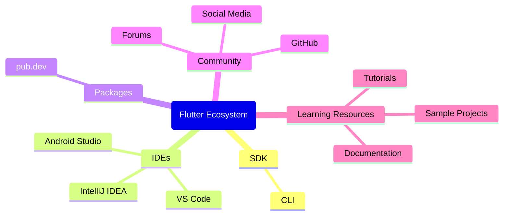

## 1.1.4 The Flutter Ecosystem

Embarking on the journey of developing your first Flutter app is an exciting endeavor. As you delve into this world, understanding the vast ecosystem surrounding Flutter is crucial. This ecosystem is not just about the SDK itself but encompasses a wide array of tools, resources, and community support that can significantly enhance your development experience. This section aims to provide a comprehensive overview of the Flutter ecosystem, guiding you through the tools, resources, and community avenues available to you.

### Flutter SDK and Tools

At the heart of the Flutter ecosystem lies the Flutter SDK, a robust toolkit that empowers developers to build natively compiled applications for mobile, web, and desktop from a single codebase. The SDK includes a rich set of pre-designed widgets, a rendering engine, and a command-line interface (CLI) that facilitates the development process.

#### Flutter SDK

The Flutter SDK is the foundation of your development environment. It is a collection of tools that allows you to build, test, and deploy Flutter applications. The SDK includes:

- **Flutter Framework**: A UI toolkit for building natively compiled applications.
- **Dart SDK**: The programming language used to write Flutter applications.
- **Flutter CLI**: A command-line tool that helps manage Flutter projects, including creating new projects, running apps, and building for different platforms.

To install the Flutter SDK, follow the official [installation guide](https://flutter.dev/docs/get-started/install) tailored for your operating system.

#### Command-Line Interface (CLI)

The Flutter CLI is a powerful tool that simplifies many tasks associated with Flutter development. Here are some common commands:

- `flutter create <project_name>`: Creates a new Flutter project.
- `flutter run`: Runs your Flutter app on a connected device or emulator.
- `flutter build <platform>`: Builds your app for the specified platform (e.g., apk, ios, web).
- `flutter doctor`: Checks your environment for dependencies required to run Flutter.

These commands are essential for managing your Flutter projects and ensuring your development environment is correctly set up.

#### Integrated Development Environments (IDEs)

Choosing the right IDE can significantly enhance your productivity. Flutter supports several popular IDEs, each offering unique features and benefits.

##### Android Studio

Android Studio is a powerful IDE with extensive support for Flutter development. It provides a rich set of tools for building Android apps, including a robust code editor, visual layout editor, and a comprehensive suite of debugging tools.

- **Flutter Plugin**: Enhances Android Studio with Flutter-specific features like widget inspection and hot reload.
- **Emulator Support**: Allows you to run and test your Flutter apps on virtual devices.

##### Visual Studio Code

Visual Studio Code (VS Code) is a lightweight, open-source editor that is highly customizable. It is favored by many developers for its speed and flexibility.

- **Flutter Extension**: Provides support for Flutter development, including IntelliSense, debugging, and hot reload.
- **Integrated Terminal**: Allows you to run Flutter CLI commands directly from the editor.

##### IntelliJ IDEA

IntelliJ IDEA, developed by JetBrains, is another excellent option for Flutter development. It offers a robust set of features and a seamless development experience.

- **Dart and Flutter Plugins**: Enhance IntelliJ IDEA with support for Flutter and Dart development.
- **Smart Code Completion**: Helps you write code faster with intelligent suggestions.

### Packages and Plugins

One of the strengths of Flutter is its extensive library of packages and plugins, which extend the functionality of your applications. These packages are available on [pub.dev](https://pub.dev/), the official package repository for Dart and Flutter.

#### Role of Packages and Plugins

Packages and plugins allow you to add new features to your app without having to write everything from scratch. They cover a wide range of functionalities, including:

- **UI Components**: Pre-built widgets and themes.
- **State Management**: Libraries like Provider, Riverpod, and Bloc.
- **Networking**: HTTP clients and WebSocket support.
- **Database**: Solutions like SQLite, Hive, and Firebase.

#### Finding and Using Packages

To find packages, visit [pub.dev](https://pub.dev/), where you can search for packages by name or functionality. Each package comes with documentation and example code to help you integrate it into your project.

To add a package to your Flutter project, update your `pubspec.yaml` file:

```yaml
dependencies:
  flutter:
    sdk: flutter
  http: ^0.13.3
```

After updating the file, run `flutter pub get` to install the package.

### Community and Support

The Flutter community is vibrant and supportive, offering numerous avenues for assistance and collaboration. Engaging with the community can provide valuable insights and help you overcome challenges.

#### Forums and Discussion Boards

- **Flutter Community**: A group of Flutter enthusiasts who share knowledge and resources.
- **Stack Overflow**: A popular platform for asking technical questions and finding solutions to common problems.

#### GitHub

Flutter's open-source nature means that its codebase and many related projects are hosted on GitHub. You can explore the [Flutter GitHub repository](https://github.com/flutter/flutter) to:

- Report issues and contribute to the project.
- Explore sample projects and libraries.

#### Social Media Channels

Stay updated with the latest Flutter news and trends by following official social media channels:

- **Twitter**: Follow [@flutterdev](https://twitter.com/flutterdev) for announcements and updates.
- **YouTube**: The [Flutter YouTube channel](https://www.youtube.com/c/flutterdev) offers tutorials, talks, and live coding sessions.

### Learning Resources

Flutter provides a wealth of learning resources to help you master the framework and build high-quality applications.

#### Official Documentation

The [Flutter documentation](https://flutter.dev/docs) is comprehensive and regularly updated. It includes:

- **Guides**: Step-by-step instructions for common tasks.
- **API Reference**: Detailed information about Flutter's classes and methods.

#### Tutorials and Code Labs

- **Flutter Code Labs**: Interactive tutorials that guide you through building Flutter apps.
- **Online Courses**: Platforms like Udemy and Coursera offer courses on Flutter development.

#### Sample Projects

Exploring sample projects is an excellent way to learn best practices and discover new techniques. The [Flutter samples repository](https://github.com/flutter/samples) on GitHub contains a variety of projects demonstrating different aspects of Flutter development.

### Staying Updated

Flutter is a rapidly evolving framework, with frequent updates and new features. Staying informed about these changes is crucial to maintaining and improving your apps. Here are some tips:

- **Subscribe to the Flutter newsletter**: Receive updates and news directly in your inbox.
- **Attend Flutter events and conferences**: Engage with the community and learn from experts.

### Conclusion

The Flutter ecosystem is rich and diverse, offering a plethora of tools, resources, and community support to aid your development journey. By leveraging these resources, you can enhance your skills, overcome challenges, and build exceptional applications. Remember, the key to success in the Flutter world is continuous learning and active engagement with the community.



## Quiz Time!



### What is the primary role of the Flutter SDK?

- [x] To provide tools for building, testing, and deploying Flutter applications.
- [ ] To manage app store submissions.
- [ ] To design UI layouts.
- [ ] To handle database operations.

> **Explanation:** The Flutter SDK provides the necessary tools for building, testing, and deploying Flutter applications, including the Flutter framework, Dart SDK, and CLI.

### Which command is used to create a new Flutter project?

- [x] `flutter create <project_name>`
- [ ] `flutter init <project_name>`
- [ ] `flutter new <project_name>`
- [ ] `flutter start <project_name>`

> **Explanation:** The `flutter create <project_name>` command is used to create a new Flutter project.

### What is pub.dev?

- [x] A repository for Dart and Flutter packages.
- [ ] A tool for debugging Flutter apps.
- [ ] An IDE for Flutter development.
- [ ] A social media platform for developers.

> **Explanation:** pub.dev is the official package repository for Dart and Flutter, where developers can find and share packages.

### Which IDE is known for its lightweight and customizable nature?

- [x] Visual Studio Code
- [ ] Android Studio
- [ ] IntelliJ IDEA
- [ ] Eclipse

> **Explanation:** Visual Studio Code is known for being lightweight and highly customizable, making it a popular choice among developers.

### What is the purpose of the `flutter pub get` command?

- [x] To install the dependencies listed in the `pubspec.yaml` file.
- [ ] To create a new Flutter project.
- [ ] To run the Flutter app.
- [ ] To build the Flutter app for production.

> **Explanation:** The `flutter pub get` command installs the dependencies listed in the `pubspec.yaml` file for a Flutter project.

### Which platform is commonly used for asking technical questions related to Flutter?

- [x] Stack Overflow
- [ ] Reddit
- [ ] LinkedIn
- [ ] Instagram

> **Explanation:** Stack Overflow is a popular platform for asking technical questions and finding solutions to common problems, including those related to Flutter.

### What is the primary benefit of using packages and plugins in Flutter?

- [x] To extend the functionality of Flutter applications without writing everything from scratch.
- [ ] To improve the performance of Flutter applications.
- [ ] To reduce the size of Flutter applications.
- [ ] To increase the security of Flutter applications.

> **Explanation:** Packages and plugins allow developers to extend the functionality of their Flutter applications by adding new features without having to write everything from scratch.

### Which social media platform is recommended for staying updated with Flutter news?

- [x] Twitter
- [ ] Facebook
- [ ] LinkedIn
- [ ] TikTok

> **Explanation:** Twitter is recommended for staying updated with Flutter news, especially by following the official @flutterdev account.

### What type of resources can be found in the Flutter samples repository on GitHub?

- [x] Sample projects demonstrating different aspects of Flutter development.
- [ ] Marketing materials for Flutter apps.
- [ ] Financial reports related to Flutter.
- [ ] Legal documents for app development.

> **Explanation:** The Flutter samples repository on GitHub contains sample projects that demonstrate different aspects of Flutter development.

### True or False: The Flutter CLI can be used to manage app store submissions.

- [ ] True
- [x] False

> **Explanation:** The Flutter CLI is used for managing Flutter projects, including creating, running, and building apps, but it does not handle app store submissions.


