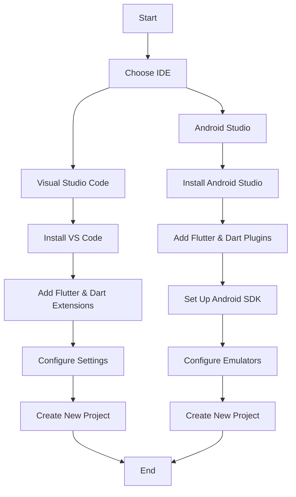

## 1.2.3 Configuring IDEs for Flutter: VS Code and Android Studio

In this section, we will guide you through the process of setting up your preferred Integrated Development Environment (IDE) for Flutter development. Flutter is a powerful framework for building cross-platform mobile applications, and having the right tools configured properly is essential for an efficient development workflow. We will focus on two popular IDEs: Visual Studio Code (VS Code) and Android Studio, providing step-by-step instructions, tips for optimal configuration, and insights into enhancing your productivity.

### Why Choose an IDE for Flutter Development?

An IDE provides a comprehensive environment that integrates various tools and features to streamline the development process. With features like code completion, syntax highlighting, debugging, and version control integration, an IDE can significantly enhance your productivity and make the development process more enjoyable.

### Setting Up Visual Studio Code for Flutter

Visual Studio Code is a lightweight, open-source code editor that has gained immense popularity among developers for its speed, flexibility, and extensive extension ecosystem. Here's how you can set it up for Flutter development:

#### Installing Visual Studio Code

1. **Download VS Code**: Visit the [official Visual Studio Code website](https://code.visualstudio.com/) and download the installer for your operating system (Windows, macOS, or Linux).

2. **Install VS Code**: Run the installer and follow the on-screen instructions to complete the installation.

3. **Launch VS Code**: Once installed, open Visual Studio Code.

#### Adding Flutter and Dart Extensions

To start developing Flutter applications, you need to install the Flutter and Dart extensions:

1. **Open Extensions View**: Click on the Extensions icon in the Activity Bar on the side of the window or press `Ctrl+Shift+X` (Windows/Linux) or `Cmd+Shift+X` (macOS).

2. **Search for Flutter**: In the Extensions view, type "Flutter" in the search box.

3. **Install Flutter Extension**: Click on the "Install" button for the Flutter extension by the Dart Code team. This will automatically install the Dart extension as well.

   

4. **Verify Installation**: After installation, you should see the Flutter and Dart extensions listed under the Installed section.

#### Configuring VS Code for Optimal Flutter Development

To enhance your development experience, consider configuring the following settings:

- **Enable Hot Reload**: Ensure that hot reload is enabled for faster development cycles. You can trigger hot reload by pressing `r` in the terminal or using the dedicated button in the Debug toolbar.

- **Set Up Format on Save**: Automatically format your code on save by adding the following setting in your `settings.json` file:

  ```json
  {
    "editor.formatOnSave": true
  }
  ```

- **Configure Flutter SDK Path**: If VS Code doesn't automatically detect your Flutter SDK, you can set the path manually in your `settings.json`:

  ```json
  {
    "dart.flutterSdkPath": "/path/to/flutter"
  }
  ```

- **Enable Linting**: Ensure linting is enabled to catch potential issues early. The Dart extension provides linting support out of the box.

#### Creating a New Flutter Project in VS Code

1. **Open Command Palette**: Press `Ctrl+Shift+P` (Windows/Linux) or `Cmd+Shift+P` (macOS) to open the Command Palette.

2. **Run Flutter: New Project**: Type "Flutter: New Project" and select it from the list.

3. **Choose Project Type**: Select "Application" when prompted.

4. **Enter Project Name**: Provide a name for your project and choose a location to save it.

5. **Open Project**: Once the project is created, VS Code will open the new project folder.

### Setting Up Android Studio for Flutter

Android Studio is a powerful IDE specifically designed for Android development. It offers robust tools for building, testing, and debugging Android apps, making it an excellent choice for Flutter development as well.

#### Downloading and Installing Android Studio

1. **Download Android Studio**: Visit the [official Android Studio website](https://developer.android.com/studio) and download the installer for your operating system.

2. **Install Android Studio**: Run the installer and follow the setup wizard to install Android Studio.

3. **Launch Android Studio**: Open Android Studio after installation.

#### Installing Flutter and Dart Plugins

To enable Flutter development in Android Studio, you need to install the Flutter and Dart plugins:

1. **Open Plugin Manager**: Go to `File > Settings` (Windows/Linux) or `Android Studio > Preferences` (macOS), then navigate to the "Plugins" section.

2. **Search for Flutter**: In the Plugins window, search for "Flutter" in the marketplace.

3. **Install Flutter Plugin**: Click "Install" for the Flutter plugin. This will also prompt you to install the Dart plugin.

   

4. **Restart Android Studio**: After installation, restart Android Studio to activate the plugins.

#### Setting Up the Android SDK and Configuring Emulators

1. **Open SDK Manager**: Go to `File > Settings` (Windows/Linux) or `Android Studio > Preferences` (macOS), then navigate to "Appearance & Behavior > System Settings > Android SDK".

2. **Install SDK Platforms**: Ensure that you have the necessary SDK platforms installed. At a minimum, install the latest Android API level.

3. **Configure AVD Manager**: To create and manage Android Virtual Devices (AVDs), open the AVD Manager from the toolbar or via `Tools > AVD Manager`.

4. **Create a New Emulator**: Click "Create Virtual Device" and follow the wizard to set up a new emulator.

   

5. **Run Emulator**: Once configured, you can start the emulator from the AVD Manager.

#### Creating a New Flutter Project in Android Studio

1. **Start New Flutter Project**: On the welcome screen, click "Start a new Flutter project".

2. **Select Project Type**: Choose "Flutter Application" and click "Next".

3. **Configure Project**: Enter your project name, Flutter SDK path, and other details.

4. **Finish Setup**: Click "Finish" to create the project. Android Studio will open the new project.

### Other Supported IDEs

While VS Code and Android Studio are the most popular choices for Flutter development, other IDEs like IntelliJ IDEA also support Flutter. You can find setup instructions for IntelliJ IDEA on the [official Flutter documentation](https://flutter.dev/docs/get-started/editor).

### Visual Summary: IDE Setup Flowchart

Below is a flowchart summarizing the steps to set up your IDE for Flutter development:



### Tips for Choosing Your IDE

- **Familiarity**: Choose the IDE you are most comfortable with to minimize the learning curve.
- **Features**: Consider the features you need, such as advanced debugging tools or a lightweight editor.
- **Community Support**: Both VS Code and Android Studio have strong community support, offering a wealth of resources and plugins.

### Troubleshooting Common Issues

- **SDK Not Found**: Ensure that the Flutter SDK path is correctly set in your IDE's settings.
- **Emulator Issues**: Check that your system meets the requirements for running Android emulators and that the necessary virtualization features are enabled in your BIOS.
- **Plugin Installation Problems**: Restart your IDE after installing plugins to ensure they are activated.

### Conclusion

Configuring your IDE is a crucial step in setting up your Flutter development environment. Whether you choose VS Code for its lightweight and extensible nature or Android Studio for its robust Android tools, both IDEs provide excellent support for Flutter development. By following the steps outlined in this guide, you'll be well-equipped to start building your Flutter applications efficiently.

## Quiz Time!



### What is the first step in setting up Visual Studio Code for Flutter development?

- [x] Downloading and installing VS Code from the official website.
- [ ] Installing the Flutter extension.
- [ ] Configuring the Flutter SDK path.
- [ ] Creating a new Flutter project.

> **Explanation:** The first step is to download and install Visual Studio Code from the official website.

### Which command is used to open the Command Palette in VS Code?

- [x] Ctrl+Shift+P (Windows/Linux) or Cmd+Shift+P (macOS)
- [ ] Ctrl+P (Windows/Linux) or Cmd+P (macOS)
- [ ] Ctrl+Shift+X (Windows/Linux) or Cmd+Shift+X (macOS)
- [ ] Ctrl+F (Windows/Linux) or Cmd+F (macOS)

> **Explanation:** The Command Palette in VS Code can be opened using Ctrl+Shift+P (Windows/Linux) or Cmd+Shift+P (macOS).

### What is the purpose of the Flutter and Dart extensions in VS Code?

- [x] To enable Flutter development features such as hot reload, debugging, and code completion.
- [ ] To provide themes and color schemes for the editor.
- [ ] To manage version control systems.
- [ ] To create database connections.

> **Explanation:** The Flutter and Dart extensions enable Flutter development features like hot reload, debugging, and code completion.

### How do you install plugins in Android Studio?

- [x] Through the Plugin Manager in the Settings/Preferences menu.
- [ ] By downloading them from the official website.
- [ ] By using the terminal command line.
- [ ] By copying plugin files into the installation directory.

> **Explanation:** Plugins in Android Studio are installed through the Plugin Manager found in the Settings/Preferences menu.

### What should you do if VS Code does not automatically detect your Flutter SDK?

- [x] Manually set the Flutter SDK path in the `settings.json` file.
- [ ] Reinstall the Flutter extension.
- [ ] Restart VS Code.
- [ ] Update the Flutter SDK.

> **Explanation:** If VS Code doesn't detect the Flutter SDK, you can manually set the path in the `settings.json` file.

### What is the AVD Manager used for in Android Studio?

- [x] To create and manage Android Virtual Devices (emulators).
- [ ] To manage Android SDK versions.
- [ ] To configure project settings.
- [ ] To install plugins.

> **Explanation:** The AVD Manager is used to create and manage Android Virtual Devices (emulators).

### Which setting should be enabled in VS Code for automatic code formatting on save?

- [x] "editor.formatOnSave": true
- [ ] "editor.autoSave": true
- [ ] "editor.saveOnFocusChange": true
- [ ] "editor.formatOnType": true

> **Explanation:** Enabling "editor.formatOnSave": true in VS Code settings will automatically format code on save.

### What is the primary advantage of using an IDE for Flutter development?

- [x] It integrates various tools and features to streamline the development process.
- [ ] It provides a platform for deploying apps to the app store.
- [ ] It offers cloud storage for project files.
- [ ] It allows for collaboration with other developers.

> **Explanation:** An IDE integrates various tools and features, such as code completion and debugging, to streamline the development process.

### Which IDE is specifically designed for Android development?

- [x] Android Studio
- [ ] Visual Studio Code
- [ ] IntelliJ IDEA
- [ ] Eclipse

> **Explanation:** Android Studio is specifically designed for Android development, offering robust tools for building, testing, and debugging Android apps.

### True or False: IntelliJ IDEA supports Flutter development.

- [x] True
- [ ] False

> **Explanation:** IntelliJ IDEA supports Flutter development, and setup instructions can be found on the official Flutter documentation site.


