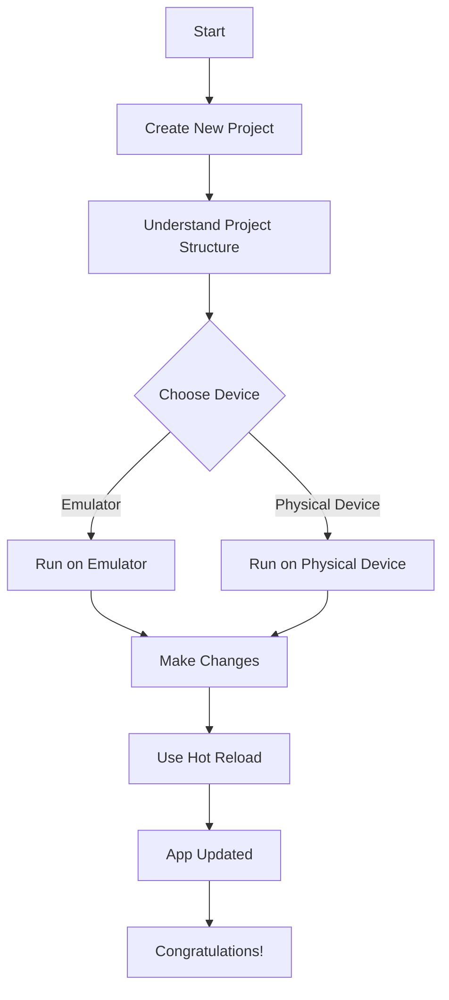

## 1.2.4 Running Your First Flutter App

Congratulations on reaching this pivotal stage in your Flutter development journey! In this section, we will guide you through the process of creating, building, and running your first Flutter app. This is an essential step to ensure your development environment is correctly set up and to familiarize yourself with the basic workflow of Flutter app development.

### Creating a New Project

The first step in building your Flutter app is to create a new project. You can do this using terminal commands or through an Integrated Development Environment (IDE) like Android Studio or Visual Studio Code.

#### Using Terminal Commands

To create a new Flutter project via the terminal, follow these steps:

1. Open your terminal or command prompt.
2. Navigate to the directory where you want to create your project.
3. Run the following command:

   ```bash
   flutter create my_app
   ```

This command will generate a new Flutter project named `my_app` in the current directory.

#### Using an IDE

If you prefer using an IDE, follow these steps in Android Studio:

1. Open Android Studio and select **File > New > New Flutter Project**.
2. Choose **Flutter Application** and click **Next**.
3. Enter the project name (e.g., `my_app`), select the Flutter SDK path, and click **Finish**.

### Understanding the Project Structure

Once your project is created, it's crucial to understand its structure. Here's a brief overview of the key directories and files:

- **lib/**: This directory contains the main Dart code for your application. The `main.dart` file is the entry point of your app.
- **test/**: This directory is for writing unit and widget tests.
- **pubspec.yaml**: This file manages the app's dependencies, assets, and other configurations.

Let's take a closer look at the `main.dart` file, which is the heart of your Flutter app.

#### The `main.dart` File

The `main.dart` file typically contains the following default code:

```dart
import 'package:flutter/material.dart';

void main() {
  runApp(MyApp());
}

class MyApp extends StatelessWidget {
  @override
  Widget build(BuildContext context) {
    return MaterialApp(
      title: 'Flutter Demo',
      theme: ThemeData(
        primarySwatch: Colors.blue,
      ),
      home: MyHomePage(title: 'Flutter Demo Home Page'),
    );
  }
}

class MyHomePage extends StatelessWidget {
  final String title;

  MyHomePage({Key? key, required this.title}) : super(key: key);

  @override
  Widget build(BuildContext context) {
    return Scaffold(
      appBar: AppBar(
        title: Text(title),
      ),
      body: Center(
        child: Text('Hello, Flutter!'),
      ),
    );
  }
}
```

**Key Components:**

- **`main()` Function**: The entry point of the app, calling `runApp()` to start the app.
- **`MyApp` Widget**: A stateless widget that sets up the app's theme and home page.
- **`MyHomePage` Widget**: Displays a simple UI with an app bar and a centered text widget.

### Running the App

Now that you have a basic understanding of your Flutter project, it's time to run the app on an emulator or a physical device.

#### Running on an Android Device

##### Using an Android Emulator

1. Open Android Studio and navigate to **Tools > AVD Manager**.
2. Click **Create Virtual Device** and follow the prompts to set up an emulator.
3. Once the emulator is running, go back to your terminal or IDE and execute:

   ```bash
   flutter run
   ```

##### Using a Physical Android Device

1. Enable Developer Mode on your device by going to **Settings > About Phone** and tapping the **Build Number** seven times.
2. Enable USB Debugging under **Developer Options**.
3. Connect your device to your computer via USB.
4. Run the following command:

   ```bash
   flutter run
   ```

#### Running on an iOS Device

##### Using the iOS Simulator

1. Open Xcode and navigate to **Xcode > Open Developer Tool > Simulator**.
2. Select the desired device from the simulator's **Hardware > Device** menu.
3. In your terminal or IDE, execute:

   ```bash
   flutter run
   ```

##### Using a Physical iOS Device

1. Connect your device to your Mac.
2. Open Xcode and navigate to **Window > Devices and Simulators**.
3. Select your device and ensure it is trusted.
4. Run the following command:

   ```bash
   flutter run
   ```

### Hot Reload and Hot Restart

Flutter's hot reload feature is a powerful tool that allows you to see changes in your app almost instantly without losing the app's state. Let's demonstrate this by making a simple change.

#### Making a Change

Open the `main.dart` file and modify the text in the `MyHomePage` widget:

```dart
body: Center(
  child: Text('Hello, Flutter!'),
),
```

Change `'Hello, Flutter!'` to `'Welcome to Flutter!'`.

#### Using Hot Reload

1. Save your changes.
2. In your terminal or IDE, press `r` to trigger a hot reload.

You should see the text update immediately in your running app.

### Visual Aids

To help visualize the process, here is a flowchart of the steps from project creation to running the app:



### Troubleshooting Tips

If you encounter issues while running your app:

- Ensure your device is connected and recognized by running `flutter devices`.
- Check for any error messages in the terminal or IDE console.
- Revisit previous steps to ensure all configurations are correct.
- Consult the [Flutter documentation](https://flutter.dev/docs) for additional help.

### Conclusion

Congratulations on running your first Flutter app! This is a significant milestone in your journey to becoming a proficient Flutter developer. With your development environment set up and a basic understanding of the Flutter workflow, you're well on your way to creating amazing apps.

## Quiz Time!



### What command is used to create a new Flutter project in the terminal?

- [x] flutter create my_app
- [ ] flutter init my_app
- [ ] flutter new my_app
- [ ] flutter start my_app

> **Explanation:** The `flutter create my_app` command initializes a new Flutter project in the specified directory.

### Which directory contains the main Dart code for your Flutter application?

- [x] lib/
- [ ] src/
- [ ] main/
- [ ] app/

> **Explanation:** The `lib/` directory is where the main Dart code for a Flutter application is stored, including the `main.dart` file.

### What is the entry point of a Flutter application?

- [x] main() function
- [ ] runApp() function
- [ ] MyApp widget
- [ ] MyHomePage widget

> **Explanation:** The `main()` function is the entry point of a Flutter application, where `runApp()` is called to start the app.

### What does the `flutter run` command do?

- [x] Builds and runs the app on a connected device or emulator
- [ ] Creates a new Flutter project
- [ ] Updates the Flutter SDK
- [ ] Installs Flutter plugins

> **Explanation:** The `flutter run` command builds and runs the app on a connected device or emulator.

### What feature allows you to see changes in your Flutter app almost instantly without losing the app's state?

- [x] Hot Reload
- [ ] Hot Restart
- [ ] Cold Start
- [ ] Quick Refresh

> **Explanation:** Hot Reload allows developers to see changes in the app immediately without losing the current state.

### How do you enable Developer Mode on an Android device?

- [x] Tap the Build Number seven times in Settings > About Phone
- [ ] Enable USB Debugging in Developer Options
- [ ] Connect the device to a computer via USB
- [ ] Install Android Studio

> **Explanation:** Developer Mode is enabled by tapping the Build Number seven times in the device's settings.

### What is required to run a Flutter app on a physical iOS device?

- [x] Connect the device to a Mac and trust it in Xcode
- [ ] Enable USB Debugging
- [ ] Install Android Studio
- [ ] Use an Android Emulator

> **Explanation:** To run a Flutter app on a physical iOS device, it must be connected to a Mac and trusted in Xcode.

### Which file manages the app's dependencies and configurations in a Flutter project?

- [x] pubspec.yaml
- [ ] main.dart
- [ ] config.json
- [ ] settings.xml

> **Explanation:** The `pubspec.yaml` file manages the app's dependencies, assets, and other configurations.

### What should you do if your device is not recognized when running `flutter devices`?

- [x] Check connections and ensure Developer Mode is enabled
- [ ] Reinstall Flutter
- [ ] Restart your computer
- [ ] Update your IDE

> **Explanation:** Checking connections and ensuring Developer Mode is enabled can help resolve device recognition issues.

### True or False: Hot Restart is the same as Hot Reload.

- [ ] True
- [x] False

> **Explanation:** Hot Restart restarts the app and loses the current state, while Hot Reload preserves the state and updates the UI instantly.


