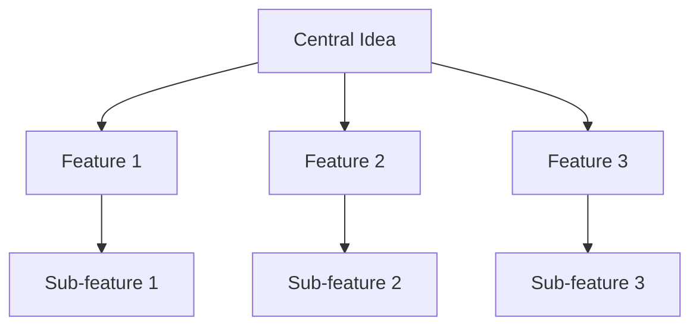
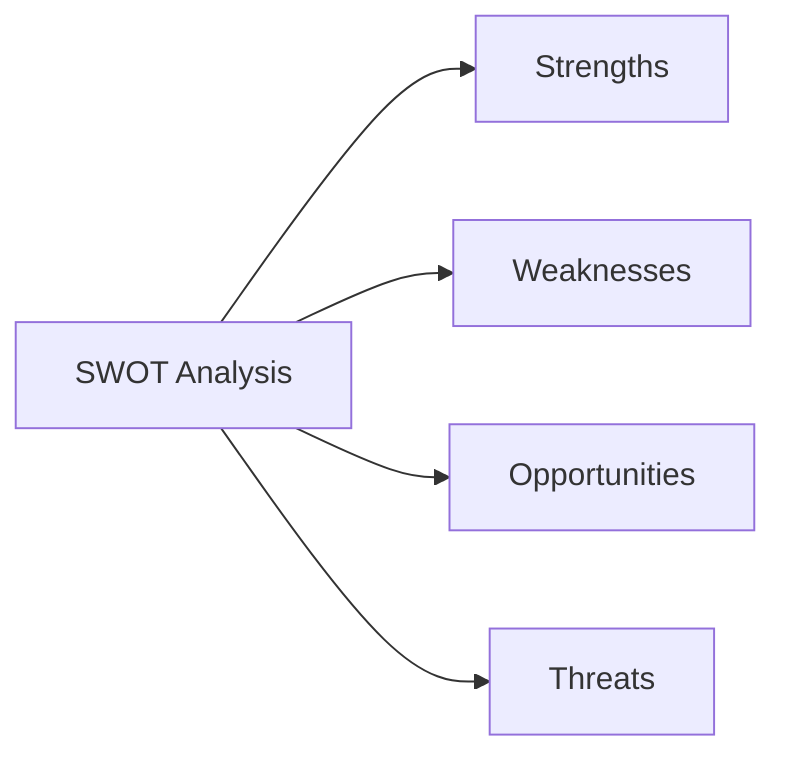
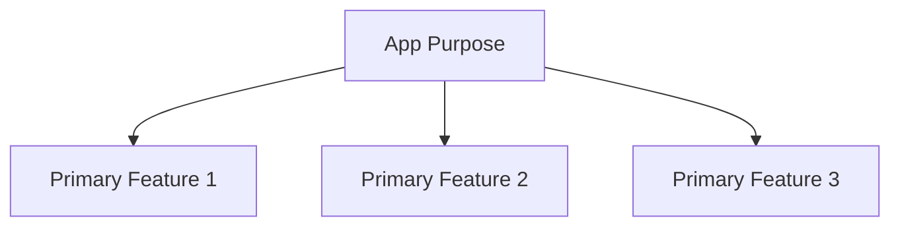
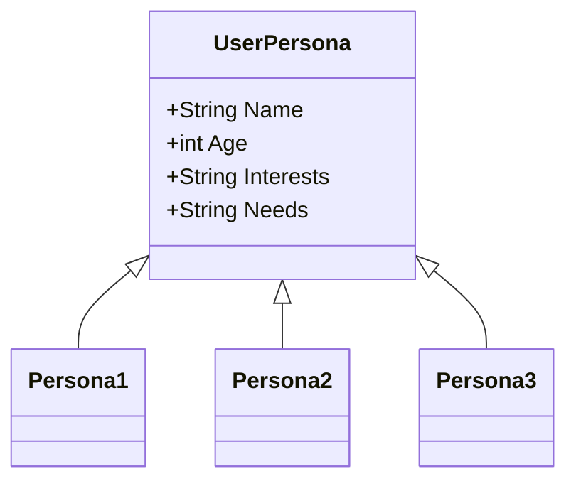

## 1.4.1 Defining Your App Idea

Embarking on the journey of creating your first app can be both exciting and daunting. The cornerstone of a successful app lies in a well-defined idea. This section will guide you through the essential steps of selecting and refining an app idea that is not only feasible but also aligns with your interests and skills. By the end of this chapter, you'll have a clear vision of your app's purpose, audience, and core features, setting a strong foundation for development.

### Brainstorming Techniques

The first step in defining your app idea is brainstorming. This creative process helps you generate a wide array of potential ideas. Here are some effective techniques:

#### Mind Mapping

Mind mapping is a visual tool that helps organize thoughts and ideas. Start with a central concept and branch out into related ideas. This method encourages free thinking and can lead to innovative app concepts.

#### Problem Listing

Another approach is to list problems you encounter in daily life. Consider how an app could solve these issues. This method ensures your app has a practical purpose and addresses real user needs.

#### SWOT Analysis

Conduct a SWOT analysis (Strengths, Weaknesses, Opportunities, Threats) for each idea. This analysis helps you understand the potential and challenges of your app concept.

### Feasibility Analysis

Once you have a list of potential ideas, it's crucial to evaluate their feasibility. This step ensures that your project is manageable and achievable, especially for a beginner.

#### Scope Evaluation

Assess the complexity of each idea. Break down the app into core features and functionalities. Determine if these are achievable with your current skills and resources.

#### Resource Assessment

Consider the resources required, such as time, tools, and technology. Ensure you have access to necessary resources or can acquire them without significant difficulty.

#### Technical Feasibility

Evaluate the technical requirements of your app. Research if the necessary technologies and frameworks are accessible and within your skill set.

### Setting Goals

Defining clear goals for your app is essential. These goals will guide your development process and help measure success.

#### Define the App's Purpose

Clearly articulate what your app aims to achieve. Is it solving a problem, providing entertainment, or offering a service? A well-defined purpose keeps your project focused.

#### Identify Primary Features

List the primary features your app will include. Prioritize these features based on their importance to the app's purpose and user experience.

#### Set Milestones

Break down the development process into smaller, manageable milestones. This approach helps track progress and maintain motivation.

### Audience Identification

Understanding your target audience is crucial for creating an app that resonates with users.

#### Define Your Audience

Identify who will benefit from your app. Consider demographics, interests, and behaviors. A clear understanding of your audience informs design and functionality decisions.

#### Analyze User Needs

Research the needs and preferences of your target audience. This analysis ensures your app provides value and meets user expectations.

#### Create User Personas

Develop user personas to represent different segments of your audience. These personas guide design and development decisions, ensuring the app aligns with user needs.

### Encouragement and Best Practices

Choosing an app idea that interests and motivates you is vital. Passion for your project sustains motivation and creativity throughout the development process.

#### Start Simple

It's perfectly okay to start with a simple app. A straightforward project allows you to focus on learning and mastering the development process without becoming overwhelmed.

#### Iterate and Improve

Remember that your first app doesn't have to be perfect. Use it as a learning experience, and be open to iterating and improving based on feedback and new insights.

### Common Pitfalls and Optimization Tips

Avoid common pitfalls by keeping your project scope realistic and manageable. Focus on delivering a functional app with core features rather than overloading it with unnecessary complexities.

#### Optimization Tips

- **Focus on Core Features**: Prioritize features that align with the app's purpose and user needs.
- **User-Centric Design**: Design with the user in mind, ensuring the app is intuitive and easy to navigate.
- **Feedback Loops**: Incorporate user feedback early and often to refine and improve the app.

### Conclusion

Defining your app idea is a critical step in the development process. By brainstorming effectively, conducting a thorough feasibility analysis, setting clear goals, and understanding your audience, you'll lay a strong foundation for your app's success. Remember to choose a project that excites you, start simple, and embrace the learning journey.

## Quiz Time!



### What is the first step in defining your app idea?

- [x] Brainstorming
- [ ] Coding
- [ ] Marketing
- [ ] Testing

> **Explanation:** Brainstorming is the initial step to generate and explore various app ideas.

### Which technique involves organizing thoughts visually around a central concept?

- [x] Mind Mapping
- [ ] SWOT Analysis
- [ ] Problem Listing
- [ ] Resource Assessment

> **Explanation:** Mind mapping is a visual tool used to organize thoughts and ideas around a central concept.

### What should you assess to ensure your app project is manageable?

- [x] Feasibility
- [ ] Marketing Strategy
- [ ] User Interface Design
- [ ] Color Scheme

> **Explanation:** Feasibility analysis ensures that the project is achievable with available resources and skills.

### What is a primary feature of an app?

- [x] A core functionality essential to the app's purpose
- [ ] A secondary feature that can be added later
- [ ] A marketing strategy
- [ ] A design element

> **Explanation:** Primary features are core functionalities that are essential to achieving the app's purpose.

### Why is it important to define your target audience?

- [x] To ensure the app meets user needs and preferences
- [ ] To increase app downloads
- [ ] To improve app aesthetics
- [ ] To reduce development costs

> **Explanation:** Defining the target audience ensures the app is designed to meet user needs and preferences.

### What is a user persona?

- [x] A representation of a segment of your target audience
- [ ] A list of app features
- [ ] A marketing tool
- [ ] A coding framework

> **Explanation:** User personas are representations of different segments of your target audience, guiding design and development decisions.

### Why should you start with a simple app?

- [x] To focus on learning and mastering the development process
- [ ] To reduce marketing costs
- [ ] To attract more users
- [ ] To increase revenue

> **Explanation:** Starting with a simple app allows you to focus on learning and mastering the development process without becoming overwhelmed.

### What should you do after receiving user feedback?

- [x] Iterate and improve the app
- [ ] Ignore it
- [ ] Increase marketing efforts
- [ ] Change the app's purpose

> **Explanation:** Incorporating user feedback helps refine and improve the app, ensuring it meets user needs.

### What is the purpose of setting milestones in app development?

- [x] To track progress and maintain motivation
- [ ] To increase app downloads
- [ ] To reduce development costs
- [ ] To improve app aesthetics

> **Explanation:** Setting milestones helps track progress and maintain motivation throughout the development process.

### True or False: Your first app must be perfect.

- [ ] True
- [x] False

> **Explanation:** Your first app doesn't have to be perfect. It's a learning experience, and improvements can be made over time.


