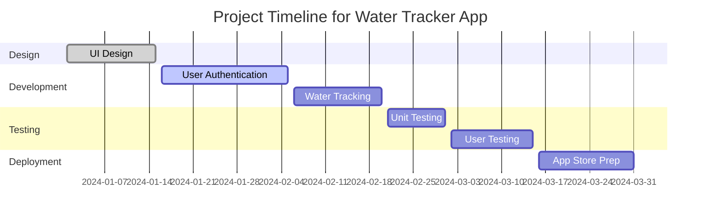

---

linkTitle: "1.4.2 Setting Realistic Goals"
title: "Setting Realistic Goals for Your First Flutter App"
description: "Learn how to set achievable objectives and timelines for your Flutter app development project using SMART goals, milestone planning, and effective time management."
categories:
- App Development
- Project Management
- Flutter
tags:
- Flutter
- App Development
- Project Planning
- SMART Goals
- Time Management
date: 2024-10-25
type: docs
nav_weight: 1420

---

## 1.4.2 Setting Realistic Goals

Embarking on the journey of developing your first Flutter app is both exciting and daunting. One of the critical steps in ensuring your success is setting realistic goals. This section will guide you through establishing achievable objectives and timelines for your app development project. By the end of this chapter, you'll have a clear roadmap to guide your efforts from conception to the App Store.

### Understanding SMART Goals

The concept of SMART goals is a powerful tool in project management and personal development. SMART stands for Specific, Measurable, Achievable, Relevant, and Time-bound. Let's break down each component and see how it applies to your Flutter app project.

#### Specific

Your goals should be clear and specific. This means defining exactly what you want to achieve. Instead of saying, "I want to build an app," specify, "I want to develop a Flutter app that helps users track their daily water intake."

#### Measurable

A measurable goal allows you to track your progress and stay motivated. For instance, "I will complete the app's user interface by the end of the month" is a measurable goal. You can track your progress by checking off completed tasks.

#### Achievable

While it's good to be ambitious, your goals should also be realistic. Consider your current skills, resources, and time availability. If you're new to Flutter, setting a goal to build a complex app in a week might not be achievable.

#### Relevant

Your goals should align with your broader objectives. Ask yourself why this goal is important and how it contributes to your overall vision. If your aim is to learn Flutter to enhance your career, ensure your app project aligns with this goal.

#### Time-bound

Every goal needs a deadline. A time-bound goal helps prevent everyday tasks from taking priority over your long-term objectives. For example, "I will publish my app on the App Store by the end of the year."

### Planning Milestones

Breaking your project into smaller, manageable tasks or features is crucial. This approach not only makes the project less overwhelming but also allows you to celebrate small victories along the way.

#### Identifying Key Milestones

Start by identifying the key features of your app. For a water tracking app, milestones might include:

1. Designing the user interface.
2. Implementing user authentication.
3. Developing the water intake tracking feature.
4. Testing the app.
5. Preparing for the App Store submission.

#### Creating a Project Timeline

A project timeline or Gantt chart can be an invaluable tool for visualizing your milestones and deadlines. Here's a simple example:

### Effective Time Management

Time management is crucial in ensuring you meet your deadlines without compromising quality. Here are some strategies to help you manage your time effectively:

#### Allocate Time for Learning

If you're new to Flutter, allocate time for learning and experimentation. This might include watching tutorials, reading documentation, or experimenting with sample projects.

#### Development and Testing

Divide your time between development and testing. Ensure you have ample time for testing, as this is critical for delivering a bug-free app.

#### Revision and Feedback

Set aside time for revisions based on feedback. This might involve refining features or fixing bugs identified during testing.

### Embracing Flexibility

While it's important to set goals and timelines, it's equally important to remain flexible. Development projects often encounter unforeseen challenges. Here are some tips for maintaining flexibility:

#### Adapt to Changes

Be prepared to adapt your goals and timelines as needed. If a feature takes longer than expected, adjust your schedule accordingly.

#### Prioritize Tasks

Focus on high-priority tasks that align with your core objectives. If time becomes a constraint, consider postponing less critical features.

#### Celebrate Small Victories

Recognize and celebrate your achievements, no matter how small. This will help maintain motivation and momentum throughout your project.

### Regular Progress Reviews

Regularly reviewing your progress is essential for staying on track. Set aside time each week to evaluate what you've accomplished and adjust your plans as necessary.

#### Weekly Check-ins

Conduct weekly check-ins to assess your progress against your goals. This will help you identify any areas where you may be falling behind and make necessary adjustments.

#### Reflect and Adjust

Reflect on what's working well and what isn't. Use this insight to improve your processes and strategies.

### Conclusion

Setting realistic goals is a foundational step in successfully developing and publishing your first Flutter app. By applying the principles of SMART goals, planning milestones, managing your time effectively, and embracing flexibility, you'll be well-equipped to navigate the challenges of app development.

Remember, the journey is as important as the destination. Celebrate your progress, learn from your experiences, and enjoy the process of bringing your app to life.

## Quiz Time!



### What does the "S" in SMART goals stand for?

- [x] Specific
- [ ] Simple
- [ ] Strategic
- [ ] Significant

> **Explanation:** The "S" in SMART goals stands for Specific, meaning your goals should be clear and well-defined.

### Why is it important for goals to be measurable?

- [x] To track progress and stay motivated
- [ ] To make them easier to achieve
- [ ] To ensure they are realistic
- [ ] To align with broader objectives

> **Explanation:** Measurable goals allow you to track your progress and stay motivated by providing clear criteria for success.

### Which of the following is an example of a time-bound goal?

- [x] "I will publish my app on the App Store by the end of the year."
- [ ] "I want to build an app."
- [ ] "I will learn Flutter."
- [ ] "I will improve my coding skills."

> **Explanation:** A time-bound goal includes a specific deadline, such as publishing the app by the end of the year.

### What is a key benefit of breaking a project into smaller tasks?

- [x] It makes the project less overwhelming and allows for celebrating small victories.
- [ ] It ensures the project is completed faster.
- [ ] It eliminates the need for a project timeline.
- [ ] It reduces the overall workload.

> **Explanation:** Breaking a project into smaller tasks makes it more manageable and allows you to celebrate progress along the way.

### How can a Gantt chart be useful in project planning?

- [x] It visualizes milestones and deadlines.
- [ ] It provides detailed code examples.
- [ ] It eliminates the need for testing.
- [ ] It simplifies the user interface design.

> **Explanation:** A Gantt chart is a visual tool that helps you see the timeline of your project, including milestones and deadlines.

### What should you do if a feature takes longer than expected to develop?

- [x] Adjust your schedule accordingly.
- [ ] Ignore the delay and continue as planned.
- [ ] Remove the feature from the project.
- [ ] Rush through the remaining tasks.

> **Explanation:** If a feature takes longer than expected, it's important to adjust your schedule to accommodate the delay.

### Why is it important to allocate time for learning when developing a Flutter app?

- [x] To build foundational knowledge and skills.
- [ ] To reduce the overall project timeline.
- [ ] To avoid testing and revisions.
- [ ] To simplify the app's design.

> **Explanation:** Allocating time for learning helps you build the necessary skills and knowledge to develop your app effectively.

### How can regular progress reviews benefit your project?

- [x] They help you stay on track and make necessary adjustments.
- [ ] They eliminate the need for a project timeline.
- [ ] They ensure the project is completed faster.
- [ ] They reduce the overall workload.

> **Explanation:** Regular progress reviews help you assess your progress and make adjustments to stay on track with your goals.

### What is a key advantage of celebrating small victories during a project?

- [x] It helps maintain motivation and momentum.
- [ ] It reduces the overall project timeline.
- [ ] It eliminates the need for testing.
- [ ] It simplifies the user interface design.

> **Explanation:** Celebrating small victories boosts motivation and helps maintain momentum throughout the project.

### True or False: Flexibility is not important when setting goals for app development.

- [ ] True
- [x] False

> **Explanation:** Flexibility is crucial in app development as it allows you to adapt to changes and challenges that may arise during the project.


