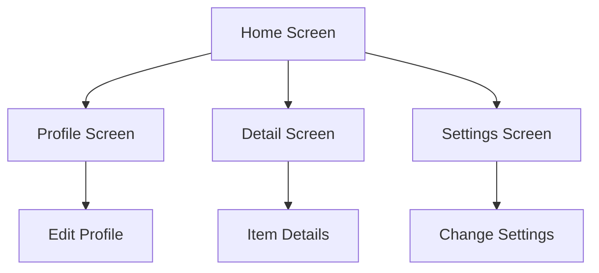

## 1.4.3 Sketching the User Interface

Designing a user interface (UI) is a critical step in the app development process. It serves as the blueprint for your application, guiding both the visual and functional aspects of your app. In this section, we will explore the importance of planning your UI, introduce you to basic UI/UX design principles, and guide you through the process of creating wireframes for your Flutter app.

### The Importance of Planning Your UI

Before diving into coding, it's essential to have a clear vision of what your app will look like and how users will interact with it. Planning your UI through wireframes can help you visualize the app's structure and flow, ensuring that you address potential usability issues early in the development process.

#### Benefits of Wireframing

- **Clarity and Focus**: Wireframes provide a clear visual representation of your app's layout, helping you focus on functionality rather than aesthetics.
- **Early Feedback**: By sharing wireframes with stakeholders, you can gather feedback and make necessary adjustments before investing time in development.
- **Efficient Development**: A well-thought-out wireframe serves as a guide for developers, reducing the likelihood of costly changes during the coding phase.

### Tools for Sketching

Creating wireframes can be done using various tools, ranging from traditional methods like paper and pencil to sophisticated digital tools. Here are some recommended options:

- **Paper and Pencil**: Ideal for quick sketches and brainstorming sessions. This method encourages creativity and flexibility.
- **Figma**: A popular digital tool for designing interfaces collaboratively. It offers real-time collaboration features, making it easy to share and edit designs with your team.
- **Sketch**: A vector-based design tool widely used for UI/UX design. It offers a range of plugins to enhance functionality.
- **Adobe XD**: A comprehensive tool for designing and prototyping user experiences. It integrates well with other Adobe products, providing a seamless workflow.

### Basic UI/UX Design Principles

Understanding basic UI/UX design principles is crucial for creating intuitive and user-friendly interfaces. Here are some key concepts to consider:

#### Consistency

Consistency in design ensures that users can easily navigate your app. This involves using uniform colors, typography, and layout patterns throughout the app. Consistency helps in building familiarity, reducing the learning curve for users.

#### Simplicity

A simple design minimizes distractions and focuses on essential elements. Avoid clutter by prioritizing content and features that add value to the user experience. Simplicity also enhances performance, as fewer elements mean faster load times.

#### User-Centered Design

User-centered design focuses on meeting the needs and expectations of your target audience. Conducting user research and testing can provide insights into user behavior, helping you design interfaces that are intuitive and satisfying to use.

### Creating Wireframes

Now that you understand the importance of planning and the tools available, let's dive into the process of creating wireframes for your app. We'll guide you through sketching key screens, emphasizing functionality over aesthetics.

#### Step 1: Define Your App's Structure

Start by identifying the main screens and features of your app. Consider the user journey and how they will navigate through your app. Common screens include:

- **Home Screen**: The starting point for users, featuring key functionalities and navigation options.
- **Profile Screen**: Displays user information and settings.
- **Detail Screen**: Provides in-depth information about a specific item or feature.
- **Settings Screen**: Allows users to customize their app experience.

#### Step 2: Sketch the Layout

Using your chosen tool, begin sketching the layout of each screen. Focus on the placement of key elements such as buttons, text, and images. Keep in mind the principles of consistency and simplicity.



#### Step 3: Add Interaction Elements

Consider how users will interact with your app. Add buttons, links, and other interactive elements to your wireframes. Ensure that navigation is intuitive and that users can easily access important features.

#### Step 4: Review and Iterate

Share your wireframes with stakeholders and gather feedback. Be open to making changes and iterating on your designs. Remember, the goal is to create a user-friendly interface that meets the needs of your audience.

### Translating Wireframes to Flutter UI Components

Once you have finalized your wireframes, the next step is to translate them into actual UI components in Flutter. Flutter's widget-based architecture makes it easy to implement designs efficiently.

#### Example: Translating a Wireframe to Flutter Code

Let's consider a simple wireframe for a login screen and translate it into Flutter code.

**Wireframe: Login Screen**

- **Username Field**
- **Password Field**
- **Login Button**

**Flutter Code:**

```dart
import 'package:flutter/material.dart';

class LoginScreen extends StatelessWidget {
  @override
  Widget build(BuildContext context) {
    return Scaffold(
      appBar: AppBar(
        title: Text('Login'),
      ),
      body: Padding(
        padding: const EdgeInsets.all(16.0),
        child: Column(
          mainAxisAlignment: MainAxisAlignment.center,
          children: <Widget>[
            TextField(
              decoration: InputDecoration(
                labelText: 'Username',
              ),
            ),
            TextField(
              decoration: InputDecoration(
                labelText: 'Password',
              ),
              obscureText: true,
            ),
            SizedBox(height: 20),
            ElevatedButton(
              onPressed: () {
                // Handle login action
              },
              child: Text('Login'),
            ),
          ],
        ),
      ),
    );
  }
}
```

### Best Practices and Common Pitfalls

#### Best Practices

- **Iterative Design**: Embrace an iterative design process. Initial sketches don't have to be perfect. Use feedback to refine your designs.
- **Focus on Functionality**: Prioritize functionality over aesthetics at this stage. Ensure that your wireframes effectively communicate the app's purpose and flow.

#### Common Pitfalls

- **Overcomplicating Designs**: Avoid adding unnecessary elements that can clutter the interface and confuse users.
- **Ignoring User Feedback**: User feedback is invaluable. Ignoring it can lead to designs that don't meet user needs.

### Conclusion

Sketching the user interface is a foundational step in app development. By planning your UI, understanding design principles, and creating effective wireframes, you set the stage for a successful app. Remember to iterate on your designs and focus on creating a user-friendly experience.

## Quiz Time!



### What is the primary purpose of wireframing in app development?

- [x] To visualize the app's structure and flow
- [ ] To finalize the app's color scheme
- [ ] To write the app's backend code
- [ ] To create marketing materials for the app

> **Explanation:** Wireframing helps visualize the app's structure and flow, allowing designers to plan the layout and functionality before development.

### Which tool is NOT recommended for creating wireframes?

- [ ] Figma
- [ ] Sketch
- [ ] Adobe XD
- [x] Microsoft Word

> **Explanation:** Microsoft Word is not typically used for creating wireframes. Tools like Figma, Sketch, and Adobe XD are designed for UI/UX design.

### What is a key benefit of using consistent design in your app?

- [x] It helps users navigate the app more easily
- [ ] It makes the app look more colorful
- [ ] It reduces the app's file size
- [ ] It increases the app's loading time

> **Explanation:** Consistent design helps users navigate the app more easily by providing a familiar and predictable interface.

### What should be the focus when creating initial wireframes?

- [ ] Aesthetics
- [x] Functionality
- [ ] Marketing
- [ ] Animation

> **Explanation:** The focus should be on functionality to ensure that the wireframes effectively communicate the app's purpose and flow.

### Which principle emphasizes designing with the user's needs in mind?

- [x] User-Centered Design
- [ ] Minimalism
- [ ] Aesthetics
- [ ] Branding

> **Explanation:** User-Centered Design focuses on meeting the needs and expectations of the target audience.

### What is the first step in creating wireframes for your app?

- [x] Define your app's structure
- [ ] Choose a color palette
- [ ] Write the app's code
- [ ] Launch the app

> **Explanation:** The first step is to define your app's structure by identifying the main screens and features.

### How can wireframes help during the development phase?

- [x] They serve as a guide for developers
- [ ] They increase the app's download speed
- [ ] They ensure the app is bug-free
- [ ] They reduce the app's cost

> **Explanation:** Wireframes serve as a guide for developers, providing a clear visual representation of the app's layout and functionality.

### What is a common pitfall when designing wireframes?

- [ ] Using too many colors
- [x] Overcomplicating designs
- [ ] Ignoring aesthetics
- [ ] Focusing on functionality

> **Explanation:** Overcomplicating designs can clutter the interface and confuse users, making it a common pitfall.

### Why is iterative design important in UI/UX?

- [x] It allows for refinement based on feedback
- [ ] It speeds up the development process
- [ ] It eliminates the need for testing
- [ ] It reduces the number of screens needed

> **Explanation:** Iterative design allows for refinement based on feedback, leading to a more user-friendly interface.

### True or False: Wireframes should prioritize aesthetics over functionality.

- [ ] True
- [x] False

> **Explanation:** Wireframes should prioritize functionality over aesthetics to ensure that the app's purpose and flow are effectively communicated.


