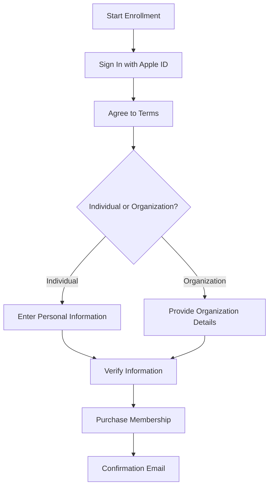

## 10.1.1 Enrolling in the Apple Developer Program

Embarking on the journey to publish your first Flutter app on the Apple App Store is an exciting milestone. However, to make this dream a reality, enrolling in the Apple Developer Program is a crucial step. This program not only allows you to distribute apps on the App Store but also provides access to a plethora of resources, including beta software, advanced app capabilities, and App Store Connect. This section will guide you through the enrollment process, ensuring you understand the requirements, costs, and steps involved.

### Understanding the Apple Developer Program

The Apple Developer Program is a gateway to the world of iOS app distribution. By joining, you gain access to:

- **App Distribution**: The ability to distribute apps on the App Store.
- **Beta Software**: Access to beta versions of Apple software.
- **Advanced App Capabilities**: Utilize features like Apple Pay, iCloud, and more.
- **App Store Connect**: Manage your apps, view analytics, and more.

#### Membership Fee

The program requires an annual membership fee of $99 USD. This fee is essential for maintaining your account and accessing all the benefits mentioned above.

#### Importance of Enrollment

Enrollment is necessary to sign apps for testing and distribution. Without it, you cannot publish your app on the App Store or access many of the tools and resources provided by Apple.

### Prerequisites

Before you begin the enrollment process, ensure you have the following prerequisites:

#### Apple ID

An Apple ID is essential for enrolling in the Apple Developer Program. If you don't have one, you can create it by visiting [appleid.apple.com](https://appleid.apple.com). Follow these steps to create an Apple ID:

1. **Visit the Apple ID Website**: Navigate to [appleid.apple.com](https://appleid.apple.com).
2. **Click on "Create Your Apple ID"**: Fill in the required information, including your name, email, and password.
3. **Verify Your Email**: Apple will send a verification email. Follow the instructions to verify your email address.

#### Device Requirements

For a seamless development experience, it's recommended to have a Mac running the latest version of macOS. This ensures compatibility with Xcode and other Apple development tools.

#### Legal Requirements

For organizations, a D-U-N-S Number is required for verification. This number is a unique nine-digit identifier for businesses and is used to verify the legal entity status of your organization.

### Enrollment Steps for Individuals

Enrolling as an individual is a straightforward process. Follow these steps to complete your enrollment:

1. **Visit the Apple Developer Website**: Go to [developer.apple.com/programs/enroll/](https://developer.apple.com/programs/enroll/).
2. **Sign In with Apple ID**: Click "Start Your Enrollment" and sign in using your Apple ID.
3. **Agree to Terms**: Review and accept the Apple Developer Agreement.
4. **Provide Personal Information**: Fill in the required details such as your name, address, and contact information.
5. **Choose Entity Type**: Select "Individual/Sole Proprietor/Single Person Business."
6. **Verify Information**: Double-check all entered information for accuracy.
7. **Purchase Membership**: Proceed to payment. Acceptable payment methods include major credit cards.
8. **Confirm Enrollment**: After payment, wait for a confirmation email from Apple.

### Enrollment Steps for Organizations

Enrolling as an organization involves a few additional steps due to the need for verification. Here's how to proceed:

1. **Gather Necessary Information**: Obtain your legal entity name and D-U-N-S Number.
2. **Sign In and Start Enrollment**: Access the enrollment page and sign in with an Apple ID associated with your organization.
3. **Agree to Terms**: Accept the Apple Developer Agreement.
4. **Provide Organization Information**: Enter the legal entity name, D-U-N-S Number, and address.
5. **Verify Authority**: Confirm that you have the legal authority to bind your organization.
6. **Contact Verification**: Provide a work email address and phone number.
7. **Apple Verification Call**: Be prepared for Apple to contact you for verification.
8. **Purchase Membership**: Complete payment after verification.
9. **Confirmation**: Wait for confirmation of enrollment.

### Important Notes

#### Two-Factor Authentication

Ensure two-factor authentication is enabled on your Apple ID for security purposes. This adds an extra layer of protection to your account.

#### Membership Renewal

Remember that the membership must be renewed annually. Keep track of your renewal date to ensure uninterrupted access to the program's benefits.

### Visual Aids

To further assist you in the enrollment process, here are some visual aids:

#### Flowchart of Enrollment Steps

Below is a flowchart summarizing the enrollment steps for both individuals and organizations:

#### Screenshots

While screenshots are not included in this text, it's recommended to take screenshots of each step during your enrollment process. Highlight where to click and what information to enter to serve as a reference.

### Troubleshooting Tips

- **D-U-N-S Number Delays**: Obtaining a D-U-N-S Number can take some time. Start this process early to avoid delays in your enrollment.
- **Accuracy in Information**: Double-check all entered information for accuracy. Errors can lead to processing delays.
- **Verification Calls**: Be prepared for a call from Apple for verification purposes. Ensure you provide a valid contact number.

### Encouragement and Final Thoughts

While the enrollment process may seem detailed, it is straightforward when followed carefully. This is a significant step towards publishing your Flutter app on the App Store, and the resources available through the Apple Developer Program will be invaluable in your development journey. Stay focused, follow the steps, and soon you'll be ready to share your app with the world.

## Quiz Time!



### What is the annual membership fee for the Apple Developer Program?

- [x] $99 USD
- [ ] $49 USD
- [ ] $199 USD
- [ ] $149 USD

> **Explanation:** The Apple Developer Program requires an annual membership fee of $99 USD.

### What is required to create an Apple ID?

- [x] Name, email, and password
- [ ] Social Security Number
- [ ] Bank account details
- [ ] D-U-N-S Number

> **Explanation:** To create an Apple ID, you need to provide your name, email, and password.

### What is a D-U-N-S Number used for in the enrollment process?

- [x] To verify the legal entity status of an organization
- [ ] To verify individual identity
- [ ] To process payment
- [ ] To access beta software

> **Explanation:** A D-U-N-S Number is used to verify the legal entity status of an organization during enrollment.

### What should you do after signing in with your Apple ID during enrollment?

- [x] Agree to the Apple Developer Agreement
- [ ] Purchase membership immediately
- [ ] Provide a D-U-N-S Number
- [ ] Contact Apple support

> **Explanation:** After signing in with your Apple ID, you should agree to the Apple Developer Agreement.

### What is a key requirement for security when enrolling in the Apple Developer Program?

- [x] Enabling two-factor authentication on your Apple ID
- [ ] Using a strong password only
- [ ] Providing a backup email
- [ ] Using a VPN

> **Explanation:** Enabling two-factor authentication is a key security requirement for your Apple ID.

### How often must the Apple Developer Program membership be renewed?

- [x] Annually
- [ ] Monthly
- [ ] Bi-annually
- [ ] Every two years

> **Explanation:** The Apple Developer Program membership must be renewed annually.

### What is the first step in the enrollment process for individuals?

- [x] Visit the Apple Developer Website
- [ ] Verify your email
- [ ] Purchase membership
- [ ] Provide personal information

> **Explanation:** The first step is to visit the Apple Developer Website.

### What information is required for organizations during enrollment?

- [x] Legal entity name and D-U-N-S Number
- [ ] Social Security Number
- [ ] Personal bank account details
- [ ] Individual tax ID

> **Explanation:** Organizations need to provide their legal entity name and D-U-N-S Number.

### What should you do if there are delays in obtaining a D-U-N-S Number?

- [x] Start the process early to avoid delays
- [ ] Skip the D-U-N-S Number requirement
- [ ] Contact Apple support immediately
- [ ] Use a personal identification number instead

> **Explanation:** Starting the process early helps avoid delays in obtaining a D-U-N-S Number.

### True or False: The Apple Developer Program allows access to beta software.

- [x] True
- [ ] False

> **Explanation:** The Apple Developer Program provides access to beta versions of Apple software.


