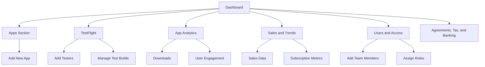

## 10.1.2 Understanding App Store Connect

In the journey from developing your Flutter app to seeing it live on the App Store, App Store Connect plays a pivotal role. This comprehensive platform is essential for submitting your app, managing its presence, analyzing its performance, and handling financial transactions. In this section, we will delve into the intricacies of App Store Connect, guiding you through its features and functionalities.

### Overview of App Store Connect

App Store Connect is Apple's suite of tools designed for developers to manage their apps on the App Store. It serves multiple purposes:

- **App Submission and Management:** Submit new apps and updates, manage app metadata, and track app status.
- **TestFlight Beta Testing:** Facilitate internal and external beta testing to gather feedback before the official release.
- **App Analytics:** Access detailed metrics on app performance, user engagement, and retention.
- **Sales and Financial Reports:** Monitor sales data, in-app purchases, and manage financial information.
- **User Management:** Add team members, assign roles, and manage access permissions.

### Accessing App Store Connect

To begin using App Store Connect, navigate to [appstoreconnect.apple.com](https://appstoreconnect.apple.com) and sign in with your Apple Developer account. Ensure you have the necessary permissions to access the features you need.

### Navigating the Interface

App Store Connect's interface is organized into several key sections, each serving a distinct purpose. Understanding these sections is crucial for efficient app management.

#### Dashboard

Upon logging in, you are greeted by the Dashboard. This is your command center, providing an overview of key metrics and recent activity. Here, you can quickly assess the status of your apps, view analytics, and access important notifications.

#### Apps Section

The Apps section is where you manage all your applications. Here, you can:

- **View and Manage Apps:** See a list of all your apps, their current status, and basic information.
- **Add a New App:** Click the "+" button to initiate the process of adding a new app. You will be prompted to enter details such as the app name, SKU, bundle ID, and availability.

#### TestFlight

TestFlight is a powerful tool for beta testing your app. It allows you to:

- **Internal and External Testing:** Conduct tests with both internal team members and external users.
- **Add Testers:** Invite testers via email and manage their access.
- **Manage Test Builds:** Upload new builds, set testing parameters, and gather feedback.

#### App Analytics

App Analytics provides insights into how your app is performing. You can track:

- **Downloads and Engagement:** Monitor the number of downloads, user sessions, and active devices.
- **Retention Rates:** Understand how well your app retains users over time.
- **User Demographics:** Gain insights into the geographical distribution and demographics of your user base.

#### Sales and Trends

This section is crucial for monitoring your app's financial performance. It includes:

- **Sales Data:** Track revenue from app sales, in-app purchases, and subscriptions.
- **Subscription Metrics:** Analyze subscription trends, renewal rates, and cancellations.

#### Users and Access

Manage your team effectively by adding users and assigning roles. You can:

- **Add Team Members:** Invite new users to your team.
- **Assign Roles:** Define roles with specific permissions, such as Admin, Developer, or Marketer.

#### Agreements, Tax, and Banking

Before you can sell apps or offer in-app purchases, you need to set up your financial information:

- **Agreements:** Accept Apple's agreements related to app sales.
- **Tax Information:** Provide necessary tax details for your region.
- **Banking Details:** Enter banking information to receive payments.

### Key Actions in App Store Connect

Understanding how to perform key actions in App Store Connect is essential for managing your app effectively.

#### Adding a New App

To add a new app, follow these steps:

1. **Click the "+" Button:** Located in the Apps section.
2. **Enter App Details:** Provide the app name, SKU, and bundle ID.
3. **Set Availability:** Choose the regions where your app will be available.
4. **Save and Continue:** Proceed to the next steps, such as uploading builds and setting metadata.

#### Managing App Metadata

App metadata is crucial for your app's visibility and appeal. Update the following:

- **App Description:** Write a compelling description that highlights your app's features.
- **Keywords:** Choose relevant keywords to improve searchability.
- **Screenshots and Promotional Text:** Upload high-quality screenshots and write engaging promotional text.

#### Uploading Builds

Builds are uploaded via Xcode or Transporter. Once uploaded, they appear under the "TestFlight" and "App Store" tabs. Ensure your build meets Apple's guidelines before submission.

#### Submitting for Review

Submitting your app for review involves several steps, which will be covered in detail later. Briefly, ensure all metadata is complete, the build is uploaded, and the app complies with Apple's guidelines.

### App Statuses

Understanding app statuses is crucial for tracking your app's progress through the submission process:

- **Prepare for Submission:** The app is ready to be submitted but not yet sent for review.
- **Waiting for Review:** The app is in the queue for Apple's review process.
- **In Review:** The app is currently being reviewed by Apple.
- **Pending Developer Release:** The app has been approved and is awaiting your release.
- **Ready for Sale:** The app is live on the App Store.

### Visual Aids

To enhance your understanding, let's look at some visual aids that illustrate the App Store Connect interface.

#### Annotated Screenshots

Annotated screenshots can help you identify key areas in the App Store Connect interface. These images highlight buttons, sections, and important metrics.

#### Navigation Diagrams

A navigation diagram can show the hierarchy of sections within App Store Connect, helping you understand how different parts of the platform are interconnected.

### Writing Tips

When working with App Store Connect, consider these tips:

- **Break Down Instructions:** Use clear, step-by-step instructions for complex tasks.
- **Use Bullet Points:** Enhance readability with bullet points for lists.
- **Encourage Exploration:** Encourage hands-on exploration of App Store Connect while following this guide.
- **Organize Information:** Keep app information organized for efficient management.

### Conclusion

App Store Connect is a comprehensive platform that requires a good understanding to utilize effectively. By familiarizing yourself with its features and functionalities, you can manage your app's presence on the App Store efficiently. As you continue your journey from zero to the App Store, mastering App Store Connect is a crucial step.

## Quiz Time!



### What is the primary purpose of App Store Connect?

- [x] To manage apps on the App Store
- [ ] To develop iOS apps
- [ ] To design app interfaces
- [ ] To provide customer support

> **Explanation:** App Store Connect is primarily used for managing apps on the App Store, including submission, analytics, and financial management.

### How do you access App Store Connect?

- [x] By visiting appstoreconnect.apple.com
- [ ] Through the Apple Developer app
- [ ] Via the App Store
- [ ] Using the iTunes Store

> **Explanation:** App Store Connect is accessed by visiting the website appstoreconnect.apple.com and signing in with an Apple Developer account.

### Which section in App Store Connect allows you to monitor app downloads and user engagement?

- [x] App Analytics
- [ ] TestFlight
- [ ] Sales and Trends
- [ ] Users and Access

> **Explanation:** The App Analytics section provides data on app performance, including downloads and user engagement.

### What is the role of TestFlight in App Store Connect?

- [x] To facilitate beta testing
- [ ] To submit apps for review
- [ ] To manage financial reports
- [ ] To update app metadata

> **Explanation:** TestFlight is used for beta testing, allowing developers to test their apps with internal and external testers.

### What information is required to set up in the Agreements, Tax, and Banking section?

- [x] Financial information for app sales
- [ ] App metadata
- [ ] User roles and permissions
- [ ] App screenshots

> **Explanation:** The Agreements, Tax, and Banking section requires financial information necessary for processing app sales and in-app purchases.

### Which status indicates that an app is live on the App Store?

- [x] Ready for Sale
- [ ] In Review
- [ ] Waiting for Review
- [ ] Pending Developer Release

> **Explanation:** The status "Ready for Sale" indicates that the app is live and available on the App Store.

### What is the first step to add a new app in App Store Connect?

- [x] Click the "+" button in the Apps section
- [ ] Upload a build via Xcode
- [ ] Set up financial information
- [ ] Submit for review

> **Explanation:** To add a new app, you start by clicking the "+" button in the Apps section to enter app details.

### How can you assign roles to team members in App Store Connect?

- [x] Through the Users and Access section
- [ ] In the App Analytics section
- [ ] Via the TestFlight tab
- [ ] In the Sales and Trends section

> **Explanation:** Roles are assigned to team members in the Users and Access section, where you can manage access permissions.

### What is the purpose of the Sales and Trends section?

- [x] To monitor sales data and subscription metrics
- [ ] To manage app metadata
- [ ] To conduct beta testing
- [ ] To track app downloads

> **Explanation:** The Sales and Trends section is used to monitor financial performance, including sales data and subscription metrics.

### True or False: App Store Connect can be used to design app interfaces.

- [ ] True
- [x] False

> **Explanation:** App Store Connect is not used for designing app interfaces; it is used for app management and analytics.


