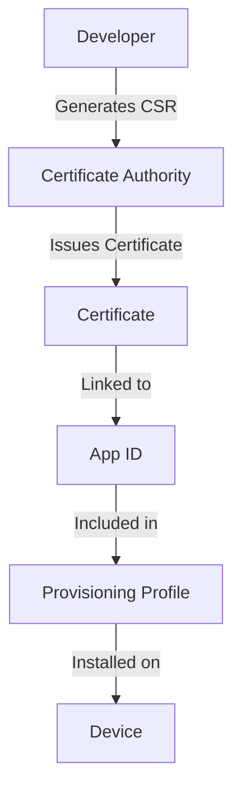

## 10.1.3 Certificates and Identifiers

In the journey from developing your Flutter app to seeing it live on the App Store, understanding and managing certificates, App IDs, and provisioning profiles is crucial. These components form the backbone of iOS app development and distribution, ensuring that your app is securely signed and authorized to run on Apple devices. This section will guide you through the process of creating and managing these elements, providing you with the knowledge needed to navigate Apple's Developer Portal and Xcode effectively.

### Understanding the Components

Before diving into the creation and management processes, it's essential to understand the roles and relationships of certificates, App IDs, and provisioning profiles.

#### Certificates

Certificates are digital documents that verify the identity of the developer and ensure the integrity of the app. They play a critical role in code signing, which is necessary for app installation on iOS devices. There are two main types of certificates:

1. **Development Certificates**: Used during the development phase, these certificates allow you to run and test your app on physical devices.

2. **Distribution Certificates**: Required for submitting your app to the App Store or distributing it via Ad Hoc or Enterprise methods.

#### App Identifiers (App IDs)

An App ID is a unique identifier for your app. It consists of a Team ID and a Bundle ID. There are two types of App IDs:

1. **Explicit App IDs**: These are specific to a single app and are used when you need to enable specific app services like Push Notifications or Game Center.

2. **Wildcard App IDs**: These can match multiple apps and are useful for apps that share the same codebase but differ in configuration.

#### Provisioning Profiles

Provisioning profiles link your certificates and App IDs to your devices, authorizing the app to run on those devices. There are different types of provisioning profiles:

1. **Development Provisioning Profiles**: Used for testing apps on physical devices during development.

2. **Distribution Provisioning Profiles**: Used for distributing apps via the App Store, Ad Hoc, or Enterprise.

### Creating Certificates

The process of creating certificates involves generating a Certificate Signing Request (CSR), creating the certificate in the Apple Developer Portal, and installing it on your machine.

#### Generating a Certificate Signing Request (CSR)

To create a certificate, you first need to generate a CSR using Keychain Access on your Mac. Follow these steps:

1. Open **Keychain Access** from the **Applications > Utilities** folder.
2. Select **Keychain Access > Certificate Assistant > Request a Certificate from a Certificate Authority** from the menu bar.
3. Enter your email address and a common name for the certificate. Leave the CA Email Address field blank.
4. Select **"Saved to disk"** and **"Let me specify key pair information"**.
5. Click **Continue** and save the CSR file to your disk.

#### Creating a Certificate in the Developer Portal

Once you have your CSR, you can create a certificate in the Apple Developer Portal:

1. Navigate to the [Apple Developer Portal](https://developer.apple.com/account/).
2. Select **Certificates, Identifiers & Profiles**.
3. Click on **Certificates** in the sidebar and then the "+" button to add a new certificate.
4. Choose the type of certificate you need (e.g., **iOS Development** or **iOS Distribution**).
5. Upload your CSR file and click **Continue**.
6. Download the generated certificate file (`.cer`).

#### Downloading and Installing the Certificate

After downloading the certificate, you need to install it:

1. Locate the downloaded `.cer` file.
2. Double-click the file to open it in Keychain Access, where it will be automatically installed.

### Registering App Identifiers

With your certificates in place, the next step is to register your App ID.

#### Creating an App ID

To create an App ID, follow these steps:

1. In the Developer Portal, select **Identifiers** from the sidebar, then **App IDs**.
2. Click the "+" button to register a new App ID.
3. Enter a description and a unique Bundle ID (e.g., `com.yourcompany.yourapp`).
4. Click **Continue** and then **Register** to complete the process.

#### Enabling App Services

When creating an App ID, you can enable various app services:

1. Select the capabilities your app requires, such as **Push Notifications**, **Game Center**, or **In-App Purchase**.
2. Save your changes to ensure these services are enabled for your app.

### Creating Provisioning Profiles

Provisioning profiles are essential for running your app on devices and distributing it. Here's how to create them:

#### Development Provisioning Profile

To create a development provisioning profile:

1. In the Developer Portal, select **Provisioning Profiles** > **All**.
2. Click the "+" button to add a new profile.
3. Choose **iOS App Development** as the type.
4. Select the App ID you created earlier.
5. Choose the certificates and devices you want to include in the profile.
6. Name the profile and click **Generate**.
7. Download the profile to your machine.

#### Downloading and Installing the Profile

To install the provisioning profile:

1. Locate the downloaded profile file.
2. Double-click the file to open it in Xcode, where it will be automatically installed.

### Using Xcode for Automatic Signing

Xcode can manage signing automatically, simplifying the process:

1. Open your project in Xcode.
2. Select the project file in the Project Navigator.
3. Go to the **Signing & Capabilities** tab.
4. Check the **Automatically manage signing** box.
5. Ensure the correct team is selected from the dropdown menu.

### Best Practices

Managing certificates and provisioning profiles can be complex. Here are some best practices to keep in mind:

- **Organization**: Keep your certificates and provisioning profiles organized and labeled clearly.
- **Expiration Management**: Monitor expiration dates and renew certificates and profiles as needed to avoid disruptions.
- **Security**: Secure your certificates to prevent unauthorized use. Consider backing them up in a secure location.
- **Consistency**: Ensure that your Bundle IDs match across all configurations to avoid common errors.

### Visual Aids

Understanding the relationships between certificates, App IDs, provisioning profiles, and devices can be challenging. The following diagram illustrates these connections:

This diagram shows the flow from generating a CSR to installing a provisioning profile on a device, highlighting the interconnected nature of these components.

### Troubleshooting Tips

- **Mismatched Bundle IDs**: Ensure that the Bundle ID in your App ID matches the one in your Xcode project settings.
- **Expired Certificates**: Regularly check the expiration dates of your certificates and renew them in advance.
- **Device Limitations**: Remember that development provisioning profiles have a limit on the number of devices they can include.

By following these steps and best practices, you'll be well-equipped to manage certificates, App IDs, and provisioning profiles, paving the way for a smooth development and distribution process.

## Quiz Time!



### What is the primary role of certificates in iOS app development?

- [x] To verify the identity of the developer and ensure the integrity of the app
- [ ] To provide a unique identifier for the app
- [ ] To manage app services and capabilities
- [ ] To link devices to the app

> **Explanation:** Certificates are used to verify the developer's identity and ensure the app's integrity through code signing.

### Which type of App ID is used when specific app services need to be enabled?

- [x] Explicit App ID
- [ ] Wildcard App ID
- [ ] Development App ID
- [ ] Distribution App ID

> **Explanation:** Explicit App IDs are used when specific app services, like Push Notifications, need to be enabled.

### What is the purpose of a provisioning profile?

- [x] To link certificates, App IDs, and devices
- [ ] To provide a unique identifier for the app
- [ ] To manage app services and capabilities
- [ ] To verify the identity of the developer

> **Explanation:** Provisioning profiles link certificates, App IDs, and devices, authorizing the app to run on those devices.

### How do you generate a Certificate Signing Request (CSR) on a Mac?

- [x] Use Keychain Access to request a certificate from a Certificate Authority
- [ ] Use Xcode to create a new project
- [ ] Use the Terminal to generate a CSR
- [ ] Use the Apple Developer Portal to create a CSR

> **Explanation:** A CSR is generated using Keychain Access on a Mac by requesting a certificate from a Certificate Authority.

### What should you do if your provisioning profile expires?

- [x] Renew the profile in the Apple Developer Portal
- [ ] Delete the expired profile and continue without it
- [ ] Create a new App ID
- [ ] Change the Bundle ID in your project

> **Explanation:** When a provisioning profile expires, it should be renewed in the Apple Developer Portal to maintain app functionality.

### Which of the following is a best practice for managing certificates?

- [x] Keep certificates organized and secure
- [ ] Share certificates with all team members
- [ ] Use the same certificate for all apps
- [ ] Ignore expiration dates

> **Explanation:** Keeping certificates organized and secure is crucial to prevent unauthorized use and ensure smooth app development.

### What is the benefit of using Xcode's automatic signing feature?

- [x] It simplifies the process by managing certificates and profiles automatically
- [ ] It allows you to bypass the need for certificates
- [ ] It enables you to create multiple App IDs at once
- [ ] It eliminates the need for a provisioning profile

> **Explanation:** Xcode's automatic signing feature simplifies the process by managing certificates and provisioning profiles automatically.

### What is a common error when creating provisioning profiles?

- [x] Mismatched Bundle IDs
- [ ] Using an expired certificate
- [ ] Selecting the wrong device
- [ ] Forgetting to enable app services

> **Explanation:** A common error is having mismatched Bundle IDs between the App ID and the Xcode project settings.

### How can you secure your certificates?

- [x] Store them in a secure location and back them up
- [ ] Share them with all team members
- [ ] Use them for multiple apps
- [ ] Ignore their expiration dates

> **Explanation:** Securing certificates by storing them in a secure location and backing them up helps prevent unauthorized use.

### True or False: Wildcard App IDs can be used for apps that require specific services like Push Notifications.

- [ ] True
- [x] False

> **Explanation:** Wildcard App IDs cannot be used for apps that require specific services like Push Notifications; explicit App IDs are needed for such cases.


